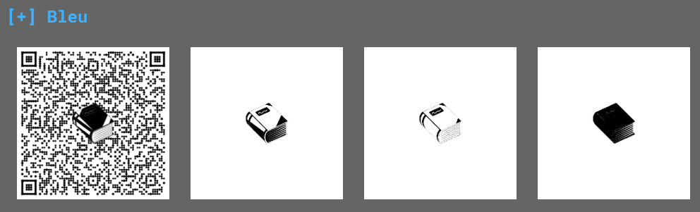
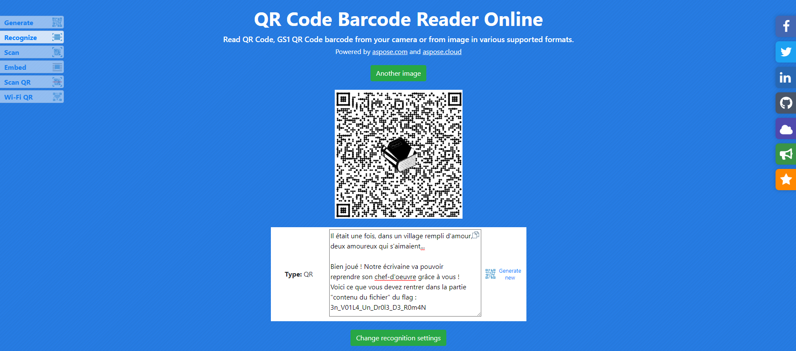


> **title:** Le Mystère du roman d'amour
>
> **category:** Analyse forensique
>
> **difficulty:** Facile
>
> **point:** 200
>
> **author:** mh4ckt3mh4ckt1c4s#0705
>
> **description:**
> En train de faire les cent pas dans un couloir du café se trouve Joseph Rouletabille. Il est préoccupé par un mystère des plus intrigants : une de ses amies, qui écrit régulièrement des livres passionnants, a perdu le contenu de son dernier roman !! Elle a voulu ouvrir son oeuvre et son éditeur a crashé... Il semblerait qu'un petit malin a voulu lui faire une blague et a modifié ses fichiers. Elle n'a pu retrouver qu'un seul fichier étrange, que Joseph vous demande de l'aider à l'analyser afin de retrouver son précieux contenu et de comprendre ce qu'il s'est passé.
> 
> ***
> 
> Vous devez retrouver :
> 
> - le PID du processus crashé
> 
> - le chemin complet vers le fichier en question (espaces autorisés) : la forme exacte trouvée dans le challenge et la forme étendue commençant par un / permettent toutes les deux de valider le challenge
> 
> - le nom de l'amie de Rouletabille
> 
> - le nom de la machine
> 
> - le contenu TEXTUEL du brouillon de son livre (si vous avez autre chose que du texte, continuez à chercher : vous devez trouver un contenu texte qui ressemble clairement au début d'un roman). Une fois ce contenu trouvé, il sera clairement indiqué quelle partie utiliser pour soumettre le flag (il s'agira d'une chaîne de caractères en [leet](https://fr.wikipedia.org/wiki/Leet_speak)) 
> 
> Le flag est la suite de ces éléments mis bout à bout, et séparés par un tiret du 6 (`-`), le tout enveloppé par `404CTF{...}`.
> 
> Un exemple de flag valide : 
> 
> `404CTF{1234-/ceci/est/un/Chemin avec/ des espaces1337/fichier.ext-gertrude-monPcPerso-W0w_Tr0P_1337_C3_T3xt3}`
> 
> Format : 404CTF{PidDuProcessusCrashé-chemin/vers le/fichier-nomUser-nomDeLaMachine-contenuDuFichier}
> 
> 	

## Solution

Il faut trouver les informations suivantes :

- **pid**
- **chemin**
- **nom de l'ami**
- **nom de la machine**
- **texte**

<br>

Avec la simple commande **`file`**, on peut déjà en récupérer beaucoup :

```
┌──(kali㉿kali)-[~]
└─$ file fichier-etrange.swp 
fichier-etrange.swp: Vim swap file, version 7.4, pid 168, user jaqueline, host aime_ecrire, file ~jaqueline/Documents/Livres/404 Histoires d'Amour pour les bibliophiles au coeur d'artichaut/brouillon.txt
```
- **pid** : 168
- **chemin** : ~jaqueline/Documents/Livres/404 Histoires d'Amour pour les bibliophiles au coeur d'artichaut/brouillon.txt
- **nom de l'ami** : jaqueline
- **nom de la machine** : aime_ecrire
- **texte** : ?

<br>

Les fichiers swp sont créés par l'éditeur Vim pour sauvegarder des versions. On peut donc récupérer cette version avec la commande :

```
┌──(kali㉿kali)-[~]
└─$ vim -r fichier-etrange.swp
```

Ensuite on appuie sur **Enter**, puis **Ctrl+C**, on entre **`save recovered`**.

<br>

Un **`file`** sur le fichier récupéré permet de voir qu'il s'agit d'un PNG :

```
┌──(kali㉿kali)-[~/Documents/CTF]
└─$ file recovered 
recovered: PNG image data, 1932 x 1932, 8-bit/color RGBA, non-interlaced
```


<br>

On passe cette image dans **[AperiSolve](https://aperisolve.fr/)** et on voit dans les LSB du canal bleu :



<br>

Direction un lecteur de QRCode en ligne (j'ai utilisé [celui-ci](https://products.aspose.app/barcode/recognize/qr)) :



Le texte est à la fin.

<br>

On a maintenant tout ce qu'il nous faut :

- **pid** : 168
- **chemin** : ~jaqueline/Documents/Livres/404 Histoires d'Amour pour les bibliophiles au coeur d'artichaut/brouillon.txt
- **nom de l'ami** : jaqueline
- **nom de la machine** : aime_ecrire
- **texte** : 3n_V01L4_Un_Dr0l3_D3_R0m4N


<span class="flag">FLAG : 404CTF{168-~jaqueline/Documents/Livres/404 Histoires d'Amour pour les bibliophiles au coeur d'artichaut/brouillon.txt-jaqueline-aime_ecrire-3n_V01L4_Un_Dr0l3_D3_R0m4N}</span>

