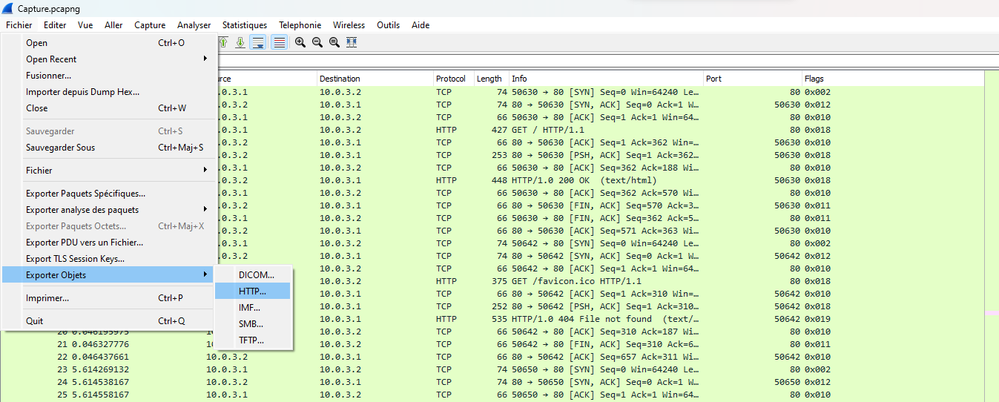
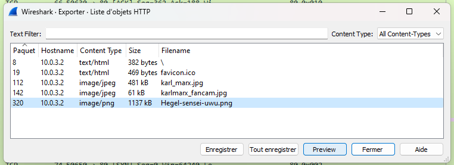


> **title:** Pêche au livre
>
> **category:** Analyse forensique
>
> **difficulty:** Introduction
>
> **point:** 100
>
> **author:** Direshaw#6811
>
> **description:**
> Etant tranquillement assis au café littéraire, vous entendez Albert Camus discuter avec quelqu'un d'autre.
> 
> Vous comprenez qu'après avoir écrit son dernier livre, il s'interroge sur l'actualité du monde littéraire. Il fait donc des recherches sur ses homologues écrivains et plus particulièrement sur Simone Weil, dont il a beaucoup entendu parlé ces derniers jours, et se demande quel sera le sujet de son prochain livre... 
> 
> Justement, vous avez récemment intercepté des communications de Simone Weil, peut être pourrez vous trouver le sujet de son prochain ouvrage.
> 
> ***
> 
> Toutes les informations nécessaires à la résolution de ce challenge sont présentes dans l'énoncé ci-dessus.

## Solution

Il s'agit d'un fichier **pcap**, on l'ouvre alors avec **WireShark**.

Dans l'onglet **Fichier**, on va **exporter les objets HTTP** :

 

Parmis les objets, celui qui nous intéresse est **`Hegl-sensei-uwu.png`** :

 

Plus qu'à afficher la preview de l'image :

 

FLAG : 404CTF{345Y_W1r35h4rK}

