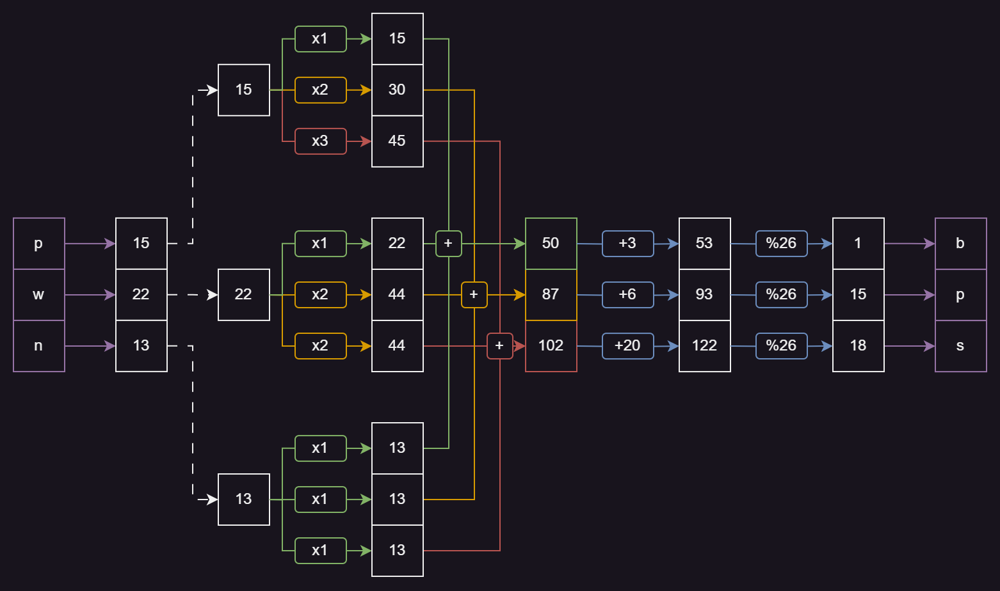


> **title:** La Réponse de Voris
>
> **category:** Cryptanalyse
>
> **difficulty:** Moyen
>
> **point:** 960
>
> **author:** NainCapable#2614
>
> **description:**
> Vous rencontrez Mme de Beauvoir qui vous explique vouloir surprendre son mari Jean Sol Partre. Ce dernier est en train d'écrire un livre et a demandé à son ami Voris un titre approprié. Elle a réussi à se procurer un étrange message, qu'elle pense avoir été chiffré par Voris afin de limiter les fuites d'information. 
> 
> Ne sachant quoi faire avec ceci, elle s'est décidée à aller à la séance de spiritualisme du samedi au café littéraire, où elle vous a rencontré aujourd'hui. Par chance, vous connaissez une oracle pouvant peut être vous aider à déchiffrer ce message. Mais, malchance, cette dernière n'est qu'en mesure de chiffrer un message... Dommage, il va falloir réfléchir pour trouver le titre que Voris a proposé à Jean Sol !
> 
> ***
> 
> > **Format** : 404CTF{titre_du_livre}
> 
> > message chiffré : pvfdhtuwgbpxfhocidqcznupamzsezp
> 
> ```
> nc challenges.404ctf.fr 31682
> ```

## Solution

Commençons par créer une classe pour interagir avec le serveur du challenge :

```python
import socket
import re

class Challenge:
	
	def __init__(self):
		# Adresse du server
		self.host = "challenges.404ctf.fr"
		self.port = 31682
		# Configuration du socket
		self.conn = socket.socket(socket.AF_INET, socket.SOCK_STREAM)
		# Connexion au serveur
		self.conn.connect((self.host, self.port))
		# Récupération du premier envoi du serveur
		response = self.conn.recv(2048).decode()
		# Parsing pour obtenir le flag à déchiffrer
		self.flag_cipher = re.search('Vous devez dechiffrer : (.*)', response).group(1)
	
	def encrypt(self, msg: str) -> str:
		# Envoi du message à chiffrer
		self.conn.send(f"{msg}\n".encode())
		try:
			# Parsing du message reçu pour renvoyer le chiffré
			return re.search('message chiffre  : (.*)', self.conn.recv(2048).decode()).group(1)
		except:
			# Si le chiffrement a échoué
			return None
```

<br>

### Tests

Maintenant on peut faire quelque tests pour essayer de trouver une logique au chiffrement.

Tous les tests vont être ajoutés à notre classe **`Challenge`**. 

<br>

#### Test n°1 - Charset utilisé

Première chose à vérifier, les lettres que l'on peut chiffrer :

```python
import string

class Challenge:

	def test_1(self) -> None:
		print("[i] Running test n°1")
		charset = ''
		for c in string.ascii_letters + string.digits + string.punctuation:
			if self.encrypt(c) is not None:
				charset += c
		print(f"Charset : {charset}")

Challenge().test_1()
```

```
[i] Running test n°1
Charset : abcdefghijklmnopqrstuvwxyz
```

On voit que seuls les 26 lettres minuscules sont acceptées par le serveur.

<br>

#### Test n°2 - Chiffrement d'1 lettre

Avant tout, on va essayer de voir les lettres comme un nombre. La lettre **`a = 0`**, **`b = 1`** etc... jusqu'à **`z = 25`**.

Ajoutons dans la classe **`Challenge`** les fonctions **`translate`** (*pour transformer un mot en tableau de nombres*) et **`prettify`** (*pour transformer un mot en un autre un peu plus joli à print*).

```python
class Challenge:
	# Les lettres minuscules utilisables
	__CHARSET = string.ascii_lowercase

	# Transforme un mot en tableau de nombres
	@staticmethod
	def translate(msg: str) -> list[int]:
		return [Challenge.__CHARSET.index(c) for c in msg]

	# Transforme un mot en un autre un peu plus joli à print
	@staticmethod
	def prettify(msg: str) -> str:
		# Tableau de nombres
		numbers = Challenge.translate(msg)
		return ' '.join([f"{n:0>2}" for n in numbers])
```

<br>

Maintenant attaquons nous aux chiffrement.

```python
class Challenge:

	def test_2(self) -> None:
		print("[i] Running test n°2")
		for msg in ["a", "b", "c", "d", "e"]:
			cipher = self.encrypt(msg)
			print(f"[{msg}] {Challenge.prettify(msg)} | {Challenge.prettify(cipher)} [{cipher}]")
```

```
[i] Running test n°2
[a] 00 | 02 [c]
[b] 01 | 03 [d]
[c] 02 | 04 [e]
[d] 03 | 05 [f]
[e] 04 | 06 [g]
```

On voit qu'on ajoute +2 à toutes les lettres.

<br>

#### Test n°3 - Chiffrement de 3 lettres

On augmente le nombre de lettres pour voir si un pattern se dessine.

```python
class Challenge:

	def test_3(self) -> None:
		print("[i] Running test n°3")
		for msg in ["aaa", "aab", "aba", "baa", "aac", "aca", "caa"]:
			cipher = self.encrypt(msg)
			print(f"[{msg}] {Challenge.prettify(msg)} | {Challenge.prettify(cipher)} [{cipher}]")
```

```
[i] Running test n°3
[aaa] 00 00 00 | 03 06 20 [dgu]
[aab] 00 00 01 | 04 07 21 [ehv]
[aba] 00 01 00 | 04 08 22 [eiw]
[baa] 01 00 00 | 04 08 23 [eix]
[aac] 00 00 02 | 05 08 22 [fiw]
[aca] 00 02 00 | 05 10 24 [fky]
[caa] 02 00 00 | 05 10 00 [fka]
```

On voit très bien qu'un schéma existe, visiblement entre le chiffrement de **`aaa`** et **`aab`** on a simplement ajouté **`+1`** à toutes les lettres. En faisant ça avec les 3 positions de **`b`** possible, on observe :

- Pour **`aab`**, on part de **`aaa`** et on ajoute **`+1 +1 +1`**
- Pour **`aba`**, on part de **`aaa`** et on ajoute **`+1 +2 +2`**
- Pour **`baa`**, on part de **`aaa`** et on ajoute **`+1 +2 +3`**

En faisant le même chose avec une autre lettre que **`b`**, on observe :

- Pour **`aac`**, on part de **`aaa`** et on ajoute **`+2 +2 +2`**
- Pour **`aca`**, on part de **`aaa`** et on ajoute **`+2 +4 +4`**
- Pour **`caa`**, on part de **`aaa`** et on ajoute **`+2 +4 +6`**

Concernant **`caa`**, en suivant la logique on voit que le **`05 10 26`** s'est transformé en **`05 10 00`**. Il y a donc un modulo 26 appliqué. Cela permet que si la valeur dépasse celle du **`z`**, on recommence à **`a`**.

<br>

### Le pattern

Avec les tests vus juste avant, on a peut dessiner un potentiel pattern du chiffrement.

En comparant les chiffrements faits avec les **`b`** et les **`c`**, on voit qu'il s'agit d'une multiplication.

Pour rappel, on est parti de ça :


<br>

Ensuite, de notre test n°3 on peut en déduire :


Le seul point "bloquant" est le **`+3 +6 +20`** obtenu en chiffrant **`aaa`**. On va appeler ça la **`base`**. Cette base à l'air de changer en fonction du nombre de caractère du message.

**Pour obtenir cette base on pourra simplement chiffrer avec le serveur un message de la même taille fait uniquement de `a`**.

<br>

### Réécriture du chiffrement

On peut essayer de mettre le tout ensemble pour prédire un chiffrement, essayons avec le mot **`pwn`** :



Le résultat attendu est **`bps`**.

Chiffrons le message **`pwn`** avec le serveur :

```python
class Challenge :

	def test_4(self) -> None:
		print("[i] Running test n°4")
		msg = "pwn"
		cipher = self.encrypt(msg)
		print(f"[{msg}] {Challenge.prettify(msg)} | {Challenge.prettify(cipher)} [{cipher}]")
```

```
[i] Running test n°4
[pwn] 15 22 13 | 01 15 18 [bps]
```

C'est le même ! Notre prédiction est juste et donc notre pattern semble être le bon pour les mots de 3 lettres.

On peut essayer de reproduire le chiffrement en code pour vérifier notre hypothèse quasi-sûre avec plus de mots :

```python
class Challenge:

	# Obtenir la base de nombres
	def get_base(self, size: int) -> list[int]:
		# Chiffrement d'un message fait uniquement de "a"
		cipher = self.encrypt('a' * size)
		# Traduction en tableau de nombres
		return self.translate(cipher)

	# Chiffrement fait de notre côté
	def local_encrypt(self, msg: str) -> str:
		# Tableau de nombres, le chiffré est initialisé avec la base
		cipher = self.get_base(len(msg))
		# Traduction en tableau de nombres
		msg = Challenge.translate(msg)
		# Multiplicateur maximal
		mul_max = len(msg)
		# Pour chaque nombre du message
		for n in msg:
			# Pour chaque case du chiffré
			for j in range(len(msg)):
				 # On y ajoute le nombre du message multiplié
				cipher[j] += min(j + 1, mul_max) * n
			# On décrémente le multiplicateur max
			mul_max -= 1
		# On transforme le tableau de nombres en mot
		return ''.join([self.__CHARSET[n % 26] for n in cipher])
```

<br>

Pour tester notre fonction :

```python
import random

class Challenge:

	def test_5(self) -> None:
		print("[i] Running test n°5")
		# 10 tests effectués
		for _ in range(10):
			# Mot aléatoire
			msg = ''.join(random.choices(Challenge.__CHARSET, k=3))
			# Comparaison entre le chiffrement du serveur et le notre
			if self.encrypt(msg) == self.local_encrypt(msg):
				print(f"[{msg}] Same cipher !")
			else:
				print(f"[{msg}] Local encrypt different !")
				exit(1)
```

```
[i] Running test n°5
[bmg] Same cipher !
[sxu] Same cipher !
[zic] Same cipher !
[npj] Same cipher !
[omq] Same cipher !
[soy] Same cipher !
[nkd] Same cipher !
[fvm] Same cipher !
[evq] Same cipher !
[unv] Same cipher !
```

### Chiffrement avec des mots de + de 3 lettres

```python
class Challenge:

	def test_6(self) -> None:
		print("[i] Running test n°6")
		# Taille minimale du mot
		min_size = 4
		# D'une taille de 4 à 14 
		for size in range(min_size, min_size+10):
			msg = ''.join(random.choices(Challenge.__CHARSET, k=size))
			if self.encrypt(msg) == self.local_encrypt(msg):
				print(f"[{msg}] Same cipher !")
			else:
				print(f"[{msg}] Local encrypt different")
				exit(1)
```

```
[i] Running test n°6
[eltp] Same cipher !
[evusm] Same cipher !
[uzctwi] Same cipher !
[lxcvnsg] Same cipher !
[cbgizbhj] Same cipher !
[rsodbbqiu] Same cipher !
[cxpwgnnsjv] Same cipher !
[tczajqbvrhq] Same cipher !
[pjctzqwnymwz] Same cipher !
[wwgfdwzfqmisd] Same cipher !
```

Notre chiffrement à l'air de fonctionner également avec plus de 3 lettres !


**`FLAG : 404CTF{}`**

