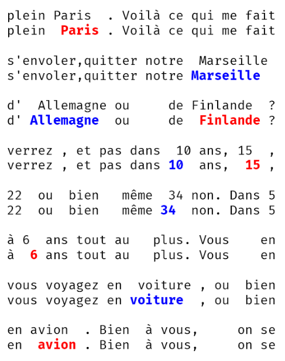


> **title:** En Profondeur
>
> **category:** Stéganographie
>
> **difficulty:** Moyen
>
> **point:** 961
>
> **author:** EneVyctis#8453
>
> **description:**
> Alors que vous dégustiez une assiette d'oeufs mayo, un homme fait son apparition dans Le Procope. Il prend place à côté de vous et se présente comme étant Monsieur de Valmont. Il vous raconte avoir reçu une lettre étonnante de Madame de Merteuil. Après quelques temps passé à discuter, il vous confie que celle-ci avait accepté un rendez-vous avec lui suite à un pari gagné. Il doutait franchement qu'elle honore sa parole, d'autant qu'elle voyage beaucoup et qu'il n'a pas le permis b lui permettant de la rejoindre n'importe où. Il s'interroge néanmoins sur cette lettre. Pouvez-vous aider de Valmont à voir le message caché derrière celle-ci ?
> 
> ***
> 
> >**Format** : 404CTF{message_caché_chaque_mot_en_minuscule}

## Solution

Il faut comparer ligne par ligne les mots qui ne sont pas alignés. On trouve 2 possibilités :
- Le mot est décalé vers la gauche (en bleu)
- Le mot est décalé vers la droite (en rouge)

Voici les lignes qui possèdents des mots décalés :

Si l'on prend tous les mots en bleu on obtient **`marseille_allemagne_10_34_voiture`**.

Si l'on prend tous les mots en rouge on obtient **`paris_finlande_15_6_avion`**.

Dans l'énoncé on apprend qu'il n'a pas le permis B, donc ce n'est pas les mots en bleu qui parlent de voiture.

**`FLAG : 404CTF{paris_finlande_15_6_avion}`**

