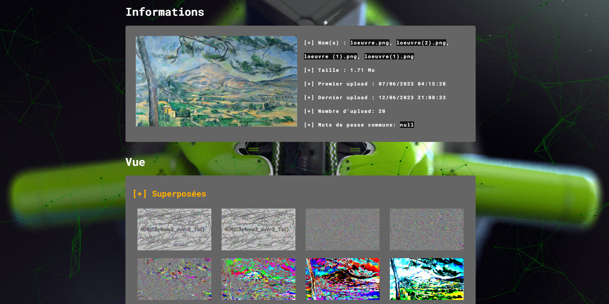
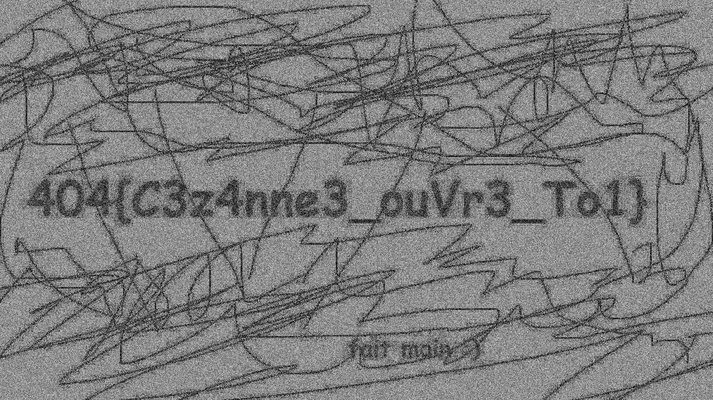


> **title:** L'Œuvre
>
> **category:** Stéganographie
>
> **difficulty:** Facile
>
> **point:** 200
>
> **author:** Neptales
>
> **description:**
> Dans un coin du Procope, vous remarquez Claude Lantier scrutant sans relâche un tableau, tasse à la main. Cette situation vous interpelle et vous lui demandez ses raisons . Il vous explique qu'avec son œil de peintre il remarque des _variations de couleurs_ à la limite de l'imperceptible.
> 
> ***
> 
> Trouvez un message secret dans la peinture ci-jointe.
> 
> *Contact en cas de problème : `Racoon#8487`*

## Solution

Ici **[AperiSolve](https://aperisolve.fr)** permet de faire du LSB facilement, on a juste à importer l'image sur le site :



Sinon version code ça nous donne ceci :

```python
from PIL import Image

# Image originale
img: Image.Image = Image.open('E:/Downloads/loeuvre.png')

# Créer une version nuance de gris (noir & blanc) de même taille
lsb = Image.new('L', img.size, 'white')

# Pour tous les pixels
for y in range(img.height):
	for x in range(img.width):
		# Prends les 2 bits de poids faible que l'on décale à gauche
		# Ceci pour les 3 canaux (R, G, B) et on calcul leur moyenne
		l = sum([(c & 0b11) << 6 for c in img.getpixel((x, y))]) // 3
		
		# On met cette moyenne dans la nouvelle image 
		lsb.putpixel((x, y), l)

# Affiche la nouvelle image
lsb.show()
```
Ce qui donne :



<br>

<span class="flag">FLAG : 404CTF{C3z4nne3_ouVr3_To1}</span>

