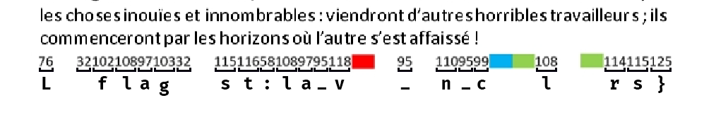
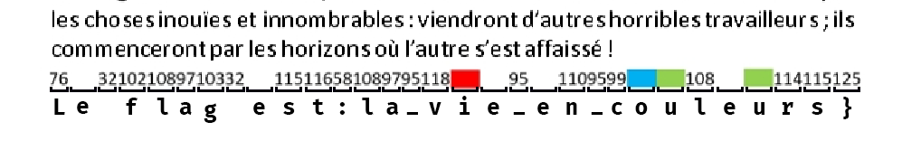


> **title:** Le Rouge et le vert, avec un soupçon de bleu
>
> **category:** Stéganographie
>
> **difficulty:** Difficile
>
> **point:** 927
>
> **author:** Kamiro#3528
>
> **description:**
> Ce qui semble être un brouillon a été laissé sur une table en hâte par un jeune homme. Vous vous rapprochez pour le lui rendre, mais il a déjà disparu. Vous décidez de lire ce bout de papier pour déterminer la personnalité de son auteur. Le début ressemble à un poème. La fin quant à elle a l'air assez spéciale...
> 
> ***
> 
> Toutes les informations nécessaires à la résolution de ce challenge sont présentes dans l'énoncé ci-dessus. Déchiffrez la fin du poème.

## Solution

En bas du l'image on voit une suite de chiffres.

Il faut les convertir selon la table ASCII :

**`76 => L`**
**`321021089710332 => 32 102 108 97 103 32 => flag `** *(32 est l'espace)*

On fait ça sur l'ensemble des chiffres pour obtenir :

On voit alors que les "espaces" entre les chiffres sont en réalité des **`e`** puisque cela forme le début de phrase **`Le flag est`**.

De là on en déduit le reste de la phrase et que donc :
- **`rouge = i`**
- **`vert = u`**
- **`bleu = o`**

**`FLAG : 404CTF{la_vie_en_couleurs}`**

