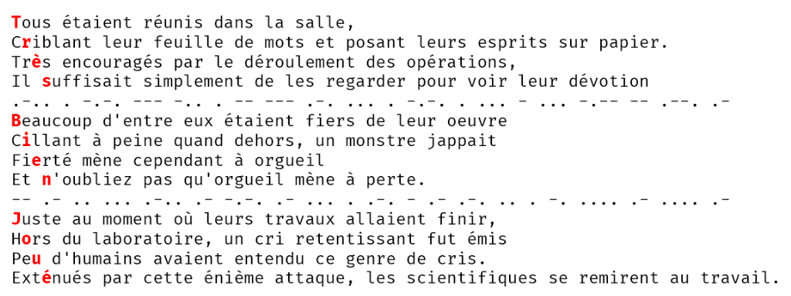


> **title:** Les Félicitations
>
> **category:** Stéganographie
>
> **difficulty:** Facile
>
> **point:** 921
>
> **author:** NainCapable#2614
>
> **description:**
> Au café littéraire, le serveur vous parle alors qu'il vous porte votre café bien noir afin de rester alerte :
> 
> « Vous avez osé braver cette tempête ? Toutes mes félicitations ! Et en parlant de félicitation, trouvez celles cachées dans ce texte.  »
> 
> Tous étaient réunis dans la salle,
> 
> Criblant leur feuille de mots et posant leurs esprits sur papier.
> 
> Très encouragés par le déroulement des opérations,
> 
> Il suffisait simplement de les regarder pour voir leur dévotion
> 
> .-.. . -.-. --- -.. . -- --- .-. ... . -.-. . ... - ... -.-- -- .--. .-
> 
> Beaucoup d'entre eux étaient fiers de leur oeuvre
> 
> Cillant à peine quand dehors, un monstre jappait
> 
> Fierté mène cependant à orgueil
> 
> Et n'oubliez pas qu'orgueil mène à perte.
> 
> -- .- .. ... .-.. .- -.-. .- ... . .-. - .- .-. .. . -. .... .- .... .-
> 
> Juste au moment où leurs travaux allaient finir, 
> 
> Hors du laboratoire, un cri retentissant fut émis
> 
> Peu d'humains avaient entendu ce genre de cris.
> 
> Exténués par cette énième attaque, les scientifiques se remirent au travail.
> 
> ***
> 
> > **Format** : 404CTF{VosSuperFélicitations}

## Solution

Le code morse séparent le texte en 3 paragraphes de 4 lignes.

Pour chaque paragraphe il faut prendre :
- la 1ère lettre de la 1ère ligne
- la 2nde lettre de la 2nde ligne
- la 3ème lettre de la 3ème ligne
- la 4ème lettre de la 4ème ligne

FLAG : 404CTF{TrèsBienJoué}

