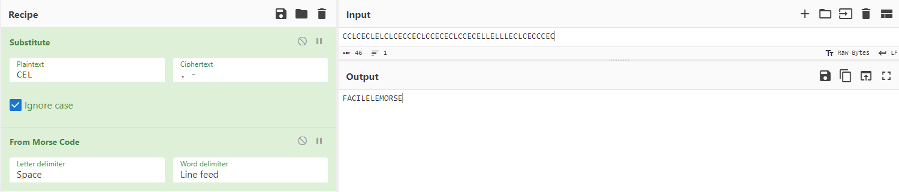


> **title:** Odobenus Rosmarus
>
> **category:** Stéganographie
>
> **difficulty:** Introduction
>
> **point:** 100
>
> **author:** NainCapable#2614
>
> **description:**
> « Bonjour à toi, et bienvenue au café littéraire ! »
> 
> Connais-tu la première règle de la lecture ? Ne pas s'attacher aux mots. Il faut les surpasser, chercher l'idée derrière. L'existence précède l'essence, ici nous cherchons l'essence des choses, et non pas leur existence ou leur forme.
> 
> Je te laisse un petit quelque chose. Prouve moi que tu peux lire entre les lignes.
> 
> > Ce soir je Célèbre Le Concert Electro Comme Louis Et Lou. Comme La nuit Commence Et Continue Clairement, Et Clignote Lascivement il Chasse sans Chausser En Clapant Encore Classiquement Les Cerclages du Clergé. Encore Car Encore, Louis Lou Entamant Longuement La Lullabile En Commençant Le Cercle Exhaltant de Club Comique Cannais Et Clermontois.
> 
> ***
> 
> > **Format** : 404CTF{cequevousalleztrouver}

## Solution

On prend chaque majuscule du texte :

```python
text = "Ce soir je Célèbre Le Concert Electro Comme Louis Et Lou. Comme La nuit Commence Et Continue Clairement, Et Clignote Lascivement il Chasse sans Chausser En Clapant Encore Classiquement Les Cerclages du Clergé. Encore Car Encore, Louis Lou Entamant Longuement La Lullabile En Commençant Le Cercle Exhaltant de Club Comique Cannais Et Clermontois."

print(''.join([c for c in a if c.isupper()]))
```

```
CCLCECLELCLCECCECLCCECECLCCECELLELLLECLCECCCEC
```

On a 3 caractères, le **`C`**, le **`E`** et le **`L`**. Le **`E`** revient moins souvent que les deux autres et n'apparaît jamais consécutivement, on en déduit qu'il s'agit d'un séparateur.

On se retrouve avec donc des groupes de 2 caractères, ce qui fait penser au **morse**. Il n'y a que 2 combinaisons à tester :
- **`C = .`**  et **`L = -`**
- **`C = -`**  et **`L = .`**

Direction **[CyberChef](https://gchq.github.io/CyberChef/#recipe=Substitute('CEL','.%20-',true)From_Morse_Code('Space','Line%20feed')&input=Q0NMQ0VDTEVMQ0xDRUNDRUNMQ0NFQ0VDTENDRUNFTExFTExMRUNMQ0VDQ0NFQw)** pour décoder tout ça :



Avec notre première hypothèse, on obtient : **`FACILELEMORSE`** 

<span class="flag">FLAG : 404CTF{facilelemorse}</span>

