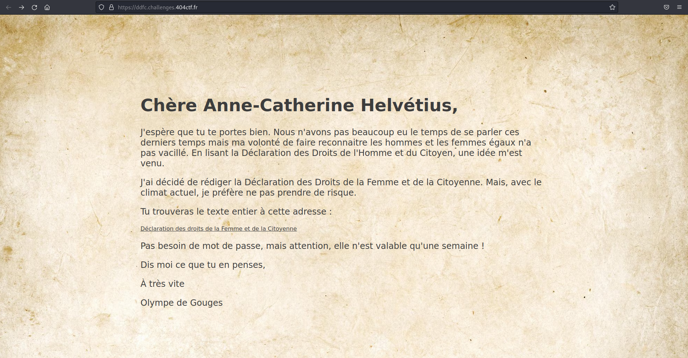
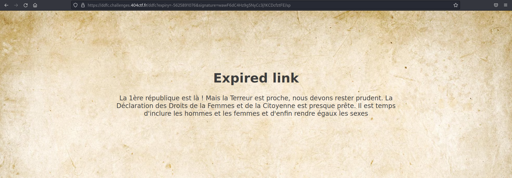
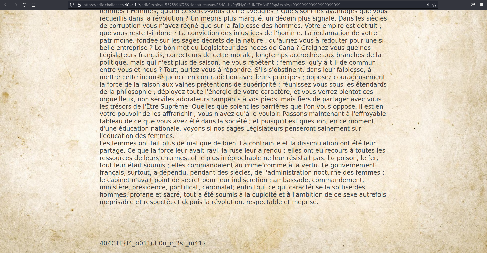


> **title:** Fuite en 1791
>
> **category:** Web
>
> **difficulty:** Moyen
>
> **point:** 863
>
> **author:** seaweedbrain#1321
>
> **description:**
> Alors qu'une douce odeur de café commençait à emplir Le Procope, une femme vient interrompre le calme de la chaleureuse pièce. Tout droit sortie du XVIIIème siècle, Olympe de Gouge fait irruption et se précipite vers votre table.
> 
> « Vous ! s’écria-t-elle
> 
> — Moi ? répondez-vous.
> 
> — Oui vous, allez porter cette lettre de toute urgence à Anne-Catherine Helvétius.
> 
> — Qui ? De quoi s'agit-il ? 
> 
> — Je ne peux vous expliquer maintenant, mais le contenu de cette lettre peut changer le cours de l'histoire, ne perdez pas de temps. »
> 
> Et avant même que vous puissiez la questionner d'avantage, elle passa la porte et sortit du café. 
> 
> Dans l'incompréhension la plus totale, vous commencez à parcourir ladite lettre…
> 
>  
> 
>  
> 
>  
> 
> ***
> 
> Toutes les informations nécessaires à la résolution de ce challenge sont présentes dans l'énoncé ci-dessus.
> 
> ```
> https://ddfc.challenges.404ctf.fr
> ```

## Solution

Sur la page principale il n'y a qu'un lien :



Ce lien nous envoie sur **`/ddfc`** avec les paramètres :
- **`expiry=-5625891076`**
- **`signature=wawF6dC4Hz9g5NyCc3j1KCDcfztFE/sp`**



Le lien est expiré et la valeur d'**`expiry`** laisse penser à un timestamp. En la convertissant on trouve que l'expiration était le 21/09/1791.

Seulement, impossible de forger la signature et donc de modifier l'expiration, il y a en fait un problème au niveau du parsing du serveur. Il suffit de polluer **`expiry`** en l'ajoutant à nouveau à la fin des paramètres avec un timestamp plus loin que la date actuelle, par exemple **`999999999999999999999`** :




<br>

**`FLAG : 404CTF{l4_p011uti0n_c_3st_m41}`**

