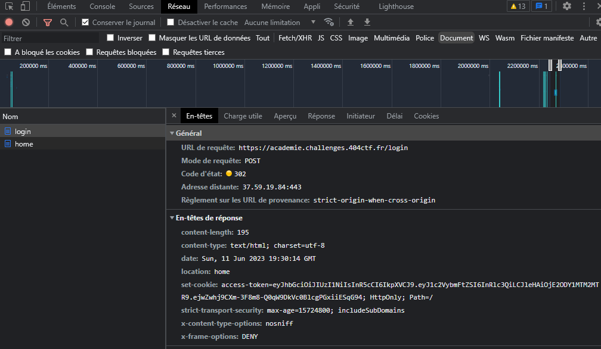
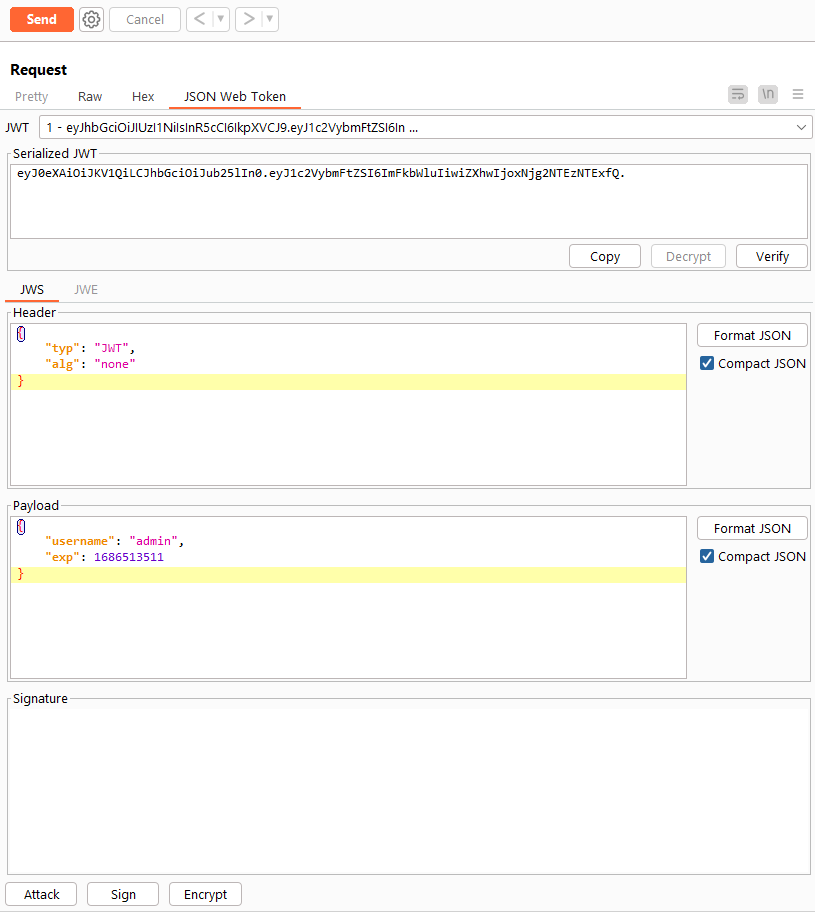
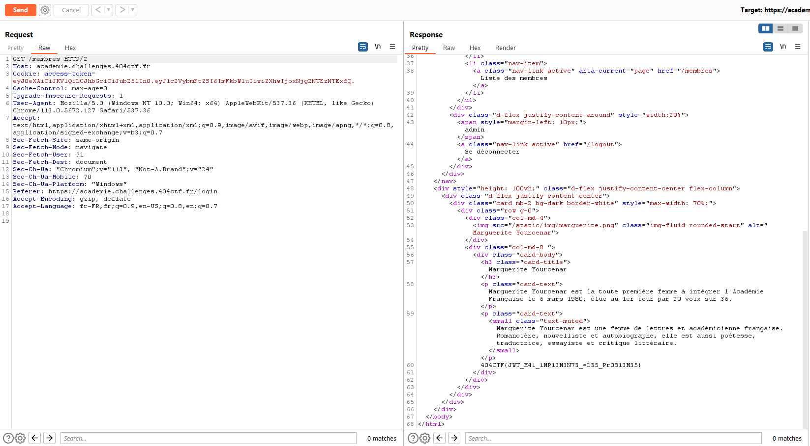


> **title:** L'Académie du détail
>
> **category:** Web
>
> **difficulty:** Facile
>
> **point:** 200
>
> **author:** seaweedbrain#1321
>
> **description:**
> Le nez plongé dans votre café noir, vous parcourez d'un rapide coup d'œil la une du journal fraichement paru. L'un des titres vous interpelle : 
> 
> >  Mars 1980 : L'opaque secret du nouveau membre de l'Académie Française.
> 
> Vous parcourez alors le journal à la recherche de l'article en question. Il énonce :
> 
> > Après des heures de délibération, les Académiciens ont enfin voté pour le nouveau membre de la grande Académie Française. Mais pour des raisons que tout le monde ignore, son nom demeure secret depuis ce jour. Malgré tous leurs efforts, aucun journaliste n'a réussi a obtenir le moindre indice ou la moindre image.
> 
> Interloqué, vous vous rendez compte que l'Académie Française possède un site web. Peut être que la réponse est finalement à portée de tous, **voir même plus ...** !
> 
> ***
> 
> Toutes les informations nécéssaires à la résolution de ce challenge sont présentes dans l'énoncé ci-dessus.
> 
> Le flag est au format classique `404CTF{}`. Vous devez le trouver, il ne peut pas être deviné.
> 
> ```
> https://academie.challenges.404ctf.fr/
> ```

## Solution

On a accès à une page de login sur laquelle on peut se connecter avec n'importe quel username et password **sauf avec le username `admin`**:


On reçoit alors un **cookie JWT** :



Il s'agit d'un JWT utilisant l'algorithme **`HS256`** dans lequel on trouve le username avec lequel on est connecté. L'attaque la plus commune sur cet algorithme est l'**`attack none`**.

Ici on va utiliser **Burp Community** avec l'extension **JWT Editor** pour réaliser l'attaque.

On commence par changer le username dans le JWT par **`admin`** puis à changer l'algorithme par **`none`** :



On envoie ensuite la requête sur **`/membres`** qui est maintenant accessible :



<br>

**`FLAG : 404CTF{JWT_M41_1MP13M3N73_=L35_Pr0813M35}`**

