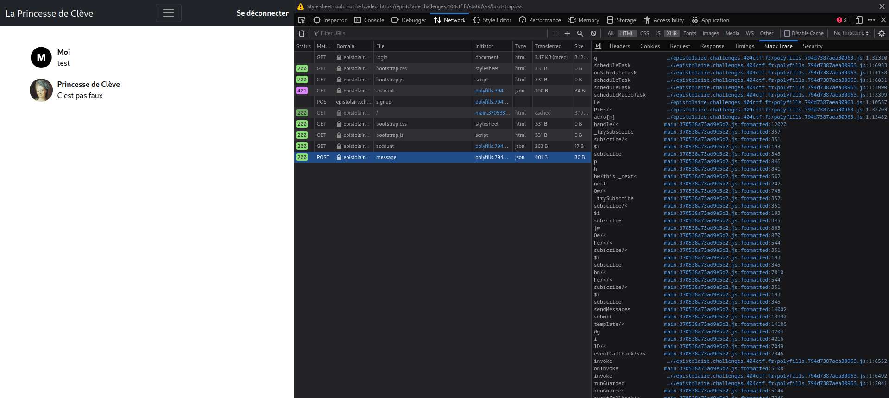
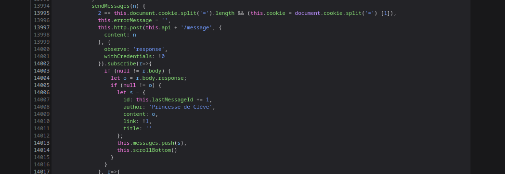
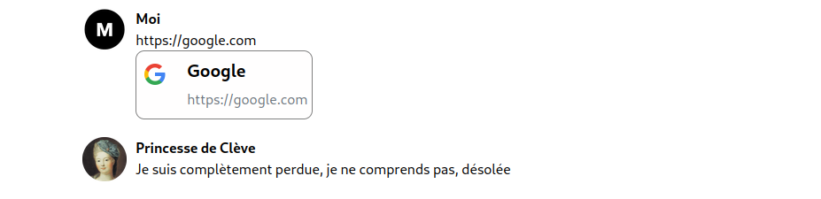
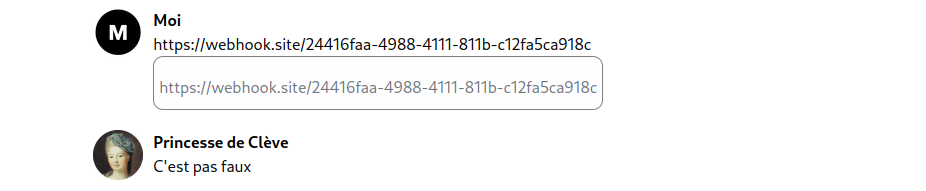
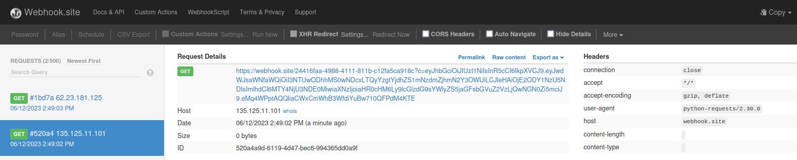
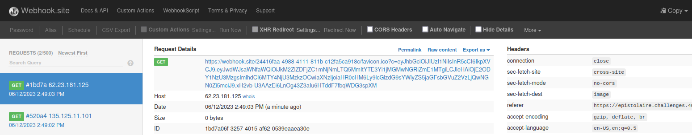
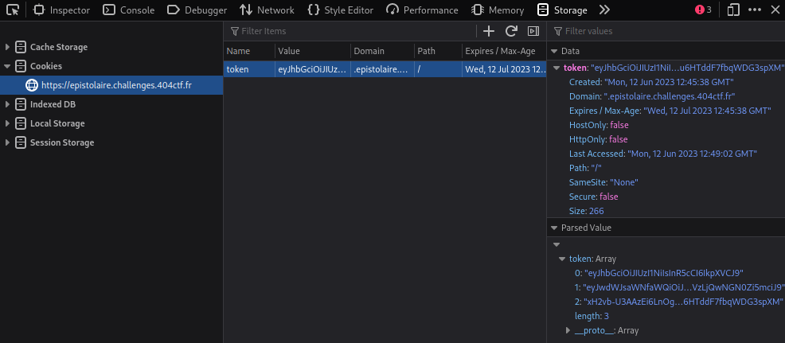
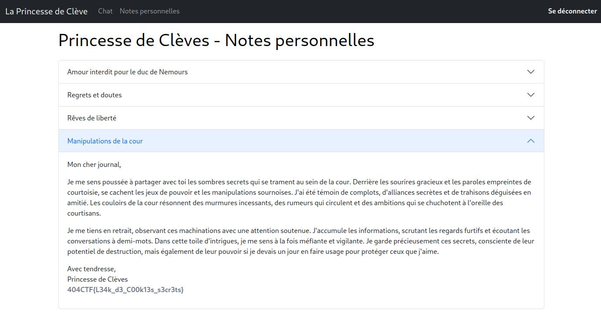


> **title:** L'Épistolaire moderne
>
> **category:** Web
>
> **difficulty:** Moyen
>
> **point:** 975
>
> **author:** seaweedbrain#1321
>
> **description:**
> Une femme frôle votre table et s'éloigne avec hâte. Les effluves de son parfum vous plongent brutalement dans votre passé, faisant remonter subitement de vieux souvenirs amoureux. Les émotions surgissent et un sentiment de nostalgie et de tristesse profonde s'empare de vous.
> 
> Vous décidez d'affronter cette douleur amoureuse et d'en parler à l'une des plus grandes figures du drâme de l'amour : la Princesse de Clève. Peut-être obtiendrez vous ses conseils et secrets.
> 
> ***
> 
> Toutes les informations nécessaires à la résolution de ce challenge sont présentes dans l'énoncé ci-dessus.
> 
> ```
> https://epistolaire.challenges.404ctf.fr/
> ```

## Solution

Le site propose de discuter via un chat avec la Princesse de Clève.

Pour cela il faut se connecter mais comme nous ne connaissons aucun compte, on le fait en tant qu'invité.

Lorsque l'on envoie un message, une requête est fait au serveur avec celui-ci :



Dans la stacktrace de la requête, on voit qu'une des fonctions appelées est **`sendMessage`**. Ce nom assez explicit doit alors piquer notre curiosité et voici à quoi ressemble la fonction :



On y découvre ligne 14006 un objet qui semble définir la réponse de la princesse. Celui-ci contient 5 propriétés donc une qui se nomme **`link`**. Cela nous indique un comportement potentiellement particulier avec les liens.

Essayons donc d'en envoyer un :



Effectivement il y a un affichage spécial pour ce cas. Comme la princesse est censée nous répondre, cela veut dire qu'elle interprête nos messages et donc potentiellement nos liens. On va créer un endpoint pour voir si le serveur contacte celui-ci.

Pour ça j'utilise **[webhook.site](https://webhook.site)** pour créer l'endpoint et ensuite envoyer son lien à la princesse :



Maintenant sur l'endpoint on observe 2 requêtes entrantes :





Ces requêtes sont accompagnées d'un paramètre qui ressemble étrangement à un **`JWT`**.

En regardant celui que l'on a sur le site en tant qu'invité, on s'aperçoit qu'il s'agit de celui de la requête 2 :



La requête 2 vient de notre navigateur, mais d'où vient la requête 1 ? Du serveur.

En remplaçant alors notre cookie par celui-ci envoyé avec la requête 1, on se retrouve connecté en tant qu'admin et un nouvel onglet apparaît : **`Notes personnelles`**

Le flag se trouve à l'intérieur :



<br>

<span class="flag">FLAG : 404CTF{L34k_d3_C00k13s_s3cr3ts}</span>

