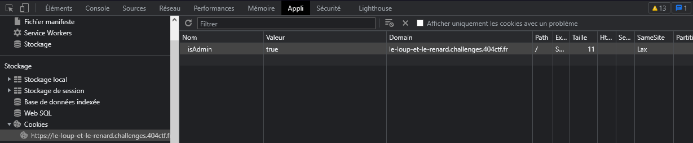


> **title:** Le Loup et le renard
>
> **category:** Web
>
> **difficulty:** Introduction
>
> **point:** 100
>
> **author:** Artamis#7513 et V0odOo#3248
>
> **description:**
> Dans un coin du café, un homme est assis. Une tasse de café ainsi qu'un manuscrit sont posés devant lui. Il observe la salle : les allées-venues des clients, les conversations. Il semble à l'affût de la moindre action, du moindre écart de la part de son sujet d'observation. 
> 
> Alors que son regard parcourt la salle, il s'étonne de voir que vous l'observiez déjà. D'un geste accompagné d'un sourire il vous invite à le rejoindre.
> 
> « Bienvenue ! Prenez place. Il est rare de voir quelqu'un d'attentif à autre chose que sa propre personne ici. C'est dommage, c'est justement ce qu'il y  a de plus intéréssant dans ce genre de rassemblement : les  autres. Je me présente : Jean de La Fontaine. Votre regard me plait, vous me semblez capable de m'aider sur mon prochain manuscrit. J'écris, voyez-vous ? Des fables, je m'inspire de ce que je vois et j'observe. Pouvez-vous m'aider à écrire la suite de celle-ci ? »
> 
> ***
> 
> Ouvrez l'œil et trouvez la fin de cette fable.
> 
> ```
> https://le-loup-et-le-renard.challenges.404ctf.fr/
> ```

## Solution

### Partie 1

En regardant le code source de la page, on voit que le **`<form>`** appelle la fonction javascript **`auth()`**.

```html

<!DOCTYPE html>
<html lang="fr">
<head>...</head>
<body>
	<div class="title-section">...</div>
	<div class="fable">...</div>
	<div class="fable">...</div>
	<div class="challenge">
		<div class="machine">
			<form
			class="form"
			method="get"
			action="javascript:void(0)"
			onsubmit="auth()"
			>
			<label for="username">Nom d'utilisateur</label>
			<input type="text" name="username" id="username" placeholder="LafontN" />
			<label for="password">Mot de passe</label>
			<input type="password" name="password" id="password" />
			<input type="submit" value="Valider" id="submit" />
			</form>
			<div class="error"></div>
		</div>
	</div>

	<script>
	// Système d'authentification
	function auth() {
		if (
		document.getElementById("username").value === "admin" &&
		document.getElementById("password").value === "h5cf8gf2s5q7d"
		) {
		window.location.href = "/fable/partie-2-cookie";
		}
	}
	</script>

 </body>
</html>
```

Si le **`username == admin`** et le **`password == h5cf8gf2s5q7d`**, on est redirigé vers **`/fable/partie-2-cookie`**

<br>

### Partie 2

Ici on voit qu'un cookie est mis lors de la réponse du serveur :


Il suffit de modifier sa valeur de **`false`** à **`true`** et de rafraîchir la page:



<br>

### Partie 3

On voit dans le code source qu'en soumettant le formulaire on accède au chemin **`/fable/partie-4-flag-final`** mais que l'on est directement renvoyé sur la page précédente.

On va donc faire la requête à la main en JS :

```javascript
await (await fetch("https://le-loup-et-le-renard.challenges.404ctf.fr/fable/partie-4-flag-final?username=&password=")).text()

/*
<!DOCTYPE html>\n<html lang="fr">\n  <head>\n    <meta charset="UTF-8" />\n    <meta http-equiv="X-UA-Compatible" content="IE=edge" />\n    <meta name="viewport" content="width=device-width, initial-scale=1.0" />\n    <link\n      rel="shortcut icon"\n      href="../static/ico/favicon.ico"\n      type="image/x-icon"\n    />\n    <link rel="stylesheet" href="../static/font/Inter/inter.css" />\n    <link rel="stylesheet" href="../static/font/Metropolis/style.css" />\n    <link rel="stylesheet" href="../static/css/home.css" />\n    \n    <title>Le Loup et le Renard | Partie 4</title>\n    \n  </head>\n  <body>\n    \n<div class="back-to-home">\n  <p><a href="/">&#8617; Retour</a></p>\n</div>\n<div class="title-section">\n  <h1>Partie 4<br />Flag</h1>\n</div>\n<div class="fable">\n  <p>Chers développeurs, n'oubliez pas cette leçon,</p>\n  <p>Il est préférable de prendre son temps pour la protection.</p>\n  <p>L'authentification en front-end est une mauvaise idée,</p>\n  <p>Et peut laisser la porte ouverte aux pirates, c'est une réalité.</p>\n</div>\n\n<div class="fable">\n  <p>Alors, méfiez-vous, chers amis développeurs,</p>\n  <p>Et ne négligez jamais la sécurité de vos utilisateurs,</p>\n  <p>Car un site rapide et performant, sans sécurité,</p>\n  <p>Peut vite devenir une calamité.</p>\n</div>\n<div>Flag : 404CTF{N0_frOn1_3nD_auTh3nt1ficAti0n}</div>\n\x3Cscript>\n  const queryString = window.location.search;\n  const urlParams = new URLSearchParams(queryString);\n  if (urlParams.has("username") && urlParams.has("password")) {\n    const username = urlParams.get("username");\n    const password = urlParams.get("password");\n    if (!(username === "admin" && password === "Fbqh96BthQ")) {\n      document.location = "/fable/partie-3-redirect";\n    }\n  } else {\n    document.location = "/fable/partie-3-redirect";\n  }\n\x3C/script>\n\n  </body>\n</html>
*/
```

Le flag se trouve au milieu de l'HTML reçu. On aurait également pu désactivé l'exécution du JS dans le navigateur.

<br>

<span class="flag">FLAG : 404CTF{N0_frOn1_3nD_auTh3nt1ficAti0n}</span>

