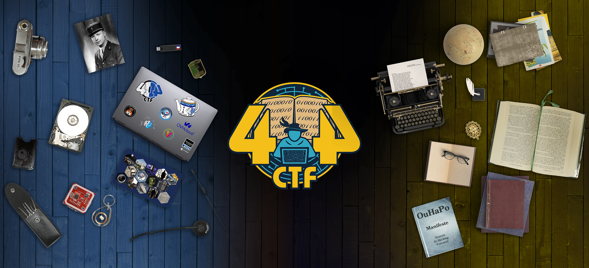

# 404 CTF 2023

**LE 404 CTF EST DE RETOUR !**

Coorganisé par la Direction Générale de la Sécurité Extérieure et Télécom SudParis, le 404 CTF est la plus grande compétition de cybersécurité de France. Après le succès de l'édition 2022 qui célébrait le double anniversaire du BCRA et de la DGSE, cette deuxième édition mettra à l'honneur les grandes figures de la littérature française.

**[https://www.404ctf.fr](https://www.404ctf.fr)**

## Analyse forensique
- {:.challenge.done} [Le Mystère du roman d'amour](./Analyse_forensique/Le_Mystere_du_roman_d_amour/)
- {:.challenge.done} [Les Mystères du cluster de la Comtesse de Ségur [1/2]](./Analyse_forensique/Les_Mysteres_du_cluster_de_la_Comtesse_de_Segur_12/)
- {:.challenge} [Note de bas de page](./Analyse_forensique/Note_de_bas_de_page/)
- {:.challenge.done} [Pêche au livre](./Analyse_forensique/Peche_au_livre/)

## Cryptanalyse
- {:.challenge} [À la fin de l'envoi, je signe !](./Cryptanalyse/A_la_fin_de_l_envoi_je_signe_/)
- {:.challenge.done} [ASCON Marchombre](./Cryptanalyse/ASCON_Marchombre/)
- {:.challenge} [Dessine et signe](./Cryptanalyse/Dessine_et_signe/)
- {:.challenge.done} [Dessine-moi une courbe elliptique](./Cryptanalyse/Dessine-moi_une_courbe_elliptique/)
- {:.challenge} [L'énigme du mal-aimé](./Cryptanalyse/L_enigme_du_mal-aime/)
- {:.challenge} [La Réponse de Voris](./Cryptanalyse/La_Reponse_de_Voris/)
- {:.challenge} [Là où les nombres n'existent pas](./Cryptanalyse/La_ou_les_nombres_n_existent_pas/)
- {:.challenge.done} [Le Jour de l'espace](./Cryptanalyse/Le_Jour_de_l_espace/)
- {:.challenge} [Oracle cassé](./Cryptanalyse/Oracle_casse/)
- {:.challenge.done} [Recette](./Cryptanalyse/Recette/)
- {:.challenge} [Trois](./Cryptanalyse/Trois/)
- {:.challenge.done} [Une littérature animalière](./Cryptanalyse/Une_litterature_animaliere/)

## Divers
- {:.challenge} [À vos plumes !](./Divers/A_vos_plumes_/)
- {:.challenge} [Bienvenue !](./Divers/Bienvenue_/)
- {:.challenge} [Certificat de participation](./Divers/Certificat_de_participation/)
- {:.challenge} [Désirée Dubois](./Divers/Desiree_Dubois/)
- {:.challenge} [Discord](./Divers/Discord/)
- {:.challenge} [Exemple de connexion distante](./Divers/Exemple_de_connexion_distante/)

## Exploitation de binaires
- {:.challenge} [Cache-cache : le retour](./Exploitation_de_binaires/Cache-cache__le_retour/)
- {:.challenge} [Calculatrice](./Exploitation_de_binaires/Calculatrice/)
- {:.challenge} [Débordement du Vélocipède Mécanique](./Exploitation_de_binaires/Debordement_du_Velocipede_Mecanique/)
- {:.challenge} [Je veux la lune !](./Exploitation_de_binaires/Je_veux_la_lune_/)
- {:.challenge} [L'Alchimiste](./Exploitation_de_binaires/L_Alchimiste/)
- {:.challenge} [La Cohue](./Exploitation_de_binaires/La_Cohue/)
- {:.challenge} [La feuille blanche](./Exploitation_de_binaires/La_feuille_blanche/)
- {:.challenge} [Protocole de lecture de fichiers simplifié](./Exploitation_de_binaires/Protocole_de_lecture_de_fichiers_simplifie/)
- {:.challenge} [Un tour de magie](./Exploitation_de_binaires/Un_tour_de_magie/)
- {:.challenge} [Une bibliothèque bien remplie](./Exploitation_de_binaires/Une_bibliotheque_bien_remplie/)
- {:.challenge} [Une citation pas comme les autres [1/2]](./Exploitation_de_binaires/Une_citation_pas_comme_les_autres_12/)

## Intelligence Artificielle
- {:.challenge} [De la poésie](./Intelligence_Artificielle/De_la_poesie/)
- {:.challenge} [Le Petit Chat](./Intelligence_Artificielle/Le_Petit_Chat/)
- {:.challenge} [Notre modèle](./Intelligence_Artificielle/Notre_modele/)

## Programmation
- {:.challenge} [Codecoquillage du Vélocipède Mécanique](./Programmation/Codecoquillage_du_Velocipede_Mecanique/)
- {:.challenge} [Des mots, des mots, des mots](./Programmation/Des_mots_des_mots_des_mots/)
- {:.challenge} [L'Inondation](./Programmation/L_Inondation/)

## Renseignement en sources ouvertes
- {:.challenge} [Chateaubrion Edrabellah : la célèbre figure littéraire française](./Renseignement_en_sources_ouvertes/Chateaubrion_Edrabellah__la_celebre_figure_litteraire_francaise/)
- {:.challenge} [Il est l'or Monseignor !](./Renseignement_en_sources_ouvertes/Il_est_l_or_Monseignor_/)
- {:.challenge} [L'âme d'un poète et le coeur d'une femme [1/4]](./Renseignement_en_sources_ouvertes/L_ame_d_un_poete_et_le_coeur_d_une_femme_14/)
- {:.challenge} [L'âme d'un poète et le coeur d'une femme [2/4]](./Renseignement_en_sources_ouvertes/L_ame_d_un_poete_et_le_coeur_d_une_femme_24/)
- {:.challenge} [L'âme d'un poète et le coeur d'une femme [3/4]](./Renseignement_en_sources_ouvertes/L_ame_d_un_poete_et_le_coeur_d_une_femme_34/)
- {:.challenge} [L'âme d'un poète et le coeur d'une femme [4/4]](./Renseignement_en_sources_ouvertes/L_ame_d_un_poete_et_le_coeur_d_une_femme_44/)
- {:.challenge} [La Quête du sens [1/3]](./Renseignement_en_sources_ouvertes/La_Quete_du_sens_13/)
- {:.challenge} [Le Tour de France](./Renseignement_en_sources_ouvertes/Le_Tour_de_France/)
- {:.challenge} [Les OSINTables [1/3]](./Renseignement_en_sources_ouvertes/Les_OSINTables_13/)
- {:.challenge} [Mentions gastronomiques](./Renseignement_en_sources_ouvertes/Mentions_gastronomiques/)
- {:.challenge} [Un vol ? ](./Renseignement_en_sources_ouvertes/Un_vol__/)

## Rétro-ingénierie
- {:.challenge} [Décortique mon Vélocipède Mécanique](./Retro-ingenierie/Decortique_mon_Velocipede_Mecanique/)
- {:.challenge} [Encore une mise à jour !](./Retro-ingenierie/Encore_une_mise_a_jour_/)
- {:.challenge} [Introspection](./Retro-ingenierie/Introspection/)
- {:.challenge} [Jouer ou ne pas jouer ?](./Retro-ingenierie/Jouer_ou_ne_pas_jouer_/)
- {:.challenge} [L'Inspiration en images](./Retro-ingenierie/L_Inspiration_en_images/)
- {:.challenge} [Le Divin Crackme](./Retro-ingenierie/Le_Divin_Crackme/)
- {:.challenge} [Le Jour du mange poney](./Retro-ingenierie/Le_Jour_du_mange_poney/)
- {:.challenge} [Les Mystères du cluster de la Comtesse de Ségur [2/2]](./Retro-ingenierie/Les_Mysteres_du_cluster_de_la_Comtesse_de_Segur_22/)

## Stéganographie
- {:.challenge.done} [En Profondeur](./Steganographie/En_Profondeur/)
- {:.challenge.done} [L'Œuvre](./Steganographie/L_oeuvre/)
- {:.challenge.done} [Le Rouge et le vert, avec un soupçon de bleu](./Steganographie/Le_Rouge_et_le_vert_avec_un_soupcon_de_bleu/)
- {:.challenge.done} [Les Félicitations](./Steganographie/Les_Felicitations/)
- {:.challenge.done} [Odobenus Rosmarus](./Steganographie/Odobenus_Rosmarus/)

## Sécurité matérielle
- {:.challenge} [0x0418 bTpot](./Securite_materielle/0x0418_bTpot/)
- {:.challenge} [À la trace](./Securite_materielle/A_la_trace/)
- {:.challenge} [Des tetrominos qui choient](./Securite_materielle/Des_tetrominos_qui_choient/)
- {:.challenge} [L'Être ou le néant](./Securite_materielle/L_Etre_ou_le_neant/)
- {:.challenge} [Un courrier suspect](./Securite_materielle/Un_courrier_suspect/)
- {:.challenge} [Un réveil difficile](./Securite_materielle/Un_reveil_difficile/)

## Web
- {:.challenge} [Chanson d'Inde](./Web/Chanson_d_Inde/)
- {:.challenge.done} [Fuite en 1791](./Web/Fuite_en_1791/)
- {:.challenge.done} [L'Académie du détail](./Web/L_Academie_du_detail/)
- {:.challenge.done} [L'Épistolaire moderne](./Web/L_Epistolaire_moderne/)
- {:.challenge.done} [La Vie Française](./Web/La_Vie_Francaise/)
- {:.challenge.done} [Le Loup et le renard](./Web/Le_Loup_et_le_renard/)

## Web3
- {:.challenge} [Art](./Web3/Art/)
- {:.challenge} [D'un nihilisme assumé](./Web3/D_un_nihilisme_assume/)
- {:.challenge} [L'Antiquaire, tête en l'air](./Web3/L_Antiquaire_tete_en_l_air/)
- {:.challenge} [L'Arriviste accompli](./Web3/L_Arriviste_accompli/)
- {:.challenge} [La Folie du jeu : d'esclave à maître](./Web3/La_Folie_du_jeu__d_esclave_a_maitre/)
- {:.challenge} [La Folie du jeu : descente aux enfers](./Web3/La_Folie_du_jeu__descente_aux_enfers/)
- {:.challenge} [La guerre des boutons](./Web3/La_guerre_des_boutons/)

 
 
 

# Résultats (top 50)

|  # |  Name  |  Solves  | Score |
|-----|--------|----------|-------|
| 1 | Thorn | 70673|
| 2 | N04H | 53701|
| 3 | Jorzan | 52843|
| 4 | Renek | 50698|
| 5 | asterix45 | 49706|
| 6 | beauby | 47212|
| 7 | Carsso | 46667|
| 8 | manieGrosTougne | 45759|
| 9 | NGD | 44764|
|10 | iagavariou | 42855|
|11 | R3børn | 42802|
|12 | DarkInfern010 | 42799|
|13 | ryses | 42780|
|14 | Chelinka | 42714|
|15 | lounux2.0 | 42165|
|16 | M4ke | 41890|
|17 | T☠to1st3 | 41820|
|18 | Persévérance | 41631|
|19 | stardust | 39342|
|20 | xdjibi | 39072|
|21 | Obeeron | 36837|
|22 | Carambole | 36414|
|23 | 0xh3x3B | 36244|
|24 | Ayweth20 | 35229|
|25 | ThaySan | 34102|
|26 | Rooting | 32576|
|27 | Anatharr | 32494|
|28 | Benja | 31990|
|29 | exhyl | 31630|
|30 | Skav | 30561|
|31 | MattLarnak | 30418|
|32 | jdhune | 30247|
|33 | BatBato | 29139|
|34 | Pierre_Adams | 28867|
|35 | kpanic | 28627|
|36 | chewwwie | 28378|
|37 | JmuXx | 28277|
|38 | Turing-04 | 27483|
|39 | Arthurdufinister | 27003|
|40 | croucroute | 26743|
|41 | thierryb | 26645|
|42 | StaZ | 26470|
|43 | ShinysArc | 26247|
|44 | 7h30th3r0n3 | 25894|
|45 | jimee | 25826|
|46 | Cryptanalyse | 25714|
|47 | Reyko | 25332|
|48 | m4tt | 25105|
|49 | Haetera | 25094|
|50 | Hector6704 | 24556|

