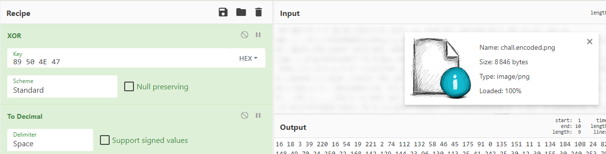
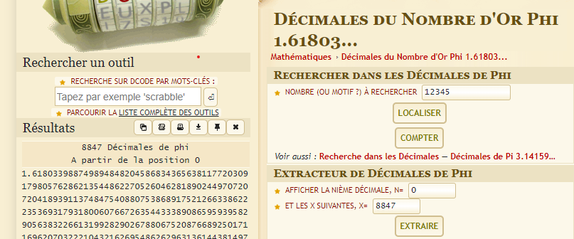

# Write-Up
> **title:** Golden Cipher
>
> **category:** Cryptographie
>
> **difficulty:** Moyen
>
> **point:** 50
>
> **author:** Maestran
>
> **description:**
>
> Selon le principe de Kerckhoffs, la sécurité d'un système cryptographique ne dépend pas de la méthode de chiffrement mais de la clé elle même.
>
> Ainsi, si je prends un nombre infini pour clé et que je le XOR, mon secret est parfait !
>
> Il ne me reste plus qu'à trouver un nombre infini...


## Analyse du challenge

Dans la description du challenge on nous parle de 2 choses :
- Le chiffrement est un simple XOR (donc réversible facilement)
- La clé utilisée est un nombre infini

Des nombres dit "infini" connus (communément appelés *nombres irrationnels*), il en existe un certain nombre, mais le titre **Golden** nous rappelle fortement le **`nombre d'or`**.

Si l'on regarde le fichier, on voit qu'il se termine par **`.png`**. Faisons donc appelle au **magic number** du PNG, à savoir **`‰PNG`**, en hexa : **`89 50 4E 47`**.

On va donc faire un XOR sur le début du fichier avec le magic number, ça nous donne ceci :



Si l'on prend les 4 premiers octets en décimal, on obtient **`16 18 03 39`**.

Le nombre d'or c'est quoi ? **`1.61803398875`**

**On voit que ça commence par la même chose !**. Il suffit donc de prendre les decimal du nombre d'or 2 à 2 et faire un XOR avec le fichier chiffré !


## Déchiffrement du fichier

On commence par récupérer le bon nombre de décimal du nombre d'or, le fichier fait **8846 octets**, on a donc besoin d'au moins du double (*puisqu'on utilise 2 décimal par octet*) soit **17691** chiffres après la virgule du nombre d'or. Pour ça j'utilise **[dcode](https://www.dcode.fr/decimales-nombre-or)** (*il faut demander 17693 décimales puisque le site compte le 1 et le . comme des décimales*) :



On enregistre le tout dans un fichier nommé **`phi.txt`**.

Voici ensuite le script pour faire un XOR du fichier chiffré avec nos décimales :

```python
with open('./chall.encoded.png', 'rb') as f:
    # Récupération des bytes du fichier chiffré
    data = f.read()

with open('./phi.txt') as f:
    # Récupération des décimales du nombre d'or
    phi = f.read().strip()
    # Transformation en tableau des décimales 2 à 2 (ex : [16, 18, 03, 39...])
    phi = [int(phi[i:i+2]) for i in range(0, len(phi), 2)]

with open('./chall.png', 'wb') as f:
    # XOR des octets entre eux + écriture dans un nouveau fichier
    f.write(bytearray([data[i] ^ phi[i] for i in range(0, len(data))]))
```


**Le flag : CYBN{3uClId3_Le_BoSs_D3s_N0mbR3s}**
