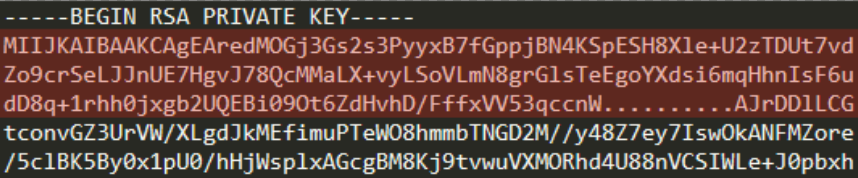
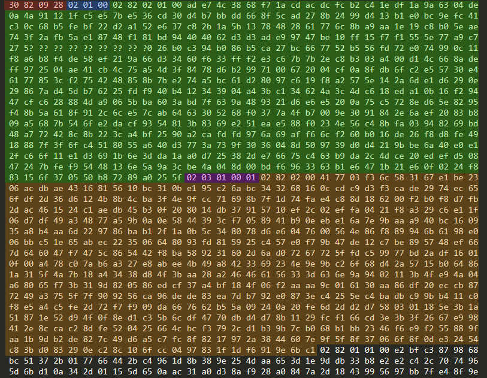
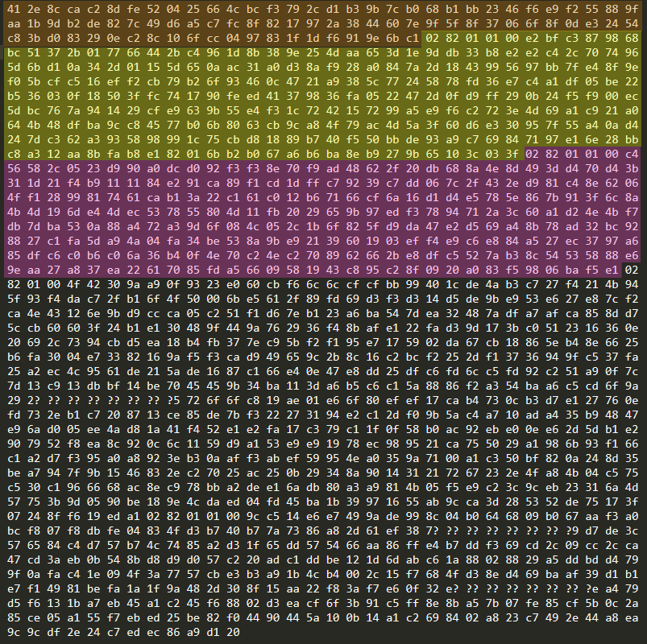
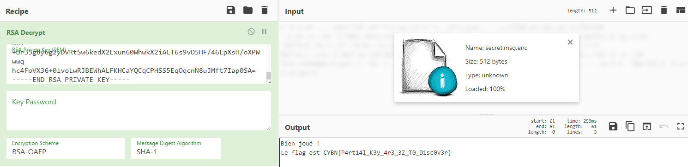


# Write-Up
> **title:** RSAPeiNeLiSiBle
>
> **category:** Cryptographie
>
> **difficulty:** 125
>
> **point:** Difficile
>
> **author:** Maestran
>
> **description:**
>
> Mince, vous avez mis votre clé privée RSA à la machine à laver, et une partie n'est plus visible ! Réussirez vous à retrouver le secret que vous aviez chiffré ?

## Analyse du RSA

Les fichiers dont nous disposons sont : le fichier chiffré en RSA *a priori* et la clé PEM utilisée pour. Seulement, certaines parties de la clé ne sont pas lisibles. Comment faire ?

Commençons par nous renseigner sur le format PEM :


## Décoder la Base64 en Hexadécimal

Puisqu'il manque des parties, il va falloir commencer par décoder les parties lisibles de la clé à la main.

On va d'abord transformer chaque caractère de la base 64 en binaire (*je rappelle qu'un caractère de la base 64 s'écrit non pas sur 8 bits mais 6*). Pour les caractères illisibles, nous remplacerons les bits par **`??????`**.

Commençons avec le début de la clé :



Script en python :

```python
charset = "ABCDEFGHIJKLMNOPQRSTUVWXYZabcdefghijklmnopqrstuvwxyz0123456789+/"

encoded = "MIIJKAIBAAKCAgEAredMOGj3Gs2s3PyyxB7fGppjBN4KSpESH8Xle+U2zTDUt7vdZo9crSeLJJnUE7HgvJ78QcMMaLX+vyLSoVLmN8grGlsTeEgoYXdsi6mqHhnIsF6udD8q+1rhh0jxgb2UQEBi09Ot6ZdHvhD/FffxVV53qccnW..........AJrDDlLCG"
print(''.join([bin(charset.index(c))[2:].zfill(6) if c != '.' else '??????' for c in encoded]))
```

```
Output:
001100001000001000001001001010000000001000000001000000000000001010000010000000100000000100000000101011011110011101001100001110000110100011110111000110101100110110101100110111001111110010110010110001000001111011011111000110101001101001100011000001001101111000001010010010101001000100010010000111111100010111100101011110111110010100110110110011010011000011010100101101111011101111011101011001101000111101011100101011010010011110001011001001001001100111010100000100111011000111100000101111001001111011111100010000011100001100001100011010001011010111111110101111110010001011010010101000010101001011100110001101111100100000101011000110100101101100010011011110000100100000101000011000010111011101101100100010111010100110101010000111100001100111001000101100000101111010101110011101000011111100101010111110110101101011100001100001110100100011110001100000011011110110010100010000000100000001100010110100111101001110101101111010011001011101000111101111100001000011111111000101011111011111110001010101010101111001110111101010011100011100100111010110????????????????????????????????????????????????????????????000000001001101011000011000011100101001011000010000110

```

Maintenant on retranscrit 4 bits par 4 bits en hexadécimal et un peu de mise en forme :

```python
binary =  "001100001000001000001001001010000000001000000001000000000000001010000010000000100000000100000000101011011110011101001100001110000110100011110111000110101100110110101100110111001111110010110010110001000001111011011111000110101001101001100011000001001101111000001010010010101001000100010010000111111100010111100101011110111110010100110110110011010011000011010100101101111011101111011101011001101000111101011100101011010010011110001011001001001001100111010100000100111011000111100000101111001001111011111100010000011100001100001100011010001011010111111110101111110010001011010010101000010101001011100110001101111100100000101011000110100101101100010011011110000100100000101000011000010111011101101100100010111010100110101010000111100001100111001000101100000101111010101110011101000011111100101010111110110101101011100001100001110100100011110001100000011011110110010100010000000100000001100010110100111101001110101101111010011001011101000111101111100001000011111111000101011111011111110001010101010101111001110111101010011100011100100111010110????????????????????????????????????????????????????????????000000001001101011000011000011100101001011000010000110"
hexa = ''.join(['?' if '?' in binary[i:i+4] else hex(int(binary[i:i+4], 2))[2:].zfill(1) for i in range(0, len(binary), 4)])
hexa_beautified = ''
for i in range(0, len(hexa), 2):
    if i != 0:
        hexa_beautified += '\n' if i % 32 == 0 else ' '
    hexa_beautified += hexa[i:i+2]
print(hexa_beautified)
```

```
Output:
30 82 09 28 02 01 00 02 82 02 01 00 ad e7 4c 38
68 f7 1a cd ac dc fc b2 c4 1e df 1a 9a 63 04 de
0a 4a 91 12 1f c5 e5 7b e5 36 cd 30 d4 b7 bb dd
66 8f 5c ad 27 8b 24 99 d4 13 b1 e0 bc 9e fc 41
c3 0c 68 b5 fe bf 22 d2 a1 52 e6 37 c8 2b 1a 5b
13 78 48 28 61 77 6c 8b a9 aa 1e 19 c8 b0 5e ae
74 3f 2a fb 5a e1 87 48 f1 81 bd 94 40 40 62 d3
d3 ad e9 97 47 be 10 ff 15 f7 f1 55 5e 77 a9 c7
27 5? ?? ?? ?? ?? ?? ?? ?? ?0 26 b0 c3 94 b0 86
```

**Appliquons maintenant cela sur l'ensemble de la clé :**

```python
charset = "ABCDEFGHIJKLMNOPQRSTUVWXYZabcdefghijklmnopqrstuvwxyz0123456789+/"

with open('./key.pem') as f:
    key = ''.join(f.read().split('\n')[1:-2])

binary = ''.join([bin(charset.index(c))[2:].zfill(6) if c != '.' else '??????' for c in key if c != '='])
hexa = ''.join(['?' if '?' in binary[i:i+4] else hex(int(binary[i:i+4], 2))[2:].zfill(1) for i in range(0, len(binary), 4)])
hexa_beautified = ''
for i in range(0, len(hexa), 2):
    if i != 0:
        hexa_beautified += '\n' if i % 64 == 0 else ' '
    hexa_beautified += hexa[i:i+2]
print(hexa_beautified)
```

```
Output:
30 82 09 28 02 01 00 02 82 02 01 00 ad e7 4c 38 68 f7 1a cd ac dc fc b2 c4 1e df 1a 9a 63 04 de
0a 4a 91 12 1f c5 e5 7b e5 36 cd 30 d4 b7 bb dd 66 8f 5c ad 27 8b 24 99 d4 13 b1 e0 bc 9e fc 41
c3 0c 68 b5 fe bf 22 d2 a1 52 e6 37 c8 2b 1a 5b 13 78 48 28 61 77 6c 8b a9 aa 1e 19 c8 b0 5e ae
74 3f 2a fb 5a e1 87 48 f1 81 bd 94 40 40 62 d3 d3 ad e9 97 47 be 10 ff 15 f7 f1 55 5e 77 a9 c7
27 5? ?? ?? ?? ?? ?? ?? ?? ?0 26 b0 c3 94 b0 86 b5 ca 27 bc 66 77 52 b5 56 fd 72 e0 74 99 0c 11
f8 a6 b8 f4 de 58 ef 21 9a 66 d3 34 60 f6 33 ff f2 e3 c6 7b 7b 2e c8 b3 03 a4 00 d1 4c 66 8a de
ff 97 25 04 ae 41 cb 4c 75 a5 4d 3f 84 78 d6 b2 99 71 00 67 20 04 cf 0a 8f db 6f c2 e5 57 30 e4
61 77 85 3c f2 75 42 48 85 8b 7b e2 74 a5 bc 61 d2 80 97 c6 19 f8 a2 57 5e 14 2a 6d e1 d6 29 0e
29 86 7a d4 5d b7 62 25 fd f9 40 b4 12 34 39 04 a4 3b c1 34 62 4a 3c 4d c6 18 ed a1 0b 16 f2 94
47 cf c6 28 88 4d a9 06 5b ba 60 3a bd 7f 63 9a 48 93 21 d6 e6 e5 20 0a 75 c5 72 8e d6 5e 82 95
f4 8b 5a 61 8f 91 2c 6c e5 7c ab 64 63 30 52 68 f0 37 7a 4f b7 00 9e 30 91 84 2e 6a ef 20 83 b8
09 a5 68 7b 54 6f e2 da cf 93 54 81 3b 83 69 e2 51 ea e5 88 f0 23 4e 56 c4 8b fa 03 94 82 69 bd
48 a7 72 42 8c 8b 22 3c a4 bf 25 90 a2 ca fd fd 97 6a 69 af f6 6c f2 60 b0 16 de 26 f8 d8 fe 49
18 88 7f 3f 6f c4 51 80 55 a6 40 d3 77 3a 73 9f 30 36 04 8d 50 97 39 d0 d4 21 9b be 6a 40 e0 e1
2f c6 6f 11 e1 d3 69 1b 6e 3d da 1a a0 d7 25 38 2d e7 66 75 c4 63 b9 da 2c 4d ce 20 ed ef d5 08
47 24 7b fe f9 54 48 13 6e 5a 9a 3c be 4a 04 8d 00 bd f6 96 33 63 b1 e6 47 1b 21 e6 0f 02 24 f8
83 15 6f 37 05 50 b8 72 89 a0 25 5f 02 03 01 00 01 02 82 02 00 41 77 03 f3 6c 58 31 67 e1 be 23
06 ac db ae 43 16 81 56 10 bc 31 0b e1 95 c2 6a bc 34 32 68 16 0c cd c9 d3 f3 ca de 29 74 ec 65
6f df 2d 36 d6 12 4b 8b 4c ba 3f 4e 9f cc 71 69 8b 7f 1d 74 fa e4 c8 8d 18 62 00 f2 b0 f8 d7 fb
2d ac 46 15 24 c1 ae db 45 b3 0f 20 80 14 db 37 91 57 10 ef 2c 02 ef fa 04 21 f8 a3 29 c6 e1 1f
06 d7 df 49 a3 48 77 a5 9b 0a 0e 58 44 39 3c f7 05 89 41 b9 0e eb e1 6a 7e 9b aa a9 40 bc 16 09
35 a8 b4 aa 6d 22 97 86 ba b1 2f 1a 0b 5c 34 80 78 d6 e6 04 76 00 56 4e 86 f8 89 94 6b 61 98 e0
06 bb c5 1e 65 ab ec 22 35 06 64 80 93 fd 81 59 25 c4 57 e0 f7 9b 47 de 12 c7 be 89 57 48 ef 66
7d 64 60 47 f7 47 5c 86 54 42 f8 ba 58 92 31 60 2d 6a d0 72 67 72 5f fd c5 99 77 bd 2a df 16 01
0f 00 a4 78 c0 7a b6 a3 27 e8 ab ee 4b 49 a8 42 33 69 23 4e 9e 9b c2 6f 68 d4 2a 57 15 b0 64 86
1a 31 5f 4a 7b 18 a4 34 38 d8 4f 3b aa 28 a2 46 46 61 56 33 3d 63 6e 9a 94 02 11 3b 4f e9 4a 04
a6 80 65 f7 3b 31 9d 82 05 86 ed cf 37 a4 bf 18 4f 06 f2 aa aa 9c 01 61 30 aa 86 df 20 ec cb 87
72 49 a3 75 5f 7f 90 92 56 ca 96 de de 83 ea 7d b7 92 e0 87 3e c4 25 5e c4 ba db c9 9b b4 11 c0
f8 e5 a4 c5 fe 2d 72 f7 f9 09 da 66 76 62 b5 5a 09 24 0a 20 fe 6d 2d d2 d7 58 03 01 18 5e 3b 1a
51 87 1e 52 d9 4f 0f 8e d1 c3 5b 6c df 47 70 db d4 d7 8b 11 29 fc f1 66 cd 3e 3b 3f 26 67 e9 98
41 2e 8c ca c2 8d fe 52 04 25 66 4c bc f3 79 2c d1 b3 9b 7c b0 68 b1 bb 23 46 f6 e9 f2 55 88 9f
aa 1b 9d b2 de 82 7c 49 d6 a5 c7 fc 8f 82 17 97 2a 38 44 60 7e 9f 5f 8f 37 06 6f 8f 0d e3 24 54
c8 3b d0 83 29 0e c2 8c 10 6f cc 04 97 83 1f 1d f6 91 9e 6b c1 02 82 01 01 00 e2 bf c3 87 98 68
bc 51 37 2b 01 77 66 44 2b c4 96 1d 8b 38 9e 25 4d aa 65 3d 1e 9d db 33 b8 e2 e2 c4 2c 70 74 96
5d 6b d1 0a 34 2d 01 15 5d 65 0a ac 31 a0 d3 8a f9 28 a0 84 7a 2d 18 43 99 56 97 bb 7f e4 8f 9e
f0 5b cf c5 16 ef f2 cb 79 b2 6f 93 46 0c 47 21 a9 38 5c 77 24 58 78 fd 36 e7 c4 a1 df 05 be 22
b5 36 03 0f 18 50 3f fc 74 17 90 fe ed 41 37 98 36 fa 05 22 47 2d 0f d9 ff 29 0b 24 f5 f9 00 ec
5d bc 76 7a 94 14 29 cf e9 63 9b 55 e4 f3 1c 72 42 15 72 99 a5 e9 f6 c2 72 3e 4d 69 a1 c9 21 a0
64 4b 48 df ba 9c c8 45 77 b0 6b 80 63 cb 9c a8 4f 79 ac 4d 5a 3f 60 d6 e3 30 95 7f 55 a4 0a d4
24 7d c3 62 a3 93 58 98 99 1c 75 cb d8 18 89 b7 40 f5 50 bb de 93 a9 c7 69 84 71 97 e1 6e 28 bb
c8 a3 12 aa 8b fa b8 e1 82 01 6b b2 b0 67 a6 b6 ba 8e b9 27 9b 65 10 3c 03 3f 02 82 01 01 00 c4
56 58 2c 05 23 d9 90 a0 dc d0 92 f3 f3 8e 70 f9 ad 48 62 2f 20 db 68 8a 4e 8d 49 3d d4 70 d4 3b
31 1d 21 f4 b9 11 11 84 e2 91 ca 89 f1 cd 1d ff c7 92 39 c7 dd 06 7c 2f 43 2e d9 81 c4 8e 62 06
4f f1 28 99 81 74 61 ca b1 3a 22 c1 61 c0 12 b6 71 66 cf 6a 16 d1 d4 e5 78 5e 86 7b 91 3f 6c 8a
4b 4d 19 6d e4 4d ec 53 78 55 80 4d 11 fb 20 29 65 9b 97 ed f3 78 94 71 2a 3c 60 a1 d2 4e 4b f7
db 7d ba 53 0a 88 a4 72 a3 9d 6f 08 4c 05 2c 1b 6f 82 5f d9 da 47 e2 d5 69 a4 8b 78 ad 32 bc 92
88 27 c1 fa 5d a9 4a 04 fa 34 be 53 8a 9b e9 21 39 60 19 03 ef f4 e9 c6 e8 84 a5 27 ec 37 97 a6
85 df c6 c0 b6 c0 6a 36 b4 0f 4e 70 c2 4e c2 70 89 62 66 2b e8 df c5 52 7a b3 8c 54 53 58 88 e6
9e aa 27 a8 37 ea 22 61 70 85 fd a5 66 09 58 19 43 c8 95 c2 8f 09 20 a0 83 f5 98 06 ba f5 e1 02
82 01 00 4f 42 30 9a a9 0f 93 23 e0 60 cb f6 6c 6c cf cf bb 99 40 1c de 4a b3 c7 27 f4 21 4b 94
5f 93 f4 da c7 2f b1 6f 4f 50 00 6b e5 61 2f 89 fd 69 d3 f3 d3 14 d5 de 9b e9 53 e6 27 e8 7c f2
ca 4e 43 12 6e 9b d9 cc ca 05 c2 51 f1 d6 7e b1 23 a6 ba 54 7d ea 32 48 7a df a7 af ca 85 8d d7
5c cb 60 60 3f 24 b1 e1 30 48 9f 44 9a 76 29 36 f4 8b af e1 22 fa d3 9d 17 3b c0 51 23 16 36 0e
20 69 2c 73 94 cb d5 ea 18 b4 fb 37 7e c9 5b f2 f1 95 e7 17 59 02 da 67 cb 18 86 5e b4 8e 66 25
b6 fa 30 04 e7 33 82 16 9a f5 f3 ca d9 49 65 9c 2b 8c 16 c2 bc f2 25 2d f1 37 36 94 9f c5 37 fa
25 a2 ec 4c 95 61 de 21 5a de 16 87 c1 66 e4 0e 47 e8 dd 25 df c6 fd 6c c5 fd 92 c2 51 a9 0f 7c
7d 13 c9 13 db bf 14 be 70 45 45 9b 34 ba 11 3d a6 b5 c6 c1 5a 88 86 f2 a3 54 ba a6 c5 cd 6f 9a
29 2? ?? ?? ?? ?? ?? ?? ?5 72 6f 6f c8 19 ae 01 e6 6f 80 ef ef 17 ca b4 73 0c b3 d7 e1 27 76 0e
fd 73 2e b1 c7 20 87 13 ce 85 de 7b f3 22 27 31 94 e2 c1 2d f0 9b 5a c4 a7 10 ad a4 35 b9 48 47
e9 6a d0 05 ee 4a d8 1a 41 f4 52 e1 e2 fa 17 c3 79 c1 1f 0f 58 b0 ac 92 eb e0 0e e6 2d 5d b1 e2
90 79 52 f8 ea 8c 92 0c 6c 11 59 d9 a1 53 e9 e9 19 78 ec 98 95 21 ca 75 50 29 a1 98 6b 93 f1 66
c1 a2 d7 f3 95 a0 a8 92 3e b3 0a af f3 ab ef 59 95 4e a0 35 9a 71 00 a1 c3 50 bf 82 0a 24 8d 35
be a7 94 7f 9b 15 46 83 2e c2 70 25 ac 25 0b 29 34 8a 90 14 31 21 72 67 23 2e 4f a8 4b 04 c5 75
c5 30 c1 96 66 68 ac 8e c9 78 bb a2 de e1 6a db 80 a3 a9 81 4b 05 f5 e9 c2 3c 9c eb 23 31 6a 4d
57 75 3b 9d 05 90 be 18 9e 4c da ed 04 fd 45 ba 1b 39 97 16 55 ab 9c ca 3d 28 53 52 de 75 17 3f
07 24 8f f6 19 ed a1 02 82 01 01 00 9c c5 14 e6 e7 49 9a de 99 8c 04 b0 64 68 09 b0 67 aa f3 a0
bc f8 07 f8 db fe 04 83 4f d3 b7 40 b7 7a 73 86 a8 2d 61 ef 38 7? ?? ?? ?? ?? ?? ?? ?9 d7 de 3c
57 65 84 c4 d7 57 b7 4c 74 85 a2 d3 1f 65 dd 57 54 66 aa 86 ff e4 b7 dd f3 69 cd 2c 09 cc 2c ca
47 cd 3a eb 0b 54 8b d8 d9 d0 57 c2 20 ad c1 dd be 12 1d 6d ab c6 1a 88 02 88 29 a5 dd bd d4 79
9f 0a fa c4 1e 09 4f 3a 77 57 cb e3 b3 a9 1b 4c b4 00 2c 15 f7 68 4f d3 8e d4 69 ba af 39 d1 b1
e7 f1 49 81 be fa 1a 1f 9a 48 2d 30 8f 15 aa 22 f8 3a f7 e6 0f 32 e? ?? ?? ?? ?? ?? ?? ?e a4 79
d5 f6 13 1b a7 eb 45 a1 c2 45 f6 88 02 d3 ea cf 6f 3b 91 c5 ff 8e 8b a5 7b 07 fe 85 cf 5b 0c 2a
85 ce 05 a1 55 f7 eb ed 25 be 82 f0 44 90 44 5a 10 0b 14 a1 c2 69 84 02 a8 23 c7 49 2e 44 a8 ea
9c 9c df 2e 24 c7 ed ec 86 a9 d1 20
```


## Fonctionnement d'une clé PEM

Une clé PEM est au encodée au format DER en base 64 et entre des balises. La structure des bytes répond aux critères précis de l' **ASN-1**. Son fonctionnement :

Pour encoder une valeur, on utilise un **triplet TLV** (*Tag-Length-Value*) :
- Le premier octet, **le tag**, définis le type de valeur (*ex: 0x02 pour un entier, 0x03 pour une string, 0x30 pour une séquence etc..., [liste complète](https://docs.microsoft.com/en-us/windows/win32/seccertenroll/about-encoded-tag-bytes)*)

- Le second octet, **la taille**, dit sur combien d'octet la valeur est codée **en BigEndian**. Une particularité est que le 7ème bit (*celui tout à gauche*) est réservé. Si la valeur est codée sur moins de 128 octets, pas de soucis on peut écrire sa taille sur l'octet Length directement, sinon, on passe le 7ème bit à 1 et les bits 6 à 0 servent à dire sur combien d'octets, à la suite de lui-même, la taille est codée.

- Troisième partie, **Value** : les octets suivants définissent la valeur.

> **Exemple 1**
>
> Si je veux coder l'entier 65537 (soit `01 00 01` en hexa), je peux le coder sa valeur sur 3 octets.
>
> Ainsi, on écrit d'abord le tag, ici un entier donc le premier octet sera 0x02
>
> Ensuite l'octet taille, comme on a besoin de 3 octets et que c'est inférieur à 128, le cet octet dira directement la taille de la valeur, ce sera donc 0x03
>
> Enfin les octets de valeur, ça sera notre valeur concrète donc : 0x01 0x00 0x01
>
> Au complet ça donne : `02 03 01 00 01`


> **Exemple 2**
>
> Si je veux coder un entier très grand et qui prend 560 octets pour l'être :
>
> On écrit d'abord le tag, ici un entier donc toujours 0x02
>
> Ensuite l'octet taille, comme la taille est de 560, c'est supérieur ou égal à 128, il nous faudra 2 octets pour la coder, l'octet de taille servira donc non pas à annoncer la taille directement, mais sur combien d'octet elle va être annoncée, on place donc le bit tout à gauche sur 1, et sur les 7 suivants serviront à dire sur combien : 1000 0010 (0x82 en hexa)
>
> On place nos 2 octets pour annoncer la taille de la valeur : 0x02 0x30 (560 en décimal)
>
> Enfin la valeur, les octets suivants seront les 560 attendus.
>
> Au complet ça donne : `02 82 02 30 xx xx .. xx`

Dans une clé DER, les données sont codées dans cet ordre :

```
RSAPrivateKey ::= SEQUENCE {
  version           Version,
  modulus           INTEGER,  -- n
  publicExponent    INTEGER,  -- e
  privateExponent   INTEGER,  -- d
  prime1            INTEGER,  -- p
  prime2            INTEGER,  -- q
  exponent1         INTEGER,  -- d mod (p-1)
  exponent2         INTEGER,  -- d mod (q-1)
  coefficient       INTEGER,  -- (inverse of q) mod p
  otherPrimeInfos   OtherPrimeInfos OPTIONAL
}
```

Si l'on prend notre fichier en hexa, on peut essayer de décoder à la main :



- En rouge, la taille de la clé, on voit 30, c'est notre **séquence**, ensuite 82 nous indique que les 2 octets suivants définissent la taille de la valeur, et enfin 09 28 nous dit que le fichier fait 2344, et en effet, sans ces 4 octets, c'est bien la taille complète du fichier.
- En bleu, c'est ce qu'on a vu juste avant, c'est la **version**, on est en **`version 0`**.
- En vert, c'est le n, codé sur 513 octets mais malheureusement certains sont illisibles...
- En violet, l'exposant public, **e**, sa valeur est **`65537`**
- En orange l'exposant privé, **d**, bien plus intéressant et totalement lisible, il est codé sur 512 octets (0x02 0x00)

La suite du fichier en hexa :



- En jaune, le **p**, codé sur 257 octets

- En rose, le **q**, codé sur 257 octets également

Nos valeurs :

```
n = ?
e = 65537
d = 267073507412023336475960262054614130505861824680127951483294164376669157497684275142897779822630791531440939183089902756895868598138257524635984743022893416691347942957291951163005746006464673458961590765415964035313067915443265323142147961669125648867095672347921541586412531194440566936718609116753687164543592335362204246490047610596339777011743661045735575791471767142977031109523740562213096048877393395305812391125298767570644713661268213676142650159090197209787787696735694922045765107351931357611809507860434554736152056991081228909798051852720292450941719987139562508918492184517993566093298868034421304241067710991560804774588097107060407193997286283005412172949946190543269821898000345599086562412834476580269913337260350517028935449651592605529548710915468451450003796665252145400417756511763925368978909231748958278450369647244357426493776193587480580760430005122044834007966765901573824459434617014446778119596219102997949347488817383369366837332131260208065283506520324361373795179277329295778715846529768717662006633116532831035653691181612697863160253370242933565342722676287579429207540866738963271184854910085027081848223736545922877468052273940668165086099781179773167510060979760905287779330440514885629939444673
p = 28624419170462290429619507580511082029814285924336052999010182124917972841006878918726243071673417299074683204292392144627159000205781533578531754715514732592849428254306665371024137670865671608270364783239429433056435627976400320451175968563373864986016441846631837797463413950346898900459251472898681074143271331809909497639302707135389992144799531103781956385823578632179611396835397387038316278283758192688385449845144106230408499243996526598740444033026965688385456136989730944173791972214484523636228231440211784813964230458591085429684808122556402457591455176654173580540820453034612552749567720222467517317951
q = 24785285794588935772876957267722756919307544096595999122829484675362080441664148640753194433380728673623252940848806816866511436086486400712292275391091626839390762380511576876277944085610413662884100488402563476676458887597213843520754999909944047092277958517431184590389414535039783787423826334934734593865141848191761224478751883028557596705660307279995042041459630178314513067565435941593925544875883918549371160329836836281119729525856583871502468844249599704107490188737281308695303668038471971328962312203479778371921651836668706029185920510062601649204390766872277681510251860597638803823694087830878985844193
```

**Maintenant qu'on a pu identifier le p et q, on peut retrouver n qui est illisible**.

Si l'on teste :

```python
p = 28624419170462290429619507580511082029814285924336052999010182124917972841006878918726243071673417299074683204292392144627159000205781533578531754715514732592849428254306665371024137670865671608270364783239429433056435627976400320451175968563373864986016441846631837797463413950346898900459251472898681074143271331809909497639302707135389992144799531103781956385823578632179611396835397387038316278283758192688385449845144106230408499243996526598740444033026965688385456136989730944173791972214484523636228231440211784813964230458591085429684808122556402457591455176654173580540820453034612552749567720222467517317951
q = 24785285794588935772876957267722756919307544096595999122829484675362080441664148640753194433380728673623252940848806816866511436086486400712292275391091626839390762380511576876277944085610413662884100488402563476676458887597213843520754999909944047092277958517431184590389414535039783787423826334934734593865141848191761224478751883028557596705660307279995042041459630178314513067565435941593925544875883918549371160329836836281119729525856583871502468844249599704107490188737281308695303668038471971328962312203479778371921651836668706029185920510062601649204390766872277681510251860597638803823694087830878985844193
print(hex(p*q)[2:])
```

```
Output: ade74c3868f71acdacdcfcb2c41edf1a9a6304de0a4a91121fc5e57be536cd30d4b7bbdd668f5cad278b2499d413b1e0bc9efc41c30c68b5febf22d2a152e637c82b1a5b1378482861776c8ba9aa1e19c8b05eae743f2afb5ae18748f181bd94404062d3d3ade99747be10ff15f7f1555e77a9c7275a150caf7589b6644026b0c394b086b5ca27bc667752b556fd72e074990c11f8a6b8f4de58ef219a66d33460f633fff2e3c67b7b2ec8b303a400d14c668adeff972504ae41cb4c75a54d3f8478d6b2997100672004cf0a8fdb6fc2e55730e46177853cf2754248858b7be274a5bc61d28097c619f8a2575e142a6de1d6290e29867ad45db76225fdf940b412343904a43bc134624a3c4dc618eda10b16f29447cfc628884da9065bba603abd7f639a489321d6e6e5200a75c5728ed65e8295f48b5a618f912c6ce57cab6463305268f0377a4fb7009e3091842e6aef2083b809a5687b546fe2dacf9354813b8369e251eae588f0234e56c48bfa03948269bd48a772428c8b223ca4bf2590a2cafdfd976a69aff66cf260b016de26f8d8fe4918887f3f6fc4518055a640d3773a739f3036048d509739d0d4219bbe6a40e0e12fc66f11e1d3691b6e3dda1aa0d725382de76675c463b9da2c4dce20edefd50847247bfef95448136e5a9a3cbe4a048d00bdf6963363b1e6471b21e60f0224f883156f370550b87289a0255f
```

Ca commence par **`ad e7 4c 38`**, tout comme la valeur de l'entier en vert sur notre image de tout à l'heure, **ça semble correct**.

## Déchiffrement du fichier

On peut simplement reconstruire une clé PEM valide à partir de ces informations :

```python
from Crypto.PublicKey import RSA  

e = 65537
d = 267073507412023336475960262054614130505861824680127951483294164376669157497684275142897779822630791531440939183089902756895868598138257524635984743022893416691347942957291951163005746006464673458961590765415964035313067915443265323142147961669125648867095672347921541586412531194440566936718609116753687164543592335362204246490047610596339777011743661045735575791471767142977031109523740562213096048877393395305812391125298767570644713661268213676142650159090197209787787696735694922045765107351931357611809507860434554736152056991081228909798051852720292450941719987139562508918492184517993566093298868034421304241067710991560804774588097107060407193997286283005412172949946190543269821898000345599086562412834476580269913337260350517028935449651592605529548710915468451450003796665252145400417756511763925368978909231748958278450369647244357426493776193587480580760430005122044834007966765901573824459434617014446778119596219102997949347488817383369366837332131260208065283506520324361373795179277329295778715846529768717662006633116532831035653691181612697863160253370242933565342722676287579429207540866738963271184854910085027081848223736545922877468052273940668165086099781179773167510060979760905287779330440514885629939444673
p = 28624419170462290429619507580511082029814285924336052999010182124917972841006878918726243071673417299074683204292392144627159000205781533578531754715514732592849428254306665371024137670865671608270364783239429433056435627976400320451175968563373864986016441846631837797463413950346898900459251472898681074143271331809909497639302707135389992144799531103781956385823578632179611396835397387038316278283758192688385449845144106230408499243996526598740444033026965688385456136989730944173791972214484523636228231440211784813964230458591085429684808122556402457591455176654173580540820453034612552749567720222467517317951
q = 24785285794588935772876957267722756919307544096595999122829484675362080441664148640753194433380728673623252940848806816866511436086486400712292275391091626839390762380511576876277944085610413662884100488402563476676458887597213843520754999909944047092277958517431184590389414535039783787423826334934734593865141848191761224478751883028557596705660307279995042041459630178314513067565435941593925544875883918549371160329836836281119729525856583871502468844249599704107490188737281308695303668038471971328962312203479778371921651836668706029185920510062601649204390766872277681510251860597638803823694087830878985844193
n = p * q

print(RSA.construct((n, e, d, p, q)).export_key('PEM').decode())
```

Et on utilise cette clé, *sur **[CyberChef](https://gchq.github.io/CyberChef/)** par exemple*, pour déchiffrer le fichier.



**Le flag : CYBN{P4rt14l_K3y_4r3_3Z_T0_D1sc0v3r}**

