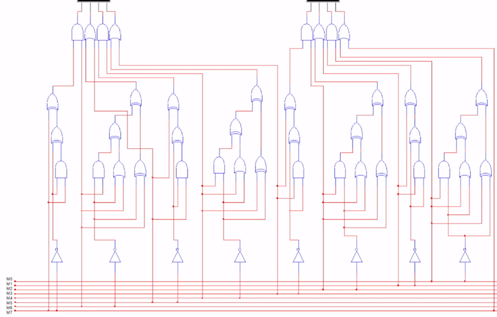
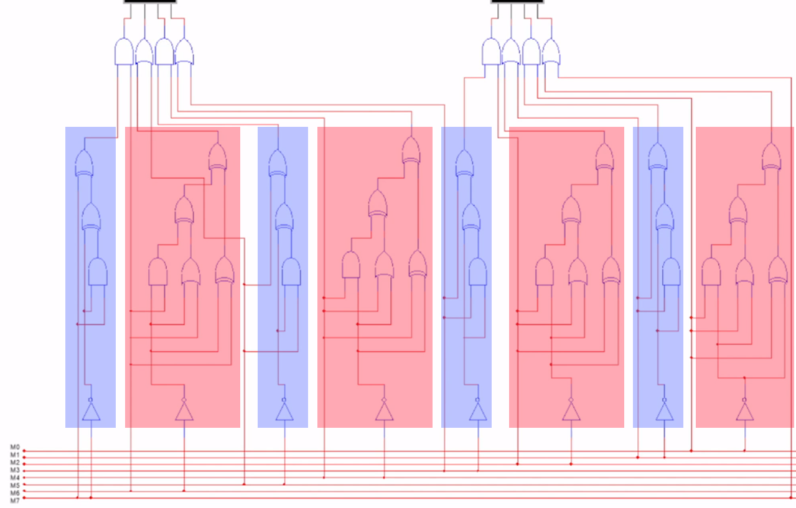
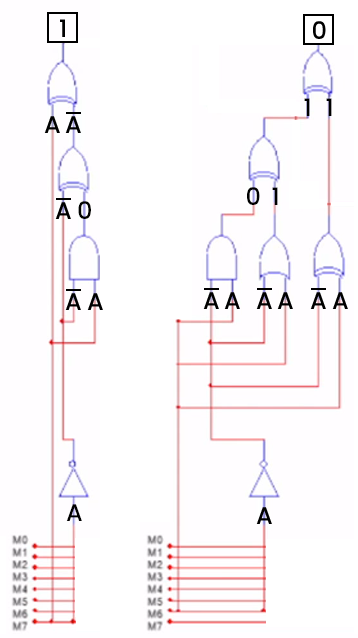
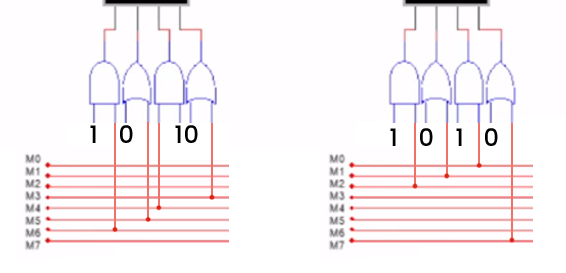
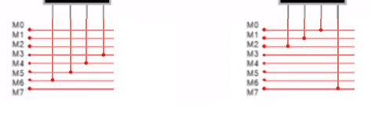


# Write-Up
> **title:** Hardware to hell
>
> **category:** Hardware
>
> **difficulty:** Moyen
>
> **point:** 50
>
> **author:** Maestran
>
> **description:**
>
> Votre ami Brian s'est amusé avec des portes logiques et a décidé de vous proposer un petit défi ! Un générateur de lettre en ASCII émet le flag sur un bus 8 bit ! À vous de retrouver le mot initial écrit !

## Ouverture de la vidéo

Si l'on ouvre le fichier **mp4**, on y découvre un schéma de portes logiques. Comment récupérer le flag ? On nous dit que **le flag est écrit octet par octet**, et chacun passe par le fameux circuit, puis on affiche le résultat **sous forme hexadécimal**.

Première chose, récupérer l'hexadécimal, on voit que les mises à jour d'affichage ont lieu toutes les 3.5 secondes, on regarde donc à tous ces intervalles et l'on récupère :
```
86b2849cf6624edabe60dcbee8d066be9062ced0ee68f2bee8debed066d898fa
```

## Etudier les portes logiques

Regardons maintenant le schéma :



On peut repérer une chose directement : **deux groupes se répètent**, les voici :



Les groupe prennent toujours un même bit 2 fois en input, on va donc pouvoir essayer de simplifier le schéma pour deviner ce que ces groupes ressortent en fonction de leurs entrées :



- **Les groupes bleus** ressortent systématiquement **`1`**
- **Les groupes rouges** ressortent systématiquement **`0`**

**En remplaçant les groupes par leur valeur** de retour (*qui est fixe*), peut donc réduire le schéma à ceci :



**Appliquons maintenant les dernières portes** pour encore réduire le circuit :



On découvre alors que le circuit ne fait qu'une **rotation à gauche** sur chacun des octets.


## Algorithme python

Pour retrouver les octets initiaux, on fait un petit script avec une simple **rotation à droite** sur tous les octets :

```python
# Hexadécimal récupéré
cipher = "86b2849cf6624edabe60dcbee8d066be9062ced0ee68f2bee8debed066d898fa"

# Découpe en octet et transformation en binaire
bin_cipher = [bin(int(a[i:i+2], 16))[2:].zfill(8) for i in range(0, len(a), 2)]

# Rotation du binaire à droite, transformation en char, jointure de tous les char
print(''.join([chr(int(i[-1:]+i[:-1],2)) for i in bin_cipher]))
```

```
Output: CYBN{1'm_0n_th3_H1ghw4y_to_h3lL}
```

