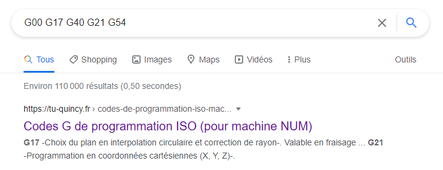


# Write-Up
> **title:** LightDec
>
> **category:** Hardware
>
> **difficulty:** Facile
>
> **point:** 25
>
> **author:** Langley
>
> **description:**
>
> Vous avez trouvé des données dans une carte SD du FabLab que personne n'arrive à interpréter. Arriverez-vous à les comprendre ?

## Prise d'empreintes

Si nous n'avons aucune idée de ce que ça peut être, on peut copier coller des parties sur google en espérant tomber sur des références. C'est le cas en cherchant **`G00 G17 G40 G21 G54`** (*ligne 4*) où l'on apprend que c'est du GCODE.

Le GCODE est un ensemble d'instruction permettant à une machine d'effectuer les bonnes actions, comme pour une imprimante 3D par exemple. On peut donc visualiser à l'avance les mouvements de la machine. En cherchant un visualiseur de GCODE, on tombe sur **[ncviewer](https://ncviewer.com)** (il en existe d'autres). On rentre alors le GCODE sur le site, on clique sur **PLOT** et :

On recentre un peu tout ça pour voir le flag au complet :

**Le flag : CYBN{l453r_3n6R4v3d_fL46}**
