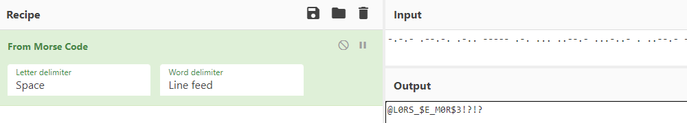


# Write-Up
> **title:** What a waterfall
>
> **category:** Hardware
>
> **difficulty:** Difficile
>
> **point:** 100
>
> **author:** Langley
>
> **description:**
>
> Nous avons capturé un signal sur la banquise. Ce signal est enregistré avec une fréquence d'échantillonnage de 48kHz 📻🧊
> > ⚠️ Le flag est a mettre au format CYBN{data}.
> > Si vous trouvez la chaine "toto123" alors le flag sera CYBN{TOTO123}

## Analyse du fichier

Il s'agit d'un fichier **.iq**, même si on se doute de ce que c'est avec la description du challenge, en cherchant sur google on découvre qu'il s'agit de fichiers utilisés pour la transmission **Radio**.

On va analyser le fichier avec **[URH](https://github.com/jopohl/urh)** (*Universal Radio Hacker*). Ouvrons simplement le fichier et analysons le.

Si l'on change le **Signal View** en **Spectrogramme**, on découvre alors ce spectre :


## Décodage du morse

C'est clairement du morse que l'on voit sur le spectre, on a juste à le retranscrire :

```
-.-.- .--.-. .-.. ----- .-. ... ..--.- ...-..- . ..--.- -- ----- .-. ...-..- ...-- -.-.-- ..--.. -.-.-- ..--.. ...-.
```

On le passe dans **[CyberChef](https://gchq.github.io/CyberChef)** :



> A noter (*merci Alban pour le tips*) :
> 
> Le premier caractères : **`-.-.-`** signifie **début de message**
> 
> Le dernier caractères : **`...-.`** signifie **tout compris**
> 
> cf : [techno-science](https://www.techno-science.net/definition/3815.html)

**Le flag : CYBN{@L0RS_$E_M0R$3!?!?}**

