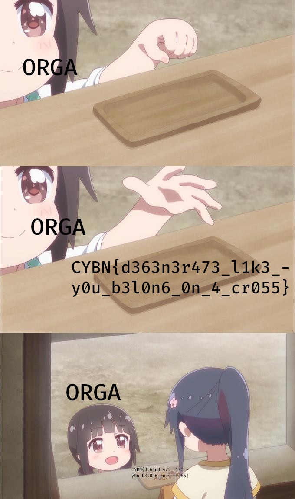

# Write-Up
> **title:** Fucking Degenerates
>
> **category:** Misc
>
> **difficulty:** Difficile
>
> **point:** 100
>
> **author:** m00nm00n
>
> **description:**
>
> 
>
> Le " - " présent dans le flag est à retirer pour valider.

## Etude du fichier

Si l'on recherche **`UwU esoteric language`** sur google, on tombe sur cette page **[EsoLangs](https://esolangs.org/wiki/UwU)**. Il s'agit d'une simple substitution de brainfuck.

Voici à quoi correspond les groupes en brainfuck :

| UwU Language | Brainfuck |
| --- | - |
| OwO | > |
| *w* | < |
| UwU | + |
| QwQ | - |
| @w@ | . |
| >w< | , |
| ~w~ | [ |
| -w- | ] |


## Transformation du texte et interprétation

Petit script pour automatiser la transformation du fichier en brainfuck puis interprétation de celui-ci (j'utilise la lib **[brainfuck-interpreter](https://pypi.org/project/brainfuck-interpreter/)**):

```python
import brainfuck

with open('./Degeneracy.txt') as f:
    data = f.read()

replace_by = {
    'OwO': '>',
    '*w*': '<',
    'UwU': '+',
    'QwQ': '-',
    '@w@': '.',
    '>w<': ',',
    '~w~': '[',
    '-w-': ']',
}

for key in replace_by:
    data = data.replace(key, replace_by[key])
data = brainfuck.evaluate(data)
print(data)
```

```
Output: ~w~ ~w~ ~w~ ~w~ ~w~ ~w~ ~w~ ~w~ ~w~ ~w~ @w@ -w- ~w~ -w- ~w~ ~w~ ~w~ -w- ~w~ ~w~ ~w~ ~w~ ~w~ ~w~ ~w~ -w- ~w~ ~w~ ~w~ ~w~ ~w~ ~w~ ~w~ ~w~ ~w~ ~w~ OwO OwO OwO OwO *w* UwU -w- -w- -w- ~w~ ~w~ ~w~ ~w~ ~w~ ~w~ ~w~ ~w~ ~w~ >w< -w- ~w~ ~w~ ~w~ ~w~ ~w~ ~w~ ~w~ ~w~ ~w~ ~w~ ~w~ ~w~ ~w~ ~w~ ~w~ ~w~ ~w~ ~w~ ~w~ >w< OwO >w< OwO ~w~ ~w~ >w< -w- >w< -w- >w< OwO >w< OwO >w< -w- >w< -w- >w< OwO >w< OwO >w< -w- >w< -w- >w< OwO >w< OwO >w< -w- >w< -w- >w< OwO >w< OwO >w< -w- >w< -w- >w< OwO >w< OwO >w< -w- >w< -w- >w< OwO >w< OwO >w< -w- >w< -w- >w< OwO >w< OwO >w< -w- >w< -w- >w< OwO >w< OwO >w< -w- >w< -w- >w< OwO >w< OwO >w< -w- *w* *w* *w* *w* *w* *w* *w* *w* *w* *w* *w* *w* *w* *w* *w* >w< -w- >w< OwO >w< OwO >w< -w- *w* *w* >w< -w- >w< OwO *w* *w* >w< OwO >w< -w- ~w~ ~w~ ~w~ ~w~ ~w~ ~w~ ~w~ ~w~ ~w~ ~w~ ~w~ ~w~ ~w~ ~w~ ~w~ ~w~ ~w~ ~w~ ~w~ >w< -w- >w< OwO >w< OwO >w< -w- *w* *w* *w* *w* *w* *w* *w* *w* *w* *w* *w* *w* *w* *w* *w* *w* *w* >w< -w- >w< OwO *w* *w* >w< OwO >w< -w- ~w~ ~w~ ~w~ ~w~ ~w~ ~w~ ~w~ ~w~ ~w~ ~w~ ~w~ ~w~ ~w~ ~w~ ~w~ ~w~ ~w~ ~w~ ~w~ >w< -w- >w< OwO >w< OwO >w< -w- >w< -w- >w< OwO >w< OwO >w< -w- >w< -w- >w< OwO >w< OwO >w< -w- *w* *w* *w* *w* *w* *w* *w* *w* *w* *w* *w* *w* *w* *w* *w* *w* *w* >w< -w- >w< OwO *w* *w* >w< OwO >w< -w- ~w~ ~w~ ~w~ ~w~ ~w~ ~w~ ~w~ ~w~ ~w~ ~w~ ~w~ ~w~ ~w~ ~w~ ~w~ ~w~ ~w~ ~w~ ~w~ >w< -w- >w< OwO >w< OwO >w< -w- >w< -w- >w< OwO >w< OwO >w< -w- >w< -w- >w< OwO >w< OwO >w< -w- >w< -w- >w< OwO >w< OwO >w< -w- >w< -w- >w< OwO >w< OwO >w< -w- >w< -w- >w< OwO >w< OwO >w< -w- >w< -w- >w< OwO >w< OwO >w< -w- *w* *w* *w* *w* *w* *w* *w* *w* *w* *w* *w* *w* *w* *w* *w* *w* *w* >w< -w- >w< OwO *w* *w* >w< OwO >w< -w- ~w~ ~w~ ~w~ ~w~ ~w~ ~w~ ~w~ ~w~ ~w~ ~w~ ~w~ ~w~ ~w~ ~w~ ~w~ ~w~ ~w~ ~w~ ~w~ >w< -w- >w< OwO >w< OwO >w< -w- >w< -w- >w< OwO >w< OwO >w< -w- >w< -w- >w< OwO >w< OwO >w< -w- >w< -w- >w< OwO >w< OwO >w< -w- >w< -w- >w< OwO >w< OwO >w< -w- >w< -w- >w< OwO >w< OwO >w< -w- >w< -w- >w< OwO >w< OwO >w< -w- >w< -w- >w< OwO >w< OwO >w< -w- >w< -w- >w< OwO >w< OwO >w< -w- >w< -w- >w< OwO >w< OwO >w< -w- ~w~ ~w~ >w< -w- >w< OwO >w< OwO >w< -w- >w< -w- >w< OwO >w< OwO >w< -w- >w< -w- >w< OwO >w< OwO >w< -w- >w< -w- >w< OwO >w< OwO >w< ~w~ ~w~ ~w~ ~w~ ~w~ ~w~ ~w~ ~w~ ~w~ ~w~ ~w~ ~w~ ~w~ >w< -w- -w- >w< OwO OwO >w< *w* *w* *w* *w* *w* *w* *w* *w* *w* *w* *w* *w* *w* >w< ~w~ ~w~ ~w~ ~w~ ~w~ ~w~ ~w~ ~w~ ~w~ ~w~ >w< -w- -w- >w< OwO OwO >w< *w* *w* *w* *w* *w* *w* *w* *w* *w* *w* >w< -w- *w* *w* *w* *w* *w* *w* *w* *w* *w* *w* *w* *w* *w* *w* *w* *w* *w* *w* *w* >w< -w- >w< OwO *w* *w* >w< OwO >w< -w- ~w~ ~w~ >w< -w- >w< OwO *w* *w* >w< OwO >w< -w- ~w~ ~w~ >w< -w- >w< OwO *w* *w* >w< OwO >w< -w- ~w~ ~w~ >w< -w- >w< OwO *w* *w* >w< OwO >w< ~w~ ~w~ ~w~ ~w~ ~w~ ~w~ ~w~ ~w~ ~w~ ~w~ ~w~ ~w~ ~w~ >w< -w- -w- >w< OwO OwO >w< *w* *w* *w* *w* *w* *w* *w* *w* *w* *w* *w* *w* *w* >w< ~w~ ~w~ ~w~ ~w~ ~w~ ~w~ ~w~ ~w~ ~w~ ~w~ ~w~ ~w~ ~w~ >w< -w- -w- >w< OwO OwO >w< *w* *w* *w* *w* *w* *w* *w* *w* *w* *w* *w* *w* *w* >w< -w- -w- ~w~ ~w~ ~w~ ~w~ ~w~ ~w~ ~w~ >w< *w* *w* *w* *w* *w* *w* *w* >w< ~w~ ~w~ ~w~ ~w~ ~w~ ~w~ ~w~ >w< OwO OwO >w< -w- ~w~ ~w~ ~w~ ~w~ ~w~ ~w~ ~w~ ~w~ ~w~ ~w~ ~w~ ~w~ ~w~ ~w~ ~w~ ~w~ ~w~ ~w~ ~w~ >w< -w- *w* *w* *w* *w* *w* *w* *w* >w< OwO >w< OwO >w< -w- >w< -w- >w< OwO >w< OwO >w< -w- >w< -w- >w< OwO >w< OwO >w< -w- >w< -w- >w< OwO >w< OwO >w< -w- >w< -w- >w< OwO >w< OwO >w< -w- >w< -w- >w< OwO >w< OwO >w< -w- >w< -w- >w< OwO >w< OwO >w< -w- -w- ~w~ ~w~ ~w~ ~w~ ~w~ ~w~ ~w~ >w< *w* *w* *w* *w* *w* *w* *w* >w< ~w~ ~w~ ~w~ ~w~ ~w~ ~w~ ~w~ >w< OwO OwO >w< -w- >w< -w- *w* *w* *w* *w* *w* *w* *w* >w< OwO >w< OwO >w< -w- >w< -w- >w< OwO >w< OwO >w< -w- >w< -w- >w< OwO >w< OwO >w< -w- >w< -w- >w< OwO >w< OwO >w< -w- >w< -w- >w< OwO >w< OwO >w< -w- >w< -w- >w< OwO >w< OwO >w< -w- >w< -w- >w< OwO >w< OwO >w< -w- >w< -w- >w< OwO >w< OwO >w< -w- >w< -w- >w< OwO >w< OwO >w< -w- >w< -w- >w< OwO >w< OwO >w< -w- >w< -w- >w< OwO >w< OwO >w< -w- -w- ~w~ ~w~ ~w~ ~w~ ~w~ ~w~ ~w~ >w< *w* *w* *w* *w* *w* *w* *w* >w< ~w~ ~w~ ~w~ ~w~ ~w~ ~w~ ~w~ >w< OwO OwO >w< -w- ~w~ ~w~ >w< -w- *w* *w* *w* *w* *w* *w* *w* >w< OwO >w< OwO >w< -w- >w< -w- >w< OwO >w< OwO >w< -w- *w* *w* >w< -w- >w< OwO >w< OwO >w< -w- >w< -w- >w< OwO >w< OwO >w< -w- >w< -w- >w< OwO >w< OwO >w< -w- >w< -w- >w< OwO >w< OwO >w< -w- >w< -w- >w< OwO >w< OwO >w< -w- >w< -w- >w< OwO >w< OwO >w< -w- >w< -w- >w< OwO >w< OwO >w< -w- >w< -w- >w< OwO >w< OwO >w< -w- >w< -w- >w< OwO >w< OwO >w< -w- >w< -w- >w< OwO >w< OwO >w< -w- >w< -w- >w< OwO >w< OwO >w< -w- >w< -w- >w< OwO >w< OwO >w< -w- >w< -w- >w< OwO >w< OwO >w< -w- >w< -w- >w< OwO >w< OwO >w< -w- >w< -w- >w< OwO >w< OwO >w< -w- >w< -w- >w< OwO >w< OwO >w< -w- -w- ~w~ ~w~ ~w~ ~w~ ~w~ ~w~ ~w~ >w< *w* *w* *w* *w* *w* *w* *w* >w< ~w~ ~w~ ~w~ ~w~ ~w~ ~w~ ~w~ >w< OwO OwO >w< -w- *w* *w* *w* *w* *w* *w* *w* *w* *w* *w* *w* *w* *w* *w* *w* *w* *w* >w< -w- *w* *w* *w* *w* *w* *w* *w* >w< OwO *w* *w* >w< OwO >w< -w- ~w~ ~w~ >w< -w- >w< OwO *w* *w* >w< OwO >w< ~w~ ~w~ ~w~ ~w~ ~w~ ~w~ ~w~ ~w~ ~w~ ~w~ ~w~ ~w~ ~w~ >w< -w- -w- >w< OwO OwO >w< *w* *w* *w* *w* *w* *w* *w* *w* *w* *w* *w* *w* *w* >w< ~w~ ~w~ ~w~ ~w~ ~w~ ~w~ ~w~ ~w~ ~w~ ~w~ ~w~ ~w~ ~w~ >w< -w- -w- >w< OwO OwO >w< *w* *w* *w* *w* *w* *w* *w* *w* *w* *w* *w* *w* *w* >w< ~w~ ~w~ ~w~ ~w~ ~w~ ~w~ ~w~ ~w~ ~w~ ~w~ ~w~ ~w~ ~w~ >w< -w- -w- >w< OwO OwO >w< *w* *w* *w* *w* *w* *w* *w* *w* *w* *w* *w* *w* *w* >w< ~w~ ~w~ ~w~ ~w~ ~w~ ~w~ ~w~ ~w~ ~w~ ~w~ ~w~ ~w~ ~w~ >w< -w- -w- >w< OwO OwO >w< *w* *w* *w* *w* *w* *w* *w* *w* *w* *w* *w* *w* *w* >w< ~w~ ~w~ ~w~ ~w~ ~w~ ~w~ ~w~ ~w~ ~w~ ~w~ ~w~ ~w~ ~w~ >w< -w- -w- >w< OwO OwO >w< *w* *w* *w* *w* *w* *w* *w* *w* *w* *w* *w* *w* *w* >w< ~w~ ~w~ ~w~ ~w~ ~w~ ~w~ ~w~ ~w~ ~w~ ~w~ ~w~ ~w~ ~w~ >w< -w- -w- >w< OwO OwO >w< *w* *w* *w* *w* *w* *w* *w* *w* *w* *w* *w* *w* *w* >w< ~w~ ~w~ ~w~ ~w~ ~w~ ~w~ ~w~ ~w~ ~w~ ~w~ ~w~ ~w~ ~w~ >w< -w- -w- >w< OwO OwO >w< *w* *w* *w* *w* *w* *w* *w* *w* *w* *w* *w* *w* *w* >w< ~w~ ~w~ ~w~ ~w~ ~w~ ~w~ ~w~ ~w~ ~w~ ~w~ ~w~ ~w~ ~w~ >w< -w- -w- >w< OwO OwO >w< *w* *w* *w* *w* *w* *w* *w* *w* *w* *w* *w* *w* *w* >w< -w- -w- ~w~ ~w~ ~w~ ~w~ ~w~ ~w~ ~w~ >w< *w* *w* *w* *w* *w* *w* *w* >w< ~w~ ~w~ ~w~ ~w~ ~w~ ~w~ ~w~ >w< OwO OwO >w< -w- ~w~ ~w~ ~w~ ~w~ ~w~ ~w~ ~w~ ~w~ ~w~ ~w~ ~w~ ~w~ ~w~ ~w~ ~w~ ~w~ ~w~ ~w~ ~w~ >w< -w- *w* *w* *w* *w* *w* *w* *w* >w< OwO >w< OwO >w< -w- >w< -w- >w< OwO >w< OwO >w< -w- >w< -w- >w< OwO >w< OwO >w< -w- >w< -w- >w< OwO >w< OwO >w< -w- >w< -w- >w< OwO >w< OwO >w< -w- >w< -w- >w< OwO >w< OwO >w< -w- >w< -w- >w< OwO >w< OwO >w< -w- >w< -w- >w< OwO >w< OwO >w< -w- >w< -w- >w< OwO >w< OwO >w< -w- >w< -w- >w< OwO >w< OwO >w< -w- >w< -w- >w< OwO >w< OwO >w< -w- >w< -w- >w< OwO >w< OwO >w< -w- >w< -w- >w< OwO >w< OwO >w< -w- -w- ~w~ ~w~ ~w~ ~w~ ~w~ ~w~ ~w~ >w< *w* *w* *w* *w* *w* *w* *w* >w< ~w~ ~w~ ~w~ ~w~ ~w~ ~w~ ~w~ >w< OwO OwO >w< -w- ~w~ ~w~ >w< -w- *w* *w* *w* *w* *w* *w* *w* >w< OwO >w< OwO >w< -w- >w< -w- >w< OwO >w< OwO >w< -w- *w* *w* >w< -w- >w< OwO >w< OwO >w< -w- -w- ~w~ ~w~ ~w~ ~w~ ~w~ ~w~ ~w~ >w< *w* *w* *w* *w* *w* *w* *w* >w< ~w~ ~w~ ~w~ ~w~ ~w~ ~w~ ~w~ >w< OwO OwO >w< -w- >w< -w- *w* *w* *w* *w* *w* *w* *w* >w< OwO >w< OwO >w< -w- >w< -w- >w< OwO >w< OwO >w< -w- >w< -w- >w< OwO >w< OwO >w< -w- >w< -w- >w< OwO >w< OwO >w< -w- -w- ~w~ ~w~ ~w~ ~w~ ~w~ ~w~ ~w~ >w< *w* *w* *w* *w* *w* *w* *w* >w< ~w~ ~w~ ~w~ ~w~ ~w~ ~w~ ~w~ >w< OwO OwO >w< -w- *w* *w* *w* *w* *w* *w* *w* *w* *w* *w* *w* *w* *w* *w* *w* *w* *w* >w< -w- *w* *w* *w* *w* *w* *w* *w* >w< OwO *w* *w* >w< OwO >w< ~w~ ~w~ ~w~ ~w~ ~w~ ~w~ ~w~ ~w~ ~w~ ~w~ ~w~ ~w~ ~w~ >w< -w- -w- >w< OwO OwO >w< *w* *w* *w* *w* *w* *w* *w* *w* *w* *w* *w* *w* *w* >w< ~w~ ~w~ ~w~ ~w~ ~w~ ~w~ ~w~ ~w~ ~w~ ~w~ ~w~ ~w~ ~w~ >w< -w- -w- >w< OwO OwO >w< *w* *w* *w* *w* *w* *w* *w* *w* *w* *w* *w* *w* *w* >w< -w- -w- ~w~ ~w~ ~w~ ~w~ ~w~ ~w~ ~w~ >w< *w* *w* *w* *w* *w* *w* *w* >w< ~w~ ~w~ ~w~ ~w~ ~w~ ~w~ ~w~ >w< OwO OwO >w< -w- ~w~ ~w~ >w< -w- *w* *w* *w* *w* *w* *w* *w* >w< OwO *w* *w* >w< OwO >w< -w- -w- ~w~ ~w~ ~w~ ~w~ ~w~ ~w~ ~w~ >w< *w* *w* *w* *w* *w* *w* *w* >w< ~w~ ~w~ ~w~ ~w~ ~w~ ~w~ ~w~ >w< OwO OwO >w< ~w~ ~w~ ~w~ ~w~ ~w~ ~w~ ~w~ ~w~ ~w~ ~w~ ~w~ ~w~ ~w~ >w< -w- -w- *w* *w* *w* *w* *w* *w* *w* >w< OwO OwO >w< *w* *w* *w* *w* *w* *w* *w* *w* *w* *w* *w* *w* *w* >w< ~w~ ~w~ ~w~ ~w~ ~w~ ~w~ ~w~ ~w~ ~w~ ~w~ ~w~ ~w~ ~w~ >w< -w- -w- >w< OwO OwO >w< *w* *w* *w* *w* *w* *w* *w* *w* *w* *w* *w* *w* *w* >w< ~w~ ~w~ ~w~ ~w~ ~w~ ~w~ ~w~ ~w~ ~w~ ~w~ ~w~ ~w~ ~w~ >w< -w- -w- >w< OwO OwO >w< *w* *w* *w* *w* *w* *w* *w* *w* *w* *w* *w* *w* *w* >w< ~w~ ~w~ ~w~ ~w~ ~w~ ~w~ ~w~ ~w~ ~w~ ~w~ ~w~ ~w~ ~w~ >w< -w- -w- >w< OwO OwO >w< *w* *w* *w* *w* *w* *w* *w* *w* *w* *w* *w* *w* *w* >w< ~w~ ~w~ ~w~ ~w~ ~w~ ~w~ ~w~ ~w~ ~w~ ~w~ ~w~ ~w~ ~w~ >w< -w- -w- >w< OwO OwO >w< *w* *w* *w* *w* *w* *w* *w* *w* *w* *w* *w* *w* *w* >w< ~w~ ~w~ ~w~ ~w~ ~w~ ~w~ ~w~ ~w~ ~w~ ~w~ ~w~ ~w~ ~w~ >w< -w- -w- >w< OwO OwO >w< *w* *w* *w* *w* *w* *w* *w* *w* *w* *w* *w* *w* *w* >w< ~w~ ~w~ ~w~ ~w~ ~w~ ~w~ ~w~ ~w~ ~w~ ~w~ ~w~ ~w~ ~w~ >w< -w- -w- >w< OwO OwO >w< *w* *w* *w* *w* *w* *w* *w* *w* *w* *w* *w* *w* *w* >w< ~w~ ~w~ ~w~ ~w~ ~w~ ~w~ ~w~ ~w~ ~w~ ~w~ ~w~ ~w~ ~w~ >w< -w- -w- >w< OwO OwO >w< *w* *w* *w* *w* *w* *w* *w* *w* *w* *w* *w* *w* *w* >w< ~w~ ~w~ ~w~ ~w~ ~w~ ~w~ ~w~ ~w~ ~w~ ~w~ ~w~ ~w~ ~w~ >w< -w- -w- >w< OwO OwO >w< *w* *w* *w* *w* *w* *w* *w* *w* *w* *w* *w* *w* *w* >w< ~w~ ~w~ ~w~ ~w~ ~w~ ~w~ ~w~ ~w~ ~w~ ~w~ ~w~ ~w~ ~w~ >w< -w- -w- >w< OwO OwO >w< *w* *w* *w* *w* *w* *w* *w* *w* *w* *w* *w* *w* *w* >w< ~w~ ~w~ ~w~ ~w~ ~w~ ~w~ ~w~ ~w~ ~w~ ~w~ ~w~ ~w~ ~w~ >w< -w- -w- >w< OwO OwO >w< *w* *w* *w* *w* *w* *w* *w* *w* *w* *w* *w* *w* *w* >w< ~w~ ~w~ ~w~ ~w~ ~w~ ~w~ ~w~ ~w~ ~w~ ~w~ ~w~ ~w~ ~w~ >w< -w- -w- >w< OwO OwO >w< *w* *w* *w* *w* *w* *w* *w* *w* *w* *w* *w* *w* *w* >w< ~w~ ~w~ ~w~ ~w~ ~w~ ~w~ ~w~ ~w~ ~w~ ~w~ ~w~ ~w~ ~w~ >w< -w- -w- >w< OwO OwO >w< *w* *w* *w* *w* *w* *w* *w* *w* *w* *w* *w* *w* *w* >w< ~w~ ~w~ ~w~ ~w~ ~w~ ~w~ ~w~ ~w~ ~w~ ~w~ ~w~ ~w~ ~w~ >w< -w- -w- >w< OwO OwO >w< *w* *w* *w* *w* *w* *w* *w* *w* *w* *w* *w* *w* *w* >w< ~w~ ~w~ ~w~ ~w~ ~w~ ~w~ ~w~ ~w~ ~w~ ~w~ ~w~ ~w~ ~w~ >w< -w- -w- >w< OwO OwO >w< *w* *w* *w* *w* *w* *w* *w* *w* *w* *w* *w* *w* *w* >w< ~w~ ~w~ ~w~ ~w~ ~w~ ~w~ ~w~ ~w~ ~w~ ~w~ ~w~ ~w~ ~w~ >w< -w- -w- >w< OwO OwO >w< *w* *w* *w* *w* *w* *w* *w* *w* *w* *w* *w* *w* *w* >w< ~w~ ~w~ ~w~ ~w~ ~w~ ~w~ ~w~ ~w~ ~w~ ~w~ ~w~ ~w~ ~w~ >w< -w- -w- >w< OwO OwO >w< *w* *w* *w* *w* *w* *w* *w* *w* *w* *w* *w* *w* *w* >w< ~w~ ~w~ ~w~ ~w~ ~w~ ~w~ ~w~ ~w~ ~w~ ~w~ ~w~ ~w~ ~w~ >w< -w- -w- >w< OwO OwO >w< *w* *w* *w* *w* *w* *w* *w* *w* *w* *w* *w* *w* *w* >w< ~w~ ~w~ ~w~ ~w~ ~w~ ~w~ ~w~ ~w~ ~w~ ~w~ ~w~ ~w~ ~w~ >w< -w- -w- >w< OwO OwO >w< *w* *w* *w* *w* *w* *w* *w* *w* *w* *w* *w* *w* *w* >w< ~w~ ~w~ ~w~ ~w~ ~w~ ~w~ ~w~ ~w~ ~w~ ~w~ ~w~ ~w~ ~w~ >w< -w- -w- >w< OwO OwO >w< *w* *w* *w* *w* *w* *w* *w* *w* *w* *w* *w* *w* *w* >w< ~w~ ~w~ ~w~ ~w~ ~w~ ~w~ ~w~ ~w~ ~w~ ~w~ ~w~ ~w~ ~w~ >w< -w- -w- >w< OwO OwO >w< *w* *w* *w* *w* *w* *w* *w* *w* *w* *w* *w* *w* *w* >w< ~w~ ~w~ ~w~ ~w~ ~w~ ~w~ ~w~ ~w~ ~w~ ~w~ ~w~ ~w~ ~w~ >w< -w- -w- >w< OwO OwO >w< *w* *w* *w* *w* *w* *w* *w* *w* *w* *w* *w* *w* *w* >w< ~w~ ~w~ ~w~ ~w~ ~w~ ~w~ ~w~ ~w~ ~w~ ~w~ ~w~ ~w~ ~w~ >w< -w- -w- >w< OwO OwO >w< *w* *w* *w* *w* *w* *w* *w* *w* *w* *w* *w* *w* *w* >w< ~w~ ~w~ ~w~ ~w~ ~w~ ~w~ ~w~ ~w~ ~w~ ~w~ ~w~ ~w~ ~w~ >w< -w- -w- >w< OwO OwO >w< *w* *w* *w* *w* *w* *w* *w* *w* *w* *w* *w* *w* *w* >w< -w- -w- ~w~ ~w~ ~w~ ~w~ ~w~ ~w~ ~w~ >w< *w* *w* *w* *w* *w* *w* *w* >w< ~w~ ~w~ ~w~ ~w~ ~w~ ~w~ ~w~ >w< OwO OwO >w< ~w~ ~w~ ~w~ ~w~ ~w~ ~w~ ~w~ ~w~ ~w~ ~w~ ~w~ ~w~ ~w~ >w< -w- -w- *w* *w* *w* *w* *w* *w* *w* >w< OwO OwO >w< *w* *w* *w* *w* *w* *w* *w* *w* *w* *w* *w* *w* *w* >w< ~w~ ~w~ ~w~ ~w~ ~w~ ~w~ ~w~ ~w~ ~w~ ~w~ ~w~ ~w~ ~w~ >w< -w- -w- >w< OwO OwO >w< *w* *w* *w* *w* *w* *w* *w* *w* *w* *w* *w* *w* *w* >w< ~w~ ~w~ ~w~ ~w~ ~w~ ~w~ ~w~ ~w~ ~w~ ~w~ ~w~ ~w~ ~w~ >w< -w- -w- >w< OwO OwO >w< *w* *w* *w* *w* *w* *w* *w* *w* *w* *w* *w* *w* *w* >w< ~w~ ~w~ ~w~ ~w~ ~w~ ~w~ ~w~ ~w~ ~w~ ~w~ ~w~ ~w~ ~w~ >w< -w- -w- >w< OwO OwO >w< *w* *w* *w* *w* *w* *w* *w* *w* *w* *w* *w* *w* *w* >w< ~w~ ~w~ ~w~ ~w~ ~w~ ~w~ ~w~ ~w~ ~w~ ~w~ ~w~ ~w~ ~w~ >w< -w- -w- >w< OwO OwO >w< *w* *w* *w* *w* *w* *w* *w* *w* *w* *w* *w* *w* *w* >w< ~w~ ~w~ ~w~ ~w~ ~w~ ~w~ ~w~ ~w~ ~w~ ~w~ ~w~ ~w~ ~w~ >w< -w- -w- >w< OwO OwO >w< *w* *w* *w* *w* *w* *w* *w* *w* *w* *w* *w* *w* *w* >w< ~w~ ~w~ ~w~ ~w~ ~w~ ~w~ ~w~ ~w~ ~w~ ~w~ ~w~ ~w~ ~w~ >w< -w- -w- >w< OwO OwO >w< *w* *w* *w* *w* *w* *w* *w* *w* *w* *w* *w* *w* *w* >w< -w- -w- ~w~ ~w~ ~w~ ~w~ ~w~ ~w~ ~w~ >w< *w* *w* *w* *w* *w* *w* *w* >w< ~w~ ~w~ ~w~ ~w~ ~w~ ~w~ ~w~ >w< OwO OwO >w< -w- ~w~ ~w~ ~w~ ~w~ ~w~ ~w~ ~w~ ~w~ ~w~ ~w~ ~w~ ~w~ ~w~ ~w~ ~w~ ~w~ ~w~ ~w~ ~w~ >w< -w- *w* *w* *w* *w* *w* *w* *w* >w< OwO >w< OwO >w< -w- >w< -w- >w< OwO >w< OwO >w< -w- >w< -w- >w< OwO >w< OwO >w< -w- >w< -w- >w< OwO >w< OwO >w< -w- >w< -w- >w< OwO >w< OwO >w< -w- >w< -w- >w< OwO >w< OwO >w< -w- >w< -w- >w< OwO >w< OwO >w< -w- >w< -w- >w< OwO >w< OwO >w< -w- >w< -w- >w< OwO >w< OwO >w< -w- >w< -w- >w< OwO >w< OwO >w< -w- >w< -w- >w< OwO >w< OwO >w< -w- >w< -w- >w< OwO >w< OwO >w< -w- >w< -w- >w< OwO >w< OwO >w< -w- >w< -w- >w< OwO >w< OwO >w< -w- >w< -w- >w< OwO >w< OwO >w< -w- >w< -w- >w< OwO >w< OwO >w< -w- >w< -w- >w< OwO >w< OwO >w< -w- >w< -w- >w< OwO >w< OwO >w< -w- >w< -w- >w< OwO >w< OwO >w< -w- >w< -w- >w< OwO >w< OwO >w< -w- >w< -w- >w< OwO >w< OwO >w< -w- >w< -w- >w< OwO >w< OwO >w< -w- >w< -w- >w< OwO >w< OwO >w< -w- >w< -w- >w< OwO >w< OwO >w< -w- -w- ~w~ ~w~ ~w~ ~w~ ~w~ ~w~ ~w~ >w< *w* *w* *w* *w* *w* *w* *w* >w< ~w~ ~w~ ~w~ ~w~ ~w~ ~w~ ~w~ >w< OwO OwO >w< -w- ~w~ ~w~ >w< -w- *w* *w* *w* *w* *w* *w* *w* >w< OwO >w< OwO >w< -w- >w< -w- >w< OwO >w< OwO >w< -w- *w* *w* >w< -w- >w< OwO >w< OwO >w< -w- >w< -w- >w< OwO >w< OwO >w< -w- >w< -w- >w< OwO >w< OwO >w< -w- >w< -w- >w< OwO >w< OwO >w< -w- >w< -w- >w< OwO >w< OwO >w< -w- -w- ~w~ ~w~ ~w~ ~w~ ~w~ ~w~ ~w~ >w< *w* *w* *w* *w* *w* *w* *w* >w< ~w~ ~w~ ~w~ ~w~ ~w~ ~w~ ~w~ >w<
```

## Refaire la même chose

Comme nous obtenons encore un texte de type **UwU**, on est tenté de recommencer, seulement ça ne commence plus par la même chose, si on ressaie directement ça ne compile pas. **Il faut retrouver les correspondances** entre les UwU et les caractères du brainfuck.

Pour ça on va sur un site qui permet d'encoder en brainfuck et on encode une chaîne bidon pour voir un peu la structure attendue (j'utilise **[dcode](https://www.dcode.fr/langage-brainfuck)**).

Ainsi, ça : **`chaine_bidon`**

Devient : **`++++++++++[>+>+++>+++++++>++++++++++<<<<-]>>>>-.+++++.-------.++++++++.+++++.---------.------.+++.+++++++.-----.+++++++++++.-.`**

Ca commence par pas mal de **`+`**, vient un **`[`** suivis de **`>`**

Si l'on regarde notre texte :

```
~w~ ~w~ ~w~ ~w~ ~w~ ~w~ ~w~ ~w~ ~w~ ~w~ @w@ -w- ~w~ -w- ~w~
 +   +   +   +   +   +   +   +   +   +   [   >   +   >   +
```

**Ca correspond plutôt bien**. En continuant de la même façon, on peut ressortir le tableau suivant :

| UwU | Brainfuck |
| --- | - |
| OwO | < |
| *w* | - |
| UwU | ] |
| ~~QwQ~~ | , |
| @w@ | [ |
| >w< | . |
| ~w~ | + |
| -w- | > |

On voit que **`QwQ`** n'existe pas dans notre texte, il correspond à la virgule du brainfuck, si l'on se renseigne un peu, la virgule sert aux input, ce dont nous n'avons pas besoin ici et donc ça parait finalement logique qu'elle n'y soit pas.

On relance le script sur la sortie qu'on a eu avant avec ce nouveau tableau de correspondances :

```python
import brainfuck

data = "~w~ ~w~ ~w~ ~w~ ~w~ ~w~ ~w~ ~w~ ~w~ ~w~ @w@ -w- ~w~ -w- ~w~ ~w~ ~w~ -w- ~w~ ~w~ ~w~ ~w~ ~w~ ~w~ ~w~ -w- ~w~ ~w~ ~w~ ~w~ ~w~ ~w~ ~w~ ~w~ ~w~ ~w~ OwO OwO OwO OwO *w* UwU -w- -w- -w- ~w~ ~w~ ~w~ ~w~ ~w~ ~w~ ~w~ ~w~ ~w~ >w< -w- ~w~ ~w~ ~w~ ~w~ ~w~ ~w~ ~w~ ~w~ ~w~ ~w~ ~w~ ~w~ ~w~ ~w~ ~w~ ~w~ ~w~ ~w~ ~w~ >w< OwO >w< OwO ~w~ ~w~ >w< -w- >w< -w- >w< OwO >w< OwO >w< -w- >w< -w- >w< OwO >w< OwO >w< -w- >w< -w- >w< OwO >w< OwO >w< -w- >w< -w- >w< OwO >w< OwO >w< -w- >w< -w- >w< OwO >w< OwO >w< -w- >w< -w- >w< OwO >w< OwO >w< -w- >w< -w- >w< OwO >w< OwO >w< -w- >w< -w- >w< OwO >w< OwO >w< -w- >w< -w- >w< OwO >w< OwO >w< -w- *w* *w* *w* *w* *w* *w* *w* *w* *w* *w* *w* *w* *w* *w* *w* >w< -w- >w< OwO >w< OwO >w< -w- *w* *w* >w< -w- >w< OwO *w* *w* >w< OwO >w< -w- ~w~ ~w~ ~w~ ~w~ ~w~ ~w~ ~w~ ~w~ ~w~ ~w~ ~w~ ~w~ ~w~ ~w~ ~w~ ~w~ ~w~ ~w~ ~w~ >w< -w- >w< OwO >w< OwO >w< -w- *w* *w* *w* *w* *w* *w* *w* *w* *w* *w* *w* *w* *w* *w* *w* *w* *w* >w< -w- >w< OwO *w* *w* >w< OwO >w< -w- ~w~ ~w~ ~w~ ~w~ ~w~ ~w~ ~w~ ~w~ ~w~ ~w~ ~w~ ~w~ ~w~ ~w~ ~w~ ~w~ ~w~ ~w~ ~w~ >w< -w- >w< OwO >w< OwO >w< -w- >w< -w- >w< OwO >w< OwO >w< -w- >w< -w- >w< OwO >w< OwO >w< -w- *w* *w* *w* *w* *w* *w* *w* *w* *w* *w* *w* *w* *w* *w* *w* *w* *w* >w< -w- >w< OwO *w* *w* >w< OwO >w< -w- ~w~ ~w~ ~w~ ~w~ ~w~ ~w~ ~w~ ~w~ ~w~ ~w~ ~w~ ~w~ ~w~ ~w~ ~w~ ~w~ ~w~ ~w~ ~w~ >w< -w- >w< OwO >w< OwO >w< -w- >w< -w- >w< OwO >w< OwO >w< -w- >w< -w- >w< OwO >w< OwO >w< -w- >w< -w- >w< OwO >w< OwO >w< -w- >w< -w- >w< OwO >w< OwO >w< -w- >w< -w- >w< OwO >w< OwO >w< -w- >w< -w- >w< OwO >w< OwO >w< -w- *w* *w* *w* *w* *w* *w* *w* *w* *w* *w* *w* *w* *w* *w* *w* *w* *w* >w< -w- >w< OwO *w* *w* >w< OwO >w< -w- ~w~ ~w~ ~w~ ~w~ ~w~ ~w~ ~w~ ~w~ ~w~ ~w~ ~w~ ~w~ ~w~ ~w~ ~w~ ~w~ ~w~ ~w~ ~w~ >w< -w- >w< OwO >w< OwO >w< -w- >w< -w- >w< OwO >w< OwO >w< -w- >w< -w- >w< OwO >w< OwO >w< -w- >w< -w- >w< OwO >w< OwO >w< -w- >w< -w- >w< OwO >w< OwO >w< -w- >w< -w- >w< OwO >w< OwO >w< -w- >w< -w- >w< OwO >w< OwO >w< -w- >w< -w- >w< OwO >w< OwO >w< -w- >w< -w- >w< OwO >w< OwO >w< -w- >w< -w- >w< OwO >w< OwO >w< -w- ~w~ ~w~ >w< -w- >w< OwO >w< OwO >w< -w- >w< -w- >w< OwO >w< OwO >w< -w- >w< -w- >w< OwO >w< OwO >w< -w- >w< -w- >w< OwO >w< OwO >w< ~w~ ~w~ ~w~ ~w~ ~w~ ~w~ ~w~ ~w~ ~w~ ~w~ ~w~ ~w~ ~w~ >w< -w- -w- >w< OwO OwO >w< *w* *w* *w* *w* *w* *w* *w* *w* *w* *w* *w* *w* *w* >w< ~w~ ~w~ ~w~ ~w~ ~w~ ~w~ ~w~ ~w~ ~w~ ~w~ >w< -w- -w- >w< OwO OwO >w< *w* *w* *w* *w* *w* *w* *w* *w* *w* *w* >w< -w- *w* *w* *w* *w* *w* *w* *w* *w* *w* *w* *w* *w* *w* *w* *w* *w* *w* *w* *w* >w< -w- >w< OwO *w* *w* >w< OwO >w< -w- ~w~ ~w~ >w< -w- >w< OwO *w* *w* >w< OwO >w< -w- ~w~ ~w~ >w< -w- >w< OwO *w* *w* >w< OwO >w< -w- ~w~ ~w~ >w< -w- >w< OwO *w* *w* >w< OwO >w< ~w~ ~w~ ~w~ ~w~ ~w~ ~w~ ~w~ ~w~ ~w~ ~w~ ~w~ ~w~ ~w~ >w< -w- -w- >w< OwO OwO >w< *w* *w* *w* *w* *w* *w* *w* *w* *w* *w* *w* *w* *w* >w< ~w~ ~w~ ~w~ ~w~ ~w~ ~w~ ~w~ ~w~ ~w~ ~w~ ~w~ ~w~ ~w~ >w< -w- -w- >w< OwO OwO >w< *w* *w* *w* *w* *w* *w* *w* *w* *w* *w* *w* *w* *w* >w< -w- -w- ~w~ ~w~ ~w~ ~w~ ~w~ ~w~ ~w~ >w< *w* *w* *w* *w* *w* *w* *w* >w< ~w~ ~w~ ~w~ ~w~ ~w~ ~w~ ~w~ >w< OwO OwO >w< -w- ~w~ ~w~ ~w~ ~w~ ~w~ ~w~ ~w~ ~w~ ~w~ ~w~ ~w~ ~w~ ~w~ ~w~ ~w~ ~w~ ~w~ ~w~ ~w~ >w< -w- *w* *w* *w* *w* *w* *w* *w* >w< OwO >w< OwO >w< -w- >w< -w- >w< OwO >w< OwO >w< -w- >w< -w- >w< OwO >w< OwO >w< -w- >w< -w- >w< OwO >w< OwO >w< -w- >w< -w- >w< OwO >w< OwO >w< -w- >w< -w- >w< OwO >w< OwO >w< -w- >w< -w- >w< OwO >w< OwO >w< -w- -w- ~w~ ~w~ ~w~ ~w~ ~w~ ~w~ ~w~ >w< *w* *w* *w* *w* *w* *w* *w* >w< ~w~ ~w~ ~w~ ~w~ ~w~ ~w~ ~w~ >w< OwO OwO >w< -w- >w< -w- *w* *w* *w* *w* *w* *w* *w* >w< OwO >w< OwO >w< -w- >w< -w- >w< OwO >w< OwO >w< -w- >w< -w- >w< OwO >w< OwO >w< -w- >w< -w- >w< OwO >w< OwO >w< -w- >w< -w- >w< OwO >w< OwO >w< -w- >w< -w- >w< OwO >w< OwO >w< -w- >w< -w- >w< OwO >w< OwO >w< -w- >w< -w- >w< OwO >w< OwO >w< -w- >w< -w- >w< OwO >w< OwO >w< -w- >w< -w- >w< OwO >w< OwO >w< -w- >w< -w- >w< OwO >w< OwO >w< -w- -w- ~w~ ~w~ ~w~ ~w~ ~w~ ~w~ ~w~ >w< *w* *w* *w* *w* *w* *w* *w* >w< ~w~ ~w~ ~w~ ~w~ ~w~ ~w~ ~w~ >w< OwO OwO >w< -w- ~w~ ~w~ >w< -w- *w* *w* *w* *w* *w* *w* *w* >w< OwO >w< OwO >w< -w- >w< -w- >w< OwO >w< OwO >w< -w- *w* *w* >w< -w- >w< OwO >w< OwO >w< -w- >w< -w- >w< OwO >w< OwO >w< -w- >w< -w- >w< OwO >w< OwO >w< -w- >w< -w- >w< OwO >w< OwO >w< -w- >w< -w- >w< OwO >w< OwO >w< -w- >w< -w- >w< OwO >w< OwO >w< -w- >w< -w- >w< OwO >w< OwO >w< -w- >w< -w- >w< OwO >w< OwO >w< -w- >w< -w- >w< OwO >w< OwO >w< -w- >w< -w- >w< OwO >w< OwO >w< -w- >w< -w- >w< OwO >w< OwO >w< -w- >w< -w- >w< OwO >w< OwO >w< -w- >w< -w- >w< OwO >w< OwO >w< -w- >w< -w- >w< OwO >w< OwO >w< -w- >w< -w- >w< OwO >w< OwO >w< -w- >w< -w- >w< OwO >w< OwO >w< -w- -w- ~w~ ~w~ ~w~ ~w~ ~w~ ~w~ ~w~ >w< *w* *w* *w* *w* *w* *w* *w* >w< ~w~ ~w~ ~w~ ~w~ ~w~ ~w~ ~w~ >w< OwO OwO >w< -w- *w* *w* *w* *w* *w* *w* *w* *w* *w* *w* *w* *w* *w* *w* *w* *w* *w* >w< -w- *w* *w* *w* *w* *w* *w* *w* >w< OwO *w* *w* >w< OwO >w< -w- ~w~ ~w~ >w< -w- >w< OwO *w* *w* >w< OwO >w< ~w~ ~w~ ~w~ ~w~ ~w~ ~w~ ~w~ ~w~ ~w~ ~w~ ~w~ ~w~ ~w~ >w< -w- -w- >w< OwO OwO >w< *w* *w* *w* *w* *w* *w* *w* *w* *w* *w* *w* *w* *w* >w< ~w~ ~w~ ~w~ ~w~ ~w~ ~w~ ~w~ ~w~ ~w~ ~w~ ~w~ ~w~ ~w~ >w< -w- -w- >w< OwO OwO >w< *w* *w* *w* *w* *w* *w* *w* *w* *w* *w* *w* *w* *w* >w< ~w~ ~w~ ~w~ ~w~ ~w~ ~w~ ~w~ ~w~ ~w~ ~w~ ~w~ ~w~ ~w~ >w< -w- -w- >w< OwO OwO >w< *w* *w* *w* *w* *w* *w* *w* *w* *w* *w* *w* *w* *w* >w< ~w~ ~w~ ~w~ ~w~ ~w~ ~w~ ~w~ ~w~ ~w~ ~w~ ~w~ ~w~ ~w~ >w< -w- -w- >w< OwO OwO >w< *w* *w* *w* *w* *w* *w* *w* *w* *w* *w* *w* *w* *w* >w< ~w~ ~w~ ~w~ ~w~ ~w~ ~w~ ~w~ ~w~ ~w~ ~w~ ~w~ ~w~ ~w~ >w< -w- -w- >w< OwO OwO >w< *w* *w* *w* *w* *w* *w* *w* *w* *w* *w* *w* *w* *w* >w< ~w~ ~w~ ~w~ ~w~ ~w~ ~w~ ~w~ ~w~ ~w~ ~w~ ~w~ ~w~ ~w~ >w< -w- -w- >w< OwO OwO >w< *w* *w* *w* *w* *w* *w* *w* *w* *w* *w* *w* *w* *w* >w< ~w~ ~w~ ~w~ ~w~ ~w~ ~w~ ~w~ ~w~ ~w~ ~w~ ~w~ ~w~ ~w~ >w< -w- -w- >w< OwO OwO >w< *w* *w* *w* *w* *w* *w* *w* *w* *w* *w* *w* *w* *w* >w< ~w~ ~w~ ~w~ ~w~ ~w~ ~w~ ~w~ ~w~ ~w~ ~w~ ~w~ ~w~ ~w~ >w< -w- -w- >w< OwO OwO >w< *w* *w* *w* *w* *w* *w* *w* *w* *w* *w* *w* *w* *w* >w< -w- -w- ~w~ ~w~ ~w~ ~w~ ~w~ ~w~ ~w~ >w< *w* *w* *w* *w* *w* *w* *w* >w< ~w~ ~w~ ~w~ ~w~ ~w~ ~w~ ~w~ >w< OwO OwO >w< -w- ~w~ ~w~ ~w~ ~w~ ~w~ ~w~ ~w~ ~w~ ~w~ ~w~ ~w~ ~w~ ~w~ ~w~ ~w~ ~w~ ~w~ ~w~ ~w~ >w< -w- *w* *w* *w* *w* *w* *w* *w* >w< OwO >w< OwO >w< -w- >w< -w- >w< OwO >w< OwO >w< -w- >w< -w- >w< OwO >w< OwO >w< -w- >w< -w- >w< OwO >w< OwO >w< -w- >w< -w- >w< OwO >w< OwO >w< -w- >w< -w- >w< OwO >w< OwO >w< -w- >w< -w- >w< OwO >w< OwO >w< -w- >w< -w- >w< OwO >w< OwO >w< -w- >w< -w- >w< OwO >w< OwO >w< -w- >w< -w- >w< OwO >w< OwO >w< -w- >w< -w- >w< OwO >w< OwO >w< -w- >w< -w- >w< OwO >w< OwO >w< -w- >w< -w- >w< OwO >w< OwO >w< -w- -w- ~w~ ~w~ ~w~ ~w~ ~w~ ~w~ ~w~ >w< *w* *w* *w* *w* *w* *w* *w* >w< ~w~ ~w~ ~w~ ~w~ ~w~ ~w~ ~w~ >w< OwO OwO >w< -w- ~w~ ~w~ >w< -w- *w* *w* *w* *w* *w* *w* *w* >w< OwO >w< OwO >w< -w- >w< -w- >w< OwO >w< OwO >w< -w- *w* *w* >w< -w- >w< OwO >w< OwO >w< -w- -w- ~w~ ~w~ ~w~ ~w~ ~w~ ~w~ ~w~ >w< *w* *w* *w* *w* *w* *w* *w* >w< ~w~ ~w~ ~w~ ~w~ ~w~ ~w~ ~w~ >w< OwO OwO >w< -w- >w< -w- *w* *w* *w* *w* *w* *w* *w* >w< OwO >w< OwO >w< -w- >w< -w- >w< OwO >w< OwO >w< -w- >w< -w- >w< OwO >w< OwO >w< -w- >w< -w- >w< OwO >w< OwO >w< -w- -w- ~w~ ~w~ ~w~ ~w~ ~w~ ~w~ ~w~ >w< *w* *w* *w* *w* *w* *w* *w* >w< ~w~ ~w~ ~w~ ~w~ ~w~ ~w~ ~w~ >w< OwO OwO >w< -w- *w* *w* *w* *w* *w* *w* *w* *w* *w* *w* *w* *w* *w* *w* *w* *w* *w* >w< -w- *w* *w* *w* *w* *w* *w* *w* >w< OwO *w* *w* >w< OwO >w< ~w~ ~w~ ~w~ ~w~ ~w~ ~w~ ~w~ ~w~ ~w~ ~w~ ~w~ ~w~ ~w~ >w< -w- -w- >w< OwO OwO >w< *w* *w* *w* *w* *w* *w* *w* *w* *w* *w* *w* *w* *w* >w< ~w~ ~w~ ~w~ ~w~ ~w~ ~w~ ~w~ ~w~ ~w~ ~w~ ~w~ ~w~ ~w~ >w< -w- -w- >w< OwO OwO >w< *w* *w* *w* *w* *w* *w* *w* *w* *w* *w* *w* *w* *w* >w< -w- -w- ~w~ ~w~ ~w~ ~w~ ~w~ ~w~ ~w~ >w< *w* *w* *w* *w* *w* *w* *w* >w< ~w~ ~w~ ~w~ ~w~ ~w~ ~w~ ~w~ >w< OwO OwO >w< -w- ~w~ ~w~ >w< -w- *w* *w* *w* *w* *w* *w* *w* >w< OwO *w* *w* >w< OwO >w< -w- -w- ~w~ ~w~ ~w~ ~w~ ~w~ ~w~ ~w~ >w< *w* *w* *w* *w* *w* *w* *w* >w< ~w~ ~w~ ~w~ ~w~ ~w~ ~w~ ~w~ >w< OwO OwO >w< ~w~ ~w~ ~w~ ~w~ ~w~ ~w~ ~w~ ~w~ ~w~ ~w~ ~w~ ~w~ ~w~ >w< -w- -w- *w* *w* *w* *w* *w* *w* *w* >w< OwO OwO >w< *w* *w* *w* *w* *w* *w* *w* *w* *w* *w* *w* *w* *w* >w< ~w~ ~w~ ~w~ ~w~ ~w~ ~w~ ~w~ ~w~ ~w~ ~w~ ~w~ ~w~ ~w~ >w< -w- -w- >w< OwO OwO >w< *w* *w* *w* *w* *w* *w* *w* *w* *w* *w* *w* *w* *w* >w< ~w~ ~w~ ~w~ ~w~ ~w~ ~w~ ~w~ ~w~ ~w~ ~w~ ~w~ ~w~ ~w~ >w< -w- -w- >w< OwO OwO >w< *w* *w* *w* *w* *w* *w* *w* *w* *w* *w* *w* *w* *w* >w< ~w~ ~w~ ~w~ ~w~ ~w~ ~w~ ~w~ ~w~ ~w~ ~w~ ~w~ ~w~ ~w~ >w< -w- -w- >w< OwO OwO >w< *w* *w* *w* *w* *w* *w* *w* *w* *w* *w* *w* *w* *w* >w< ~w~ ~w~ ~w~ ~w~ ~w~ ~w~ ~w~ ~w~ ~w~ ~w~ ~w~ ~w~ ~w~ >w< -w- -w- >w< OwO OwO >w< *w* *w* *w* *w* *w* *w* *w* *w* *w* *w* *w* *w* *w* >w< ~w~ ~w~ ~w~ ~w~ ~w~ ~w~ ~w~ ~w~ ~w~ ~w~ ~w~ ~w~ ~w~ >w< -w- -w- >w< OwO OwO >w< *w* *w* *w* *w* *w* *w* *w* *w* *w* *w* *w* *w* *w* >w< ~w~ ~w~ ~w~ ~w~ ~w~ ~w~ ~w~ ~w~ ~w~ ~w~ ~w~ ~w~ ~w~ >w< -w- -w- >w< OwO OwO >w< *w* *w* *w* *w* *w* *w* *w* *w* *w* *w* *w* *w* *w* >w< ~w~ ~w~ ~w~ ~w~ ~w~ ~w~ ~w~ ~w~ ~w~ ~w~ ~w~ ~w~ ~w~ >w< -w- -w- >w< OwO OwO >w< *w* *w* *w* *w* *w* *w* *w* *w* *w* *w* *w* *w* *w* >w< ~w~ ~w~ ~w~ ~w~ ~w~ ~w~ ~w~ ~w~ ~w~ ~w~ ~w~ ~w~ ~w~ >w< -w- -w- >w< OwO OwO >w< *w* *w* *w* *w* *w* *w* *w* *w* *w* *w* *w* *w* *w* >w< ~w~ ~w~ ~w~ ~w~ ~w~ ~w~ ~w~ ~w~ ~w~ ~w~ ~w~ ~w~ ~w~ >w< -w- -w- >w< OwO OwO >w< *w* *w* *w* *w* *w* *w* *w* *w* *w* *w* *w* *w* *w* >w< ~w~ ~w~ ~w~ ~w~ ~w~ ~w~ ~w~ ~w~ ~w~ ~w~ ~w~ ~w~ ~w~ >w< -w- -w- >w< OwO OwO >w< *w* *w* *w* *w* *w* *w* *w* *w* *w* *w* *w* *w* *w* >w< ~w~ ~w~ ~w~ ~w~ ~w~ ~w~ ~w~ ~w~ ~w~ ~w~ ~w~ ~w~ ~w~ >w< -w- -w- >w< OwO OwO >w< *w* *w* *w* *w* *w* *w* *w* *w* *w* *w* *w* *w* *w* >w< ~w~ ~w~ ~w~ ~w~ ~w~ ~w~ ~w~ ~w~ ~w~ ~w~ ~w~ ~w~ ~w~ >w< -w- -w- >w< OwO OwO >w< *w* *w* *w* *w* *w* *w* *w* *w* *w* *w* *w* *w* *w* >w< ~w~ ~w~ ~w~ ~w~ ~w~ ~w~ ~w~ ~w~ ~w~ ~w~ ~w~ ~w~ ~w~ >w< -w- -w- >w< OwO OwO >w< *w* *w* *w* *w* *w* *w* *w* *w* *w* *w* *w* *w* *w* >w< ~w~ ~w~ ~w~ ~w~ ~w~ ~w~ ~w~ ~w~ ~w~ ~w~ ~w~ ~w~ ~w~ >w< -w- -w- >w< OwO OwO >w< *w* *w* *w* *w* *w* *w* *w* *w* *w* *w* *w* *w* *w* >w< ~w~ ~w~ ~w~ ~w~ ~w~ ~w~ ~w~ ~w~ ~w~ ~w~ ~w~ ~w~ ~w~ >w< -w- -w- >w< OwO OwO >w< *w* *w* *w* *w* *w* *w* *w* *w* *w* *w* *w* *w* *w* >w< ~w~ ~w~ ~w~ ~w~ ~w~ ~w~ ~w~ ~w~ ~w~ ~w~ ~w~ ~w~ ~w~ >w< -w- -w- >w< OwO OwO >w< *w* *w* *w* *w* *w* *w* *w* *w* *w* *w* *w* *w* *w* >w< ~w~ ~w~ ~w~ ~w~ ~w~ ~w~ ~w~ ~w~ ~w~ ~w~ ~w~ ~w~ ~w~ >w< -w- -w- >w< OwO OwO >w< *w* *w* *w* *w* *w* *w* *w* *w* *w* *w* *w* *w* *w* >w< ~w~ ~w~ ~w~ ~w~ ~w~ ~w~ ~w~ ~w~ ~w~ ~w~ ~w~ ~w~ ~w~ >w< -w- -w- >w< OwO OwO >w< *w* *w* *w* *w* *w* *w* *w* *w* *w* *w* *w* *w* *w* >w< ~w~ ~w~ ~w~ ~w~ ~w~ ~w~ ~w~ ~w~ ~w~ ~w~ ~w~ ~w~ ~w~ >w< -w- -w- >w< OwO OwO >w< *w* *w* *w* *w* *w* *w* *w* *w* *w* *w* *w* *w* *w* >w< ~w~ ~w~ ~w~ ~w~ ~w~ ~w~ ~w~ ~w~ ~w~ ~w~ ~w~ ~w~ ~w~ >w< -w- -w- >w< OwO OwO >w< *w* *w* *w* *w* *w* *w* *w* *w* *w* *w* *w* *w* *w* >w< ~w~ ~w~ ~w~ ~w~ ~w~ ~w~ ~w~ ~w~ ~w~ ~w~ ~w~ ~w~ ~w~ >w< -w- -w- >w< OwO OwO >w< *w* *w* *w* *w* *w* *w* *w* *w* *w* *w* *w* *w* *w* >w< ~w~ ~w~ ~w~ ~w~ ~w~ ~w~ ~w~ ~w~ ~w~ ~w~ ~w~ ~w~ ~w~ >w< -w- -w- >w< OwO OwO >w< *w* *w* *w* *w* *w* *w* *w* *w* *w* *w* *w* *w* *w* >w< ~w~ ~w~ ~w~ ~w~ ~w~ ~w~ ~w~ ~w~ ~w~ ~w~ ~w~ ~w~ ~w~ >w< -w- -w- >w< OwO OwO >w< *w* *w* *w* *w* *w* *w* *w* *w* *w* *w* *w* *w* *w* >w< -w- -w- ~w~ ~w~ ~w~ ~w~ ~w~ ~w~ ~w~ >w< *w* *w* *w* *w* *w* *w* *w* >w< ~w~ ~w~ ~w~ ~w~ ~w~ ~w~ ~w~ >w< OwO OwO >w< ~w~ ~w~ ~w~ ~w~ ~w~ ~w~ ~w~ ~w~ ~w~ ~w~ ~w~ ~w~ ~w~ >w< -w- -w- *w* *w* *w* *w* *w* *w* *w* >w< OwO OwO >w< *w* *w* *w* *w* *w* *w* *w* *w* *w* *w* *w* *w* *w* >w< ~w~ ~w~ ~w~ ~w~ ~w~ ~w~ ~w~ ~w~ ~w~ ~w~ ~w~ ~w~ ~w~ >w< -w- -w- >w< OwO OwO >w< *w* *w* *w* *w* *w* *w* *w* *w* *w* *w* *w* *w* *w* >w< ~w~ ~w~ ~w~ ~w~ ~w~ ~w~ ~w~ ~w~ ~w~ ~w~ ~w~ ~w~ ~w~ >w< -w- -w- >w< OwO OwO >w< *w* *w* *w* *w* *w* *w* *w* *w* *w* *w* *w* *w* *w* >w< ~w~ ~w~ ~w~ ~w~ ~w~ ~w~ ~w~ ~w~ ~w~ ~w~ ~w~ ~w~ ~w~ >w< -w- -w- >w< OwO OwO >w< *w* *w* *w* *w* *w* *w* *w* *w* *w* *w* *w* *w* *w* >w< ~w~ ~w~ ~w~ ~w~ ~w~ ~w~ ~w~ ~w~ ~w~ ~w~ ~w~ ~w~ ~w~ >w< -w- -w- >w< OwO OwO >w< *w* *w* *w* *w* *w* *w* *w* *w* *w* *w* *w* *w* *w* >w< ~w~ ~w~ ~w~ ~w~ ~w~ ~w~ ~w~ ~w~ ~w~ ~w~ ~w~ ~w~ ~w~ >w< -w- -w- >w< OwO OwO >w< *w* *w* *w* *w* *w* *w* *w* *w* *w* *w* *w* *w* *w* >w< ~w~ ~w~ ~w~ ~w~ ~w~ ~w~ ~w~ ~w~ ~w~ ~w~ ~w~ ~w~ ~w~ >w< -w- -w- >w< OwO OwO >w< *w* *w* *w* *w* *w* *w* *w* *w* *w* *w* *w* *w* *w* >w< -w- -w- ~w~ ~w~ ~w~ ~w~ ~w~ ~w~ ~w~ >w< *w* *w* *w* *w* *w* *w* *w* >w< ~w~ ~w~ ~w~ ~w~ ~w~ ~w~ ~w~ >w< OwO OwO >w< -w- ~w~ ~w~ ~w~ ~w~ ~w~ ~w~ ~w~ ~w~ ~w~ ~w~ ~w~ ~w~ ~w~ ~w~ ~w~ ~w~ ~w~ ~w~ ~w~ >w< -w- *w* *w* *w* *w* *w* *w* *w* >w< OwO >w< OwO >w< -w- >w< -w- >w< OwO >w< OwO >w< -w- >w< -w- >w< OwO >w< OwO >w< -w- >w< -w- >w< OwO >w< OwO >w< -w- >w< -w- >w< OwO >w< OwO >w< -w- >w< -w- >w< OwO >w< OwO >w< -w- >w< -w- >w< OwO >w< OwO >w< -w- >w< -w- >w< OwO >w< OwO >w< -w- >w< -w- >w< OwO >w< OwO >w< -w- >w< -w- >w< OwO >w< OwO >w< -w- >w< -w- >w< OwO >w< OwO >w< -w- >w< -w- >w< OwO >w< OwO >w< -w- >w< -w- >w< OwO >w< OwO >w< -w- >w< -w- >w< OwO >w< OwO >w< -w- >w< -w- >w< OwO >w< OwO >w< -w- >w< -w- >w< OwO >w< OwO >w< -w- >w< -w- >w< OwO >w< OwO >w< -w- >w< -w- >w< OwO >w< OwO >w< -w- >w< -w- >w< OwO >w< OwO >w< -w- >w< -w- >w< OwO >w< OwO >w< -w- >w< -w- >w< OwO >w< OwO >w< -w- >w< -w- >w< OwO >w< OwO >w< -w- >w< -w- >w< OwO >w< OwO >w< -w- >w< -w- >w< OwO >w< OwO >w< -w- -w- ~w~ ~w~ ~w~ ~w~ ~w~ ~w~ ~w~ >w< *w* *w* *w* *w* *w* *w* *w* >w< ~w~ ~w~ ~w~ ~w~ ~w~ ~w~ ~w~ >w< OwO OwO >w< -w- ~w~ ~w~ >w< -w- *w* *w* *w* *w* *w* *w* *w* >w< OwO >w< OwO >w< -w- >w< -w- >w< OwO >w< OwO >w< -w- *w* *w* >w< -w- >w< OwO >w< OwO >w< -w- >w< -w- >w< OwO >w< OwO >w< -w- >w< -w- >w< OwO >w< OwO >w< -w- >w< -w- >w< OwO >w< OwO >w< -w- >w< -w- >w< OwO >w< OwO >w< -w- -w- ~w~ ~w~ ~w~ ~w~ ~w~ ~w~ ~w~ >w< *w* *w* *w* *w* *w* *w* *w* >w< ~w~ ~w~ ~w~ ~w~ ~w~ ~w~ ~w~ >w<"

replace_by = {
    'OwO': '<',
    '*w*': '-',
    'UwU': ']',
    '@w@': '[',
    '>w<': '.',
    '~w~': '+',
    '-w-': '>',
}

for key in replace_by:
    data = data.replace(key, replace_by[key])
data = brainfuck.evaluate(data)
print(data)
```

```
Output: OwO OwO OwO OwO OwO OwO OwO OwO OwO OwO @w@ >w< OwO >w< OwO OwO OwO >w< OwO OwO OwO OwO OwO OwO OwO >w< OwO OwO OwO OwO OwO OwO OwO OwO OwO OwO QwQ QwQ QwQ QwQ -w- *w* >w< >w< >w< >w< -w- -w- ~w~ OwO OwO OwO OwO OwO OwO OwO ~w~ OwO OwO OwO OwO OwO OwO OwO OwO OwO OwO OwO ~w~ QwQ QwQ OwO OwO OwO OwO OwO OwO OwO OwO OwO OwO OwO OwO OwO OwO OwO OwO ~w~ >w< >w< -w- -w- -w- -w- -w- -w- -w- -w- ~w~ OwO OwO OwO OwO OwO OwO OwO OwO OwO OwO OwO OwO OwO ~w~ QwQ QwQ OwO ~w~ OwO OwO OwO OwO ~w~ >w< -w- -w- ~w~ >w< ~w~ -w- -w- -w- -w- -w- -w- -w- -w- -w- -w- -w- -w- -w- -w- -w- -w- -w- -w- -w- -w- -w- -w- -w- -w- ~w~ -w- -w- -w- -w- -w- -w- -w- ~w~ OwO OwO OwO OwO OwO OwO OwO OwO OwO OwO OwO OwO OwO OwO OwO OwO OwO OwO OwO OwO OwO OwO OwO OwO ~w~ QwQ QwQ OwO OwO OwO OwO OwO ~w~
```

## Ca fait beaucoup là

On recommence, même méthode pour déterminer les correspondances, on obtient ça :

| UwU | Brainfuck |
| --- | - |
| OwO | + |
| *w* | ] |
| ~~UwU~~ | , |
| QwQ | < |
| @w@ | [ |
| >w< | > |
| ~w~ | . |
| -w- | - |

Le script :

```python
import brainfuck

data = "OwO OwO OwO OwO OwO OwO OwO OwO OwO OwO @w@ >w< OwO >w< OwO OwO OwO >w< OwO OwO OwO OwO OwO OwO OwO >w< OwO OwO OwO OwO OwO OwO OwO OwO OwO OwO QwQ QwQ QwQ QwQ -w- *w* >w< >w< >w< >w< -w- -w- ~w~ OwO OwO OwO OwO OwO OwO OwO ~w~ OwO OwO OwO OwO OwO OwO OwO OwO OwO OwO OwO ~w~ QwQ QwQ OwO OwO OwO OwO OwO OwO OwO OwO OwO OwO OwO OwO OwO OwO OwO OwO ~w~ >w< >w< -w- -w- -w- -w- -w- -w- -w- -w- ~w~ OwO OwO OwO OwO OwO OwO OwO OwO OwO OwO OwO OwO OwO ~w~ QwQ QwQ OwO ~w~ OwO OwO OwO OwO ~w~ >w< -w- -w- ~w~ >w< ~w~ -w- -w- -w- -w- -w- -w- -w- -w- -w- -w- -w- -w- -w- -w- -w- -w- -w- -w- -w- -w- -w- -w- -w- -w- ~w~ -w- -w- -w- -w- -w- -w- -w- ~w~ OwO OwO OwO OwO OwO OwO OwO OwO OwO OwO OwO OwO OwO OwO OwO OwO OwO OwO OwO OwO OwO OwO OwO OwO ~w~ QwQ QwQ OwO OwO OwO OwO OwO ~w~"

replace_by = {
    'OwO': '+',
    '*w*': ']',
    'QwQ': '<',
    '@w@': '[',
    '>w<': '>',
    '~w~': '.',
    '-w-': '-',
}

for key in replace_by:
    data = data.replace(key, replace_by[key])
data = brainfuck.evaluate(data)
print(data)
```

```
Output: bit.ly/3DyaZr8
```

On a plus qu'à suivre le lien pour tomber sur cette image :



**Le flag : CYBN{d363n3r473_l1k3_y0u_b3l0n6_0n_4_cr055}**
