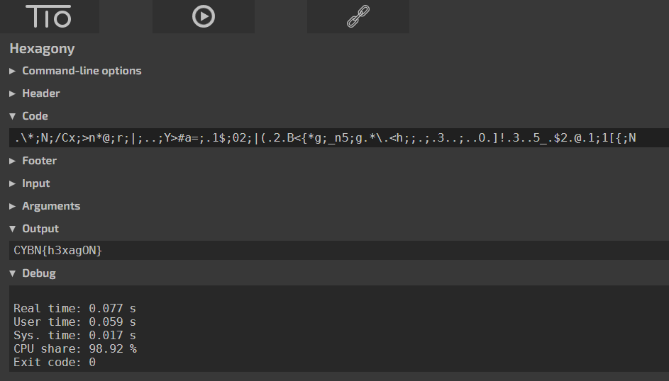


# Write-Up
> **title:** hexcompiler
>
> **category:** Misc
>
> **difficulty:** Facile
>
> **point:** 25
>
> **author:** MrSheepSheep
>
> **description:**
>
> > Étymologie : Du grec ancien ἕξ, hèx (« six »). hexa- \ɛɡ.za
> > Préfixe représentant le chiffre six. Synonymes : sexi- sexta- sexti-
>
> La chaîne suivante permet de générer le flag :
>
> `.\*;N;/Cx;>n*@;r;|;..;Y>#a=;.1$;02;|(.2.B<{*g;_n5;g.*\.<h;;.;.3..;..O.]!.3..5_.$2.@.1;1[{;N`

## Recherche sur internet

A l'aide de la description, on recherche **hex esoteric language**. Dès que quelque chose ne ressemble à rien, surtout dans la catégorie **Misc** ou **Stéganography**, il faut regarder du côté des langages ésotériques. On tombe alors sur cette page **[EsoLangs](https://esolangs.org/wiki/Hexagony)**.

En bas de la page on a un lien vers un interpréteur en ligne sur **[tio.run](https://tio.run/#hexagony)**.

**Le flag : CYBN{h3xagON}**

