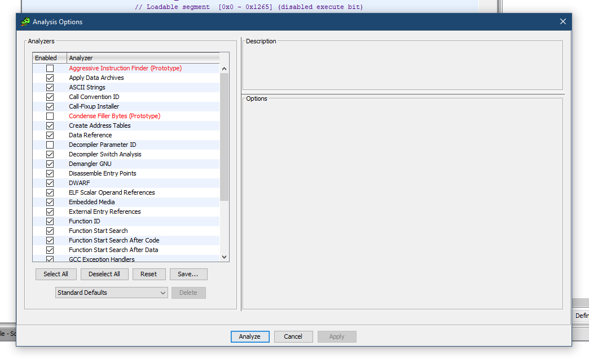
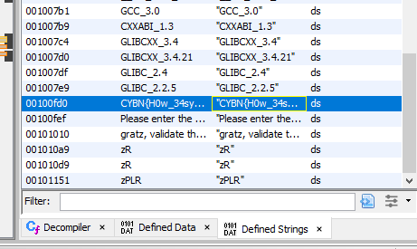


# Write-Up
> **title:** Crackme
>
> **category:** Reverse
>
> **difficulty:** Facile
>
> **point:** 25
>
> **author:** Lmeaou
>
> **description:**
>
> Vous jettez un œil au premier challenge de reverse de la CyberNight. Il n'a pas l'air trop tendu

## Décompilation du binaire

On commence par analyser le binaire avec **GHIDRA**.

## Recherche de notre objectif

Premier réflexe, regarder les chaînes définies, on y cherche un truc ressemblant soit à un flag, soit à un message intéressant.

On y découvre celle-ci :
**"CYBN{H0w_34sy_do3s_th1s_gets?}"**
