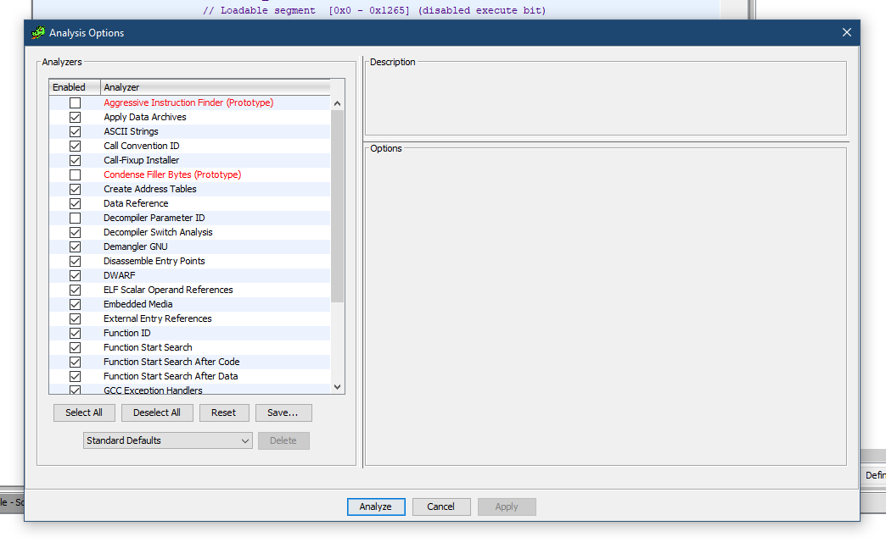
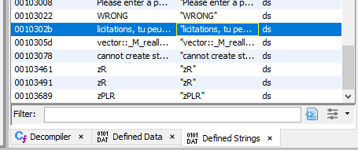
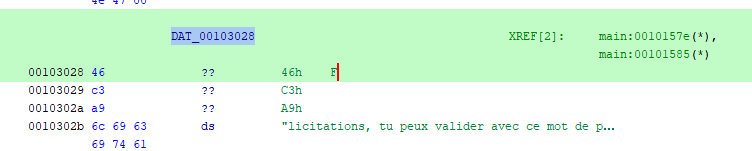

# Write-Up
> **title:** Crackme2
>
> **category:** Reverse
>
> **difficulty:** Facile
>
> **point:** 25
>
> **author:** m00nm00n
>
> **description:**
>
> [For the watch](https://www.youtube.com/watch?v=kg-2dAxNQ8g)

## Décompilation du binaire

On commence par analyser le binaire avec **GHIDRA**.




## Recherche de notre objectif

Premier réflexe, regarder les chaînes définies, on y cherche un truc ressemblant soit à un flag, soit à un message intéressant.



On y découvre celle-ci :
**"licitations, tu peux valider avec ce mot de passe**

On imagine donc que c'est la phrase affichée si l'on a le bon password.

Comme il manque le début de la phrase, nous allons aller chercher son adresse :



On voit alors que le début est bien F de "Félicitaions" et qu'on là trouve ici sous le nom **DAT_00103028**


## Décompilation de la fonction objectif

Si l'on regarde les fonctions utilisant cette string, seule 1 fonction le fait : le main

Voici son code sorti par GHIDRA :

```c++
undefined8 main(void)

{
  char cVar1;
  bool bVar2;
  long *plVar3;
  char *pcVar4;
  int *piVar5;
  ulong uVar6;
  basic_ostream *pbVar7;
  ulong uVar8;
  char local_149;
  vector<int,std::allocator<int>> local_148 [32];
  vector<char,std::allocator<char>> local_128 [32];
  vector<int,std::allocator<int>> local_108 [32];
  undefined4 local_e8;
  undefined4 local_e4;
  undefined4 local_e0;
  undefined4 local_dc;
  undefined4 local_d8;
  undefined4 local_d4;
  undefined4 local_d0;
  undefined4 local_cc;
  undefined4 local_c8;
  undefined4 local_c4;
  undefined4 local_c0;
  undefined4 local_bc;
  undefined4 local_b8;
  undefined4 local_b4;
  undefined4 local_b0;
  undefined4 local_ac;
  undefined4 local_a8;
  undefined4 local_a4;
  undefined4 local_a0;
  undefined4 local_9c;
  undefined4 local_98;
  undefined4 local_94;
  undefined4 local_90;
  undefined4 local_8c;
  undefined4 local_88;
  undefined4 local_84;
  undefined4 local_80;
  undefined4 local_7c;
  undefined4 local_78;
  undefined4 local_74;
  undefined4 local_70;
  undefined4 local_6c;
  undefined4 local_68;
  undefined4 local_64;
  undefined4 local_60;
  undefined4 local_5c;
  undefined4 local_58;
  undefined4 local_54;
  undefined4 local_50;
  undefined4 local_4c;
  undefined4 local_48;
  undefined4 local_44;
  undefined4 local_40;
  undefined4 local_3c;
  allocator<int> local_2d;
  int local_2c;

  local_e8 = 0x46;
  local_e4 = 0x5c;
  local_e0 = 0x45;
  local_dc = 0x51;
  local_d8 = 0x7e;
  local_d4 = 0x69;
  local_d0 = 0x75;
  local_cc = 0x33;
  local_c8 = 0x70;
  local_c4 = 0x62;
  local_c0 = 0x75;
  local_bc = 0x33;
  local_b8 = 0x70;
  local_b4 = 0x37;
  local_b0 = 0x71;
  local_ac = 0x62;
  local_a8 = 0x67;
  local_a4 = 0x34;
  local_a0 = 0x66;
  local_9c = 0x3a;
  local_98 = 0x37;
  local_94 = 0x3a;
  local_90 = 0x33;
  local_8c = 0x75;
  local_88 = 0x62;
  local_84 = 0x3a;
  local_80 = 0x33;
  local_7c = 0x62;
  local_78 = 0x37;
  local_74 = 0x62;
  local_70 = 0x69;
  local_6c = 0x78;
  local_68 = 0x66;
  local_64 = 0x6e;
  local_60 = 0x34;
  local_5c = 0x71;
  local_58 = 0x39;
  local_54 = 0x62;
  local_50 = 0x38;
  local_4c = 0x37;
  local_48 = 0x6f;
  local_44 = 0x37;
  local_40 = 0x67;
  local_3c = 0x80;
  std::allocator<int>::allocator();
  std::vector<int,std::allocator<int>>::vector
            ((int)register0x00000020 - 0x108,(allocator *)&local_e8);
  std::allocator<int>::~allocator(&local_2d);
  std::vector<char,std::allocator<char>>::vector(local_128);
  std::vector<int,std::allocator<int>>::vector(local_148);
  printf("Please enter a password: ");
  std::basic_istream<char,std::char_traits<char>>::operator>>
            ((basic_istream<char,std::char_traits<char>> *)std::cin,std::noskipws);
  while( true ) {
    plVar3 = (long *)std::operator>>((basic_istream *)std::cin,&local_149);
    bVar2 = std::basic_ios::operator.cast.to.bool
                      ((basic_ios *)((long)plVar3 + *(long *)(*plVar3 + -0x18)));
    if ((bVar2 == false) || (local_149 == '\n')) {
      bVar2 = false;
    }
    else {
      bVar2 = true;
    }
    if (!bVar2) break;
    std::vector<char,std::allocator<char>>::push_back(local_128,&local_149);
  }
  local_2c = 0;
  do {
    uVar8 = (ulong)local_2c;
    uVar6 = std::vector<int,std::allocator<int>>::size(local_108);
    if (uVar6 <= uVar8) {
      pbVar7 = std::operator<<((basic_ostream *)__TMC_END__,&DAT_00103028);
      std::basic_ostream<char,std::char_traits<char>>::operator<<
                ((basic_ostream<char,std::char_traits<char>> *)pbVar7,
                 std::endl<char,std::char_traits<char>>);
LAB_001015ae:
      std::vector<int,std::allocator<int>>::~vector(local_148);
      std::vector<char,std::allocator<char>>::~vector(local_128);
      std::vector<int,std::allocator<int>>::~vector(local_108);
      return 0;
    }
    pcVar4 = (char *)std::vector<char,std::allocator<char>>::operator[](local_128,(long)local_2c);
    cVar1 = *pcVar4;
    piVar5 = (int *)std::vector<int,std::allocator<int>>::operator[](local_108,(long)local_2c);
    if (cVar1 + 3 != *piVar5) {
      pbVar7 = std::operator<<((basic_ostream *)__TMC_END__,"WRONG");
      std::basic_ostream<char,std::char_traits<char>>::operator<<
                ((basic_ostream<char,std::char_traits<char>> *)pbVar7,
                 std::endl<char,std::char_traits<char>>);
      goto LAB_001015ae;
    }
    local_2c = local_2c + 1;
  } while( true );
}
```

Première chose a remarquer : une longue liste de définition de variable, si l'on regarde coté assembleur, il s'agit en fait d'une adresse (local_2d) suivis de 32 valeurs.

Ensuite on voit une première boucle while, en la regardant on comprend qu'elle sert à lire l'input

La seconde boucle est un do while, elle cherche à vérifier l'input, c'est dans celle-ci qu'on retrouve **DAT_00103028**

Pour aller jusqu'à notre string, il faut remplir la condition **(uVar6 <= uVar8)**

Cependant uVar6 est la taille de notre input et uVar8 prend, juste avant la condition, la valeur de **local_2c**

Et **local_2c** est incrémenté à chaque tour de boucle, il s'agit donc de l'**index parcouru**

Il également essentiel de remarquer le bout de code ci-dessous au début :

```c++
std::allocator<int>::allocator();
std::vector<int,std::allocator<int>>::vector
          ((int)register0x00000020 - 0x108,(allocator *)&local_e8);
std::allocator<int>::~allocator(&local_2d);
```

Ce que fait ce code c'est **remapper l'adresse de local_e8** (la première de la longue liste de 32 variables) **sur local_108**, c'est à dire que local_108 devient le pointeur du vecteur de taille 32 (qui contient probablement le flag).

Remettons un peu cette deuxième boucle au propre et simplifions la :

Pour ça, local_108 devient flag, local_128 devient password, local_2c devient i etc...

```c++
do {
  size = std::vector<int,std::allocator<int>>::size(flag);
  if (size <= i) {
    felicitations = std::operator<<((basic_ostream *)__TMC_END__,&DAT_00103028);
    std::basic_ostream<char,std::char_traits<char>>::operator<<
              ((basic_ostream<char,std::char_traits<char>> *)felicitations,
               std::endl<char,std::char_traits<char>>);
perdu:
    // Suppression des allocations mémoire
    std::vector<int,std::allocator<int>>::~vector(local_148);
    std::vector<char,std::allocator<char>>::~vector(password);
    std::vector<int,std::allocator<int>>::~vector(flag);
    return 0;
  }
  // Récupère le char à la position i de notre password
  c = *(char *)std::vector<char,std::allocator<char>>::operator[](password,(long)i);
  // Récupère le int à la position i de flag
  f = *(int *)std::vector<int,std::allocator<int>>::operator[](flag,(long)i);

  // Compare les deux, (c + 3 transforme implicitement le char en int)
  if (c + 3 != f) {
    // Si notre c + 3 n'est pas égal à f, alors c'est perdu
    wrong = std::operator<<((basic_ostream *)__TMC_END__,"WRONG");
    std::basic_ostream<char,std::char_traits<char>>::operator<<
              ((basic_ostream<char,std::char_traits<char>> *)wrong,
               std::endl<char,std::char_traits<char>>);
    goto perdu;
  }
  i = i + 1;
} while( true );
```

On comprend donc que chacun des char de nos input doit être égale à celui de flag - 3, autrement dit il s'agit d'un **chiffrement de César de clé 3**.

On récupère les variables, soustrait 3 à chacune, la transforme en char et le tour est joué.

Voici un script python qui s'en occupe :

```Python
a = """local_e8 = 0x46;
  local_e4 = 0x5c;
  local_e0 = 0x45;
  local_dc = 0x51;
  local_d8 = 0x7e;
  local_d4 = 0x69;
  local_d0 = 0x75;
  local_cc = 0x33;
  local_c8 = 0x70;
  local_c4 = 0x62;
  local_c0 = 0x75;
  local_bc = 0x33;
  local_b8 = 0x70;
  local_b4 = 0x37;
  local_b0 = 0x71;
  local_ac = 0x62;
  local_a8 = 0x67;
  local_a4 = 0x34;
  local_a0 = 0x66;
  local_9c = 0x3a;
  local_98 = 0x37;
  local_94 = 0x3a;
  local_90 = 0x33;
  local_8c = 0x75;
  local_88 = 0x62;
  local_84 = 0x3a;
  local_80 = 0x33;
  local_7c = 0x62;
  local_78 = 0x37;
  local_74 = 0x62;
  local_70 = 0x69;
  local_6c = 0x78;
  local_68 = 0x66;
  local_64 = 0x6e;
  local_60 = 0x34;
  local_5c = 0x71;
  local_58 = 0x39;
  local_54 = 0x62;
  local_50 = 0x38;
  local_4c = 0x37;
  local_48 = 0x6f;
  local_44 = 0x37;
  local_40 = 0x67;
  local_3c = 0x80;"""

a = [chr(int(line.split('= ')[1], 16) - 3) for line in a.split(';')[:-1]]
print(''.join(a))
```

```
Output: CYBN{fr0m_r0m4n_d1c7470r_70_4_fuck1n6_54l4d}
```
