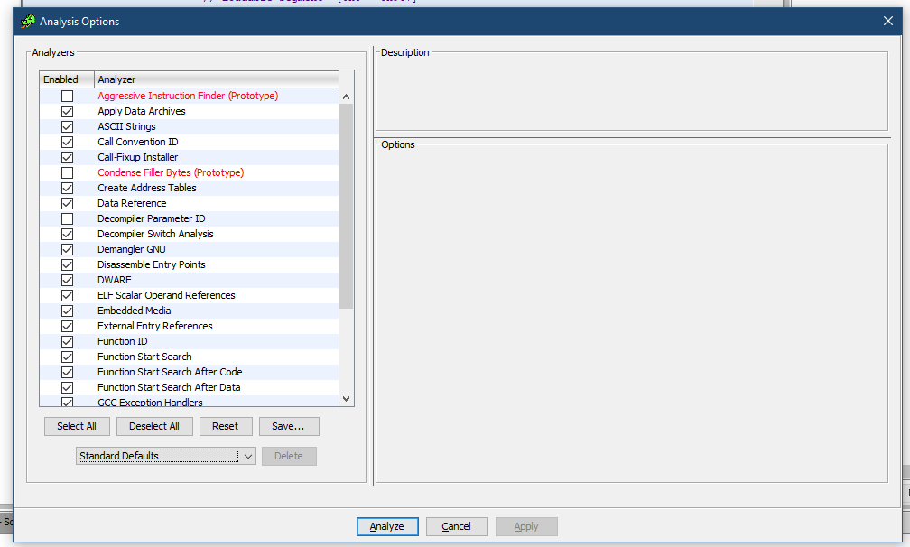
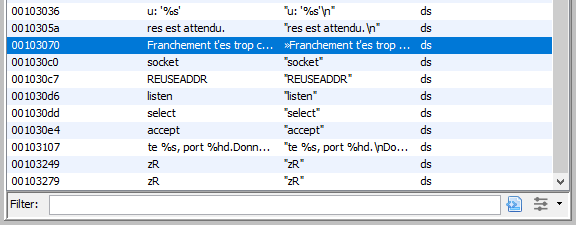

# Write-Up
> **title:** revMeBaby
>
> **category:** Reverse
>
> **difficulty:** Insane
>
> **point:** 225
>
> **author:** m00nm00n
>
> **description:**
>
> Est-ce que vous vous souvenez de vos cours de seconde ?
>
> Le flag est de la forme: CYBN{password}

## Décompilation du binaire

On commence par analyser le binaire avec **GHIDRA**.




## Recherche de notre objectif

Premier réflexe, regarder les chaînes définies, on y cherche un truc ressemblant soit à un flag, soit à un message intéressant.



On y découvre celle-ci :
**"Franchement t'es trop chaud, felicitations, tu peux aller prendre tes points !"**

Le but maintenant est de décompiler la fonction où elle est utilisée et de remonter au fur et à mesure les fonctions dans le sens inverse pour comprendre comment aller jusqu'à ce point.


## Décompilation de la fonction cible

On décompile donc la fonction qui fait une référence dessus : FUN_001021a2.

```c++
undefined8 FUN_001021a2(int param_1)

{
  // Initialisation des variables.
  int iVar1;
  ssize_t sVar2;
  undefined8 uVar3;
  size_t sVar4;
  char local_218 [512];     // buffer de 520 char
  uint local_10;
  int local_c;

  // Lecture du paramètre, on se doute que param_1 est donc un file descriptor (fd, dans le contexte il s'agit en fait d'un socket)
  // On lit les 512 premiers char du fd
  sVar2 = read(param_1,local_218,0x200);
  local_c = (int)sVar2;
  if (local_c < 0) {
    perror("read");
                    /* WARNING: Subroutine does not return */
    exit(1);
  }
  // Si la taille de la chaîne récupérée est égale à 0, le message a été reçu, sortie de la fonction.
  if (local_c == 0) {
    uVar3 = 0xffffffff;
  }
  else {
    // Récupère la première occurance d'un retour à la ligne
    sVar4 = strcspn(local_218,"\n");

    // Transforme ce retour à la ligne en fin de chaîne
    local_218[sVar4] = '\0';
    fprintf(stderr,&DAT_0010302a,local_218);

    // Sous-fonction n°1
    iVar1 = FUN_00101c28(local_218);

    // Si elle retourne 0 (ou false)
    if (iVar1 == 0) {

      // Si la taille de la chaîne est différente de 16
      sVar4 = strlen(local_218);
      if (sVar4 != 0x10) {
        fwrite(&DAT_00103040,1,0x2b,stderr);
      }
      sVar4 = strlen(local_218);
      if (sVar4 == 0x10) {
        sVar4 = strlen(local_218);

        // Sous-fonction n°2
        local_10 = FUN_00101d3a(local_218,sVar4);
        fprintf(stderr,"%d",(ulong)local_10);

        // Si elle retourne autre chose que 0 (ou que false)
        if (local_10 != 0) {
          fwrite("Franchement t\'es trop chaud, felicitations, tu peux aller prendre tes points ! ", 1, 0x4f, stderr);
          return 1;
        }
      }
      uVar3 = 0;
    }
    else {
      uVar3 = 0;
    }
  }
  return uVar3;
}
```

Pour simplifier les explications, j'ai directement commenté le code décompilé, modifié le nom des variables et autres fonction et simplifié un poil le code.

```c++
undefined8 read_password(int fd)

{
  char buffer [512];
  // Lecture du message du client socket
  ssize_t count_bytes_read = (int)read(fd,buffer,0x200);
  size_t password_size;

  // Si une erreur est survenue pendant la lecture
  if (count_bytes_read < 0) exit(1);
  // Si le fichier est vide
  if (count_bytes_read == 0) return 0xffffffff;
  // Sinon
  else {
    password_size = strcspn(buffer,"\n");
    buffer[password_size] = '\0';

    // Il faut que la fonction verif1 retourne 0
    if (verif_1(buffer) == 0) {
      password_size = strlen(buffer);

      // Il faut que le password fasse 16 de longueur
      if (password_size == 16) {

        // Il faut que la fonction verif2 retourne autre chose que 0
        if (verif_2(buffer,password_size) != 0) {
          fwrite("Franchement t\'es trop chaud, felicitations, tu peux aller prendre tes points ! ", ,0x4f,stderr);
          return 1;
        }
      }
      return 0;
    }
    return 0;
  }
  return 0;
}
```


Donc je récapitule ce que nous devons faire pour atteindre notre objectif :
- La chaîne rentrée doit faire 16 de longueur
- La sous-fonction n°1 doit retourner 0 ou false
- La sous-fonction n°2 ne doit pas retourner 0 ou false


## Décompilation de verif_1

Encore une fois, pour l'expliquer j'ai modifié le nom des variables, commenté et simplifié :

```c++
undefined8 verif_1(char *password)
{
  int v1;
  int v2;
  size_t len;
  int i;

  // Boucle sur chaque char du password
  i = 0;
  do {

    // Quitte la boucle si l'index arrive à la fin de la chaîne
    len = strlen(password);
    if (len <= (ulong)(long)i) {
      // Comme on veut que cette fonction retourne 0
      // Il faut éviter tous les autres return pour arriver ici.
      return 0;
    }

    v1 = (int)password[i];
    v2 = 48;


    // Impose que password[i] soit compris entre (48 et 57) OU (65 et 90)
    // Sinon la fonction retournera 1
    if (v1 < v2) {
verif_65_90:
      v1 = (int)password[i];
      v2 = 65;
      if (v1 < v2) {
perdu:
        fwrite("coup dur frer\n",1,14,stderr);
        return 1;
      }
      v1 = (int)password[i];
      v2 = 90;
      if (v2 < v1) goto perdu;
    }
    else {
      v1 = (int)password[i];
      v2 = 57;
      if (v2 < v1) goto verif_65_90;
    }
    i = i + 1;
  } while( true );
}
```

Cette fonction nous dit donc que les char acceptés dans le password sont : **0123456789ABCDEFGHIJKLMNOPQRSTUVWXYZ**.


## Décompilation de verif_2

Attaquons nous à la seconde fonction de vérification.

```c++
undefined8 FUN_00101d3a(char *param_1)

{
  int iVar1;

  iVar1 = FUN_001012c9((int)*param_1,(int)param_1[2]);
  if (iVar1 == 0) {
    fwrite("You Suck !\n",1,0xb,stderr);
  }
  else {
    iVar1 = FUN_0010133c((int)param_1[2],(int)param_1[3]);
    if (((((((iVar1 != 0) &&
            (iVar1 = FUN_001013a9((int)param_1[1],(int)param_1[3],(int)param_1[5]), iVar1 != 0)) &&
           (iVar1 = FUN_0010142a((int)param_1[9],(int)param_1[0xc],(int)param_1[0xf]), iVar1 != 0))
          && ((iVar1 = FUN_001014ab((int)param_1[0xd],(int)param_1[0xe],(int)param_1[0xf]),
              iVar1 != 0 &&
              (iVar1 = FUN_0010152c((int)param_1[6],(int)param_1[8],(int)param_1[10]), iVar1 != 0)))
          ) && ((iVar1 = FUN_001015ad((int)param_1[3],(int)param_1[4],(int)param_1[5]), iVar1 != 0
                && ((iVar1 = FUN_0010162e((int)param_1[2],(int)param_1[4],(int)param_1[6]),
                    iVar1 != 0 && (iVar1 = FUN_001016af((int)*param_1,(int)param_1[1]), iVar1 != 0))
                   )))) &&
        (iVar1 = FUN_0010171c((int)param_1[1],(int)param_1[4],(int)param_1[7]), iVar1 != 0)) &&
       (((((iVar1 = FUN_0010179d((int)param_1[8],(int)param_1[9],(int)param_1[10]), iVar1 != 0 &&
           (iVar1 = FUN_0010181e((int)param_1[7],(int)param_1[0xc],(int)param_1[0xd]), iVar1 != 0))
          && (iVar1 = FUN_0010189f((int)param_1[0xb],(int)param_1[0xc],(int)param_1[0xd]),
             iVar1 != 0)) &&
         (((iVar1 = FUN_00101920((int)param_1[4],(int)param_1[2],(int)param_1[1]), iVar1 != 0 &&
           (iVar1 = FUN_001019a1((int)param_1[0xe],(int)*param_1,(int)param_1[8]), iVar1 != 0)) &&
          ((iVar1 = FUN_00101a22((int)param_1[0xd],(int)param_1[5],(int)param_1[7]), iVar1 != 0 &&
           ((iVar1 = FUN_00101aa3((int)param_1[8],(int)param_1[1],(int)param_1[0xc]), iVar1 != 0 &&
            (iVar1 = FUN_00101b24((int)param_1[0xe],(int)param_1[0xb],(int)param_1[7]), iVar1 != 0))
           )))))) &&
        (iVar1 = FUN_00101ba6((int)param_1[3],(int)param_1[1],(int)param_1[6]), iVar1 != 0)))) {
      return 1;
    }
  }
  return 0;
}
```

Beaucoup de sous-fonctions sont présentes, il va falloir les décortiquer une par une.

Voici la première d'entre elles **FUN_001012c9** :

```c++
bool FUN_001012c9(char param_1,char param_2)

{
  int iVar1;
  int iVar2;

  iVar1 = FUN_0010125a((int)param_2);
  iVar2 = FUN_0010125a((int)param_1);
  return ((iVar1 - iVar2) + 72) % 36 == 10;
}
```

Si l'on fait cela avec chacune des sous-fonctions on s'aperçoit qu'elles ont toutes la même tête, nous allons les appeler **fonctions équation**.

On s'aperçoit également qu'elles utilisent une fonction nommée **FUN_0010125a**, elle est utilisée dans toutes les fonctions équation dont on a parlé juste avant, on l'expliquera plus tard, en attendant je l'appelle  **shift_ascii_code**

Fonction renommée et simplifiée :

```c++
bool equation_1(char c1,char c2)

{
  int v1 = shift_ascii_code((int)c2);
  int v2 = shift_ascii_code((int)c1);
  return ((v1 - v2) + 72) % 36 == 10;
}
```


## Décompilation de shift_ascii_code

Regardons donc cette fameuse fonction que toutes nos fonctions équation appelle :

```c++
ulong FUN_0010125a(char param_1)

{
  int iVar1;
  ulong uVar2;

  iVar1 = to_int((int)param_1);
  if ((47 < iVar1) && (iVar1 = to_int((int)param_1), iVar1 < 58)) {
    iVar1 = to_int((int)param_1);
    return (ulong)(iVar1 - 48);
  }
  uVar2 = to_int((int)param_1);
  if ((64 < (int)uVar2) && (uVar2 = to_int((int)param_1), (int)uVar2 < 91)) {
    iVar1 = to_int((int)param_1);
    uVar2 = (ulong)(iVar1 - 55);
  }
  return uVar2;
}
```

Fonction renommée et simplifiée :

```c++
ulong shift_ascii_code(char param_1)

{
  int charcode = (int)param_1;
  if (47 < charcode && charcode < 58) return (ulong)(charcode - 48);
  if (64 < charcode && charcode < 91) return (ulong)(charcode - 55);
  return charcode;
}
```

Si l'on test rapidemment cette fonction dans un autre langage (genre Python), on voit ceci :

```python
def shift_ascii_code(i):
  return ((i - 48) if (47 < i < 58) else ((i - 55) if (64 < i < 91) else i))

charset = [*list(range(48, 58)), *list(range(65, 91))]
print([(i, shift_ascii_code(i)) for i in charset])
```
```
Output:
[(48, 0), (49, 1), (50, 2), (51, 3), (52, 4), (53, 5), (54, 6), (55, 7), (56, 8), (57, 9), (65, 10), (66, 11), (67, 12), (68, 13), (69, 14), (70, 15), (71, 16), (72, 17), (73, 18), (74, 19), (75, 20), (76, 21), (77, 22), (78, 23), (79, 24), (80, 25), (81, 26), (82, 27), (83, 28), (84, 29), (85, 30), (86, 31), (87, 32), (88, 33), (89, 34), (90, 35)]
```

On comprend alors que la fonction ramène les codes ascii en suite de 0 à 35.

## Récupération des équations

Pour passer la première condition, on se souvient de cette ligne :
```c++
iVar1 = equation_1((int)*param_1,(int)param_1[2]);
if (iVar1 == 0) {
  fwrite("You Suck !\n",1,0xb,stderr);
}
```
Elle se traduit par : **il faut que ((password[2]-password[0]) + 72) % 36 soit égal à 10**.

On applique le même raisonnement à toutes les fonctions équations, je ne vais donc pas toutes les faire ici mais noter simplement les équations qu'elles reflètent:

- (password[2] - password[0] + 72) % 36 == 10
- (password[2] + password[3]) % 36 == 8
- (password[1] + password[3] + password[5]) % 36 == 32    
- (password[9] + password[12] + password[15]) % 36 == 34
- (password[13] + password[14] + password[15]) % 36 == 34
- (password[6] + password[8] + password[10]) % 36 == 15
- (password[3] + password[4] + password[5]) % 36 == 17   
- (password[2] + password[4] + password[6]) % 36 == 2
- (password[0] + password[1]) % 36 == 20
- (password[1] + password[4] + password[7]) % 36 == 10   
- (password[8] + password[9] + password[10]) % 36 == 32
- (password[7] + password[12] + password[13]) % 36 == 34
- (password[11] + password[12] + password[13]) % 36 == 7
- (password[4] + password[2] + password[1]) % 36 == 6  
- (password[14] + password[0] + password[8]) % 36 == 7
- (password[13] + password[5] + password[7]) % 36 == 11
- (password[8] + password[1] + password[12]) % 36 == 5
- ((password[14] + password[11]) - password[7]) % 36 == 32
- ((password[3] + password[1]) - password[6]) % 36 == 9  


Il ne reste plus qu'à trouver le mot de passe grâce à ça, comment ? Grâce à un langage de contrainte (j'avais oublié que ça existe, merci m00nm00n pour le tips après le CTF)


## Langage de contrainte

Ici on va la faire avec une lib python : **python-constraint**

Voici le code :

```python
from constraint import *

problem = Problem()

# Comme tous les char sont modifiés par la fonction shift_ascii_code, le charset est de 0 à 35 inclus
charset = list(range(36))

# Ajout des variable (bêtement les variables sont notées de 0 à 15 inclus)
for n in range(16):
    problem.addVariable(n, charset)

# Ajout des équations
problem.addConstraint(lambda a, b: (b - a + 72) % 36 == 10, (0, 2))
problem.addConstraint(lambda a, b: (a + b) % 36 == 8, (2, 3))
problem.addConstraint(lambda a, b, c: (a + b + c) % 36 == 32, (1, 3, 5))
problem.addConstraint(lambda a, b, c: (a + b + c) % 36 == 34, (9, 12, 15))
problem.addConstraint(lambda a, b, c: (a + b + c) % 36 == 34, (13, 14, 15))
problem.addConstraint(lambda a, b, c: (a + b + c) % 36 == 15, (6, 8, 10))
problem.addConstraint(lambda a, b, c: (a + b + c) % 36 == 17, (3, 4, 5))
problem.addConstraint(lambda a, b, c: (a + b + c) % 36 == 2, (2, 4, 6))
problem.addConstraint(lambda a, b: (a + b) % 36 == 20, (0, 1))
problem.addConstraint(lambda a, b, c: (a + b + c) % 36 == 10, (1, 4, 7))
problem.addConstraint(lambda a, b, c: (a + b + c) % 36 == 32, (8, 9, 10))
problem.addConstraint(lambda a, b, c: (a + b + c) % 36 == 34, (7, 12, 13))
problem.addConstraint(lambda a, b, c: (a + b + c) % 36 == 7, (11, 12, 13))
problem.addConstraint(lambda a, b, c: (a + b + c) % 36 == 6, (4, 2, 1))
problem.addConstraint(lambda a, b, c: (a + b + c) % 36 == 7, (14, 0, 8))
problem.addConstraint(lambda a, b, c: (a + b + c) % 36 == 11, (13, 5, 7))
problem.addConstraint(lambda a, b, c: (a + b + c) % 36 == 5, (8, 1, 12))
problem.addConstraint(lambda a, b, c: ((a + b) - c) % 36 == 32, (14, 11, 7))
problem.addConstraint(lambda a, b, c: ((a + b) - c) % 36 == 9, (3, 1, 6))

# Calcul des solution possible
solutions = problem.getSolutions()


for solution in solutions:
    out = ''
    for i in range(16):
        # Reverse de la fonction shift_ascii_code pour retrouver le code original
        out += chr(solution[i] + (48 if solution[i] < 10 else 55))
    print("CYBN{" + out + "}")
```
```
Output: CYBN{TR35C0N7R41GN4N7}
```
