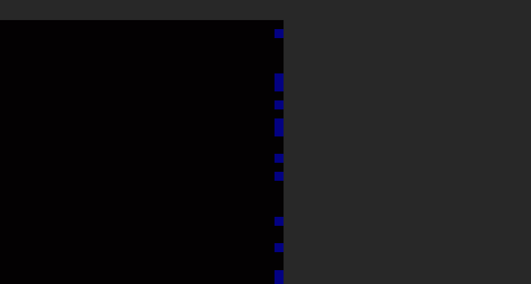


# Write-Up
> **title:** Evil Mondrian
>
> **category:** Stéganographie
>
> **difficulty:** Difficile
>
> **point:** 125
>
> **author:** Pedro
>
> **description:**
>
> Evil Mondrian être comme ...

## Analyse de l'image

En ouvrant l'image on voit "EVIL LSB", le LSB consiste à cacher des données dans les bits de poids faibles.
Si l'on fait un peu plus attention (*chose que personne n'a fait durant le CTF*), on peut voir ceci sur le côté droit de l'image :



Sauf que pour que la couleur puisse se voir à l'oeil nu, ce n'est pas du LSB mais du MSB, c'est la même chose avec les bits de poids fort.


## Récupération des données

Puisque le fond de l'image est noir et que nous voyons des pixels bleus, nous n'auront besoin, a priori, que du canaux bleu pour faire le MSB.

Avant de s'y lancer il faut bien comprendre ce que cela veut dire, imaginons que l'on veuille cacher le mot **`abc`** :

On commence par le transformer en binaire : **`01100001 01100010 01100011`**. Puis pour chaque bit que l'on veut cacher, on va prendre notre pixel noir de base, en binaire ça donne :

|     R     |     G     |     B     |
|:---------:|:---------:|:---------:|
| 0000 0000 | 0000 0000 | **0**000 0000 |

Si l'on veut cacher un **`0`**, rien ne change. Par contre si l'on veut cacher un **`1`**, le pixel devient :

|     R     |     G     |     B     |
|:---------:|:---------:|:---------:|
| 0000 0000 | 0000 0000 | **1**000 0000 |

 On va faire un *petit* script python qui permet de récupérer ces bits :

```python
from PIL import Image
img = Image.open('./evil_mondrian.png')
output = ''.join([bin(img.getpixel((img.width-1, y))[2])[2:].zfill(8)[0] for y in range(img.height)])
print(''.join([chr(int(output[i:i+8], 2)) for i in range(0, len(output), 8)]))
```

Bon, **en un peu plus compréhensible** pour ceux qui haïssent le python ça donne :

```python
# Récupération de l'image
from PIL import Image
img = Image.open('./evil_mondrian.png')

# Binaire que l'on va récupérer
binary = ''

# Pour chaque ligne, on récupère le pixel de la dernière colonne
x = img.width-1
for y in range(img.height):
  # Récupération du pixel
  pixel = img.getpixel((img.width-1, y))

  # Récupération du canaux Bleu et transformation en binaire (+ ajout de 0 devant le binaire si sa taille est inférieur à 8)
  blue = bin(pixel[2])[2:].zfill(8)

  # Récupération et ajout du bit de poids fort (celui tout à gauche)
  binary += blue[0]

# Transformation du binaire en octet et conversion en nombre entier
data = [int(binary[i:i+8], 2) for i in range(0, len(binary), 8)]

# Transformation des entiers en caractères selon ascii et concaténation du tout
text = ''.join([chr(n) for n in data])

print(text)
```

```
Output: CYBN{MoSt_SignIfiC4nT_BiT_sT3g4n0grAPhY_iS_n0t_A_gOo0D_IDe4}
```
