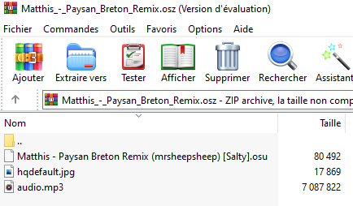
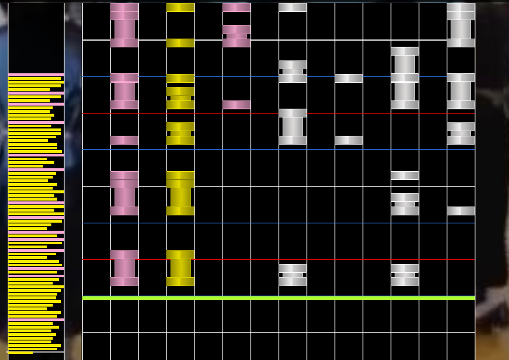
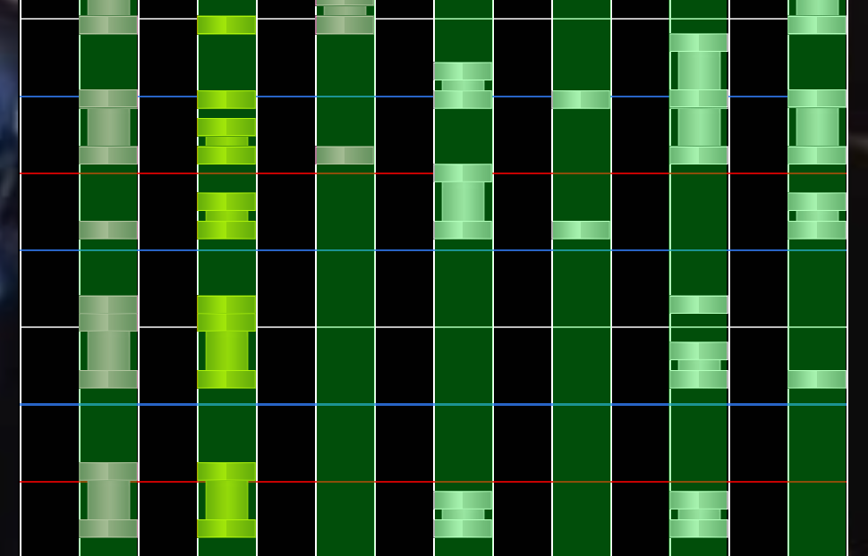
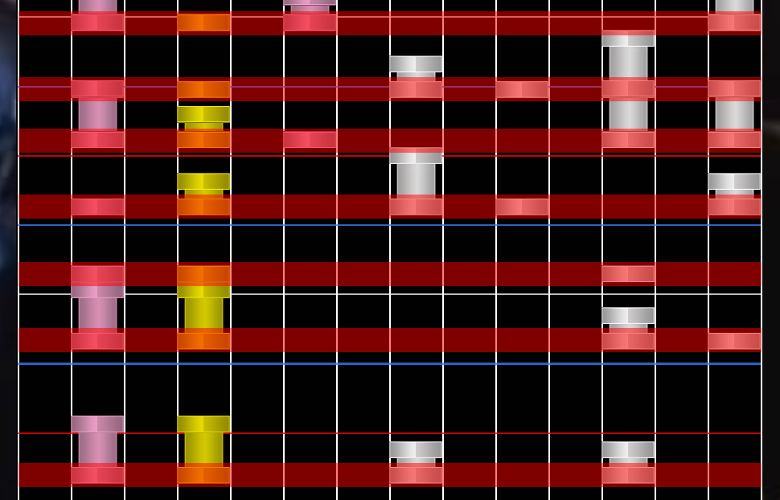
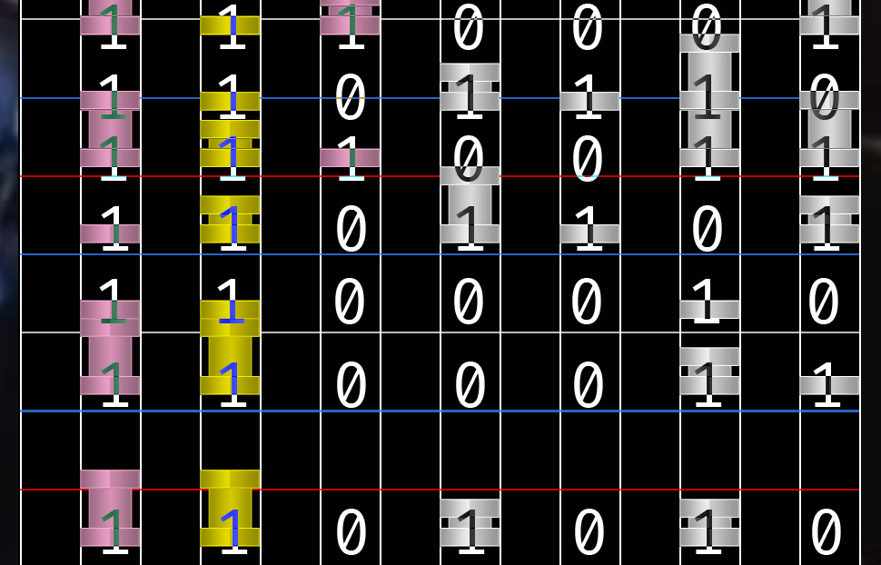
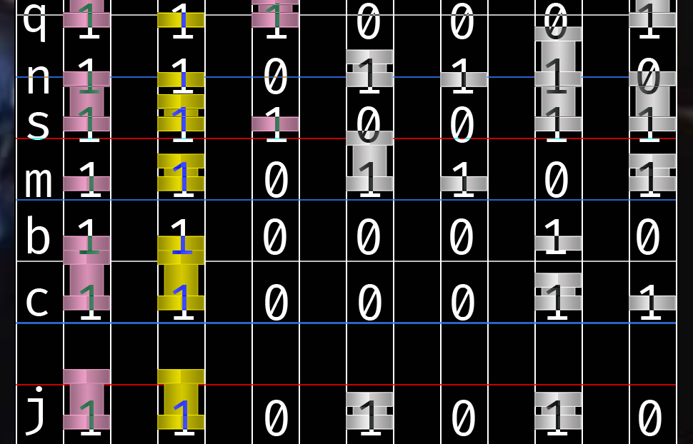


# Write-Up
> **title:** Jakads
>
> **category:** Stéganographie
>
> **difficulty:** Difficile
>
> **point:** 100
>
> **author:** MrSheepSheep
>
> **description:**
>
> Personne n'a jamais réussi à terminer cette map...
>
> Le flag est caché dans les notes.

## Analyse du fichier

Il s'agit d'un **`.osz`**. En cherchant sur internet, on découvre que c'est une extension utilisée par le jeu **OSU** comme map et que c'est une **archive**.

Ouvrons le avec **Winrar** :



On voit 3 fichiers. Même si la description nous dit que le flag est caché dans les notes, ça nous coûte pas grand chose de jeter un oeil dans les autres fichiers.

**L'image** : en faisant une analyse assez basique avec **[AperiSolve](https://aperisolve.fr)** on obtient rien de probant.

**L'audio** : une analyse spectographique classique + une écoute ne donne rien non plus.

**Le fichier .osu** : c'est un type peu commun et très spécifique. En l'ouvrant on peut y voir tout un tas de données concernant la map. On remarque que le fichier se découpe en plusieurs parties :
- [General]
- [Editor]
- [Metadata]
- [Difficulty]
- [Events]
- [TimingPoints]
- [HitObjects]

Les 2 seules parties qui semblent intéressantes sont **TimingPoints**, qui contient des nombres énigmatiques, et **HitObjects** qui compose en majorité le fichier et contient également des nombres énigmatiques.

Regardons le format du fichier .osu sur **[osu.ppy.sh](https://osu.ppy.sh/wiki/fr/osu%21_File_Formats/Osu_%28file_format%29)**:

Le **TimingPoints** se compose dans cet ordre de : `time,beatLength,meter,sampleSet,sampleIndex,volume,uninherited,effects`

Les valeurs qu'on trouve dans le fichier semblent normales, pas de valeurs suspectes.

Les **HitObjects** : `x,y,time,type,hitSound,objectParams,hitSample`

On peut remarquer déjà plusieurs choses :
- **y** est invariable dans notre fichier
- **x** varie entre 7 valeurs : `73, 146, 219, 292, 365, 438, 512`


## Regarder le jeu

Bon, puisqu'en analysant seulement les fichiers rien ne saute aux yeux, ouvrons la map dans le jeu. Pour ça on regarde notre meilleur tuto Youtube pour ajouter la map et on ouvre le jeu :


On va ouvrir l'éditeur de map pour voir à quoi ça ressemble :


On voit alors la tête de la map :



## 6ème sens

On voit tout de suite qu'1 colonne sur 2 est utilisée, ce qui fait 7 colonnes :



En voyant la map, on peut émettre une hypothèse assez rapidement (*si on y pense*) : **les lignes représentent des octets** et **les notes sont les bits**.



**Problème** : Il n'y a que 7 bits,

**Solution**: L'**ASCII** est encodé sur 7 bits. Ce qui correspond plutôt bien.

Essayons sur les quelques premières lignes à la main :



Ce qui nous donne en ASCII :



On a des caractères qui sont valides, essayons donc de faire ça sur toute la map


## Automatisation

On vient de voir que le flag serait peut-être caché dans les **HitObjects**, donc petit script python pour appliquer notre méthode sur tout le fichier.

Avant tout, on créé un fichier avec seulement les **HitObjects**, le fichier se trouve dans **/files/data.osu**.

Le script :

```python
# Récupération du fichier
with open('./data.osu') as f:
	lines = f.read().split('\n')

# Les valeurs de x pour déterminer sur quelle colonne la note est
x_values = ['73', '146', '219', '292', '365', '438', '512']

# Chaque time étant une nouvelle ligne, previous_time servira à savoir quand on change de ligne
previous_time = None

# Liste des octets récupérés
bytes_list = []

# Pour chaque lignes du fichier
for line in lines:

  # Parse les paramètres selon le format vu précédemment
  x, y, time, _type, hitSound, hitSample = line.split(',')

  # Si c'est une nouvelle ligne
  if time != previous_time:

    # Met à jour le time de la nouvelle ligne
    previous_time = time

    # Ajoute un nouvel octet dans notre list
    bytes_list.append(['0' for i in range(7)])

  # Met à jour le bit correspondant à x
  bytes_list[-1][x_values.index(x)] = '1'

# Pour chaque octet, on le transforme en ascii et l'on concatène le tout
print(''.join([chr(int(''.join(b), 2)) for b in bytes_list]))
```

```
Output:
jcbmsnqyccccviuilijenyoqxyzebavecgmbwijgfvxhyjjrdfyfbixpktoyjipuxgqgkedunhxurxobppxsjqdvmtgfvbbbyoqusmkasxmdrxtofhvjoienuediiyulkbwhflmzzhqahokydeutmkzcvnuwotvahkonebpvxmspzmskrzfcfhtqirjiztllbzpxapbooqjybfunhpvknsqyyumwlswgqkoebshenwvrtjfvufhdmhvetgpjasxcCYBN{N0t_My_kinD_oF_Mu51c_3ithEr}qgsdakertmxfokqsjejeoxwegorhawttldwzxvnwhblkihahgccdlazjqmesxxglsgcousqhjbzyphnhdbdwrsqffizyybfvfjnpiyzlhbvffqeawmhkdnqpkjqxpjpvfutsrtrytanjczsvldudnigzsnrocwifkvmdirwviiahmnbuckrquvlsdkdownyycezfordbijpkwogppryfvscqxaruaqmcactnvekkdznisqbrtgstlqpyqcjqwzcu
```

On trouve le flag à l'intérieur de la sortie

**Le flag : CYBN{N0t_My_kinD_oF_Mu51c_3ithEr}**

