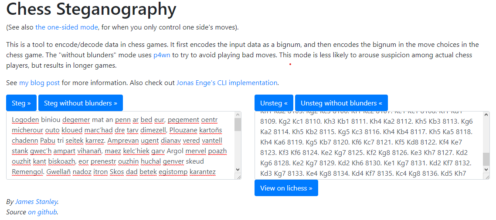
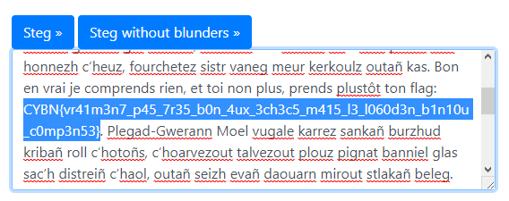


# Write-Up
> **title:** LoremIpsum_v2
>
> **category:** Stéganographie
>
> **difficulty:** Facile
>
> **point:** 25
>
> **author:** m00nm00n
>
> **description:**
>
> J'ai entendu dire que c'était populaire.

## Analyse du fichier

Si l'on regarde bien le fichier, on peut voir que les caractères ne sont pas aléatoires:

```
1. a3 h5 2. f3 e6 3. a4 Qh4+ 4. g3 f6 5. Bg2 e5 6. Nc3 b5
```

Cherchons **`1. a3 h5 2. f3 e6`** sur internet. On tombe alors sur **des échecs**. Notre fichier contient en fait les déplacements d'une partie d'échec.

Cherchons donc **`chess steganography`** (*en anglais il y a plus de résultat*) sur internet, on trouve **[incoherency.co.uk](https://incoherency.co.uk/chess-steg/)**.

## Récupération des données

Ce site nous propose une manière de cacher des données dans des déplacements d'échecs, mais également de les extraire. Espérons que c'est cette même manière qui a permis de les cacher :



On obtient un long texte, **du lorem ipsum**, cependant si l'on prend le temps de regarder le texte (*ou de faire un Ctrl+F*) on peut trouver le flag plus bas :



**Le flag : CYBN{vr41m3n7_p45_7r35_b0n_4ux_3ch3c5_m415_l3_l060d3n_b1n10u_c0mp3n53}**

