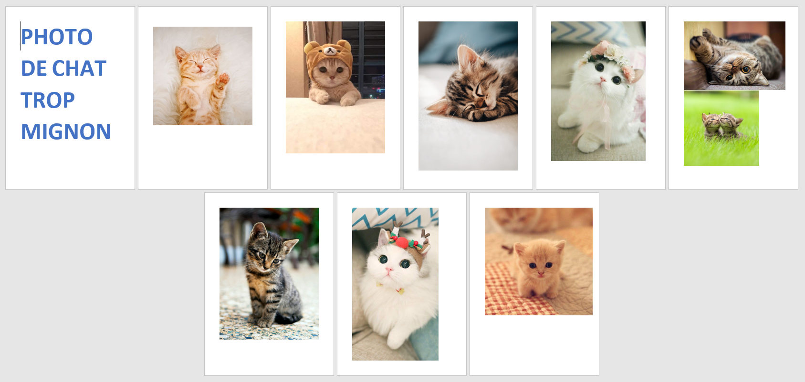
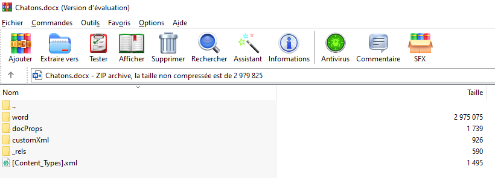
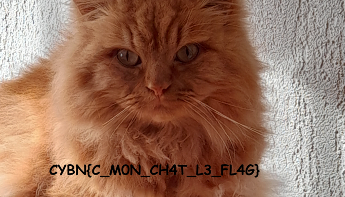


# Write-Up
> **title:** Now you mew me 🐱
>
> **category:** Stéganographie
>
> **difficulty:** Facile / Miaou
>
> **point:** 25
>
> **author:** Mewstran
>
> **description:**
>
> The closer you think you purr, the less you'll actually roar.
>
> Miaou

## Analyse du fichier

Il s'agit d'un **.docx**. A l'intérieur on trouve un petit texte et des photos. On peut faire un **`Ctrl+A`** pour vérifier qu'il n'y a pas de texte écrit en blanc sur blanc, mais il n'y a rien. Cherchons donc du côté **des images**.

Chose que peu de gens savent (*en dehors de ceux qui font des CTF*), c'est que l'on peut **ouvrir un docx en tant qu'archive** pour récupérer les différents objets qu'il contient, comme les images par exemples.

Ouvrons donc le fichier avec **Winrar** :

Si l'on fouille un peu les fichier, on tombe sur **/word/media/image10.jpg** :

**Le flag : CYBN{C_M0N_CH4T_L3_FL4G}**

