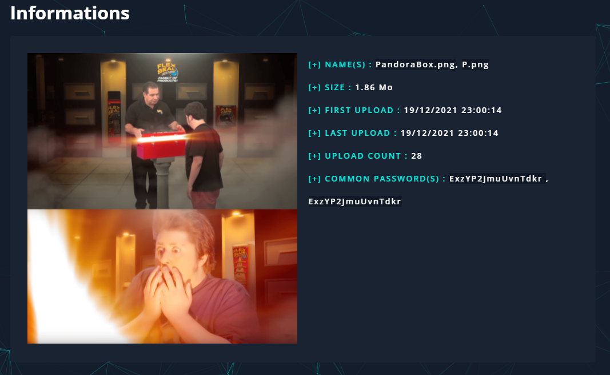
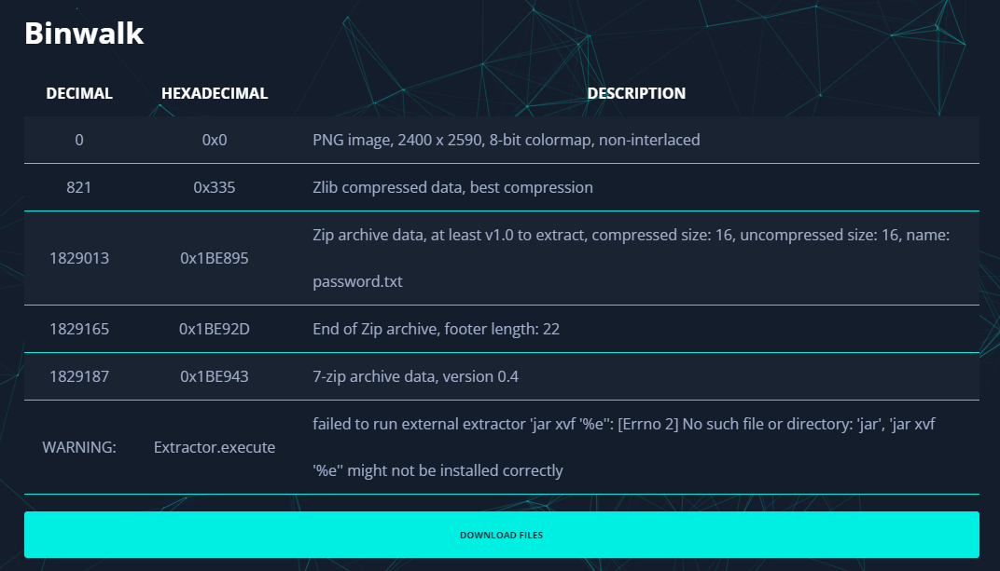


# Write-Up
> **title:** Pandora Box
>
> **category:** Stéganographie
>
> **difficulty:** Facile
>
> **point:** 25
>
> **author:** m00nm00n
>
> **description:**
>
> MAIS ON T'AVAIT DIS DE PAS L'OUVRIR

## Analyse de l'image

En Stéganographie, dès que l'on a une image, je conseille **[AperiSolve](https://aperisolve.fr)**. Le site automatise pas mal de fonctions tel que :
- Zsteg
- Steghide
- Outguess
- ExifTool
- Binwalk
- Foremost
- Strings

Si l'on analyse le fichier

Dans la catégorie **Binwalk** on trouve quelques fichiers cachés intéressants :

## Récupération des fichiers cachés

Téléchargeons ce que Binwalk a détecté et trions les faux positifs :
- 0x0, c'est l'image, pas besoin de la traiter, **on ignore**
- 0x335 est une zlib, **on retient**
- 0x1BE895 est un fichier zip avec un fichier texte à l'intérieur, **on retient**
- 0x1BE92D est une fin de zip, **on ignore**
- 0x1BE943 est un fichier zip, **on retient**

Le fichier nommé **password.txt** est déjà extrait de l'archive et contient **`ExzYP2JmuUvnTdkr`**

Si l'on tente d'ouvrir le **0x335** ou le **0x1BE895** avec **Winrar** on a une erreur, l'archive est corrompue, ce sont donc des **faux positif**.

Concernant le **0x1BE943**, Winrar peut l'ouvrir mais demande un mot de passe, on utilise celui trouvé précédemment et on obtient les fichiers :
- OpenMe.png
- flag.txt

On trouve le flag dans flag.txt

**Le flag : CYBN{d0n7_0p3n_7h3_p4nd0r4_b0x}**

