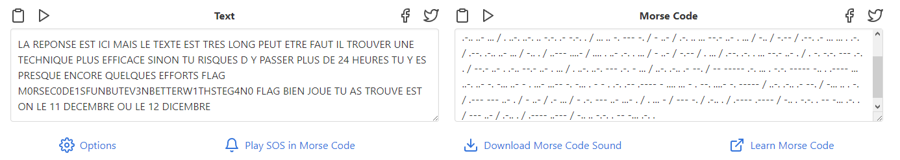

# Write-Up
> **title:** The Office
>
> **category:** Stéganographie
>
> **difficulty:** Moyen
>
> **point:** 50
>
> **author:**
>
> **description:**
>
> Dwight Schrute vous a envoyé un étrange mémo. Le texte a l'air de contenir des petits symboles, peut-être un résidu de ses années en tant qu'adjoint au shériff volontaire. Trouvez le message caché dans son mémo.
>
> *Explication du flag*
>
> Vous trouverez un texte, le flag est écrit dedans entre les mots `FLAG`. Par exemple, si vous trouvez le texte :
>
> ```
> CECI EST UN TEXTE EXEMPLE FLAG CH4LL3NGECYB3RN1GHT FLAG ET VOICI LA FIN DU TEXTE
> ```
>
> Le flag vous permettant de valider sera :
>
> ```
> CYBN{CH4LL3NGECYB3RN1GHT}
> ```

## Analyse du fichier

Dans le fichier, on peut trouver cela :

```
Thė Offıcē ıs an Ȧmerıcȧn mockumentãry sıtcom tėlevısīon serĩes
```

On peut observer 2 choses :
- Des accents étranges sont présents sur des caractères à des mauvais endroits
- Des accents ne sont pas à l'endroit où ils devraient l'être

Si l'on regarde mieux, les seuls accents présents sont **`. - ~ ˊ`**, on peut émettre l'hypothèse que **`. -`** servent pour du morse et que **`~ ˊ`** servent d'espace et de retour à la ligne.


## Transformation du texte

Petit script python pour retirer tous les caractères non-accentués puis transformer les restants en morse :

```python
# Récupération du fichier
with open('./dwight-k-schrute-memo.txt', encoding='utf-8') as f:
  text = f.read()

# Suppression des caractères non-accentués
chars_to_keep = 'ĪīāŌōēȦȮėȧȯĨẼÕĩÃõãẽíáóéij'
for c in text:
  text = text if c in chars_to_keep else text.replace(c, '')

# Transformations des caractères accentués en morse
chars_to_modify = {
  '-': 'ĪīāŌōē',
  '.': 'ȦȮėȧȯij',
  ' ': 'ĨẼÕĩÃõãẽ',
  '/': 'íáóé'
}
for k in chars_to_modify:
  for c in chars_to_modify[k]:
    text = text.replace(c, k)

print(text)
```

```
Output:
.-.. .- / .-. . .--. --- -. ... . / . ... - / .. -.-. .. / -- .- .. ... / .-.. . / - . -..- - . / . ... - / - .-. . ... / .-.. --- -. --. / .--. . ..- - / . - .-. . / ..-. .- ..- - / .. .-.. / - .-. --- ..- ...- . .-. / ..- -. . / - . -.-. .... -. .. --.- ..- . / .--. .-.. ..- ... / . ..-. ..-. .. -.-. .- -.-. . / ... .. -. --- -. / - ..- / .-. .. ... --.- ..- . ... / -.. / -.-- / .--. .- ... ... . .-. / .--. .-.. ..- ... / -.. . / ..--- ....- / .... . ..- .-. . ... / - ..- / -.-- / . ... / .--. .-. . ... --.- ..- . / . -. -.-. --- .-. . / --.- ..- . .-.. --.- ..- . ... / . ..-. ..-. --- .-. - ... / ..-. .-.. .- --. / -- ----- .-. ... . -.-. ----- -.. . .---- ... ..-. ..- -. -... ..- - . ...- ...-- -. -... . - - . .-. .-- .---- - .... ... - . --. ....- -. ----- / ..-. .-.. .- --. / -... .. . -. / .--- --- ..- . / - ..- / .- ... / - .-. --- ..- ...- . / . ... - / --- -. / .-.. . / .---- .---- / -.. . -.-. . -- -... .-. . / --- ..- / .-.. . / .---- ..--- / -.. .. -.-. . -- -... .-. .
```


## Décodage du morse

On ouvre un site qui permet de décoder le morse, ici **[morsedecoder.com](https://morsedecoder.com)**.



**Le flag : CYBN{M0RSEC0DE1SFUNBUTEV3NBETTERW1THSTEG4N0}**
