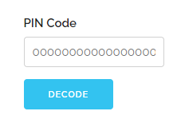
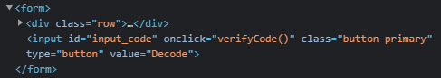


# Write-Up
> **title:** Coffre faible
>
> **category:** Web
>
> **difficulty:** Facile
>
> **point:** 25
>
> **author:** Pedro
>
> **description:**
>
> - Là, je vois pas d'autre solution que du bruteforce Francis...
> - T'es malade Hervé ?! Ça ferait plusieurs millions de millions de tentatives !
> - Des millions de millions ? Tu sais c'que c'est déjà un million Francis ?

## Analyse générale

On commence par regarder ce qui est attendu sur le site, on y voit un input demandant un code et un bouton pour valider celui-ci.



Si l'on regarde ce qu'il se passe en appuyant sur le bouton, on voit que la fonction **verifyCode()** est appelée.




## Analyse de la fonction verifyCode

Voici la fonction commentée pour l'expliquer :

```JS
function verifyCode(){

    // Récupère le code rentré dans l'input
    let input = document.getElementById("pinCodeInput").value
    let errorBox = document.getElementById("decoded")

    // Décode le secret avec notre input
    verdict = decode(encoded_secret, input);

    // Affiche le secret décodé
    errorBox.innerHTML = "<p>The decoded version is : " + verdict + "</p>"
}
```

Autrement dit, si l'on a le mauvais input, le secret sera mal décodé.

Attaquons nous alors à la fonction **decode()**.


## Analyse de la fonction decode

La fonction commentée encore une fois :

```JS
function decode(encoded_secret, passcode){
    decoded_secret = ""

    // Calcul un coefficient en fonction de notre input
    coeffs = getCoefficients(passcode)
    a = coeffs[0], b = coeffs[1], c = coeffs[2]

    for ( i = 2 ; i < encoded_secret.length + 2 ; i++ ){
        x = encoded_secret[i-2]

        // Utilise le coefficient pour décoder le secret
        x = x/(c*(a*i+b))
        if( (x < 32)){
            x = 33 //replace by '!' if the caracter is not printable
        }
        decoded_secret+=String.fromCharCode(x)
    }

    return(decoded_secret)
}
```

A priori, on va devoir jouer sur le coefficient pour tenter de déchiffrer le secret, regardons donc cette fameuse fonction **getCoefficients()**.


## Analyse de la fonction getCoefficients

La fonction :

```JS
function getCoefficients(passcode){
    return [
        passcode[7]**(passcode[12]*4) + 18,
        21*(passcode[12]**passcode[7] + 83),
        7*(passcode[7]**passcode[7]**passcode[12])
    ]
}
```

On voit qu'elle retourne un tableau de 3 valeurs, calculées uniquement avec passcode[7] et passcode[12].

On peut donc tenter de la bruteforce, cela fait seulement 100 combinaisons possibles.


## Bruteforce de verifyCode

On ouvre notre meilleure console JS sur le site pour ne pas avoir à recopier les fonctions, et l'on tente le bruteforce :

```JS
for (let i = 0; i <= 9; i++) {
    for (let j = 0; j <= 9; j++) {
        const decoded = decode(encoded_secret, [0,0,0,0,0,0,0,i,0,0,0,0,j,0,0,0,0,0,0,0])
        if (decoded.startsWith('CYBN')) console.log(i, j, decoded)
    }
}
```
```
Output: 2 5 'CYBN{P3dr0_alW4yS_lO0s3s_h1s_P4ssW0rDz_h4ha}'
```

On trouve alors le flag, tout code ayant un 2 à la 7ème place et 5 à la 12ème fonctionnera.

