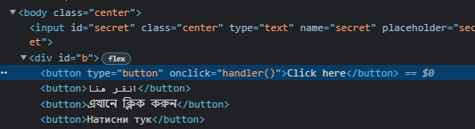
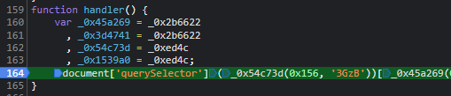
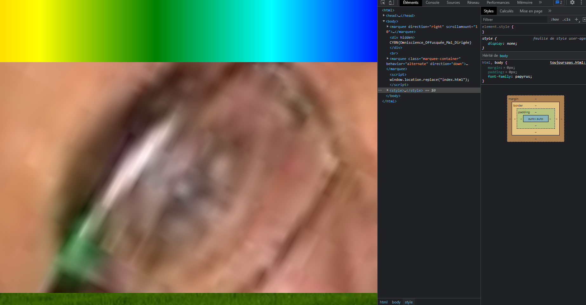

# Write-Up
> **title:** Obfuscation
>
> **category:** Web
>
> **difficulty:** Moyen
>
> **point:** 50
>
> **author:** Maltemo
>
> **description:**
>
> Le code javascript d’une page n’est pas toujours lisible, pour des raisons d’efficacité ou pour camoufler les action réalisées par celui-ci. Partez à l’aventure d’un code touffu dans le but de découvrir le secret qu’il renferme.

## Analyse générale

On commence par regarder ce qui est attendu sur le site, on y voit un input avec écrit **secret** à l'intérieur et énormément de bouton.



En regardant l'html, on voit que le bouton **Click here** appelle la fonction **handler()**. Essayons donc de la décortiquer.


## Analyse de la fonction handler

Voici la fonction :

```JS
function handler() {
    var _0x45a269 = _0x2b6622
      , _0x3d4741 = _0x2b6622
      , _0x54c73d = _0xed4c
      , _0x1539a0 = _0xed4c;
    document['querySelector'](_0x54c73d(0x156, '3GzB'))[_0x45a269(0x152)] === _0x45a269(0x151) && (window[_0x1539a0(0x15b, 'L&ER')][_0x45a269(0x167)] = _0x1539a0(0x16d, 'lnOn'));
}
```

On y voit une définition de plusieurs variables, sans doutes des fonctions au vu de la dernière ligne.

Mais ne cherchons pas à comprendre précisément l'ensemble du code directement, essayons déjà de voir ce qu'il fait.

Pour ça, on va exécuter les fonctions appelées par la dernière ligne une à une pour connaître leur retour. Pour ça on va le faire en dynamique, on place d'abord un breakpoint dans la fonction handler, juste avant la dernière ligne.



Puis on lance **handler()** en cliquant sur le bouton par exemple. On peut maintenant copier coller les fonctions dans la console pour connaître leur résultat.

```
_0x54c73d(0x156, '3GzB')
> '#secret'
```
```
_0x45a269(0x152)
> 'value'
```
```
_0x45a269(0x151)
> 'cecinestpaslapagedelasolution'
```
```
_0x1539a0(0x15b, 'L&ER')
> 'location'
```
```
_0x45a269(0x167)
> 'href'
```
```
_0x1539a0(0x16d, 'lnOn')
> 'toujourspas.html'
```

Remplaçons maintenant ces valeurs dans la dernière ligne pour comprendre ce qu'elle fait.

```JS
document['querySelector']('#secret')['value'] === 'cecinestpaslapagedelasolution' && (window['location']['href'] = toujourspas.html);
```


## Une autre page

On voit que si la valeur de notre input est 'cecinestpaslapagedelasolution', on est redirigé sur une autre page html. Malgré le nom, on peut toujours essayé, ça ne coûte que quelques secondes.

Une page s'ouvre et se referme aussi vite, avec à l'intérieur ceci :


Puisque la page charge, la redirection de celle-ci par du JS. Soit on désactive le JS du navigateur, soit on fait la requête via Postman, curl, wget ou autre.

Comme le site est magnifique, je le fait ici en désactivant le JS :


On y trouve notre flag dans l'html de la page en hidden : **CYBN{Omniscience_Offusquée_Mal_Dirigée}**
