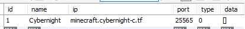
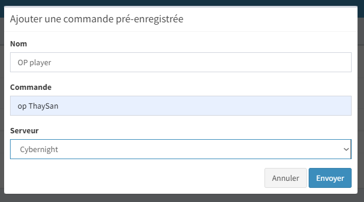


# Write-Up
> **title:** Remote Cube Execution 2/2
>
> **category:** Web
>
> **difficulty:** Insane
>
> **point:** 225
>
> **author:** MrSheepSheep
>
> **description:**
>
> Trouvez un moyen d'exécuter la commande /flag sur le serveur Minecraft.


## Prise d'empreintes

Avant toutes choses, le site utilise un CMS, CMS qui offre la possibilité d'utiliser des plugins, sachant qu'à la partie précédente, nous avons abusé du **link_ajax** pour récupérer un secret utilisé dans la liaison par défaut. La doc du CMS nous indique qu'il faut utiliser un plugin nommé **Mineweb-Bridge** pour ce type de liaison. Allons donc sur le serveur minecraft voir si le plugin y est :


**Les plugins sur le serveur :**


Si on tente de faire **`/flag`**, on voit qu'il faut être OP sur le serveur. Le plugin ne permettant pas de récupérer l'output d'une commande faite à distance, il faudra nous passer admin avec la commande **`/op <username>`** pour ensuite taper **`/flag`** directement depuis le jeu.

## Différentes façons de faire

Pour ce chall, on peut le faire par **au moins 2 approches** différentes :
- **Installer le CMS** en local et modifier sa config
- **Reverse le code** PHP

Je vais donc expliquer les deux façons de faire, l'une est plus simple, l'autre plus stylée (*à vous de voir de laquelle je parle*).


## Solution 1 : Reverse le code

Si l'on regarde dans le même fichier que **link_ajax** (*fonction à l'origine de la vulnérabilité exploitée dans la partie 1*), on peut y trouver d'autres fonctions utilisables par un admin, notamment : **send_command**.

```php
<?php
public function send_command($cmd, $server_id = false) {
    return $this->commands(array($cmd), $server_id);
}
```

Cette fonction prend un paramètre une **cmd** et l'**id d'un serveur** pour ensuite appeler la fonction **commands** avec. Allons voir cette fonction :

```php
<?php
public function commands($commands, $server_id = false)
{
    if (!is_array($commands)) {
        $this->User = ClassRegistry::init('User');
        $commands = str_replace('{PLAYER}', $this->User->getKey('pseudo'), $commands);
        $commands = explode('[{+}]', $commands);
    }
    $calls = [];
    foreach ($commands as $command)
        $calls[] = ['RUN_COMMAND' => $command];
    return $this->call($calls, $server_id);
}
```

On voit dans celle-ci que la première condition est ignorée, puisqu'on passe forcément un **array** avec **send_command**, regardons donc après.

On fait un  foreach où on remplie le tableau **calls**, bon a priori on ne passe qu'une commande, donc **calls** va systématiquement ressembler à quelque chose comme ça :

  ```php
  <?php
  Array (
    [0] => Array (
      ['RUN_COMMAND'] => $command
    )
  )
  ```

Enfin, la fonction **call()** est appelée avec notre tableau construit à l'instant et toujours l'id du serveur.

**Je ne vais pas montrer l'intégralité de la fonction call**, déjà parce qu'elle est **trop longue** et surtout parce que **c'est inutile**, 90% du code dedans n'est pas exécuté par notre appel. Si vous voulez voir pourquoi, vous la trouverez le fichier dans **files/ServerController.php** du repo. Petit aperçu quand même des conditions qui sont fausses et donc inutilisées :


**Bref**, ce qui intéresse c'est ce passage là :

```php
<?php
// plugin
$url = $this->getUrl($server_id);
$data = $this->encryptWithKey(json_encode($this->parse($methods)));

// request
list($return, $code, $error) = $this->request($url, $data);
```

On voit que l'on récupère l'**url du serveur** à partir de son **id**. Puis après avoir parsé **methods**, on le transforme en json et on chiffre (***methods** est le tableau **calls** qu'on a passé en paramètres de cette fonction*).


#### Trouver le body de la requête

Regardons la fonction **parse** :

```php
<?php
private function parse($methods)
{
    $result = array();
    foreach ($methods as $method) {
        if (!is_array($method)) {
            $result[] = array(
                'name' => $method,
                'args' => []
            );
            continue;
        }
        foreach ($method as $name => $args) {
            $result[] = array(
                'name' => $name,
                'args' => (is_array($args)) ? $args : [$args]
            );
        }
    }
    return $result;
}
```

Vu que **je n'aime pas PHP**, on ne va pas s'embêter à empiler des matrices de tête, on sort donc sa meilleure sandbox PHP en ligne (ici j'utilise **[sandbox.onlinephpfunctions](https://sandbox.onlinephpfunctions.com)**) et on rentre le code suivant pour émuler ce que fera le serveur s'il reçoit la commande "/op ThaySan".

Le **json_encode()** est utilisé juste avant de chiffrer dans la fonction **call**, donc on le fait pour savoir ce que ça nous donne dans un langage *compréhensible* et surtout pour savoir exactement ce qui va être chiffré.

```php
<?php
// Imitation du foreach qui rempli calls
$calls = [];
$calls[] = ['RUN_COMMAND' => "/op ThaySan"];

// Fonction parse (sans le if puisqu'il sera ignoré dans tous les cas)
$result = array();
foreach ($calls as $method) {
    foreach ($method as $name => $args) {
        $result[] = array(
            'name' => $name,
            'args' => (is_array($args)) ? $args : [$args]
        );
    }
}
print(json_encode($result));
```

```
Output: [{"name":"RUN_COMMAND","args":["/op ThaySan"]}]`
```


Il ne reste plus qu'à voir la fonction de chiffrement pour la partie data :

```php
<?php
private function encryptWithKey($data)
{
    if (!isset($this->key))
        $this->key = $this->configModel->find('first')['Configuration']['server_secretkey'];
    $iv_size = openssl_cipher_iv_length('aes-128-cbc'); // AES-128-CBC or  AES-256-CBC
    $iv = openssl_random_pseudo_bytes($iv_size);

    $data = $this->pkcs5_pad($data, 16);

    $signed = openssl_encrypt($data, 'aes-128-cbc', substr($this->key, 0, 16), OPENSSL_ZERO_PADDING, $iv);
    if ($signed === false)
        $this->log('Server: openssl_encrypt failed.');
    return json_encode(array('signed' => ($signed), 'iv' => base64_encode($iv)));
}
```

Bon, on voit que c'est de l'AES-128 en CBC, qu'on utilise un IV aléatoire et que la clé utilisée est celle récupérée dans la partie 1 du challenge, à savoir : **Uns3curexM1new3b**.

 Enfin, le tout est renvoyé sous format json. Pour être sûr de la tête qu'auront les données qui ressortent de cette fonction, on teste avec des valeurs bidons :

```php
<?php
print(json_encode(array('signed' => ("bidon_cipher"), 'iv' => base64_encode("bidon_iv"))));
```

```
Output: {"signed":"bidon_cipher","iv":"Ymlkb25faXY="}
```

**On connaît désormais la forme des data a envoyer au serveur !**


#### Trouver l'url de la requête

Tout à l'heure, on appelait la fonction **getUrl**, si on y jette un oeil :

```php
<?php
public function getUrl($server_id)
{
    if (empty($server_id)) return false;

    $config = $this->getConfig($server_id);
    if (!$config) return false;

    return 'http://' . $config['ip'] . ':' . $config['port'] . '/ask';
}
```

On voit que l'on fait une requête sur **`http://<host>:<port>/ask`**

Bon, pas besoin de farfouiller les schémas sql du CMS, on se doute que l'id du serveur correspond à celui présenté sur le site et que donc l'url est celle du serveur minecraft, ce qui nous donne : **`http://minecraft.cybernight-c.tf:25565/ask`**.


#### Envoie des données

On prend notre meilleur python, curl, Postman ou autre, et on fait le test :

1. Chiffrer les data


J'ai pris volontaire un IV arbitrairement simple pour ne pas se prendre la tête, on met tout ça dans POSTMAN avec la bonne forme:


Sauf que si on regarde sur le jeu : **rien**. Le problème est que sur la doc ça n'est pas précisé clairement, mais il ne faut pas que la commande commence par un **/**, on peut le deviner uniquement en voyant ceci :


On réssaie avec la commande **`op ThaySan`** :


Plus qu'à tenter la commande **`/flag`** sur le serveur :


On peut être content, on a notre **flag : CYBN{M1necRAfT_R3moTE_Kub_EX3cut1ioN#}**


## Solution 2 : Utilisation du CMS

L'autre façon de faire pour ceux qui ne sont pas fun, c'est installer le CMS et utiliser son interface. Ici je vais utiliser **WampServer** pour héberger localement le CMS. Vous aurez également besoin de SQL pour vous simplifier la vie.

On commence par extraire tout le **.zip** du CMS dans le dossier **/www** de Wamp.


Une fois le dossier complet, on lance la page web et on installe le CMS en suivant simplement les étapes. On commence par se connecter à la base de données etc...


Une fois votre CMS complétement installé, rendez-vous dans la base de données liées pour modifier les données enregistrées. On commence par la table **server**, on ajoute le serveur minecraft avec l'url **`minecraft.cybernight-c.tf`**, le port **`25565`** et le tout en type **`0`**.



Ensuite dans la table **configurations** on ajoute la **secretKey** **`Uns3curexM1new3b`**


Et enfin, direction **le panel administrateur** sur le compte admin que vous avez créé lors de l'installation. On va dans **commandes pré-enregistrées** et l'on ajoute notre commande **`op <username>`**.



On l'envoie et le tour est joué :


Plus qu'à tenter la commande **`/flag`** sur le serveur :


## Enjoy



