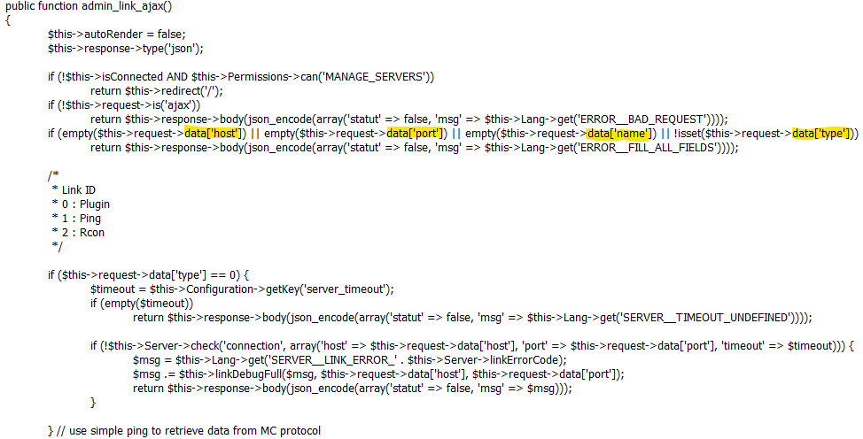


# Write-Up
> **title:** Remote Cube Execution 1/2
>
> **category:** Web
>
> **difficulty:** Difficile
>
> **point:** 225
>
> **author:** MrSheepSheep
>
> **description:**
>
> On vient d'installer notre super CMS pour notre serveur Minecraft PvP Faction Cracké Pay 2 Win !
>
> Trouvez la vulnérabilité sur le CMS permettant d'obtenir la clé secrète utilisée par le CMS pour communiquer avec le serveur Minecraft.
>
> Le flag est la clé secrète de 16 caractères.


# Analyse du site

On a un magnifique site dédié à un serveur Minecraft. Celui-ci est construit grâce au CMS **MineWeb** et on nous annonce une vulnérabilité dans celui-ci.


Première chose, essayer de trouver la version du CMS en question, heureusement en étant un peu curieux, on peut la trouver à la fin de l'html, **c'est la 1.10.2** :


# Etude du CMS

Comme la faille vient du CMS lui-même, on essaie de regarder son code pour la trouver, pour ça on va sur le site du CMS en question, et **on y trouve son GitHub avec l'ensemble des versions existantes dans les releases**.


Pour éviter de décortiquer tout le code, on peut être malin et regarder dans les versions ultérieures les patchs de sécurité effectués, ça nous donnera des pistes.

On découvre alors que dans la version suivante, **2 fichiers ont été modifiés** pour des raisons de **sécurité**.


# Analyse de la vulnérabilité

On voit que le code modifié correspond à la fonction **link_ajax** dans **ServerController.php** et que d'après la condition *ratée*, on peut l'exécuter sans être admin.

Que fait cette fonction ? On peut voir qu'elle peut, par exemple, faire un ping sur un **host** voulu et un **port** voulu.

```php
<?php
if ($this->request->data['type'] == 0) {
    $timeout = $this->Configuration->getKey('server_timeout');
    if (empty($timeout)) return $this->response->body(json_encode(array('statut' => false, 'msg' => $this->Lang->get('SERVER__TIMEOUT_UNDEFINED'))));

    // Tente de faire une connection sur le HOST:PORT
    if (!$this->Server->check('connection', array('host' => $this->request->data['host'], 'port' => $this->request->data['port'], 'timeout' => $timeout))) {
        $msg = $this->Lang->get('SERVER__LINK_ERROR_' . $this->Server->linkErrorCode);
        $msg .= $this->linkDebugFull($msg, $this->request->data['host'], $this->request->data['port']);
        return $this->response->body(json_encode(array('statut' => false, 'msg' => $msg)));
    }
}
?>
```

Maintenant voyons la fameuse fonction **check** de $this->Server->check. Elle se trouve dans **/Component/ServerComponent.php**, c'est dans le même dossier que /ServerController.php

On voit qu'une chose **très intéressante** est envoyée : **la clé secrète**.


```php
<?php
public function check($info, $value)
{
    if (empty($info) OR !is_array($value)) return false;

    $path = 'http://' . $value['host'] . ':' . $value['port'] . '/handshake';
    $data = json_encode(array(
        'secretKey' => substr($this->getSecretKey(), 0, 16),
        'domain' => Router::url('/', true)
    ));

    list($return, $code, $error) = $this->request($path, $data, $value['timeout']);

    [...]
?>
```

Bon, du coup on sait que si on exploite cette vulnérabilité, on peut récupérer la clé, maintenant **comment faire ?**

Il faut déjà savoir comment exécuter cette fonction, là c'est un peu tricky mais **on peut s'en sortir sans connaître CakePHP et en détestant PHP** (*la preuve j'ai réussi*).


## Trouver l'URL

Tout d'abord il faut savoir comment fonctionne CakePHP, qui est utilisé par ce CMS, heureusement en haut de notre ServerController.php, on a une info : `class ServerController extends AppController`.

C'est le début de la quête du Graal, direction **AppController.php**.

Dans AppController.php on trouve un lien vers CakePHP et son fonctionnement :


On apprend que les **Controller** sont liés aux **View** : *Controllers can be thought of as middle man between the Model and View*.

Direction le dossier **View** et tadaaa, un dossier **Server** qui correspondrait à notre **ServerController**. A l'intérieur, plusieurs fichiers dont un nommé **admin_link.php**


Si l'on jette un oeil à l'intérieur et qu'on **Ctrl+F link_ajax**, on tombe sur ça :

```php
<form action="<?= $this->Html->url(array('controller' => 'server', 'action' => 'link_ajax', 'admin' => true)) ?>" method="post" data-ajax="true">`
```

Encore de la magie noire proposé par CakePHP, allons donc chercher sur le web à quoi cela correspond. En tapant **cakephp controller url**, on tombe sur ça :


On apprend notamment que l'url est construite de cette façon : `/prefix/controller/action`.
On y apprend également que 'admin'=>true est un possible préfix (spoiler : s'en est un si vous allez vérifier dans /app/Config/core.php).

Notre url serait alors **/admin/server/link_ajax**, en **POST** (la méthode est écrite dans la ligne PHP que j'ai montrée plus haut).

Souvenons nous également que la requête doit être une **Ajax** (c'est à dire avoir un header *X-Requested-With: XMLHttpRequest*)

Et du body à envoyer en form-data (puisque c'était dans une balise `<form>`), c'était dans la fonction :
- host
- port
- name
- type



Plus qu'à tester et croiser les doigts.


## Exploitation de la vulnérabilité

Ici je vais utiliser Postman, ça serait moins galère avec Burp (ce que j'ai fait pendant le CTF) mais ça revient au même.

On oublie pas le **header** et **les champs dans le form-data** :


**On envoie et :**

```JSON
{
    "statut": false,
    "msg": "La connexion au serveur a échoué.La connexion au serveur a échoué.<br /><br /><i class=\"fa fa-times\"></i> Le port du serveur web semble fermé pour le pare-feu bloque la connexion.<br /><br /><i class=\"fa fa-times\"></i> Le port du serveur Minecraft semble fermé ou vous n'avez pas indiqué un bon couple d'IP/port."
}
```

**Ca fonctionne**, le serveur accepte la requête et tente de se connecter à un serveur. Maintenant il ne reste plus qu'à **intercepter** la **fameuse** clé secrète qu'il envoie à ce moment là. Pour ça on va créé un faux endpoint, vous pouvez le faire en démarrant un Flak ou Node sur votre ordi, puis en mappant un port de votre box dessus. Sinon on va sur **[RequestBin](https://requestbin.com)** comme un bon flemmard et on créé un nouveau endpoint (public si vous voulez éviter de créer un compte).


Maintenant on envoie au serveur Minecraft **notre endpoint en tant qu'host, sur le port 80** (443 ne passe pas)


Et **magie**, la réponse du serveur :

```JSON
{
    "statut": true,
    "msg": "La connexion au serveur a bien été établie !"
}
```

Et sur notre endpoint :


On reçoit la secretKey, on a notre **flag : CBYN{Uns3curexM1new3b}**

