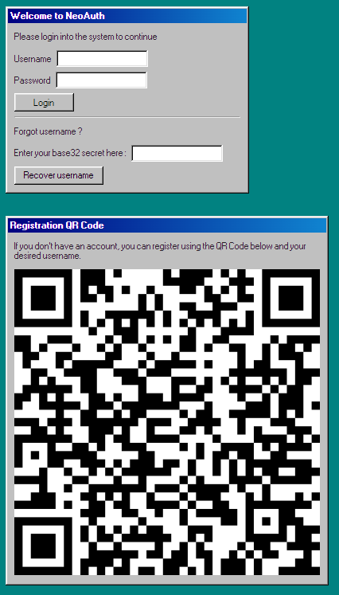
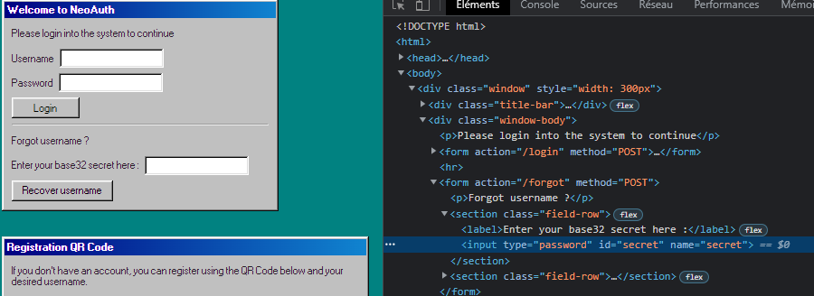
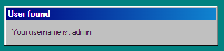
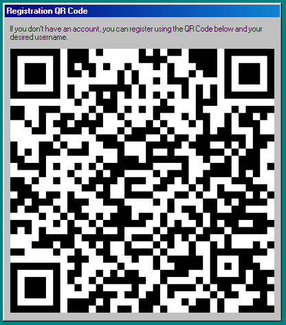
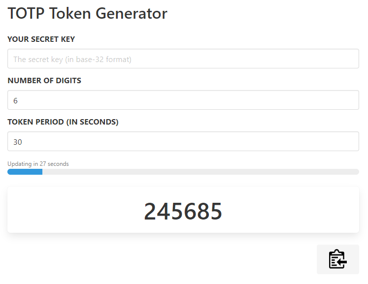
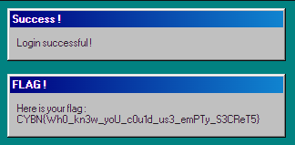


# Write-Up
> **title:** TOTP
>
> **category:** Web
>
> **difficulty:** Moyen
>
> **point:** 75
>
> **author:** MrSheepSheep
>
> **description:**
>
> Nous avons implémenté un nouveau système d'authentification appelé "NeoAuth", extrêmement robuste, basé sur les TOTP.
>
> Débrouillez-vous pour vous connecter en tant que "admin".


## Analyse du site

Sur le site, on peut observer 3 zones :
- La connexion
- L'oublie de username
- La création de compte

Deux choses ne sont pas communes :
- on peut récupérer son username avec un secret
- on peut se créer un compte avec un QRCode




## Abus de l'oubli du username

On peut voir que pour récupérer un username, **il faut entrer son secret**.

Le champs est **required** donc on ne peut tester avec un champs vide.

Premier réflexe donc ? **Tester avec un champs vide**.

Pour ça on peut simplement dégager le **required** par exemple :



Et l'on envoie le formulaire :



**Bingo**, on vient de découvrir que **admin** utilise un secret vide.

Maintenant il faut savoir quoi faire de ce secret, pour ça je vais détailler dans la partie suivante comment fonctionne TOTP, si vous avez la flemme, passez cette partie explication.


## Fonctionnement de TOTP

TOTP est un dérivé de HOTP, signifiant HMAC-Based One Time Password. Ici tout sera expliqué en Python car c'est très lisible et simple.

Comment ça fonctionne :

On a besoin de 4 paramètres : le **secret en base 32**, le **nombre de chiffre**, la **période de validité en seconde** et le **timestamp actuel**.

> Pour l'exemple, on va prendre :
> - secret = "JBSWY3DPEHPK3PXP"
> - digits = 6
> - period = 30
> - timestamp = 1639504595

#### Première étape :

Calculer le **counter**, c'est simplement le timestamp actuel divisé par la période arrondi à l'inférieur : `floor(timestamp/period)`

> counter = floor(1639504595/30) = 54650153


#### Seconde étape :

Calculer le **hash** en faisant un HMAC-SHA1 où la clé est le secret décodé et le message est le counter : `HMAC-SHA1(base32_decode(secret), counter)`

> decoded_secret = base32_decode("JBSWY3DPEHPK3PXP") = 48656c6c6f21deadbeef
>
> hash = HMAC-SHA1(48656c6c6f21deadbeef, 54650153) = e709385ab53f115f0b52c60e3757e63a69a94cea

 #### Troisième étape :

Appliquer la fonction de **troncage**, elle consiste à :
- Prendre les 4 derniers bits de notre hash, on appelle la valeur de ces bits **offset**.
- Récupérer 4 octets consécutifs de notre hash à partir de cet **offset**, que l'on notera **dbc** (pour Dynamic Binary Code).
- Retirer le premier bit de **dbc** pour n'en avoir plus que 31.
- Appliquer le modulo **10 puissance digits**  pour avoir le bon nombre de chiffres, ceci est notre **code TOTP**.

> ```
> hash = e709385ab53f115f0b52c60e3757e63a69a94cea
>   -------------------------------------------------------------
>   |00|01|02|03|04|05|06|07|08|09|10|11|12|13|14|15|16|17|18|19|
>   -------------------------------------------------------------
>   |e7|09|38|5a|b5|3f|11|5f|0b|52|c6|0e|37|57|e6|3a|69|a9|4c|ea|
>   -------------------------------***********-----------------^|
> offset = a = 10 (le "^" sur la ligne au dessus)
> dbc = c60e3757 (les "*")
> dbc_31 = 460e3757 (base 16) = 1175336791 (base 10)
> code = 1175336791 % (10^6) = 336791
> ```


#### Fonction en python :

Voici un code python qui permet de générer un code en passant en paramètre uniquement le secret en base32, le nombre de chiffres et la période.

```python
import math, time, hmac, struct
from hashlib import sha1
from base64 import b32decode

def TOTP(secret, digits, period, timestamp=time.time()):
    hash = hmac.new(b32decode(secret), struct.pack(">Q", math.floor(timestamp / period)), sha1).digest()
    offset = hash[-1] & 0xf
    dbc = struct.unpack(">I", hash[offset:offset+4])[0]
    dbc_31 = dbc & 0x7fffffff
    code = dbc_31 % 10**digits
    return code
```


## Se faire passer pour l'admin

On a le secret (**qui est donc vide**), pour ceux qui ont zappé les explications, il nous faut également connaître le nombre de chiffre du code et sa période de validité. Pour ça rien de plus simple, on a un QRCode qui nous dit tout.

Un exemple avec celui-là :



En allant sur **[zxing](https://zxing.org)** on décode le QRCode, ce qui nous donne :
`otpauth://totp/CYBNCTF?secret=AVANEJ5OLADQ4GG6TQXHGPAJ6KWPFYQ5&algorithm=SHA1&digits=6&period=30`

On apprend que **digits=6** et **period=30**.

Maintenant plus qu'à générer le code, pour ça soit on utilise mon script, soit un site tout fait, tout beau, tout propre : **[totp.danhersam](https://totp.danhersam.com)**.



On se connecte au site avec le combo **admin**/**245685**.



**Flag : CYBN{Wh0_kn3w_yoU_c0u1d_us3_emPTy_S3CReT5}**

