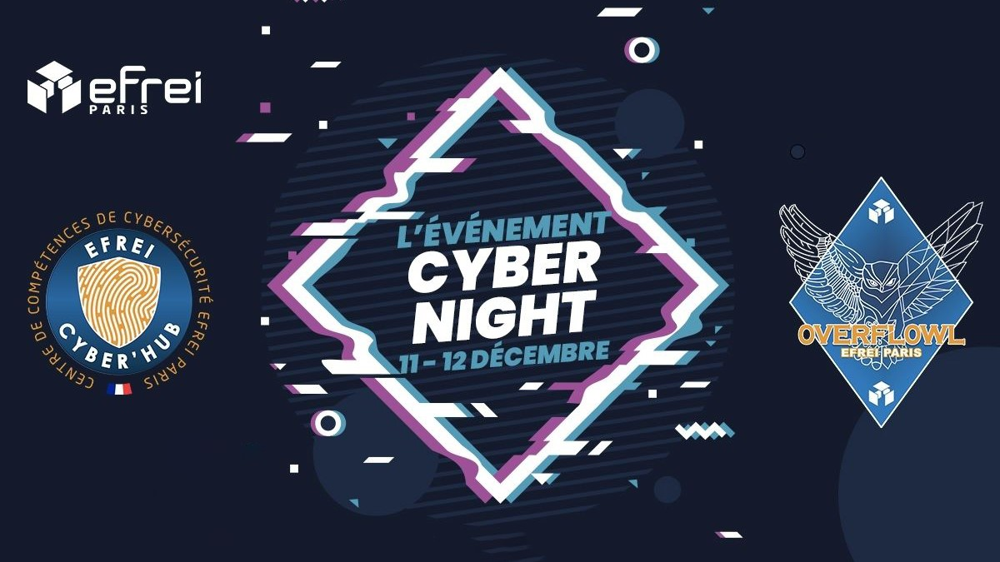

# EFREI-CyberNight 2021

Du 11 au 12 décembre, près de 200 étudiants de l’Efrei participeront à la CyberNight, un rendez-vous unique de la cybersécurité sur le campus.

Quel que soit le niveau académique ou la formation, la cyber s’adresse à tous les étudiants du numérique. Afin de sensibiliser tous les étudiants de l’école et de faire émerger les meilleurs talents en la matière, l’Efrei organise une CyberNight du samedi 11 décembre dès 14h jusqu’au dimanche 12 décembre à 9h du matin.

Au cours de cet événement marathon, les étudiants de l’école participeront à des challenges en cyber, assisteront à des conférences ou à des démos techniques et se formeront, en groupe, aux techniques de pentest (test d’intrusion). La CyberNight Efrei vise deux objectifs majeurs. En premier lieu, et dans la mesure où la cybersécurité est l’affaire de tous les professionnels du numérique, une telle opération permet de sensibiliser et de former aux bons réflexes cyber. Ensuite, les épreuves proposées permettront d’identifier les meilleurs étudiants cyber de l’école. Ils rejoindront l’équipe cyber étudiante de l’Efrei et participeront, durant une année entière, à des compétitions proposées par des organismes extérieurs à l’école (Le Hack, Le FIC,…).

## Cryptographie
- [Burp](/writeups/CYBN_2021/Cryptographie/Burp/)
- [Cicéron](/writeups/CYBN_2021/Cryptographie/Cic%C3%A9ron/)
- [Golden Cipher](/writeups/CYBN_2021/Cryptographie/Golden%20Cipher/)
- [RSAPeiNeLiSiBle](/writeups/CYBN_2021/Cryptographie/RSAPeiNeLiSiBle/)
- [Simple Basique](/writeups/CYBN_2021/Cryptographie/Simple%20Basique/)
- [Smiley😃](/writeups/CYBN_2021/Cryptographie/Smiley%F0%9F%98%83/)
- [WeirdVigenere](/writeups/CYBN_2021/Cryptographie/WeirdVigenere/)

## Hardware
- [Hardware to hell](/writeups/CYBN_2021/Hardware/Hardware%20to%20hell/)
- [LightDec](/writeups/CYBN_2021/Hardware/LightDec/)
- [What a waterfall](/writeups/CYBN_2021/Hardware/What%20a%20waterfall/)

## Misc
- [Fucking Degenerates](/writeups/CYBN_2021/Misc/Fucking%20Degenerates/)
- [hackthebox](/writeups/CYBN_2021/Misc/hackthebox/)
- [hexcompiler](/writeups/CYBN_2021/Misc/hexcompiler/)
- [Send Meme](/writeups/CYBN_2021/Misc/Send%20Meme/)
- [Survey](/writeups/CYBN_2021/Misc/Survey/)
- [Switch](/writeups/CYBN_2021/Misc/Switch/)

## Reverse
- [Crackme](/writeups/CYBN_2021/Reverse/Crackme/)
- [Crackme2](/writeups/CYBN_2021/Reverse/Crackme2/)
- [revMeBaby](/writeups/CYBN_2021/Reverse/revMeBaby/)

## Stéganographie
- [Evil Mondrian](/writeups/CYBN_2021/St%C3%A9ganographie/Evil%20Mondrian/)
- [Jakads](/writeups/CYBN_2021/St%C3%A9ganographie/Jakads/)
- [LoremIpsum_v2](/writeups/CYBN_2021/St%C3%A9ganographie/LoremIpsum_v2/)
- [Now you mew me 🐱](/writeups/CYBN_2021/St%C3%A9ganographie/Now%20you%20mew%20me%20%F0%9F%90%B1/)
- [Pandora Box](/writeups/CYBN_2021/St%C3%A9ganographie/Pandora%20Box/)
- [The Office](/writeups/CYBN_2021/St%C3%A9ganographie/The%20Office/)

## Web
- [Coffre faible](/writeups/CYBN_2021/Web/Coffre%20faible/)
- [Obfuscation](/writeups/CYBN_2021/Web/Obfuscation/)
- [Remote Code Execution](/writeups/CYBN_2021/Web/Remote%20Cube%20Execution/)
- [Remote Code Execution 2](/writeups/CYBN_2021/Web/Remote%20Cube%20Execution%202/)
- [TOTP](/writeups/CYBN_2021/Web/TOTP/)
- [XANA](/writeups/CYBN_2021/Web/XANA/)
