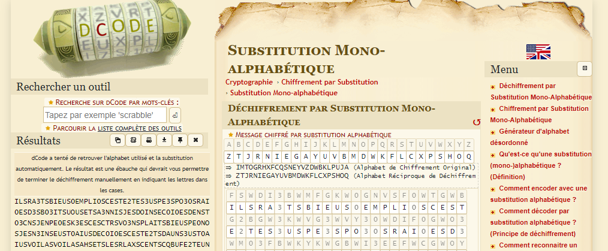
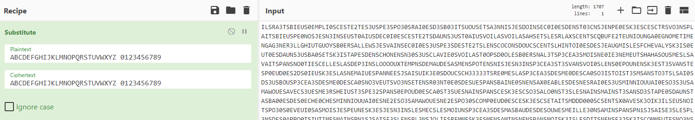


> **title:** ExFILEtration
>
> **category:** Cryptography
>
> **difficulty:** Difficile
>
> **point:** 100
>
> **author:** Maestran
>
> **description:**
>
> Il peut y avoir plusieurs manières de cacher de l'information, mais la méthode de chiffrement reste toujours importante !
>
> 

## Solution

Il fallait remarquer plusieurs choses :
- Tous les fichiers contiennent un hexadécimal de 64 caractères. Avec quelques recherches de ceux-ci sur internet on ne tombe sur rien donc mauvaise piste.
- Tous les noms de fichiers commencent par un nombre allant de 0 à 41
- Tous les noms de fichiers sont composés d'extensions

Pour commencer, on va mettre toutes les extensions dans les noms de fichiers à la suite et dans le bon ordre selon le numéro par lequel le nom commence :

```python
# Liste des fichiers du challenge
files = listdir(r"./chall")

# Assemblage de toutes les extensions dans l'ordre
filenames = [None]*len(files)
for file in files:
	n, *data = file.split('.')
	filenames[int(n)] = data
extensions = [j for i in filenames for j in i]
print(extensions)

# ['wav', 'deb', 'sql', 'doc', 'exe', 'pdf', 'zip', 'sql', 'dmp', 'wav', 'mp4', 'bin', 'sql', 'txt', 'mp4', 'obj', 'dat', 'deb', 'wav', 'txt', 'sql', 'png', 'mp4', 'sql', 'zip', 'mp4', 'sys', 'zip', 'mp4', 'sql', 'pdf', 'bin', 'sql', 'dat', 'mp4', 'pdf', 'sql', 'dat', 'rar', 'pdf', 'txt', 'sql', 'doc', 'exe', 'wav', 'txt', 'mp4', 'sql', 'arm', 'pdf', 'sql', 'dmp', 'txt', 'pdf', 'wav', 'zip', 'sql', 'bin', 'rar', 'bin', 'sql', 'mp4', 'zip', 'sql', 'exe', 'pdf', 'odt', 'odt', 'wav', 'sql', 'ppt', 'mp4', 'sql', 'arm', 'rar', 'wav', 'odt', 'sql', 'mp4', 'png', 'txt', 'wav', 'txt', 'mp4', 'sql', 'arm', 'mp4', 'odt', 'sql', 'zip', 'txt', 'pdf', 'png', 'odt', 'sql', 'ppt', 'mp4', 'odt', 'dat', 'mp4', 'txt', 'mp4', 'sql', 'gif', 'pdf', 'mp4', 'sql', 'png', 'mp4', 'sql', 'png', 'zip', 'doc', 'sql', 'apk', 'rar', 'pdf', 'odt', 'sql', 'dat', 'deb', 'exe', 'wav', 'zip', 'sql', 'dmp', 'wav', 'mp4', 'bin', 'sql', 'dat', 'mp4', 'txt', 'odt', 'rar', 'sql', 'ppt', 'mp4', 'sql', 'odt', 'pdf', 'wav', 'odt', 'sql', 'mp4', 'bin', 'sql', 'zip', 'txt', 'exe', 'wav', 'bin', 'sql', 'arm', 'mp4', 'png', 'txt', 'wav', 'txt', 'mp4', 'sql', 'png', 'mp4', 'sql', 'zip', 'mp4', 'sys', 'zip', 'sql', 'arm', 'exe', 'bin', 'odt', 'sql', 'pdf', 'bin', 'sql', 'zip', 'txt', 'exe', 'wav', 'bin', 'sql', 'apk', 'rar', 'wav', 'deb', 'exe', 'sql', 'apk', 'rar', 'wav', 'deb', 'exe', 'sql', 'exe', 'jpg', 'sql', 'mp4', 'zip', 'sql', 'deb', 'mp4', 'sql', 'doc', 'deb', 'exe', 'elf', 'sql', 'png', 'mp4', 'odt', 'zip', 'sql', 'png', 'lua', 'dmp', 'bin', 'open', 'mp4', 'sys', 'zip', 'mp4', 'bin', 'odt', 'wav', 'rar', 'bin', 'odt', 'under', 'exe', 'txt', 'mp4', 'under', 'odt', 'rar', 'obj', 'mp4', 'zip', 'wav', 'obj', 'mp4', 'odt', 'under', 'exe', 'under', 'pdf', 'odt', 'mp4', 'doc', 'pdf', 'deb', 'deb', 'under', 'jpg', 'wav', 'bin', 'zip', 'under', 'bin', 'rar', 'close', 'sql', 'dmp', 'txt', 'mp4', 'doc', 'sql', 'exe', 'deb', 'deb', 'mp4', 'iso', 'sql', 'ppt', 'mp4', 'sql', 'apk', 'exe', 'wav', 'odt', 'sql', 'mp4', 'png', 'txt', 'wav', 'txt', 'mp4', 'sql', 'pdf', 'bin', 'sql', 'dat', 'mp4', 'pdf', 'sql', 'arm', 'mp4', 'sql', 'zip', 'mp4', 'sys', 'zip', 'sql', 'deb', 'mp4', 'odt', 'sql', 'png', 'rar', 'png', 'rar', 'odt', 'sql', 'arm', 'rar', 'bin', 'png', 'sql', 'png', 'mp4', 'odt', 'zip', 'sql', 'deb', 'jpg', 'wav', 'odt', 'zip', 'rar', 'wav', 'txt', 'mp4', 'sql', 'arm', 'mp4', 'sql', 'ppt', 'mp4', 'exe', 'bin', 'under', 'obj', 'wav', 'sql', 'deb', 'mp4', 'sql', 'open', 'png', 'jpg', 'mp4', 'apk', 'exe', 'deb', 'close', 'sql', 'gif', 'pdf', 'wav', 'sql', 'txt', 'mp4', 'bin', 'zip', 'txt', 'mp4', 'sql', 'arm', 'exe', 'bin', 'odt', 'sql', 'pdf', 'bin', 'sql', 'dmp', 'exe', 'txt', 'sql', 'mp4', 'zip', 'sql', 'gif', 'pdf', 'wav', 'sql', 'zip', 'exe', 'dat', 'mp4', 'sql', 'arm', 'mp4', 'odt', 'sql', 'png', 'jpg', 'rar', 'odt', 'mp4', 'odt', 'sql', 'odt', 'pdf', 'txt', 'sql', 'pdf', 'bin', 'sql', 'png', 'deb', 'exe', 'apk', 'wav', 'mp4', 'txt', 'sql', 'apk', 'rar', 'wav', 'deb', 'exe', 'sql', 'zip', 'txt', 'rar', 'dat', 'sql', 'arm', 'txt', 'rar', 'deb', 'mp4', 'sql', 'dmp', 'txt', 'mp4', 'doc', 'sql', 'odt', 'exe', 'deb', 'pdf', 'zip', 'sql', 'dat', 'pdf', 'png', 'mp4', 'exe', 'pdf', 'sql', 'obj', 'rar', 'wav', 'sql', 'odt', 'mp4', 'txt', 'wav', 'mp4', 'pdf', 'odt', 'mp4', 'obj', 'mp4', 'bin', 'zip', 'sql', 'jpg', 'exe', 'jpg', 'exe', 'sql', 'rar', 'bin', 'sql', 'obj', 'mp4', 'sql', 'deb', 'sql', 'exe', 'apk', 'exe', 'wav', 'zip', 'sql', 'dat', 'exe', 'odt', 'sql', 'odt', 'rar', 'txt', 'zip', 'wav', 'mp4', 'sql', 'png', 'mp4', 'deb', 'deb', 'mp4', 'sql', 'deb', 'exe', 'sql', 'arm', 'mp4', 'dat', 'pdf', 'wav', 'odt', 'sql', 'deb', 'rar', 'rar', 'rar', 'rar', 'bin', 'elf', 'zip', 'mp4', 'obj', 'dat', 'odt', 'sql', 'arm', 'mp4', 'obj', 'exe', 'bin', 'arm', 'mp4', 'sql', 'exe', 'sql', 'obj', 'mp4', 'odt', 'sql', 'dat', 'rar', 'zip', 'mp4', 'odt', 'sql', 'odt', 'wav', 'sql', 'ppt', 'mp4', 'sql', 'odt', 'pdf', 'wav', 'odt', 'sql', 'dat', 'pdf', 'png', 'mp4', 'exe', 'pdf', 'sql', 'zip', 'pdf', 'sql', 'apk', 'exe', 'odt', 'sql', 'apk', 'rar', 'wav', 'txt', 'sql', 'deb', 'mp4', 'odt', 'sql', 'txt', 'mp4', 'dat', 'rar', 'bin', 'odt', 'mp4', 'odt', 'sql', 'gif', 'pdf', 'mp4', 'sql', 'zip', 'pdf', 'sql', 'apk', 'exe', 'odt', 'sql', 'zip', 'mp4', 'sql', 'dat', 'txt', 'mp4', 'bin', 'arm', 'txt', 'mp4', 'sql', 'sys', 'arm', 'sql', 'txt', 'wav', 'mp4', 'bin', 'sql', 'gif', 'pdf', 'mp4', 'sql', 'deb', 'exe', 'sql', 'odt', 'mp4', 'obj', 'exe', 'wav', 'bin', 'mp4', 'sql', 'dat', 'exe', 'odt', 'odt', 'mp4', 'mp4', 'sql', 'ppt', 'sql', 'exe', 'wav', 'sql', 'bin', 'wav', 'gif', 'pdf', 'mp4', 'txt', 'sql', 'arm', 'rar', 'bin', 'png', 'sql', 'png', 'jpg', 'pdf', 'pdf', 'pdf', 'pdf', 'pdf', 'zip', 'sql', 'doc', 'mp4', 'txt', 'obj', 'mp4', 'sql', 'deb', 'exe', 'sql', 'dat', 'pdf', 'png', 'mp4', 'exe', 'pdf', 'sql', 'arm', 'mp4', 'sql', 'obj', 'mp4', 'txt', 'arm', 'mp4', 'sql', 'png', 'exe', 'txt', 'sql', 'rar', 'pdf', 'wav', 'sql', 'zip', 'rar', 'wav', 'sql', 'zip', 'pdf', 'sql', 'obj', 'sql', 'exe', 'odt', 'sql', 'zip', 'rar', 'pdf', 'zip', 'sql', 'deb', 'sql', 'exe', 'wav', 'txt', 'sql', 'arm', 'sql', 'pdf', 'bin', 'sql', 'dmp', 'rar', 'bin', 'sql', 'dat', 'pdf', 'png', 'mp4', 'exe', 'pdf', 'sql', 'arm', 'mp4', 'sql', 'obj', 'mp4', 'txt', 'arm', 'mp4', 'sql', 'png', 'exe', 'txt', 'sql', 'odt', 'rar', 'pdf', 'apk', 'mp4', 'bin', 'zip', 'sql', 'apk', 'rar', 'pdf', 'odt', 'sql', 'mp4', 'zip', 'mp4', 'odt', 'sql', 'doc', 'txt', 'pdf', 'odt', 'zip', 'txt', 'mp4', 'txt', 'sql', 'arm', 'mp4', 'sql', 'bin', 'mp4', 'sql', 'dat', 'exe', 'odt', 'sql', 'dmp', 'exe', 'wav', 'odt', 'mp4', 'txt', 'sql', 'odt', 'mp4', 'odt', 'sql', 'exe', 'elf', 'txt', 'mp4', 'exe', 'dmp', 'deb', 'mp4', 'sql', 'arm', 'mp4', 'sql', 'odt', 'mp4', 'sql', 'doc', 'exe', 'wav', 'txt', 'mp4', 'sql', 'pdf', 'bin', 'sql', 'obj', 'wav', 'odt', 'odt', 'wav', 'rar', 'bin', 'bin', 'exe', 'wav', 'txt', 'mp4', 'sql', 'rar', 'pdf', 'sql', 'pdf', 'bin', 'sql', 'exe', 'obj', 'exe', 'iso', 'rar', 'bin', 'mp4', 'sql', 'exe', 'apk', 'mp4', 'png', 'sql', 'pdf', 'bin', 'mp4', 'sql', 'obj', 'mp4', 'pdf', 'doc', 'sql', 'jpg', 'mp4', 'wav', 'bin', 'sql', 'zip', 'pdf', 'sql', 'dat', 'mp4', 'pdf', 'sys', 'sql', 'dat', 'exe', 'odt', 'sql', 'txt', 'mp4', 'dat', 'rar', 'bin', 'arm', 'txt', 'mp4', 'sql', 'png', 'exe', 'txt', 'sql', 'zip', 'pdf', 'sql', 'bin', 'mp4', 'sql', 'odt', 'exe', 'wav', 'odt', 'sql', 'dat', 'exe', 'odt', 'sql', 'png', 'mp4', 'sql', 'gif', 'pdf', 'mp4', 'sql', 'png', 'sql', 'rar', 'pdf', 'sql', 'exe', 'deb', 'rar', 'txt', 'odt', 'sql', 'zip', 'pdf', 'sql', 'deb', 'mp4', 'sql', 'odt', 'exe', 'wav', 'odt', 'sql', 'obj', 'exe', 'wav', 'odt', 'sql', 'zip', 'pdf', 'sql', 'exe', 'odt', 'sql', 'arm', 'pdf', 'sql', 'zip', 'exe', 'dat', 'mp4', 'txt', 'sql', 'arm', 'exe', 'bin', 'odt', 'sql', 'zip', 'exe', 'sql', 'dmp', 'exe', 'txt', 'txt', 'mp4', 'sql', 'arm', 'mp4', 'sql', 'txt', 'mp4', 'png', 'jpg', 'mp4', 'txt', 'png', 'jpg', 'mp4', 'sql', 'obj', 'wav', 'odt', 'odt', 'wav', 'rar', 'bin', 'bin', 'exe', 'wav', 'txt', 'mp4', 'sql', 'odt', 'mp4', 'sys', 'mp4', 'sql', 'rar', 'pdf', 'sql', 'exe', 'obj', 'exe', 'iso', 'rar', 'bin', 'mp4', 'sql', 'odt', 'mp4', 'sys', 'mp4', 'sql', 'dat', 'rar', 'pdf', 'txt', 'sql', 'png', 'rar', 'obj', 'dat', 'txt', 'mp4', 'bin', 'arm', 'txt', 'mp4', 'sql', 'png', 'mp4', 'sql', 'gif', 'pdf', 'mp4', 'sql', 'png', 'sql', 'mp4', 'zip', 'exe', 'wav', 'zip', 'sql', 'obj', 'arm', 'arm', 'arm', 'txt', 'txt', 'txt', 'sql', 'png', 'sql', 'mp4', 'odt', 'zip', 'sql', 'elf', 'txt', 'exe', 'apk', 'mp4', 'sql', 'gif', 'pdf', 'rar', 'wav', 'gif', 'pdf', 'wav', 'deb', 'sql', 'mp4', 'bin', 'sql', 'odt', 'rar', 'wav', 'zip', 'sql', 'dat', 'rar', 'pdf', 'txt', 'sql', 'txt', 'mp4', 'apk', 'mp4', 'bin', 'wav', 'txt', 'sql', 'exe', 'sql', 'obj', 'rar', 'wav', 'sql', 'ppt', 'mp4', 'sql', 'dat', 'mp4', 'bin', 'odt', 'mp4', 'sql', 'gif', 'pdf', 'mp4', 'sql', 'ppt', 'mp4', 'sql', 'odt', 'pdf', 'wav', 'odt', 'sql', 'deb', 'mp4', 'sql', 'obj', 'mp4', 'png', 'sql', 'deb', 'mp4', 'sql', 'obj', 'rar', 'wav', 'bin', 'odt', 'sql', 'dat', 'pdf', 'png', 'mp4', 'exe', 'pdf', 'sql', 'arm', 'mp4', 'sql', 'obj', 'exe', 'sql', 'dmp', 'exe', 'bin', 'arm', 'mp4', 'sql', 'arm', 'mp4', 'sql', 'rar', 'bin', 'iso', 'mp4', 'sql', 'obj', 'mp4', 'wav', 'deb', 'deb', 'mp4', 'pdf', 'txt', 'odt', 'sql', 'exe', 'obj', 'wav', 'odt', 'sql', 'dat', 'exe', 'odt', 'sql', 'dat', 'odt', 'dll', 'sql', 'ppt', 'sql', 'exe', 'wav', 'sql', 'mp4', 'pdf', 'sql', 'deb', 'mp4', 'sql', 'dat', 'deb', 'pdf', 'odt', 'sql', 'arm', 'mp4', 'sql', 'txt', 'exe', 'dat', 'dat', 'rar', 'txt', 'zip', 'sql', 'wav', 'bin', 'zip', 'wav', 'obj', 'mp4', 'sql', 'obj', 'exe', 'wav', 'odt', 'sql', 'dat', 'odt', 'dll', 'sql', 'ppt', 'sql', 'exe', 'wav', 'sql', 'mp4', 'pdf', 'sql', 'deb', 'mp4', 'odt', 'sql', 'dat', 'deb', 'pdf', 'odt', 'sql', 'ppt', 'rar', 'deb', 'wav', 'mp4', 'sql', 'doc', 'mp4', 'obj', 'obj', 'mp4', 'sql', 'gif', 'pdf', 'mp4', 'sql', 'obj', 'mp4', 'odt', 'sql', 'exe', 'obj', 'wav', 'odt', 'sql', 'odt', 'mp4', 'odt', 'sql', 'dat', 'exe', 'odt', 'sql', 'obj', 'rar', 'wav', 'sql', 'gif', 'pdf', 'wav', 'sql', 'deb', 'mp4', 'sql', 'arm', 'wav', 'zip', 'sql', 'odt', 'mp4', 'odt', 'sql', 'mp4', 'pdf', 'sys', 'sql', 'gif', 'pdf', 'wav', 'sql', 'png', 'rar', 'obj', 'obj', 'mp4', 'bin', 'zip', 'mp4', 'sql', 'odt', 'rar', 'pdf', 'odt', 'sql', 'obj', 'mp4', 'odt', 'sql', 'dat', 'jpg', 'rar', 'zip', 'rar', 'odt', 'sql', 'wav', 'bin', 'odt', 'zip', 'exe', 'sql', 'zip', 'txt', 'rar', 'dat', 'sql', 'dmp', 'mp4', 'deb', 'deb', 'mp4', 'sql', 'deb', 'exe', 'sql', 'doc', 'wav', 'deb', 'deb', 'mp4', 'sql', 'gif', 'pdf', 'mp4', 'sql', 'zip', 'pdf', 'sql', 'exe', 'odt', 'sql', 'png', 'rar', 'pdf', 'png', 'jpg', 'mp4', 'txt', 'sql', 'exe', 'apk', 'mp4', 'png', 'sql', 'jpg', 'wav', 'mp4', 'txt', 'sql', 'mp4', 'bin', 'sql', 'dmp', 'rar', 'wav', 'zip', 'mp4', 'sql', 'bin', 'rar', 'zip', 'exe', 'obj', 'obj', 'mp4', 'bin', 'zip', 'sql', 'arm', 'rar', 'bin', 'png', 'sql', 'exe', 'dat', 'txt', 'mp4', 'odt', 'sql', 'odt', 'wav', 'sql', 'zip', 'pdf', 'sql', 'apk', 'mp4', 'pdf', 'sys', 'sql', 'gif', 'pdf', 'mp4', 'sql', 'odt', 'exe', 'sql', 'dat', 'exe', 'txt', 'zip', 'mp4', 'sql', 'dat', 'deb', 'pdf', 'odt', 'sql', 'deb', 'rar', 'wav', 'sql', 'odt', 'exe', 'sql', 'dat', 'mp4', 'pdf', 'zip', 'sql', 'dat', 'exe', 'txt', 'zip', 'wav', 'txt', 'sql', 'apk', 'txt', 'exe', 'wav', 'obj', 'mp4', 'bin', 'zip', 'sql', 'deb', 'rar', 'wav', 'sql', 'ppt', 'sql', 'jpg', 'exe', 'dmp', 'wav', 'zip', 'mp4', 'sql', 'arm', 'exe', 'bin', 'odt', 'sql', 'deb', 'exe', 'sql', 'dmp', 'exe', 'bin', 'deb', 'wav', 'mp4', 'pdf', 'mp4', 'sql', 'arm', 'mp4', 'sql', 'bin', 'wav', 'rar', 'txt', 'zip', 'sql', 'odt', 'exe', 'sql', 'zip', 'mp4', 'sql', 'dat', 'exe', 'txt', 'deb', 'mp4', 'sql', 'odt', 'zip', 'mp4', 'apk', 'mp4', 'bin', 'sql', 'odt', 'exe', 'bin', 'png', 'jpg', 'mp4', 'iso', 'sql', 'odt', 'mp4', 'odt', 'sql', 'ppt', 'pdf', 'odt', 'zip', 'mp4', 'sql', 'pdf', 'bin', 'sql', 'png', 'rar', 'pdf', 'odt', 'wav', 'bin', 'sql', 'arm', 'rar', 'bin', 'png', 'sql', 'rar', 'dll', 'deb', 'obj', 'sql', 'jpg', 'exe', 'jpg', 'exe', 'jpg', 'exe', 'sql', 'rar', 'bin', 'sql', 'apk', 'mp4', 'txt', 'txt', 'exe', 'sql', 'odt', 'wav', 'sql', 'zip', 'pdf', 'sql', 'dat', 'exe', 'txt', 'deb', 'mp4', 'odt', 'sql', 'mp4', 'bin', 'png', 'rar', 'txt', 'mp4', 'sql', 'deb', 'mp4', 'sql', 'dat', 'pdf', 'png', 'mp4', 'exe', 'pdf', 'sql', 'arm', 'mp4', 'sql', 'obj', 'mp4', 'txt', 'arm', 'mp4', 'sql', 'obj', 'arm', 'arm', 'arm', 'txt', 'txt', 'txt', 'sql', 'dat', 'dll', 'sql', 'wav', 'bin', 'odt', 'pdf', 'deb', 'zip', 'mp4', 'txt', 'sql', 'gif', 'arm', 'sql', 'rar', 'bin', 'sql', 'mp4', 'odt', 'zip', 'sql', 'odt', 'rar', 'wav', 'sql', 'obj', 'mp4', 'obj', 'mp4', 'sql', 'dat', 'pdf', 'png', 'mp4', 'exe', 'pdf', 'sql', 'zip', 'pdf', 'sql', 'obj', 'mp4', 'sql', 'doc', 'mp4', 'txt', 'exe', 'odt', 'sql', 'zip', 'rar', 'pdf', 'ppt', 'rar', 'pdf', 'txt', 'sql', 'obj', 'exe', 'txt', 'txt', 'mp4', 'txt', 'end']
```

Une petit analyse de fréquence sur le nom des extension :

```python
# Dictionnaire des fréquences
extensions_freq = {}

# Pour chaque extension que l'on croise
for extension in extensions:
	
	# On ajoute la fréquence dans notre dictionnaire
	if extension in extensions_freq:
		extensions_freq[extension] += 1
	else:
		extensions_freq[extension] = 1

# Trie par ordre décroissant de la fréquence
extensions_freq = {key: extensions_freq[key] for key in sorted(extensions_freq, key=extensions_freq.get, reverse=True)}
print(dumps(extensions_freq, indent=2))

# {
#   "sql": 340,
#   "mp4": 224,
#   "odt": 120,
#   "exe": 111,
#   "pdf": 104,
#   "txt": 95,
#   "wav": 92,
#   "zip": 78,
#   "bin": 76,
#   "rar": 76,
#   "deb": 57,
#   "dat": 51,
#   "obj": 49,
#   "png": 49,
#   "arm": 47,
#   "apk": 21,
#   "jpg": 19,
#   "gif": 17,
#   "dmp": 16,
#   "ppt": 15,
#   "doc": 14,
#   "sys": 10,
#   "under": 7,
#   "iso": 5,
#   "elf": 4,
#   "dll": 4,
#   "open": 2,
#   "close": 2,
#   "lua": 1,
#   "end": 1
# }
```

On voit que **`la répartition est très inégale`** donc cela fait penser à de **`la substitution monoalphabétique`**. On va remplacer chaque extension par une lettre / chiffre quelqueconque, on lancera ensuite une résolution de subsitution dessus via un outil (*pourquoi coder ça quand on peut avoir une belle interface ?*).

Le script complet depuis le début :

```python
from os import listdir
from os.path import join
from string import ascii_uppercase, digits


# Liste des fichiers du challenge
files = listdir(r"./chall")

# Assemblage de toutes les extensions dans l'ordre
filenames = [None]*len(files)
for file in files:
	n, *data = file.split('.')
	filenames[int(n)] = data
extensions = [j for i in filenames for j in i]


# Dictionnaire des fréquences
extensions_freq = {}

# Pour chaque extension que l'on croise
for extension in extensions:

	# On ajoute la fréquence dans notre dictionnaire
	if extension in extensions_freq:
		extensions_freq[extension] += 1
	else:
		extensions_freq[extension] = 1

# Trie par ordre décroissant de la fréquence
extensions_freq = {key: extensions_freq[key] for key in sorted(extensions_freq, key=extensions_freq.get, reverse=True)}


# Lettres par lequelles on va remplacer les extensions
CHARSET = ascii_uppercase + digits

# Liste unique des extensions existantes
all_extensions = list(set(extensions))

# On attribue une lettre par extensions différentes
for i in range(len(extensions)):
	extensions[i] = CHARSET[all_extensions.index(extensions[i])]
print(''.join(extensions))

# FSWDI3BWMFGKW0GNVSF0WTGWBG2BGW3KWVG3WVY30WDIF0GWO3WM03FBWKYKWGBWI3EEFWCGWOYFEWGT0F0GWOGEWB03TEWCGEVG0GWQ3GWTGWTBDWLY3EWVSIFBWMFGKWVG0EYWCGWE3FEWGKWB0IFKWOGT0F0GWTGWBG2BWOIKEW3KWB0IFKWLYFSIWLYFSIWIXWGBWSGWDSIUWTGEBWTZMKRG2BGKEFYKEHI0GHEYNGBFNGEHIH3EGD3SSHXFKBHKYJWM0GDWISSGPWCGWLIFEWGT0F0GW3KWVG3WOGWBG2BWSGEWTYTYEWOYKTWTGEBWSXFEBYF0GWOGWCGIKHNFWSGWRTXGLISJWQ3FW0GKB0GWOIKEW3KWMI0WGBWQ3FWBIVGWOGEWTXYEGEWE30W3KWTSILFG0WLYFSIWB0YVWO0YSGWM0GDWEIS3BWV3TGI3WNYFWEG0FG3EGNGKBWXIXIWYKWNGWSWILIFBWVIEWEY0BFGWTGSSGWSIWOGV3FEWSYYYYKUBGNVEWOGNIKOGWIWNGEWVYBGEWEFWCGWE3FEWV3TGI3WB3WLIEWLYF0WSGEW0GVYKEGEWQ3GWB3WLIEWBGWV0GKO0GW2OW0FGKWQ3GWSIWEGNIFKGWVIEEGGWCWIFWKFQ3G0WOYKTWTX33333BWDG0NGWSIWV3TGI3WOGWNG0OGWTI0WY3FWBYFWB3WNWIEWBY3BWSWIF0WOW3KWMYKWV3TGI3WOGWNG0OGWTI0WEY3LGKBWLY3EWGBGEWD03EB0G0WOGWKGWVIEWMIFEG0WEGEWIU0GIMSGWOGWEGWDIF0GW3KWNFEEFYKKIF0GWY3W3KWINIPYKGWILGTW3KGWNG3DWXGFKWB3WVG32WVIEW0GVYKO0GWTI0WB3WKGWEIFEWVIEWTGWQ3GWTWY3WISY0EWB3WSGWEIFEWNIFEWB3WIEWO3WBIVG0WOIKEWBIWMI00GWOGW0GTXG0TXGWNFEEFYKKIF0GWEG2GWY3WINIPYKGWEG2GWVY30WTYNV0GKO0GWTGWQ3GWTWGBIFBWNOOO000WTWGEBWU0ILGWQ3YFQ3FSWGKWEYFBWVY30W0GLGKF0WIWNYFWCGWVGKEGWQ3GWCGWE3FEWSGWNGTWSGWNYFKEWV3TGI3WOGWNIWMIKOGWOGWYKPGWNGFSSG30EWINFEWVIEWVE1WCWIFWG3WSGWVS3EWOGW0IVVY0BWFKBFNGWNIFEWVE1WCWIFWG3WSGEWVS3EWCYSFGWDGNNGWQ3GWNGEWINFEWEGEWVIEWNYFWQ3FWSGWOFBWEGEWG32WQ3FWTYNNGKBGWEY3EWNGEWVXYBYEWFKEBIWB0YVWMGSSGWSIWDFSSGWQ3GWB3WIEWTY3TXG0WILGTWXFG0WGKWMYFBGWKYBINNGKBWOYKTWIV0GEWEFWB3WLG32WQ3GWEIWVI0BGWVS3EWSYFWEIWVG3BWVI0BF0WL0IFNGKBWSYFWCWXIMFBGWOIKEWSIWMIKSFG3GWOGWKFY0BWEIWBGWVI0SGWEBGLGKWEIKTXGPWEGEWC3EBGW3KWTY3EFKWOYKTWY1SNWXIXIXIWYKWLG00IWEFWB3WVI0SGEWGKTY0GWSGWV3TGI3WOGWNG0OGWNOOO000WV1WFKE3SBG0WQOWYKWGEBWEYFWNGNGWV3TGI3WB3WNGWDG0IEWBY3CY30WNI00G0A
``` 
Maintenant direction **[Dcode](https://www.dcode.fr/substitution-monoalphabetique)** et l'on lance la résolution :



De mon côté j'obtiens :

```
ILSRA3TSBIEUS0EMPLI0SCESTE2TES3USPE3SPO30SRAI0ESD3SB03ITSUOUSETSA3NNISJESDOINSEC0I0ESDENST03CNSJENPE0ESK3ESCESCTRSVO3NSPLAITSBIEUSPE0NOSJESN3INSEUST0AIUSDEC0I0ESCESTE2TSDAUNS3UST0AIUSVOILASVOILASAHSETSLESRLAXSCENTSCQBUFE2TEUNIOUNGA0EGNOMETIMENGAG3NER3LLGHIUTGUOYSB0ERSALLEWSJESVAINSEC0I0ES3USPE3SDESTE2TSLENSCOCONSDOUCSCENTSLHINTOI0ESDESJEAUGMISLESFCHEVALYSK3IS0EUT0ESDAUNS3USBA0SETSK3ISTAPESDENSCHONENSN30S3USCLAVIE0SVOILAST0OPSD0OLESB0ERSNAL3TSP3CEA3SMOISNE0IE3NEMEUTSHAHASOUSMESLSAVAITSPANSNO0TIESCELLESLASDEP3INSLOOOOUXTEMPNSDEMAUDESASMENSPOTENSNISJESN3INSP3CEA3ST3SVANSVOI0SLENS0EPOUNENSK3EST3SVANSTESP0EUD0ES2DS0IEUSK3ESLASNEMAIUESPANNEESJSAISUIK3E0SDOUCSCH33333TSRE0MESLASP3CEA3SDESME0DESCA0SO3ISTOIST3SMSANSTO3TSLSAI0SDS3USBOUSP3CEA3SDESME0DESCA0SNO3VEUTSVO3NSETENSR03NT0E0SDESUESPANSBAINE0SNENSAX0EABLESDESNESRAI0ES3USMINNIOUUAI0ESO3S3USAMAWOUESAVECS3UESME3RSHEIUST3SPE32SPANS0EPOUD0ESCA0ST3SUESNAINSPANSCESK3ESCSO3SALO0NST3SLESNAINSMAINST3SANSD3STAPE0SDAUNSTASBA00ESDES0ECHE0CHESMINNIOUUAI0ESNE2ESO3SAMAWOUESNE2ESPO30SCOMP0EUD0ESCESK3ESCSETAITSMDDD000SCSENTSX0AVESK3OIK3ILSEUSNOITSPO30S0EVEUI0SASMOISJESPEUNESK3ESJESN3INSLESMECSLESMOIUNSP3CEA3SDESMASBAUDESDESOUWESMEILLE30NSAMINSPANSPN1SJSAISE3SLESPL3NSDES0APPO0TSIUTIMESMAINSPN1SJSAISE3SLENSPL3NSJOLIESREMMESK3ESMENSAMINSNENSPANSMOISK3ISLESDITSNENSE32SK3ISCOMMEUTESNO3NSMENSPHOTONSIUNTAST0OPSBELLESLASRILLESK3EST3SANSCO3CHE0SAVECSHIE0SEUSBOITESUOTAMMEUTSDOUCSAP0ENSNIST3SVE32SK3ESNASPA0TESPL3NSLOISNASPE3TSPA0TI0SV0AIMEUTSLOISJSHABITESDAUNSLASBAULIE3ESDESUIO0TSNASTESPA0LESNTEVEUSNAUCHEWSNENSJ3NTES3USCO3NIUSDOUCSO1LMSHAHAHASOUSVE00ASNIST3SPA0LENSEUCO0ESLESP3CEA3SDESME0DESMDDD000SP1SIUN3LTE0SKDSOUSENTSNOISMEMESP3CEA3ST3SMESRE0ANSTO3JO30SMA00E0Z
```

C'est l'heure de faire des corrections manuelles sur la substitution, on va donc sur **[CyberChef](https://gchq.github.io/CyberChef/)** et l'on utilise le module **`Substitute`** en mettant le même alphabet dans les cases **Plaintext** et **Ciphertext** :



Dans notre texte, on voit que l'on a un **`S`** entre chaque mot que l'on arrive à reconnaître, un **`ESPACE`** serait sans doute plus adapté, on échange donc ces deux charactères dans notre alphabet de Ciphertext:

```
Plaintext : ABCDEFGHIJKLMNOPQRSTUVWXYZ 0123456789
Ciphertext: ABCDEFGHIJKLMNOPQR TUVWXYZS0123456789
```

Maintenant on voit **`TE2TE`**, donc le **`2`** est en faite un **`X`**, je viens donc échanger le X et le 2 dans mon ciphertext :

```
Plaintext : ABCDEFGHIJKLMNOPQRSTUVWXYZ 0123456789
Ciphertext: ABCDEFGHIJKLMNOPQR TUVW2YZS01X3456789
```

Un peu plus loin : **`JE DOIN => JE DOIS`** : **`N => S`** :

```
Plaintext : ABCDEFGHIJKLMNOPQRSTUVWXYZ 0123456789
Ciphertext: ABCDEFGHIJKLMSOPQR TUVW2YZN01X3456789
```

**`JESPE0E => JESPERE`** : **`0 => R`** :

```
Plaintext : ABCDEFGHIJKLMNOPQRSTUVWXYZ 0123456789
Ciphertext: ABCDEFGHIJKLMSOPQ0 TUVW2YZNR1X3456789
```

**`PE3 PO3R 0AIRE D3 BR3IT => PEU POUR FAIRE DU BRUIT`** : **`3 => U | 0 => F`** :

```
Plaintext : ABCDEFGHIJKLMNOPQRSTUVWXYZ 0123456789
Ciphertext: ABCDE0GHIJKLMSOPQF T3VW2YZNR1XU456789
```

**`JE SUIS E3 TRAI3 => JE SUIS EN TRAIN`** : **`3 => N`** :

```
Plaintext : ABCDEFGHIJKLMNOPQRSTUVWXYZ 0123456789
Ciphertext: ABCDE0GHIJKLMSOPQF TNVW2YZ3R1XU456789
```

**`LE FLA2 CEST => LE FLAG CEST`** : **`2 => G`** :

```
Plaintext : ABCDEFGHIJKLMNOPQRSTUVWXYZ 0123456789
Ciphertext: ABCDE02HIJKLMSOPQF TNVWGYZ3R1XU456789
```

Enfin ce qui ressemble au flag et qui est juste après la phrase *LE FLAG CEST* : **`CQBN0EXTENSIONS2ARE2SOMETIMES2A2USEFULL2HINT2NOY`**, on sait que c'est sous la forme CYBN{}, donc **`Q => Y`**, **`0 => {`**, **`2 => _`** **puis** **`Q => }`** (l'ordre est important)

```
Plaintext : ABCDEFGHIJKLMNOPQRSTUVWXYZ 0123456789
Ciphertext: ABCDE{_HIJKLMSOPYF TNVWG}Z3R1XU456789
```

**`FLAG : CYBN{EXTENSIONS_ARE_SOMETIMES_A_USEFULL_HINT_NO}`**


