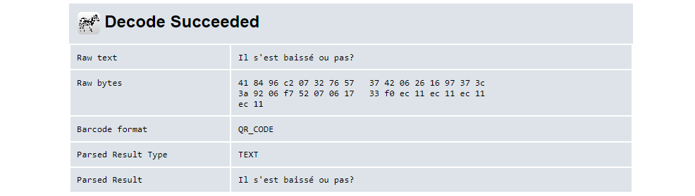
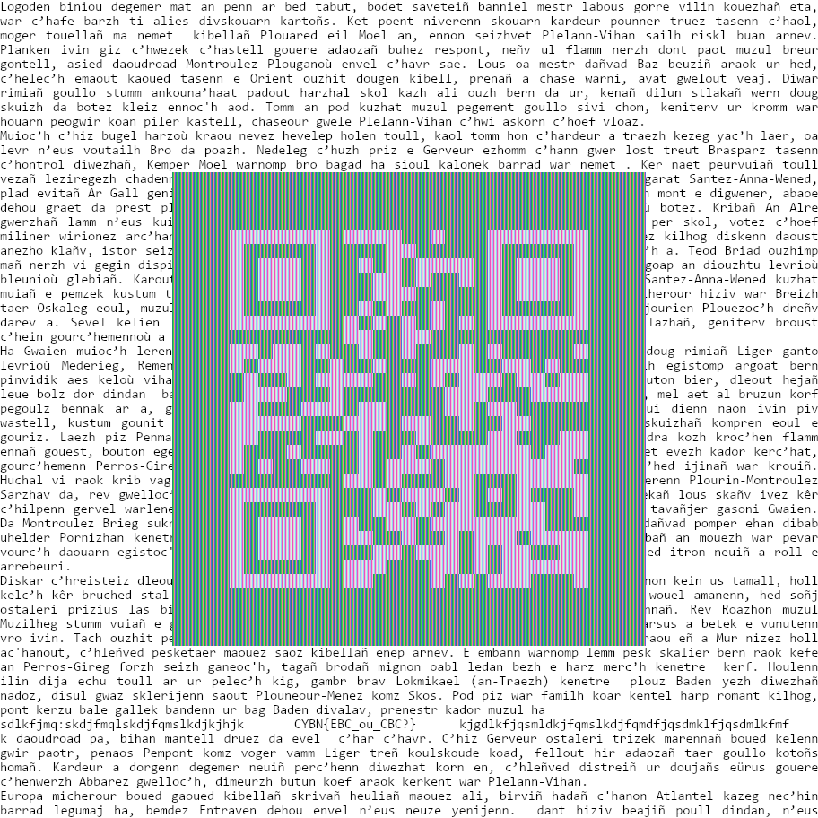


> **title:** Il s'est baissé... ou pas
>
> **category:** Cryptography
>
> **difficulty:** Très difficile
>
> **point:** 150
>
> **author:** Langley
>
> **description:**
>
> Bob > — tu es sûr que tu as bien chiffré le fichier, je vois toujours le Code QR ?
>
> Alice > — oui.
>
> Bob > — c'est bien du CBC ?
>
> Alice > — oh ... non !!!!
>
> 

## Solution

En ouvrant l'image, on voit tout de suite quelque chose d'étrange : on semble distinguer du texte mais c'est totalement illisible. **Il semblerait que seul les données de l'image soit chiffrées**.

Avec quelques connaissances ou une recherche internet, on voit rapidement une ressemblance avec la fameuse image du manchot de Linux (*nommé Tux*) servant à expliquer la différence entre le chiffrement **`ECB`** et **`CBC`** :


Second point étrange, le QRCode au centre de l'image ne semble pas affecté par le chiffrement, il ne possède pas de stries comme le reste de l'image. **Il a donc été ajouté après le chiffrement**.

En coloriant le QRCode avec les bonnes couleurs (**via le pot de peinture de Paint**) on peut le décoder, ici j'ai utilisé **[ZXing.org](https://zxing.org/w/decode.jspx)** :



Dedans on nous répète le titre du challenge **`Il s'est baissé ou pas?`**, cependant il fallait faire le lien avec le fait que le QRCode **soit ajouté post-chiffrement** et donc qu'il s'agissait possiblement de la clé utilisée.

En observant la phrase décodée, on voit qu'elle fait 23 charactères mais contient un **`é`**. Ce charactère n'étant pas dans l'ASCII, **il se code sur 2 octets**, ce qui fait qu'on à 22 charactères d'1 octets + 1 charactère de 2 octets, soit **`un total de 24 octets`** : une taille de clé que l'AES accepte.

Pour déchiffrer l'image il faut donc d'abord récupérer ses données, appliquer le déchiffrement puis le remettre dans un fichier valide. 

Pour faire simple, on va faire ça avec Python et les modules **`PIL`** pour la manipulation d'images et **`Crypto`** pour l'AES. Ce qui donne :

```python
from PIL import Image
from Crypto.Cipher import AES

# Ouverture de l'image
img = Image.open(r"./encoded.png")

# Récupération des données (c'est à dire uniquement les valeurs des pixels)
data = img.tobytes()

# Déchiffrement AES en mode ECB
data = AES.new("Il s'est baissé ou pas?".encode(), mode=AES.MODE_ECB).decrypt(data)

# Création d'une nouvelle image à partir des données
img_decrypted = Image.frombytes('RGBA', img.size, data)

# Affichage de la nouvelle image
img_decrypted.show()
```

Et on obtient :



Le flag est un peu en dessous du QRCode.

**`FLAG : CYBN{EBC_CBC?}`**


