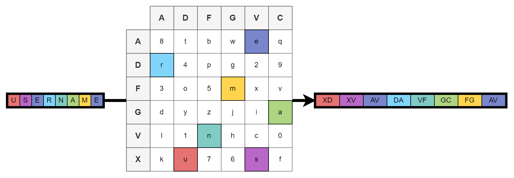
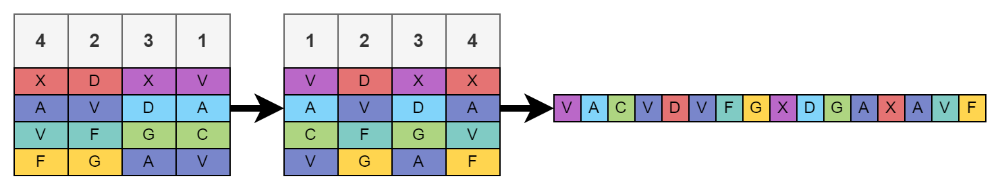
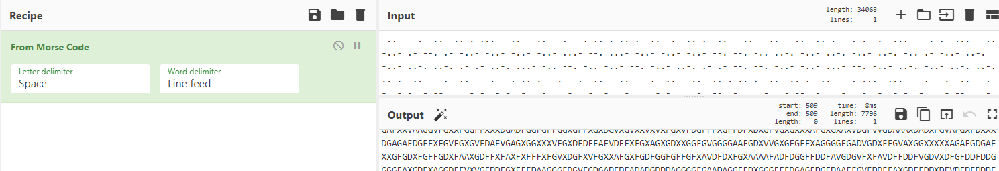


> **title:** Les Allemands... Mais oui !   Les Allemands !
>
> **category:** Cryptography
>
> **difficulty:** Très difficile
>
> **point:** 200
>
> **author:** Maestran
>
> **description:**
>
> 4 juin 1918 :
>
> Malgré le succès de votre collègue Georges hier pour casser le chiffre allemand qui vous a permis de sauver plusieurs soldats d'une offensive surprise des Allemands, une terrible nouvelle est arrivée ce matin.
>
> Il semblerait que les Allemands utilisent une nouvelle étape avant leur méthode de chiffrement que vous n'avez toujours pas réussi à comprendre.
>
> Alors que tous les espoirs semblent perdus, un espion arrive en courant dans votre bureau ! Il a réussi à voler le début du télégramme intercepté ce matin lors de la nouvelle étape de chiffrement allemande !
>
> Cela ne devrait pas être très compliqué de casser à nouveau ce chiffre avec vos compétences.
>
> ---
>
> Si vous trouvez une chaine :
>
> CYBNTOTO1234
>
> Alors le flag est CYBN{TOTO1234}
>
> 

## Solution

On nous parle de chiffrement allemand. Avec une rapide recherche internet ("*chiffre allemand cryptographie*"" ou "*morse allemand cryptographie*"" par exemple) on tombe tout de suite sur le **[chiffre ADFGVX](https://fr.wikipedia.org/wiki/Chiffre_ADFGVX)**.

Ce chiffrement correspond en tout point à ce qu'on a, **`voici son fonctionnement`** :

### Fonctionnement

#### Etape 1

On défini un **`tableau de conversion` de 6x6** et contenant toutes les lettres et tous les chiffres répartis arbitrairement (*26 + 10 = 36, soit 6x6 ça tombe bien*). **On attribut à chaque lignes un identifiant** sous forme de lettre, dans l'ordre : ADFGVX. On fait **la même avec les colonnes**, c'est à dire la première colonne aura pour identifiant A, la seconde D et ainsi de suite. 

Ensuite on va remplacer chaque lettre de notre texte par un code correspondant à l'identifiant de la ligne **puis** celui de la colonne où se trouve la lettre dans le tableau. Autrement dit chaque lettre va être remplacée par deux lettres. Voici ce que ça donne avec le mot **`username`** :



#### Etape 2

Notre **`username`** s'est donc transformé en **`XDXVAVDAVFGCFGAV`**. Maintenant on va décider d'un code dont la taille est un diviseur de celle de notre texte initial. Reprenons notre exemple, ici le texte fait 8 lettres donc on peut choisir un code de taille 1, 2, 4 ou 8. Pour l'exemple on va prendre un code à 4 chiffre : **`4231`**.

On va ainsi construire un **`tableau de permutations`** de 4 colonnes identifiées chacune par notre code. Donc la première notée 4, la seconde 2, la troisième 3 et la dernière 1. On place chaque lettre de notre texte transformé de gauche à droite et de haut en bas. Concrêtement ça donne ça :


Ensuite on vient simplement remettre les colonnes dans l'ordre croissant selon leur identifiant :


Et enfin on lit les lettres **`d'abord de haut en bas`** **`puis de gauche à droite`**, au global ça donne ça :



On se retrouve avec **`VACVDVFGXDGAXAVF`**. Les allemands passaient ensuite les lettres en morse pour les communiquer, les lettres ADFGVX ont été choisies car elles ont un code morse très distinguables les unes des autres à l'oreille.

### Comment casser le code

Maintenant que l'on sait comment le chiffrement fonctionne, on répète les étapes dans le sens inverse. Pour ça on :

1. Décode le morse
2. Place les lettres de haut en bas puis de gauche à droite dans le tableau de permutations
3. Réarrange les colonnes du tableau de permutations
4. Lit les lettres 2 à deux de gauche à droite puis de haut en bas
5. Pour chaque groupe de deux lettres, on regarde à quel charactère il correspond dans le tableau de conversion

Sauf qu'il y a plusieurs problèmes à résoudre :

**`On ne connaît ni la taille du code ni le code utilisé en lui-même, donc le nombre de colonnes du tableau de permutations =>`** Solution : on regarde les diviseurs possibles et l'on brute force les permutations si elles ne sont pas trop nombreuses.

**`On ne connaît pas le tableau de conversion =>`** Solution : on a le début du texte déchiffré fourni, on pourra donc reconstruire une partie avec ça et le reste on le devinera à la main

### 1. Décodage du morse

Ici j'utilise bêtement **[CyberChef](https://gchq.github.io/CyberChef/)**



Ce qui donne :

```
XGXFVXDGGFFXAFXXXXFGAAVGAVDXAGAXXXXVGVXXXGGDFXFXFDAXFXFFAAFVDGDXGXFAAGGXXVGXFXFFFXGXGGFGGXXGXXFFXFXGVVGGDGXXGVXXFFAAFVDFGDFAGDAFXXVGFGXXXXFXGFDVXGAFFGFGFFGAGFVFVFGXGGFGFXGXXVVVXFVGGAXGXAFFXVXGGXXFDGFDDGGFXDGFGFXFXXDDGFGXGXAGAXXGXXFAGXDFXGFGXXAXDXXDFFXDAXDXXGVFXGFGXXXGGXAGXXVAXGXGFVAGXFXGXFXFXGXVGGGFVAGDAFGGXFXFDAXFGGVFFFGGAGXGGGXXXGXGFGXXFGDGXGGGAFGDFGAXVAFAFGVXGDGAAVDXVFXVXFGDFFFGAGFFVXGAAVDFXXXXAGXGXFGGXXXXDGFFAVADDGXFXXGFDAXDXGVDXFVXXDFGFGDAAXGVFFXXFAVXVGGXFGXXGGGFGGAFGGVFGVVAVGGFVXGFXXGXXGGGVXFAFFGXXDGAAFDAGXAAXXDGVAFAXXXGFGXGGFXVVDXXAXXGGGAGAXADFGGXXFGGAFXGVGFXFDGAFXGXFFFXXVGXVAXVGXDDGGXXGFXDGXGADAXDXDXVXXDXXGVXFFXFFGXXGFFFXGDFXFAXXXGFXGAFAXXGFXDGXXXVGGFXFFGDFFGAGFFGFXFFGDGXFGVGXGFAVGGGGAAXDXVFGAXGGXFXAFGVXXGXXXFXGFGFFFDXGFFVFVFFGVXXFDFFXGGFGFGXVAFGGFDGDFXDGGXGGFFXAAGGXFGGDGAFGADVAAFXVAFAXXGFGDFXFXFGGAGGFGGXFGFFAVXFDFVXGAGXXVFGGAFFFGAGFFGAVVXXFXGGFXFXXFXXVGDAGDXXGVXGGGXVAAGGAXGXGFGAFGAFVXGXVFGXDAGXDXDFXAXFXXFXGFGXAFXGVXDGXDFFXAGGFGFXXVXDAFGXFVXGVAFGXDDGGXGXVXFVGXAFGFXFFVAXXGXXXAFXAFXGGFFVGXDXXXVFGFGXAFVXGGGGXFDAGVFGFGFGXGXGGAFVXFFFFFFFFGXDGVFFXVGXDDGGXFGAXVFXVFFDAXFGGXFGXXAGFFAGFDAGAGFGVGXFGFAAGXXGFFXGXFGAXFVXGDAFXVDXXFGXFFXFDGDFGFXXVXGXXFFXFXDGXFGDGFDAGXFGXXADFXGGXGFXXVFXXVGXGFFXVVFXAXVDGGXVGVFGXXFGFGFAGXVFXGGXFDGXXDFXXFGFGADFGGGVFGXXDXAFFFFFVXXGXDAFGGFXXVAFGFXGXGXVAGGGFGVFFXXFGDDGFVDGFXXGFGFXFXFAFXXXGXGXFGGDFFGGVXGXXVGXFXFFGFXVGFXFXFGAXGAXGGGXADGVDGXGGVGVXGFVDAXVFGGGAFXDXXFAVFGGXFDFXXXGGXGXGAGGGXXVGFXGVFXFFXFGGVFVXXVXVGAXVDDDFXGGXXGFGGFVGXAGGAXFGXGVVFGDAGDFGGXFGXGGFDFXVXXVFFGGXFFFGXDXXGDAVGFFAXXGXGGXXGGXXGDFGFXXGGXGFXXDXGVFFGXAVGGXFADDFAFVDFGVAFGVGFXFXVFDGVFXXFDGAGAFDGFFXFGFXFGXGXGXXVGXVXXFGDAXXXAFGXDFFXXGFFGGVGXFGVGFFAGXVGVGAGXGFFGFFGGAGGAGFAGGVFDAAFXDGXXAXFGXGXFVGAGGVVFFGVAFGXFGDXXVXXDAXFDGXXAXVDDXFGXVVFVXXGXXVAXXAAGGVGFXFAGGXVAXVAAGGAVAGXGFGGFGGAGGGXGGFGFVAFGFAFDGXDFVVVVAXGGGDFGFXDGXDXFVXGXFXFXGFXXGAXXXDDGGGVVXGXXXVXFGFFXVDGXVDFDFFXVFGXXADFXGGGDGFGAGXGAFXFFGXADGXFAAFFXXXXXGDGXXGGGAGAGFDVADAAGVGAAVGAGAAGGGFAFGGADGFXXXXAXFFDGAGXVGGFGGXVVVGGFAGXXAGGVXXXFAFFDXXGGAFXXFFGVGVXXFFXVXVGAGXGGAFXFFDAVGAVDXFFFAGGGXXXXVVGXGGFAGFXFFXFFGXXGFXFDXXFAGXXXXVADXFGXXXAGFXFFGFXXFXXXDGAAXGDVAGFFXGDXXXXFAGFXGFDFFFGAGFFVGADXFXXFGXDDFGFDGVDDAXDXXGFDFFFGXGFDAGXFGXDAXGVGFDDGFGXADFXDDGFGFGDAXGVGAGVVAFFDGDXGGGXGGXGFDFXGGGGFGFGXXVAVFXXXVVAXAFDXXGDVAXFXXXGXGXGXGFGFGXXXGGFXGXGFXVGFGXXGFGFAFGXXFGXXXXXGGXFGDAAAFXXAFFXVXGGDFXXGGXFFGXVVGXGAFXFDFFDFGXGDGXXFFGGFAXGFDDGVGAXVADGGFXXGXXVFGXAGFFFXAGAAVDAXGDFVFAFVDXDVAXFGGGXAVDGFGFFDGFFFVVGAFGXGXGFFVFXVGXVGGXXGDXAAXVGGFFAXXGXXFXADVGXAGGXDVFFXGXXFXGGGGVXXFXGAXFFXVFXDGXGFXDXXXGGGDAFGAXFAXFFDGXFFGXXFDDGXDAAFFAGAAAFFAAFVDFGDAAGAXAFXGFFFFXGFVVFDDFFFFXFFVVFGXXGDFFXDFXXXGAXGGXFXXGGXAFAFFVAXGXDXXDDGDGFXFGXGFFXFGXDGGVAFGXAXXGDAGAGFFDGGXGGGFGFDXVFGGXXAFGGGXXVFVFFXDDXXGFVXGDAXXVGFGVVFVXXGVGGXFFAAXVGDFFXGFGADAFXXVXXXGFFVGFXFAFXXGGFFFXGFFFVGXAFFXVXGVXAFGGFDXXAGDGFVFAGXXXVFFFGAAXDVAGGXXXVDGXXFXXGFXVGGFDAGFXDXXGGFVXFAXGDDAFGXXAAXDFAAFFGFXVDFXXDGFAGGAGXDGAFGGFFAXVDFXVFGXDGFGFGVAXFGGGXFGXFGGAGAXFAXGFXGXXGXGGAFGGFXXDGVGGFDXVGFXXVGGGXGVXGFXGXVXXGAXDFAAXDFGGXAGFXAFGAXFAXFGXAFFFFXVGXGFXDXFXXFGVGAGVXGFFDXGXGXGFGFGXFGGGXGGXDGFXAFGGFFXFGADVGAGFFFAGFXVXAVFDAGAFGAGGGXGXAGXGFAXXXGAXGDFFXFAXFGVXDFFGXVFGGXGXXAGXVAFGXXGGGAAXGDFFXXGXVADGDAVDFDXFGFXGGXVFGXXGGDVAXFAXGFGXDFXDADGGFGXFGXGFAFAXVDGXGGDGFFXFGFXFVGFVXAXDXADAGFFAXGVDADVGFGGGFAFGGXGXXGGXAGAFGGXGGGDXXAGFGVFVGGFXAXXFXGVVAXVGAXXDXDGVDFXDDXXFGGXDXXFGGGGFXDXXDDGXFGXAXFVFGXFFXFAFFXXGGGFGXGFAVFFGFAAGGXXFGGAXDDAVGFGVAVDFGXGXXVDAFXAXAFXXXXXDGXGGXVGXXGFGGAFFXAXVDGXFVGFDAXFXGGXGVDGGAGVVAGVFAFVXAVFFGXAGXAXGFGGDXXGGAXFFFVXFVGFFGXXGAXVDDXFVGGGVFDGXFGXVFVXXGXXVAXGXDAFXAXGGGGGDAGAFXXVAAGGVFGXXFGGFFXXXDGADFGGFGFFGGXGFFXGXDGVXGVXXVXVXFGXVFDGFFFXGFFDFXDXGFVGXGXXXAFGXGXAXVDGFVVGDAAAXDADXFGVAFGXFDXXXDGAGAFDGFFXFGVFGXGVFDAFVGAGXGGXXXVFGXDFDFFAFVDFFXFGXAGXGDXXGGFGVGGGGAAFGDXVVGXGFGFFXAGGGGFGADVGDXFFGVAXGGXXXXXAGAFGDGAFXXGFGDXFGFFGDXFAAXGDFFXFAXFXFFFXFGVXDGFXVFGXXAFGXFGDFGGFGFFGFXAVDFDXFGXAAAAFADFDGGFFDDFAVGDGVFXFAVDFFDDFVGDVXDFGFDDFDDGGGGFAXGDFXAGGDFFVXVGFDDFGXFFFDAAGGGFDGVFGDGADFDFADADGDDDAGGGGFGAADAGGFFDXGGGFFFDGAGFDGFDAAFFGVFDDFFAXGDFFDDXDFVDFDFDDDFGGFVFFDDDFDAXGFFFGDDVGFADDVDVDXDDFGDDGDAADGDGGGXAFFFFDGFDFDGVAFGDDDDFFFGGDGDGFFAVDDAFDFFDDDAGFGGFFGGFDDGFGFFAAGADDDAGFXGGGXDGDFAFAFDDDFFGADGFAGGGDAGFFFGXGDFFFGGDFXGFDDFFGDDFDFFGFGFGFFGDDAFFDGFGFGFFGFGGDDFFDDFGDDDDFAGFFFFFFDDGAFXXDVFFDAVDGDAFDDFFFDDVGAXFGGFFDAFGDGGFDGFGGFFFDAFAGDDAVGFFGGDFGDAAGVDDGFFGVFFXFAAFFXGXGGDGFFDVGGXGGDFFGDDDGVAFGGDDGGDGDAAAVGGGGGFFFFAAGGGFGDFGFDDFAFFXXFGAAGGGFFAFFGFXFGFFXADFDGDGDAFFDDGFGGGFDVFGDDVFFGGFDFDFADDDDFFVAGXVFDFDGDGGDGFVGFDFVGFFFFDDGAXGXXDGVXDAGDAADDXAXFXVFGVAAVFDDGGDDDGVGGFVGXXVDFDFVVGFGGDDFAXFGAFVFFFVDXAXVFGXDDFDFFGFFDAVFVFFFGAFDFFDFVGXGAFGFFGDDAXGVGVDADAADGGGFDGAADDFDAGDFFFGGGDGFDFFFGGGDAAXDFGGGFGGDGFFGGFAFDAXXFGADGDFGDGXDDVFFGDFFGVGGGFDGGGFFGGDGDDFGGVGGFDAVDGDAGFXAFADAFFDFDFGGAXGDFFGGAGAXDFFGDDFFFFGFFDFFDFFVFGGGDDXGVFFFFGAVGFAXDFDXXAGFFDXFDGXDGDGGFGAVFFDADXDAXGFFFXGGGDGXFGDGFGDFFDAVAVAGXFDGADDGAFAGFDGXFVXFDVFGFFGFAFXGGGVDFFAGGGDADGAFFFGAVAFGGFFGFGDGDFVDFGAXGFDVFFDXFGDXVFDFDGDGAFXGVGADGAFFADDFFDFGGGFXAGDAVDFDVDADFGFDGFDGAAFFDFDAVFXGGGDGFDGXFGFDAVGVXAAFGDGGADXVDDFDAGGFADXDDGDGFFFGGFFDGDFGDFGAGFDGDGXGVFAFDDDXFFGXAAFFFAAXGFFDAVFFGFGDDADGGDGFFGVGFGAFGDDFFFAFGDDDXDFVAFGAFDDAAGDFFDVFGVXGXFGDVFAADAVVFVAVFVAGAGDDDFFXDGXVGXFGGDDDGDVVGDVXVDFFGFFDFFXVDDFDDVAAFDFDFGGGVGAAVFXFDAFGGGXFGFDFDDFDAFGVFDFDFGADFDFFDAFFDGFVDFDAGFDFFXFGGDFFDGDVXGGFFGFAAGFFGXGGGAAXDDGDFVGFDFDDDAGAAGGGDVFDFFFGDDADGFXGDFFFFFFDGAFGADFGDDGXGADGDGDGFFGFDFDFGFFDFFGGVAXGGGXGGAXGGDGGAGAFDDFXDFVAFDDFGAXDVAGGFVGGDAAFFGXFGDDFGGAGGGDDFFGGFGGGFDAFFGGFDFDDADGFGFVAADXADGDFGDXFFGDGFFAAGDGFFFDAXVVDFDGVDAGDDGVFGDFFGDAGFFGDGFDFFGAVFVFFDADADGFVDDVGADADDFXAAFVFXFGDDVAGFFDXDFDXFFGVGXAAFVVDDDDAXFGDDFAVDGGGDGFGGVFXVGGXAFDFFFFGAADDVVVGXGGDDGDVADDAFGAFFGADDGFGFGXXAFGFGGGFGDDGVFDVFDFGFXDGFDFGAAGXFGAFDDDFXVDDFFAXFDFGGFFDAFVDFGDVXGFFDGDFGDFGFVFVFVGGFDGFFGGADFDGFFDFDGVAAAGVFAFGGDDFDAADXFXGGDADDFDDGGAGDAGFGFGGDDXXAGFXFFFFFDDXDAGGGGFDFDFFDDGFGDDDGVDFFFFDFDFGFGVXDAGDAAAFFDXDDGDFGGFVFDAGDAFFDDFDDFGFFDGDVFAXGVADGFFFGDFGVXDAGDAADGDADDGDDGFGAXFDFFDFGDGFFDGVGDVGGFGAGGGGVFFFADFGDAFFXDXDVGFGDDAFDAVDGDAAFFDVGVDFFDVFFFGAVFVFFGFFAAFGFXFDFFVFFDDVDDGDGDADFDDFFFDGDFDDDFFFGGGDGDADFFFVDDADFGXFGFFGGDGFDFGDGDVDAFGFGDGGDGDDGVAFGFDFDFGFAGGVAAADGFAFDDFDADFGAFFGADDFGAADAGDGFGFGDAXGAGDFDGXGGGFGGDGFDGDGDAADGDGGDGXGGGFFFDDDFDFFDDAFFFFFFGGDGGDFFFVFFGDDDDFFGGGFVGDFDAAGFDXGFFGDGFFVDGFGFAFVFFFXADVGFXGFAGGAGGDGFAGGFDGFFGFFAVAGFVXVGAFDDAXDADXGDXDFFFGGXAGFFFGVFDGFGFGGFDFXFFFAFDADFDDGAAFFGFGGFFGGGFFVDAXGFAFGDGFXGAFGDFGGDGGAFFFGDFDAFVDDDDFFFDGFFAFDDGFDGFDAAFFGVDDFFDFDGXDFFAGDAXGXFFFGFDDDDXGXFAFGDFDGDGXGGVAGFAGFDDFDFGDFFVXGGFAFXDDFFGGAGFFDFVFDVGGDFFDFFGDAAAGVDFDFGDGDGGDGGFFVFGAFGFGADDFGXGGGAVFDGDFFAFAGDGFXGFAFDDFDXXAAXFGDDAFGXAGFDDGADVDGFDGFXGVAADDGAGVXGDGDGGDADGFFGGFAXGDAADGDGVDGGDFVDAADFVFFVDDGFDXGFDFDGFAFAFGXGAFXFFFGVFGDDXGGDAFGDFDFXAFDFDGDXFGFDDFFGGFXGFDGFFFFDAVFGVFVGVFDGFAXDGFGGDAGXAAFDGAVFGFGFFGGFXGAVFVGGDFFGDFFXFFXGFVAAAGGDDFFFGGAGADXGGDAFGADVDDFGDAGDGAFGFFVXGGFGGDDDVGDGFGAGVGFGGDGGAFFDGXFGGDGGVDGFDAFFVDFFXDDDGGDDDAXGDGGGFVGVXDADFGVDFAFDVXFGGDADDVFGFDFDAFDGFDDFDDFAFFGDGDFDGDVFFAFDADFVDDGFVFFFDDGFFGFGAFFGVDDGDDGAGXXGAFXFGDFDFGGGVFFFDVAAGXAFGGFFAFDFADFDGDFGFAFXFDGFAGGFFFVDXGDAGVGDFADDDVFAFFFGXAAGDAFGDGGFFADVGGGFFGXGFFGGFVFDDAGDGFDFVXGDFFGFFFAGFDADGFGDGDFGADVFDGADFGGFFVFDVXFAGFGFVDXDFGGDFDAGGVFFGGFXFGGFAFXADDFFDXFVAAFVDGDFDDAFVDFDAGGFFAGAFGGGFGGFVGGGDGDFGDGAGDGDGFVFFDFFGVFAFGGFGAFXFDDFAGGVGDDGFDGAFGDDVAGGGDGDFGGVGFFGGVGFFDDFDDAGVGDFFGFFVDFDFDFFDDFAFDGFFGGFFVDGGVGAFDGFAFGGDGVDAGDAAGXAAGFGFVFGAVFGAFDVDAXFGDDFAVDGFGFDDFAFDFFGGFGFFGGDDFFFXAAFDGVDDAAADAGGFDFGGVDXAFGGGVDGFADAGDGVFDDGXDVXGGGDDGGVDFFFFXFVAFGDGGGDDFGGDVFGXAAFDFFDFGFFGDFDFADFXFGDDXVAXXGGGFDAFFGGFFXDAFGGFFVGFAFGDFGXGAFXGGAFXDFDVGFDAGGFGADGGGXAAVDVDFFAVGGGGDFAVADGFVFDFDGFGGDDFVFVFFGFFGXDFFDFAGVGGDGDFDGFVDVDFGFFFGVVDVFFGVFFFDDGFFGAFGVAXGFADDDVGADDDAFVXDVGFFFFFGDDFDFFADAXGDDGXFAFGAAXDAGVGFFGFDD
```

### 2. Construction du tableau de permutation

Ici le texte chiffré que l'on a fait **7796 lettres**, les diviseurs sont donc **`1, 2, 4, 1949, 3898 et 7796`**. Vous en conviendrez, la taille de code la plus probable c'est 4. Un code de 1949 chiffres ou plus c'est pas possible, et on pourra toujours partir sur 1 ou 2 après si ça ne fonctionne pas.

Combien de permutations possibles pour un code de 4 chiffres ? La réponse en python :

```python
from itertools import permutations
print(len(list(permutations([0, 1, 2, 3], 4))))

# 24
```
Un brute force de 24 possibilités c'est largement faisable donc on est parti.

On va commencer par construire notre tableau de permutation :

```python
# Morse décodé
cipher = "XGXFVXDGGFFXAFXXXXFGAAVGAVDXAGAXXXXVGVXXXGGDFXFXFDAXFXFFAAFVDGDXGXFAAGGXXVGXFXFFFXGXGGFGGXXGXXFFXFXGVVGGDGXXGVXXFFAAFVDFGDFAGDAFXXVGFGXXXXFXGFDVXGAFFGFGFFGAGFVFVFGXGGFGFXGXXVVVXFVGGAXGXAFFXVXGGXXFDGFDDGGFXDGFGFXFXXDDGFGXGXAGAXXGXXFAGXDFXGFGXXAXDXXDFFXDAXDXXGVFXGFGXXXGGXAGXXVAXGXGFVAGXFXGXFXFXGXVGGGFVAGDAFGGXFXFDAXFGGVFFFGGAGXGGGXXXGXGFGXXFGDGXGGGAFGDFGAXVAFAFGVXGDGAAVDXVFXVXFGDFFFGAGFFVXGAAVDFXXXXAGXGXFGGXXXXDGFFAVADDGXFXXGFDAXDXGVDXFVXXDFGFGDAAXGVFFXXFAVXVGGXFGXXGGGFGGAFGGVFGVVAVGGFVXGFXXGXXGGGVXFAFFGXXDGAAFDAGXAAXXDGVAFAXXXGFGXGGFXVVDXXAXXGGGAGAXADFGGXXFGGAFXGVGFXFDGAFXGXFFFXXVGXVAXVGXDDGGXXGFXDGXGADAXDXDXVXXDXXGVXFFXFFGXXGFFFXGDFXFAXXXGFXGAFAXXGFXDGXXXVGGFXFFGDFFGAGFFGFXFFGDGXFGVGXGFAVGGGGAAXDXVFGAXGGXFXAFGVXXGXXXFXGFGFFFDXGFFVFVFFGVXXFDFFXGGFGFGXVAFGGFDGDFXDGGXGGFFXAAGGXFGGDGAFGADVAAFXVAFAXXGFGDFXFXFGGAGGFGGXFGFFAVXFDFVXGAGXXVFGGAFFFGAGFFGAVVXXFXGGFXFXXFXXVGDAGDXXGVXGGGXVAAGGAXGXGFGAFGAFVXGXVFGXDAGXDXDFXAXFXXFXGFGXAFXGVXDGXDFFXAGGFGFXXVXDAFGXFVXGVAFGXDDGGXGXVXFVGXAFGFXFFVAXXGXXXAFXAFXGGFFVGXDXXXVFGFGXAFVXGGGGXFDAGVFGFGFGXGXGGAFVXFFFFFFFFGXDGVFFXVGXDDGGXFGAXVFXVFFDAXFGGXFGXXAGFFAGFDAGAGFGVGXFGFAAGXXGFFXGXFGAXFVXGDAFXVDXXFGXFFXFDGDFGFXXVXGXXFFXFXDGXFGDGFDAGXFGXXADFXGGXGFXXVFXXVGXGFFXVVFXAXVDGGXVGVFGXXFGFGFAGXVFXGGXFDGXXDFXXFGFGADFGGGVFGXXDXAFFFFFVXXGXDAFGGFXXVAFGFXGXGXVAGGGFGVFFXXFGDDGFVDGFXXGFGFXFXFAFXXXGXGXFGGDFFGGVXGXXVGXFXFFGFXVGFXFXFGAXGAXGGGXADGVDGXGGVGVXGFVDAXVFGGGAFXDXXFAVFGGXFDFXXXGGXGXGAGGGXXVGFXGVFXFFXFGGVFVXXVXVGAXVDDDFXGGXXGFGGFVGXAGGAXFGXGVVFGDAGDFGGXFGXGGFDFXVXXVFFGGXFFFGXDXXGDAVGFFAXXGXGGXXGGXXGDFGFXXGGXGFXXDXGVFFGXAVGGXFADDFAFVDFGVAFGVGFXFXVFDGVFXXFDGAGAFDGFFXFGFXFGXGXGXXVGXVXXFGDAXXXAFGXDFFXXGFFGGVGXFGVGFFAGXVGVGAGXGFFGFFGGAGGAGFAGGVFDAAFXDGXXAXFGXGXFVGAGGVVFFGVAFGXFGDXXVXXDAXFDGXXAXVDDXFGXVVFVXXGXXVAXXAAGGVGFXFAGGXVAXVAAGGAVAGXGFGGFGGAGGGXGGFGFVAFGFAFDGXDFVVVVAXGGGDFGFXDGXDXFVXGXFXFXGFXXGAXXXDDGGGVVXGXXXVXFGFFXVDGXVDFDFFXVFGXXADFXGGGDGFGAGXGAFXFFGXADGXFAAFFXXXXXGDGXXGGGAGAGFDVADAAGVGAAVGAGAAGGGFAFGGADGFXXXXAXFFDGAGXVGGFGGXVVVGGFAGXXAGGVXXXFAFFDXXGGAFXXFFGVGVXXFFXVXVGAGXGGAFXFFDAVGAVDXFFFAGGGXXXXVVGXGGFAGFXFFXFFGXXGFXFDXXFAGXXXXVADXFGXXXAGFXFFGFXXFXXXDGAAXGDVAGFFXGDXXXXFAGFXGFDFFFGAGFFVGADXFXXFGXDDFGFDGVDDAXDXXGFDFFFGXGFDAGXFGXDAXGVGFDDGFGXADFXDDGFGFGDAXGVGAGVVAFFDGDXGGGXGGXGFDFXGGGGFGFGXXVAVFXXXVVAXAFDXXGDVAXFXXXGXGXGXGFGFGXXXGGFXGXGFXVGFGXXGFGFAFGXXFGXXXXXGGXFGDAAAFXXAFFXVXGGDFXXGGXFFGXVVGXGAFXFDFFDFGXGDGXXFFGGFAXGFDDGVGAXVADGGFXXGXXVFGXAGFFFXAGAAVDAXGDFVFAFVDXDVAXFGGGXAVDGFGFFDGFFFVVGAFGXGXGFFVFXVGXVGGXXGDXAAXVGGFFAXXGXXFXADVGXAGGXDVFFXGXXFXGGGGVXXFXGAXFFXVFXDGXGFXDXXXGGGDAFGAXFAXFFDGXFFGXXFDDGXDAAFFAGAAAFFAAFVDFGDAAGAXAFXGFFFFXGFVVFDDFFFFXFFVVFGXXGDFFXDFXXXGAXGGXFXXGGXAFAFFVAXGXDXXDDGDGFXFGXGFFXFGXDGGVAFGXAXXGDAGAGFFDGGXGGGFGFDXVFGGXXAFGGGXXVFVFFXDDXXGFVXGDAXXVGFGVVFVXXGVGGXFFAAXVGDFFXGFGADAFXXVXXXGFFVGFXFAFXXGGFFFXGFFFVGXAFFXVXGVXAFGGFDXXAGDGFVFAGXXXVFFFGAAXDVAGGXXXVDGXXFXXGFXVGGFDAGFXDXXGGFVXFAXGDDAFGXXAAXDFAAFFGFXVDFXXDGFAGGAGXDGAFGGFFAXVDFXVFGXDGFGFGVAXFGGGXFGXFGGAGAXFAXGFXGXXGXGGAFGGFXXDGVGGFDXVGFXXVGGGXGVXGFXGXVXXGAXDFAAXDFGGXAGFXAFGAXFAXFGXAFFFFXVGXGFXDXFXXFGVGAGVXGFFDXGXGXGFGFGXFGGGXGGXDGFXAFGGFFXFGADVGAGFFFAGFXVXAVFDAGAFGAGGGXGXAGXGFAXXXGAXGDFFXFAXFGVXDFFGXVFGGXGXXAGXVAFGXXGGGAAXGDFFXXGXVADGDAVDFDXFGFXGGXVFGXXGGDVAXFAXGFGXDFXDADGGFGXFGXGFAFAXVDGXGGDGFFXFGFXFVGFVXAXDXADAGFFAXGVDADVGFGGGFAFGGXGXXGGXAGAFGGXGGGDXXAGFGVFVGGFXAXXFXGVVAXVGAXXDXDGVDFXDDXXFGGXDXXFGGGGFXDXXDDGXFGXAXFVFGXFFXFAFFXXGGGFGXGFAVFFGFAAGGXXFGGAXDDAVGFGVAVDFGXGXXVDAFXAXAFXXXXXDGXGGXVGXXGFGGAFFXAXVDGXFVGFDAXFXGGXGVDGGAGVVAGVFAFVXAVFFGXAGXAXGFGGDXXGGAXFFFVXFVGFFGXXGAXVDDXFVGGGVFDGXFGXVFVXXGXXVAXGXDAFXAXGGGGGDAGAFXXVAAGGVFGXXFGGFFXXXDGADFGGFGFFGGXGFFXGXDGVXGVXXVXVXFGXVFDGFFFXGFFDFXDXGFVGXGXXXAFGXGXAXVDGFVVGDAAAXDADXFGVAFGXFDXXXDGAGAFDGFFXFGVFGXGVFDAFVGAGXGGXXXVFGXDFDFFAFVDFFXFGXAGXGDXXGGFGVGGGGAAFGDXVVGXGFGFFXAGGGGFGADVGDXFFGVAXGGXXXXXAGAFGDGAFXXGFGDXFGFFGDXFAAXGDFFXFAXFXFFFXFGVXDGFXVFGXXAFGXFGDFGGFGFFGFXAVDFDXFGXAAAAFADFDGGFFDDFAVGDGVFXFAVDFFDDFVGDVXDFGFDDFDDGGGGFAXGDFXAGGDFFVXVGFDDFGXFFFDAAGGGFDGVFGDGADFDFADADGDDDAGGGGFGAADAGGFFDXGGGFFFDGAGFDGFDAAFFGVFDDFFAXGDFFDDXDFVDFDFDDDFGGFVFFDDDFDAXGFFFGDDVGFADDVDVDXDDFGDDGDAADGDGGGXAFFFFDGFDFDGVAFGDDDDFFFGGDGDGFFAVDDAFDFFDDDAGFGGFFGGFDDGFGFFAAGADDDAGFXGGGXDGDFAFAFDDDFFGADGFAGGGDAGFFFGXGDFFFGGDFXGFDDFFGDDFDFFGFGFGFFGDDAFFDGFGFGFFGFGGDDFFDDFGDDDDFAGFFFFFFDDGAFXXDVFFDAVDGDAFDDFFFDDVGAXFGGFFDAFGDGGFDGFGGFFFDAFAGDDAVGFFGGDFGDAAGVDDGFFGVFFXFAAFFXGXGGDGFFDVGGXGGDFFGDDDGVAFGGDDGGDGDAAAVGGGGGFFFFAAGGGFGDFGFDDFAFFXXFGAAGGGFFAFFGFXFGFFXADFDGDGDAFFDDGFGGGFDVFGDDVFFGGFDFDFADDDDFFVAGXVFDFDGDGGDGFVGFDFVGFFFFDDGAXGXXDGVXDAGDAADDXAXFXVFGVAAVFDDGGDDDGVGGFVGXXVDFDFVVGFGGDDFAXFGAFVFFFVDXAXVFGXDDFDFFGFFDAVFVFFFGAFDFFDFVGXGAFGFFGDDAXGVGVDADAADGGGFDGAADDFDAGDFFFGGGDGFDFFFGGGDAAXDFGGGFGGDGFFGGFAFDAXXFGADGDFGDGXDDVFFGDFFGVGGGFDGGGFFGGDGDDFGGVGGFDAVDGDAGFXAFADAFFDFDFGGAXGDFFGGAGAXDFFGDDFFFFGFFDFFDFFVFGGGDDXGVFFFFGAVGFAXDFDXXAGFFDXFDGXDGDGGFGAVFFDADXDAXGFFFXGGGDGXFGDGFGDFFDAVAVAGXFDGADDGAFAGFDGXFVXFDVFGFFGFAFXGGGVDFFAGGGDADGAFFFGAVAFGGFFGFGDGDFVDFGAXGFDVFFDXFGDXVFDFDGDGAFXGVGADGAFFADDFFDFGGGFXAGDAVDFDVDADFGFDGFDGAAFFDFDAVFXGGGDGFDGXFGFDAVGVXAAFGDGGADXVDDFDAGGFADXDDGDGFFFGGFFDGDFGDFGAGFDGDGXGVFAFDDDXFFGXAAFFFAAXGFFDAVFFGFGDDADGGDGFFGVGFGAFGDDFFFAFGDDDXDFVAFGAFDDAAGDFFDVFGVXGXFGDVFAADAVVFVAVFVAGAGDDDFFXDGXVGXFGGDDDGDVVGDVXVDFFGFFDFFXVDDFDDVAAFDFDFGGGVGAAVFXFDAFGGGXFGFDFDDFDAFGVFDFDFGADFDFFDAFFDGFVDFDAGFDFFXFGGDFFDGDVXGGFFGFAAGFFGXGGGAAXDDGDFVGFDFDDDAGAAGGGDVFDFFFGDDADGFXGDFFFFFFDGAFGADFGDDGXGADGDGDGFFGFDFDFGFFDFFGGVAXGGGXGGAXGGDGGAGAFDDFXDFVAFDDFGAXDVAGGFVGGDAAFFGXFGDDFGGAGGGDDFFGGFGGGFDAFFGGFDFDDADGFGFVAADXADGDFGDXFFGDGFFAAGDGFFFDAXVVDFDGVDAGDDGVFGDFFGDAGFFGDGFDFFGAVFVFFDADADGFVDDVGADADDFXAAFVFXFGDDVAGFFDXDFDXFFGVGXAAFVVDDDDAXFGDDFAVDGGGDGFGGVFXVGGXAFDFFFFGAADDVVVGXGGDDGDVADDAFGAFFGADDGFGFGXXAFGFGGGFGDDGVFDVFDFGFXDGFDFGAAGXFGAFDDDFXVDDFFAXFDFGGFFDAFVDFGDVXGFFDGDFGDFGFVFVFVGGFDGFFGGADFDGFFDFDGVAAAGVFAFGGDDFDAADXFXGGDADDFDDGGAGDAGFGFGGDDXXAGFXFFFFFDDXDAGGGGFDFDFFDDGFGDDDGVDFFFFDFDFGFGVXDAGDAAAFFDXDDGDFGGFVFDAGDAFFDDFDDFGFFDGDVFAXGVADGFFFGDFGVXDAGDAADGDADDGDDGFGAXFDFFDFGDGFFDGVGDVGGFGAGGGGVFFFADFGDAFFXDXDVGFGDDAFDAVDGDAAFFDVGVDFFDVFFFGAVFVFFGFFAAFGFXFDFFVFFDDVDDGDGDADFDDFFFDGDFDDDFFFGGGDGDADFFFVDDADFGXFGFFGGDGFDFGDGDVDAFGFGDGGDGDDGVAFGFDFDFGFAGGVAAADGFAFDDFDADFGAFFGADDFGAADAGDGFGFGDAXGAGDFDGXGGGFGGDGFDGDGDAADGDGGDGXGGGFFFDDDFDFFDDAFFFFFFGGDGGDFFFVFFGDDDDFFGGGFVGDFDAAGFDXGFFGDGFFVDGFGFAFVFFFXADVGFXGFAGGAGGDGFAGGFDGFFGFFAVAGFVXVGAFDDAXDADXGDXDFFFGGXAGFFFGVFDGFGFGGFDFXFFFAFDADFDDGAAFFGFGGFFGGGFFVDAXGFAFGDGFXGAFGDFGGDGGAFFFGDFDAFVDDDDFFFDGFFAFDDGFDGFDAAFFGVDDFFDFDGXDFFAGDAXGXFFFGFDDDDXGXFAFGDFDGDGXGGVAGFAGFDDFDFGDFFVXGGFAFXDDFFGGAGFFDFVFDVGGDFFDFFGDAAAGVDFDFGDGDGGDGGFFVFGAFGFGADDFGXGGGAVFDGDFFAFAGDGFXGFAFDDFDXXAAXFGDDAFGXAGFDDGADVDGFDGFXGVAADDGAGVXGDGDGGDADGFFGGFAXGDAADGDGVDGGDFVDAADFVFFVDDGFDXGFDFDGFAFAFGXGAFXFFFGVFGDDXGGDAFGDFDFXAFDFDGDXFGFDDFFGGFXGFDGFFFFDAVFGVFVGVFDGFAXDGFGGDAGXAAFDGAVFGFGFFGGFXGAVFVGGDFFGDFFXFFXGFVAAAGGDDFFFGGAGADXGGDAFGADVDDFGDAGDGAFGFFVXGGFGGDDDVGDGFGAGVGFGGDGGAFFDGXFGGDGGVDGFDAFFVDFFXDDDGGDDDAXGDGGGFVGVXDADFGVDFAFDVXFGGDADDVFGFDFDAFDGFDDFDDFAFFGDGDFDGDVFFAFDADFVDDGFVFFFDDGFFGFGAFFGVDDGDDGAGXXGAFXFGDFDFGGGVFFFDVAAGXAFGGFFAFDFADFDGDFGFAFXFDGFAGGFFFVDXGDAGVGDFADDDVFAFFFGXAAGDAFGDGGFFADVGGGFFGXGFFGGFVFDDAGDGFDFVXGDFFGFFFAGFDADGFGDGDFGADVFDGADFGGFFVFDVXFAGFGFVDXDFGGDFDAGGVFFGGFXFGGFAFXADDFFDXFVAAFVDGDFDDAFVDFDAGGFFAGAFGGGFGGFVGGGDGDFGDGAGDGDGFVFFDFFGVFAFGGFGAFXFDDFAGGVGDDGFDGAFGDDVAGGGDGDFGGVGFFGGVGFFDDFDDAGVGDFFGFFVDFDFDFFDDFAFDGFFGGFFVDGGVGAFDGFAFGGDGVDAGDAAGXAAGFGFVFGAVFGAFDVDAXFGDDFAVDGFGFDDFAFDFFGGFGFFGGDDFFFXAAFDGVDDAAADAGGFDFGGVDXAFGGGVDGFADAGDGVFDDGXDVXGGGDDGGVDFFFFXFVAFGDGGGDDFGGDVFGXAAFDFFDFGFFGDFDFADFXFGDDXVAXXGGGFDAFFGGFFXDAFGGFFVGFAFGDFGXGAFXGGAFXDFDVGFDAGGFGADGGGXAAVDVDFFAVGGGGDFAVADGFVFDFDGFGGDDFVFVFFGFFGXDFFDFAGVGGDGDFDGFVDVDFGFFFGVVDVFFGVFFFDDGFFGAFGVAXGFADDDVGADDDAFVXDVGFFFFFGDDFDFFADAXGDDGXFAFGAAXDAGVGFFGFDD"

# Taille du code
code_size = 4

# Hauteur du tableau de permutations
array_height = len(cipher) // code_size

# Création du tableau
array = []
for x in range(code_size):
	array.append([])
	for y in range(array_height):
		array[x].append(cipher[x*array_height + y])
```

### 3. et 4. Bruteforce du tableau de permutation et création des groupes

Ici on va créer toutes les permutations possibles et pour chacune d'entre elles assembler les lettres 2 à 2 comme vu dans les explications :

```python
# Pour chaque permutations possibles
for perm in permutations([0, 1, 2, 3], 4):
	# Réarrangement du tableau
	permuted_array = [array[i] for i in perm]
	
	# Récupération des lettres 2 à 2 de gauche à droite puis haut en bas
	groups = []
	for y in range(array_height):
		for x in range(0, code_size, 2):
			groups.append(f"{permuted_array[x][y]}{permuted_array[x+1][y]}")
```

### 5. Conversion des groupes en charactères

Maintenant on va s'appuyer sur le texte en clair, on dit que le premier groupe se converti selon le premier charactère du texte, le second groupe selon le second charactère etc.

> C'est à dire que si le premier groupe est **`XA`**, comme le
> premier charactère du texte est **`C`**, on remplace tous nos
> groupes **`XA`** par **`C`**

Dans le cas où la permutation faite pour créer les groupes n'est pas la bonne, il y a un moment où on va essayer de convertir avec une lettre un groupe déjà converti par une autre lettre.

> Pour reprendre l'exemple, imaginons que notre 5ème groupe est identique au premier (un **`XA`**), comme le 5ème charactère du texte est **`V`**, on voit bien que ça ne colle pas. On aurait dû trouver la lettre **`C`** en 5ème position dans notre texte hors ce n'est pas le cas donc on voit bien que la permutation n'est pas bonne.

En python ça nous donne :

```python
def decode_perm(text, groups):
	# Pour chaque lettre du texte
	for i in range(len(text)):
		# Le groupe qui correspond à l'emplacement
		replace_groups = groups[i]

		# Remplacer par
		replace_with = text[i]

		# Si le groupe est déjà remplacé et ne correspond pas à la lettre au même emplacement
		if len(replace_groups) == 1 and replace_groups != replace_with:
			return None
		
		# Remplacement de tous les groupes identiques
		for j in range(len(groups)):
			if groups[j] == replace_groups:
				groups[j] = replace_with
	
	# Concaténation de toutes les lettres en string
	return groups
```

### Execution complète du script

Le script au complet :

```python
from itertools import permutations

# Morse décodé
cipher = "XGXFVXDGGFFXAFXXXXFGAAVGAVDXAGAXXXXVGVXXXGGDFXFXFDAXFXFFAAFVDGDXGXFAAGGXXVGXFXFFFXGXGGFGGXXGXXFFXFXGVVGGDGXXGVXXFFAAFVDFGDFAGDAFXXVGFGXXXXFXGFDVXGAFFGFGFFGAGFVFVFGXGGFGFXGXXVVVXFVGGAXGXAFFXVXGGXXFDGFDDGGFXDGFGFXFXXDDGFGXGXAGAXXGXXFAGXDFXGFGXXAXDXXDFFXDAXDXXGVFXGFGXXXGGXAGXXVAXGXGFVAGXFXGXFXFXGXVGGGFVAGDAFGGXFXFDAXFGGVFFFGGAGXGGGXXXGXGFGXXFGDGXGGGAFGDFGAXVAFAFGVXGDGAAVDXVFXVXFGDFFFGAGFFVXGAAVDFXXXXAGXGXFGGXXXXDGFFAVADDGXFXXGFDAXDXGVDXFVXXDFGFGDAAXGVFFXXFAVXVGGXFGXXGGGFGGAFGGVFGVVAVGGFVXGFXXGXXGGGVXFAFFGXXDGAAFDAGXAAXXDGVAFAXXXGFGXGGFXVVDXXAXXGGGAGAXADFGGXXFGGAFXGVGFXFDGAFXGXFFFXXVGXVAXVGXDDGGXXGFXDGXGADAXDXDXVXXDXXGVXFFXFFGXXGFFFXGDFXFAXXXGFXGAFAXXGFXDGXXXVGGFXFFGDFFGAGFFGFXFFGDGXFGVGXGFAVGGGGAAXDXVFGAXGGXFXAFGVXXGXXXFXGFGFFFDXGFFVFVFFGVXXFDFFXGGFGFGXVAFGGFDGDFXDGGXGGFFXAAGGXFGGDGAFGADVAAFXVAFAXXGFGDFXFXFGGAGGFGGXFGFFAVXFDFVXGAGXXVFGGAFFFGAGFFGAVVXXFXGGFXFXXFXXVGDAGDXXGVXGGGXVAAGGAXGXGFGAFGAFVXGXVFGXDAGXDXDFXAXFXXFXGFGXAFXGVXDGXDFFXAGGFGFXXVXDAFGXFVXGVAFGXDDGGXGXVXFVGXAFGFXFFVAXXGXXXAFXAFXGGFFVGXDXXXVFGFGXAFVXGGGGXFDAGVFGFGFGXGXGGAFVXFFFFFFFFGXDGVFFXVGXDDGGXFGAXVFXVFFDAXFGGXFGXXAGFFAGFDAGAGFGVGXFGFAAGXXGFFXGXFGAXFVXGDAFXVDXXFGXFFXFDGDFGFXXVXGXXFFXFXDGXFGDGFDAGXFGXXADFXGGXGFXXVFXXVGXGFFXVVFXAXVDGGXVGVFGXXFGFGFAGXVFXGGXFDGXXDFXXFGFGADFGGGVFGXXDXAFFFFFVXXGXDAFGGFXXVAFGFXGXGXVAGGGFGVFFXXFGDDGFVDGFXXGFGFXFXFAFXXXGXGXFGGDFFGGVXGXXVGXFXFFGFXVGFXFXFGAXGAXGGGXADGVDGXGGVGVXGFVDAXVFGGGAFXDXXFAVFGGXFDFXXXGGXGXGAGGGXXVGFXGVFXFFXFGGVFVXXVXVGAXVDDDFXGGXXGFGGFVGXAGGAXFGXGVVFGDAGDFGGXFGXGGFDFXVXXVFFGGXFFFGXDXXGDAVGFFAXXGXGGXXGGXXGDFGFXXGGXGFXXDXGVFFGXAVGGXFADDFAFVDFGVAFGVGFXFXVFDGVFXXFDGAGAFDGFFXFGFXFGXGXGXXVGXVXXFGDAXXXAFGXDFFXXGFFGGVGXFGVGFFAGXVGVGAGXGFFGFFGGAGGAGFAGGVFDAAFXDGXXAXFGXGXFVGAGGVVFFGVAFGXFGDXXVXXDAXFDGXXAXVDDXFGXVVFVXXGXXVAXXAAGGVGFXFAGGXVAXVAAGGAVAGXGFGGFGGAGGGXGGFGFVAFGFAFDGXDFVVVVAXGGGDFGFXDGXDXFVXGXFXFXGFXXGAXXXDDGGGVVXGXXXVXFGFFXVDGXVDFDFFXVFGXXADFXGGGDGFGAGXGAFXFFGXADGXFAAFFXXXXXGDGXXGGGAGAGFDVADAAGVGAAVGAGAAGGGFAFGGADGFXXXXAXFFDGAGXVGGFGGXVVVGGFAGXXAGGVXXXFAFFDXXGGAFXXFFGVGVXXFFXVXVGAGXGGAFXFFDAVGAVDXFFFAGGGXXXXVVGXGGFAGFXFFXFFGXXGFXFDXXFAGXXXXVADXFGXXXAGFXFFGFXXFXXXDGAAXGDVAGFFXGDXXXXFAGFXGFDFFFGAGFFVGADXFXXFGXDDFGFDGVDDAXDXXGFDFFFGXGFDAGXFGXDAXGVGFDDGFGXADFXDDGFGFGDAXGVGAGVVAFFDGDXGGGXGGXGFDFXGGGGFGFGXXVAVFXXXVVAXAFDXXGDVAXFXXXGXGXGXGFGFGXXXGGFXGXGFXVGFGXXGFGFAFGXXFGXXXXXGGXFGDAAAFXXAFFXVXGGDFXXGGXFFGXVVGXGAFXFDFFDFGXGDGXXFFGGFAXGFDDGVGAXVADGGFXXGXXVFGXAGFFFXAGAAVDAXGDFVFAFVDXDVAXFGGGXAVDGFGFFDGFFFVVGAFGXGXGFFVFXVGXVGGXXGDXAAXVGGFFAXXGXXFXADVGXAGGXDVFFXGXXFXGGGGVXXFXGAXFFXVFXDGXGFXDXXXGGGDAFGAXFAXFFDGXFFGXXFDDGXDAAFFAGAAAFFAAFVDFGDAAGAXAFXGFFFFXGFVVFDDFFFFXFFVVFGXXGDFFXDFXXXGAXGGXFXXGGXAFAFFVAXGXDXXDDGDGFXFGXGFFXFGXDGGVAFGXAXXGDAGAGFFDGGXGGGFGFDXVFGGXXAFGGGXXVFVFFXDDXXGFVXGDAXXVGFGVVFVXXGVGGXFFAAXVGDFFXGFGADAFXXVXXXGFFVGFXFAFXXGGFFFXGFFFVGXAFFXVXGVXAFGGFDXXAGDGFVFAGXXXVFFFGAAXDVAGGXXXVDGXXFXXGFXVGGFDAGFXDXXGGFVXFAXGDDAFGXXAAXDFAAFFGFXVDFXXDGFAGGAGXDGAFGGFFAXVDFXVFGXDGFGFGVAXFGGGXFGXFGGAGAXFAXGFXGXXGXGGAFGGFXXDGVGGFDXVGFXXVGGGXGVXGFXGXVXXGAXDFAAXDFGGXAGFXAFGAXFAXFGXAFFFFXVGXGFXDXFXXFGVGAGVXGFFDXGXGXGFGFGXFGGGXGGXDGFXAFGGFFXFGADVGAGFFFAGFXVXAVFDAGAFGAGGGXGXAGXGFAXXXGAXGDFFXFAXFGVXDFFGXVFGGXGXXAGXVAFGXXGGGAAXGDFFXXGXVADGDAVDFDXFGFXGGXVFGXXGGDVAXFAXGFGXDFXDADGGFGXFGXGFAFAXVDGXGGDGFFXFGFXFVGFVXAXDXADAGFFAXGVDADVGFGGGFAFGGXGXXGGXAGAFGGXGGGDXXAGFGVFVGGFXAXXFXGVVAXVGAXXDXDGVDFXDDXXFGGXDXXFGGGGFXDXXDDGXFGXAXFVFGXFFXFAFFXXGGGFGXGFAVFFGFAAGGXXFGGAXDDAVGFGVAVDFGXGXXVDAFXAXAFXXXXXDGXGGXVGXXGFGGAFFXAXVDGXFVGFDAXFXGGXGVDGGAGVVAGVFAFVXAVFFGXAGXAXGFGGDXXGGAXFFFVXFVGFFGXXGAXVDDXFVGGGVFDGXFGXVFVXXGXXVAXGXDAFXAXGGGGGDAGAFXXVAAGGVFGXXFGGFFXXXDGADFGGFGFFGGXGFFXGXDGVXGVXXVXVXFGXVFDGFFFXGFFDFXDXGFVGXGXXXAFGXGXAXVDGFVVGDAAAXDADXFGVAFGXFDXXXDGAGAFDGFFXFGVFGXGVFDAFVGAGXGGXXXVFGXDFDFFAFVDFFXFGXAGXGDXXGGFGVGGGGAAFGDXVVGXGFGFFXAGGGGFGADVGDXFFGVAXGGXXXXXAGAFGDGAFXXGFGDXFGFFGDXFAAXGDFFXFAXFXFFFXFGVXDGFXVFGXXAFGXFGDFGGFGFFGFXAVDFDXFGXAAAAFADFDGGFFDDFAVGDGVFXFAVDFFDDFVGDVXDFGFDDFDDGGGGFAXGDFXAGGDFFVXVGFDDFGXFFFDAAGGGFDGVFGDGADFDFADADGDDDAGGGGFGAADAGGFFDXGGGFFFDGAGFDGFDAAFFGVFDDFFAXGDFFDDXDFVDFDFDDDFGGFVFFDDDFDAXGFFFGDDVGFADDVDVDXDDFGDDGDAADGDGGGXAFFFFDGFDFDGVAFGDDDDFFFGGDGDGFFAVDDAFDFFDDDAGFGGFFGGFDDGFGFFAAGADDDAGFXGGGXDGDFAFAFDDDFFGADGFAGGGDAGFFFGXGDFFFGGDFXGFDDFFGDDFDFFGFGFGFFGDDAFFDGFGFGFFGFGGDDFFDDFGDDDDFAGFFFFFFDDGAFXXDVFFDAVDGDAFDDFFFDDVGAXFGGFFDAFGDGGFDGFGGFFFDAFAGDDAVGFFGGDFGDAAGVDDGFFGVFFXFAAFFXGXGGDGFFDVGGXGGDFFGDDDGVAFGGDDGGDGDAAAVGGGGGFFFFAAGGGFGDFGFDDFAFFXXFGAAGGGFFAFFGFXFGFFXADFDGDGDAFFDDGFGGGFDVFGDDVFFGGFDFDFADDDDFFVAGXVFDFDGDGGDGFVGFDFVGFFFFDDGAXGXXDGVXDAGDAADDXAXFXVFGVAAVFDDGGDDDGVGGFVGXXVDFDFVVGFGGDDFAXFGAFVFFFVDXAXVFGXDDFDFFGFFDAVFVFFFGAFDFFDFVGXGAFGFFGDDAXGVGVDADAADGGGFDGAADDFDAGDFFFGGGDGFDFFFGGGDAAXDFGGGFGGDGFFGGFAFDAXXFGADGDFGDGXDDVFFGDFFGVGGGFDGGGFFGGDGDDFGGVGGFDAVDGDAGFXAFADAFFDFDFGGAXGDFFGGAGAXDFFGDDFFFFGFFDFFDFFVFGGGDDXGVFFFFGAVGFAXDFDXXAGFFDXFDGXDGDGGFGAVFFDADXDAXGFFFXGGGDGXFGDGFGDFFDAVAVAGXFDGADDGAFAGFDGXFVXFDVFGFFGFAFXGGGVDFFAGGGDADGAFFFGAVAFGGFFGFGDGDFVDFGAXGFDVFFDXFGDXVFDFDGDGAFXGVGADGAFFADDFFDFGGGFXAGDAVDFDVDADFGFDGFDGAAFFDFDAVFXGGGDGFDGXFGFDAVGVXAAFGDGGADXVDDFDAGGFADXDDGDGFFFGGFFDGDFGDFGAGFDGDGXGVFAFDDDXFFGXAAFFFAAXGFFDAVFFGFGDDADGGDGFFGVGFGAFGDDFFFAFGDDDXDFVAFGAFDDAAGDFFDVFGVXGXFGDVFAADAVVFVAVFVAGAGDDDFFXDGXVGXFGGDDDGDVVGDVXVDFFGFFDFFXVDDFDDVAAFDFDFGGGVGAAVFXFDAFGGGXFGFDFDDFDAFGVFDFDFGADFDFFDAFFDGFVDFDAGFDFFXFGGDFFDGDVXGGFFGFAAGFFGXGGGAAXDDGDFVGFDFDDDAGAAGGGDVFDFFFGDDADGFXGDFFFFFFDGAFGADFGDDGXGADGDGDGFFGFDFDFGFFDFFGGVAXGGGXGGAXGGDGGAGAFDDFXDFVAFDDFGAXDVAGGFVGGDAAFFGXFGDDFGGAGGGDDFFGGFGGGFDAFFGGFDFDDADGFGFVAADXADGDFGDXFFGDGFFAAGDGFFFDAXVVDFDGVDAGDDGVFGDFFGDAGFFGDGFDFFGAVFVFFDADADGFVDDVGADADDFXAAFVFXFGDDVAGFFDXDFDXFFGVGXAAFVVDDDDAXFGDDFAVDGGGDGFGGVFXVGGXAFDFFFFGAADDVVVGXGGDDGDVADDAFGAFFGADDGFGFGXXAFGFGGGFGDDGVFDVFDFGFXDGFDFGAAGXFGAFDDDFXVDDFFAXFDFGGFFDAFVDFGDVXGFFDGDFGDFGFVFVFVGGFDGFFGGADFDGFFDFDGVAAAGVFAFGGDDFDAADXFXGGDADDFDDGGAGDAGFGFGGDDXXAGFXFFFFFDDXDAGGGGFDFDFFDDGFGDDDGVDFFFFDFDFGFGVXDAGDAAAFFDXDDGDFGGFVFDAGDAFFDDFDDFGFFDGDVFAXGVADGFFFGDFGVXDAGDAADGDADDGDDGFGAXFDFFDFGDGFFDGVGDVGGFGAGGGGVFFFADFGDAFFXDXDVGFGDDAFDAVDGDAAFFDVGVDFFDVFFFGAVFVFFGFFAAFGFXFDFFVFFDDVDDGDGDADFDDFFFDGDFDDDFFFGGGDGDADFFFVDDADFGXFGFFGGDGFDFGDGDVDAFGFGDGGDGDDGVAFGFDFDFGFAGGVAAADGFAFDDFDADFGAFFGADDFGAADAGDGFGFGDAXGAGDFDGXGGGFGGDGFDGDGDAADGDGGDGXGGGFFFDDDFDFFDDAFFFFFFGGDGGDFFFVFFGDDDDFFGGGFVGDFDAAGFDXGFFGDGFFVDGFGFAFVFFFXADVGFXGFAGGAGGDGFAGGFDGFFGFFAVAGFVXVGAFDDAXDADXGDXDFFFGGXAGFFFGVFDGFGFGGFDFXFFFAFDADFDDGAAFFGFGGFFGGGFFVDAXGFAFGDGFXGAFGDFGGDGGAFFFGDFDAFVDDDDFFFDGFFAFDDGFDGFDAAFFGVDDFFDFDGXDFFAGDAXGXFFFGFDDDDXGXFAFGDFDGDGXGGVAGFAGFDDFDFGDFFVXGGFAFXDDFFGGAGFFDFVFDVGGDFFDFFGDAAAGVDFDFGDGDGGDGGFFVFGAFGFGADDFGXGGGAVFDGDFFAFAGDGFXGFAFDDFDXXAAXFGDDAFGXAGFDDGADVDGFDGFXGVAADDGAGVXGDGDGGDADGFFGGFAXGDAADGDGVDGGDFVDAADFVFFVDDGFDXGFDFDGFAFAFGXGAFXFFFGVFGDDXGGDAFGDFDFXAFDFDGDXFGFDDFFGGFXGFDGFFFFDAVFGVFVGVFDGFAXDGFGGDAGXAAFDGAVFGFGFFGGFXGAVFVGGDFFGDFFXFFXGFVAAAGGDDFFFGGAGADXGGDAFGADVDDFGDAGDGAFGFFVXGGFGGDDDVGDGFGAGVGFGGDGGAFFDGXFGGDGGVDGFDAFFVDFFXDDDGGDDDAXGDGGGFVGVXDADFGVDFAFDVXFGGDADDVFGFDFDAFDGFDDFDDFAFFGDGDFDGDVFFAFDADFVDDGFVFFFDDGFFGFGAFFGVDDGDDGAGXXGAFXFGDFDFGGGVFFFDVAAGXAFGGFFAFDFADFDGDFGFAFXFDGFAGGFFFVDXGDAGVGDFADDDVFAFFFGXAAGDAFGDGGFFADVGGGFFGXGFFGGFVFDDAGDGFDFVXGDFFGFFFAGFDADGFGDGDFGADVFDGADFGGFFVFDVXFAGFGFVDXDFGGDFDAGGVFFGGFXFGGFAFXADDFFDXFVAAFVDGDFDDAFVDFDAGGFFAGAFGGGFGGFVGGGDGDFGDGAGDGDGFVFFDFFGVFAFGGFGAFXFDDFAGGVGDDGFDGAFGDDVAGGGDGDFGGVGFFGGVGFFDDFDDAGVGDFFGFFVDFDFDFFDDFAFDGFFGGFFVDGGVGAFDGFAFGGDGVDAGDAAGXAAGFGFVFGAVFGAFDVDAXFGDDFAVDGFGFDDFAFDFFGGFGFFGGDDFFFXAAFDGVDDAAADAGGFDFGGVDXAFGGGVDGFADAGDGVFDDGXDVXGGGDDGGVDFFFFXFVAFGDGGGDDFGGDVFGXAAFDFFDFGFFGDFDFADFXFGDDXVAXXGGGFDAFFGGFFXDAFGGFFVGFAFGDFGXGAFXGGAFXDFDVGFDAGGFGADGGGXAAVDVDFFAVGGGGDFAVADGFVFDFDGFGGDDFVFVFFGFFGXDFFDFAGVGGDGDFDGFVDVDFGFFFGVVDVFFGVFFFDDGFFGAFGVAXGFADDDVGADDDAFVXDVGFFFFFGDDFDFFADAXGDDGXFAFGAAXDAGVGFFGFDD"
text = "C3STV3RSL4F1NDUX1X3M3S13CL3QU3S3D3V3LOPP3L4CRYPTOGR4PH134C4R4CT3R3M1L1T41R34L1N1T14T1V3D3QU3LQU3SOFF1C13RST3LSQU3L3COMM4ND4NTB4Z3R13SOUL3C4P1T41N3C4RT13RUN3COMM1SS1OND3CRYPTOGR4PH133STM3M3CONST1TU333N18944V4NTD3TR3R3ORG4N1S33SOUSL3COMM4ND3M3NTDUS3CONDD3C3SM1L1T41R3S3N1903L1D33QU1PR3S1D34C3PROC3SSUSTROUV3S3SOR1G1N3SD4NSL4GU3RR3FR4NCOPRUSS13NN3D318701871OUL4PROT3CT1OND3SCOMMUN1C4T1ONSN43T3LOBJ3TQU3D3FORTP3UD3FFORTSUNBUR34UD3D3CH1FFR3M3NT3STD3SLORSCR333NVU3D3CONC3VO1RD3SD1CT1ONN41R3SCH1FFR3S3TD3SCOD3SD3CH1FFR3M3NTS4NSD1CT1ONN41R3L3TR4V41LCONS1D3R4BL33NTR3PR1SP4RC3TT3MOD3ST31NST1TUT1ONN3S4RR3T3P4SL44COT3D3C3S4V4NC33SL3SOFF1C13RSFR4NC41SQU1M3N3NTC3TT33NTR3PR1S3P1ONN13R3S1NT3R3SS3NTD3PR3ST3N4NTCOMPT3D3SPROGR3S4CCOMPL1S3NM4T13R3D3T3L3GR4PH13S4NSF1L4L3"


def decode_perm(text, groups):
	# Pour chaque lettre du texte
	for i in range(len(text)):
		# Le groupe qui correspond à l'emplacement
		replace_groups = groups[i]

		# Remplacer par
		replace_with = text[i]

		# Si le groupe est déjà remplacé et ne correspond pas à la lettre au même emplacement
		if len(replace_groups) == 1 and replace_groups != replace_with:
			return None

		# Remplacement de tous les groupes identiques
		for j in range(len(groups)):
			if groups[j] == replace_groups:
				groups[j] = replace_with

	# Concaténation de toutes les lettres en string
	return groups


# Taille du code
code_size = 4

# Hauteur du tableau de permutations
array_height = len(cipher) // code_size

# Création du tableau
array = []
for x in range(code_size):
	array.append([])
	for y in range(array_height):
		array[x].append(cipher[x*array_height + y])

# Pour chaque permutations possibles
for perm in permutations([0, 1, 2, 3], 4):
	# Réarrangement du tableau
	permuted_array = [array[i] for i in perm]

	# Récupération des lettres 2 à 2 de gauche à droite puis haut en bas
	groups = []
	for y in range(array_height):
		for x in range(0, code_size, 2):
			groups.append(f"{permuted_array[x][y]}{permuted_array[x+1][y]}")
	
	# On tente de décoder avec la permutation actuelle
	decoded = decode_perm(text, groups)
	if decoded is not None:
		print(perm, decoded)

# (1, 2, 0, 3) ['C', '3', 'S', 'T', 'V', '3', 'R', 'S', 'L', '4', 'F', '1', 'N', 'D', 'U', 'X', '1', 'X', '3', 'M', '3', 'S', '1', '3', 'C', 'L', '3', 'Q', 'U', '3', 'S', '3', 'D', '3', 'V', '3', 'L', 'O', 'P', 'P', '3', 'L', '4', 'C', 'R', 'Y', 'P', 'T', 'O', 'G', 'R', '4', 'P', 'H', '1', '3', '4', 'C', '4', 'R', '4', 'C', 'T', '3', 'R', '3', 'M', '1', 'L', '1', 'T', '4', '1', 'R', '3', '4', 'L', '1', 'N', '1', 'T', '1', '4', 'T', '1', 'V', '3', 'D', '3', 'Q', 'U', '3', 'L', 'Q', 'U', '3', 'S', 'O', 'F', 'F', '1', 'C', '1', '3', 'R', 'S', 'T', '3', 'L', 'S', 'Q', 'U', '3', 'L', '3', 'C', 'O', 'M', 'M', '4', 'N', 'D', '4', 'N', 'T', 'B', '4', 'Z', '3', 'R', '1', '3', 'S', 'O', 'U', 'L', '3', 'C', '4', 'P', '1', 'T', '4', '1', 'N', '3', 'C', '4', 'R', 'T', '1', '3', 'R', 'U', 'N', '3', 'C', 'O', 'M', 'M', '1', 'S', 'S', '1', 'O', 'N', 'D', '3', 'C', 'R', 'Y', 'P', 'T', 'O', 'G', 'R', '4', 'P', 'H', '1', '3', '3', 'S', 'T', 'M', '3', 'M', '3', 'C', 'O', 'N', 'S', 'T', '1', 'T', 'U', '3', '3', '3', 'N', '1', '8', '9', '4', '4', 'V', '4', 'N', 'T', 'D', '3', 'T', 'R', '3', 'R', '3', 'O', 'R', 'G', '4', 'N', '1', 'S', '3', '3', 'S', 'O', 'U', 'S', 'L', '3', 'C', 'O', 'M', 'M', '4', 'N', 'D', '3', 'M', '3', 'N', 'T', 'D', 'U', 'S', '3', 'C', 'O', 'N', 'D', 'D', '3', 'C', '3', 'S', 'M', '1', 'L', '1', 'T', '4', '1', 'R', '3', 'S', '3', 'N', '1', '9', '0', '3', 'L', '1', 'D', '3', '3', 'Q', 'U', '1', 'P', 'R', '3', 'S', '1', 'D', '3', '4', 'C', '3', 'P', 'R', 'O', 'C', '3', 'S', 'S', 'U', 'S', 'T', 'R', 'O', 'U', 'V', '3', 'S', '3', 'S', 'O', 'R', '1', 'G', '1', 'N', '3', 'S', 'D', '4', 'N', 'S', 'L', '4', 'G', 'U', '3', 'R', 'R', '3', 'F', 'R', '4', 'N', 'C', 'O', 'P', 'R', 'U', 'S', 'S', '1', '3', 'N', 'N', '3', 'D', '3', '1', '8', '7', '0', '1', '8', '7', '1', 'O', 'U', 'L', '4', 'P', 'R', 'O', 'T', '3', 'C', 'T', '1', 'O', 'N', 'D', '3', 'S', 'C', 'O', 'M', 'M', 'U', 'N', '1', 'C', '4', 'T', '1', 'O', 'N', 'S', 'N', '4', '3', 'T', '3', 'L', 'O', 'B', 'J', '3', 'T', 'Q', 'U', '3', 'D', '3', 'F', 'O', 'R', 'T', 'P', '3', 'U', 'D', '3', 'F', 'F', 'O', 'R', 'T', 'S', 'U', 'N', 'B', 'U', 'R', '3', '4', 'U', 'D', '3', 'D', '3', 'C', 'H', '1', 'F', 'F', 'R', '3', 'M', '3', 'N', 'T', '3', 'S', 'T', 'D', '3', 'S', 'L', 'O', 'R', 'S', 'C', 'R', '3', '3', '3', 'N', 'V', 'U', '3', 'D', '3', 'C', 'O', 'N', 'C', '3', 'V', 'O', '1', 'R', 'D', '3', 'S', 'D', '1', 'C', 'T', '1', 'O', 'N', 'N', '4', '1', 'R', '3', 'S', 'C', 'H', '1', 'F', 'F', 'R', '3', 'S', '3', 'T', 'D', '3', 'S', 'C', 'O', 'D', '3', 'S', 'D', '3', 'C', 'H', '1', 'F', 'F', 'R', '3', 'M', '3', 'N', 'T', 'S', '4', 'N', 'S', 'D', '1', 'C', 'T', '1', 'O', 'N', 'N', '4', '1', 'R', '3', 'L', '3', 'T', 'R', '4', 'V', '4', '1', 'L', 'C', 'O', 'N', 'S', '1', 'D', '3', 'R', '4', 'B', 'L', '3', '3', 'N', 'T', 'R', '3', 'P', 'R', '1', 'S', 'P', '4', 'R', 'C', '3', 'T', 'T', '3', 'M', 'O', 'D', '3', 'S', 'T', '3', '1', 'N', 'S', 'T', '1', 'T', 'U', 'T', '1', 'O', 'N', 'N', '3', 'S', '4', 'R', 'R', '3', 'T', '3', 'P', '4', 'S', 'L', '4', '4', 'C', 'O', 'T', '3', 'D', '3', 'C', '3', 'S', '4', 'V', '4', 'N', 'C', '3', '3', 'S', 'L', '3', 'S', 'O', 'F', 'F', '1', 'C', '1', '3', 'R', 'S', 'F', 'R', '4', 'N', 'C', '4', '1', 'S', 'Q', 'U', '1', 'M', '3', 'N', '3', 'N', 'T', 'C', '3', 'T', 'T', '3', '3', 'N', 'T', 'R', '3', 'P', 'R', '1', 'S', '3', 'P', '1', 'O', 'N', 'N', '1', '3', 'R', '3', 'S', '1', 'N', 'T', '3', 'R', '3', 'S', 'S', '3', 'N', 'T', 'D', '3', 'P', 'R', '3', 'S', 'T', '3', 'N', '4', 'N', 'T', 'C', 'O', 'M', 'P', 'T', '3', 'D', '3', 'S', 'P', 'R', 'O', 'G', 'R', '3', 'S', '4', 'C', 'C', 'O', 'M', 'P', 'L', '1', 'S', '3', 'N', 'M', '4', 'T', '1', '3', 'R', '3', 'D', '3', 'T', '3', 'L', '3', 'G', 'R', '4', 'P', 'H', '1', '3', 'S', '4', 'N', 'S', 'F', '1', 'L', '4', 'L', '3', 'C', 'O', 'U', 'T', '3', 'D', '3', 'S', 'C', 'O', 'M', 'M', 'U', 'N', '1', 'C', '4', 'T', '1', 'O', 'N', 'S', 'R', '4', 'D', '1', 'O', 'T', '3', 'L', '3', 'G', 'R', '4', 'P', 'H', '1', 'Q', 'U', '3', 'S', '3', 'N', '1', '9', '1', 'VF', 'C', '4', 'R', 'T', '1', '3', 'R', 'R', '3', 'C', 'O', 'M', 'P', '3', 'N', 'S', '3', 'D', '3', 'S', '3', 'S', '3', 'F', 'F', 'O', 'R', 'T', 'S', '3', 'S', 'T', 'C', 'H', '4', 'R', 'G', '3', 'D', '3', 'F', 'O', 'R', 'M', '3', 'R', 'U', 'N', '3', 'S', '3', 'C', 'T', '1', 'O', 'N', 'D', 'U', 'C', 'H', '1', 'F', 'F', 'R', '3', '4', 'T', 'T', '4', 'C', 'H', '3', '3', '4', 'U', 'C', '4', 'B', '1', 'N', '3', 'T', 'D', 'U', 'M', '1', 'N', '1', 'S', 'T', 'R', '3', 'D', '3', 'L', '4', 'G', 'U', '3', 'R', 'R', '3', '4', 'L', 'O', 'R', 'S', 'M', '3', 'M', '3', 'Q', 'U', '3', 'C', 'L', '4', 'T', '3', 'L', '4', 'G', 'R', '4', 'N', 'D', '3', 'G', 'U', '3', 'R', 'R', '3', 'D', '3', 'U', 'X', '4', 'N', 'S', 'P', 'L', 'U', 'S', 'T', '4', 'R', 'D', 'L', '3', 'S', 'F', 'R', '4', 'N', 'C', '4', '1', 'S', 'O', 'N', 'T', '4', 'V', '4', 'N', 'C', '3', '4', 'G', 'R', '4', 'N', 'D', 'S', 'P', '4', 'S', '3', 'T', 'P', 'O', 'S', 'S', '3', 'D', '3', 'N', 'T', 'M', '3', 'M', '3', 'U', 'N', '4', 'V', '4', 'N', 'T', '4', 'G', '3', 'S', 'U', 'R', 'L', '3', 'U', 'R', 'S', '3', 'N', 'N', '3', 'M', '1', 'S', 'D', '4', 'N', 'S', 'L', '3', 'C', '4', 'M', 'P', 'D', '3', 'L', '4', 'T', 'R', '1', 'P', 'L', '1', 'C', '3', '3', 'N', '3', 'F', 'F', '3', 'T', 'L', '4', 'L', 'L', '3', 'M', '4', 'G', 'N', '3', 'N', '3', 'S', '3', 'S', 'T', 'G', 'U', '3', 'R', '3', '1', 'N', 'T', '3', 'R', '3', 'S', 'S', '3', '3', '4', 'L', '4', 'F', 'F', '4', '1', 'R', '3', '3', 'L', 'L', '3', 'N', '3', 'P', 'R', '3', 'N', 'D', 'R', '4', 'C', 'O', 'N', 'S', 'C', '1', '3', 'N', 'C', '3', 'D', '3', 'S', 'O', 'N', '1', 'N', 'T', '3', 'R', '3', 'T', 'S', 'T', 'R', '4', 'T', '3', 'G', '1', 'Q', 'U', '3', '3', 'T', 'T', '4', 'C', 'T', '1', 'Q', 'U', '3', 'Q', 'U', '3', 'D', '4', 'N', 'S', 'L', '3', 'S', 'D', '3', 'R', 'N', '1', '3', 'R', 'S', 'M', 'O', '1', 'S', 'D', '3', '1', '9', '1', '4', '3', 'N', 'R', '3', 'V', '4', 'N', 'C', 'H', '3', 'L', '4', 'U', 'T', 'R', '1', 'C', 'H', '3', 'H', 'O', 'N', 'G', 'R', '1', '3', 'S', '3', 'S', 'T', 'D', 'O', 'T', '3', '3', 'D', 'U', 'N', 'S', '3', 'R', 'V', '1', 'C', '3', 'D', 'U', 'C', 'H', '1', 'F', 'F', 'R', '3', '3', 'F', 'F', '1', 'C', '4', 'C', '3', 'S', '3', 'M', 'B', 'L', '3', 'T', '1', 'L', 'P', 'L', '4', 'C', '3', 'S', 'O', 'U', 'S', 'L', '3', 'C', 'O', 'M', 'M', '4', 'N', 'D', '3', 'M', '3', 'N', 'T', 'D', 'U', 'C', 'O', 'L', 'O', 'N', '3', 'L', 'R', '3', 'D', 'L', 'Q', 'U', '1', '3', 'S', 'T', 'L', 'U', '1', 'M', '3', 'M', '3', 'U', 'N', '3', 'S', 'P', '1', 'O', 'N', '4', 'L', '4', 'S', 'O', 'L', 'D', '3', 'D', '3', 'S', 'R', 'U', 'S', 'S', '3', 'S', 'D', '3', 'P', 'U', '1', 'S', '1', '8', '9', '8', '4', 'U', 'X', 'P', 'R', '3', 'M', '1', '3', 'R', 'S', 'J', 'O', 'U', 'R', 'S', 'D', '3', 'S', 'H', 'O', 'S', 'T', '1', 'L', '1', 'T', '3', 'S', 'N', 'U', 'L', 'N', '3', 'S', 'T', '3', 'N', 'M', '3', 'S', 'U', 'R', '3', 'D', '3', 'P', 'R', '3', 'V', 'O', '1', 'R', 'L', '4', 'M', 'P', 'L', '3', 'U', 'R', 'Q', 'U', '4', 'L', 'L', '4', '1', 'T', 'P', 'R', '3', 'N', 'D', 'R', '3', 'L', '3', 'C', 'H', '1', 'F', 'F', 'R', '3', 'D', '4', 'N', 'S', 'U', 'N', '3', 'G', 'U', '3', 'R', 'R', '3', 'P', 'R', '3', 'S', 'U', 'M', '3', '3', 'C', 'O', 'U', 'R', 'T', '3', '4', 'D', '1', 'R', '3', 'V', 'R', '4', '1', 'L', '3', 'S', '3', 'N', 'S', '3', '1', 'G', 'N', '3', 'M', '3', 'N', 'T', 'S', 'D', 'U', 'C', 'O', 'N', 'F', 'L', '1', 'T', 'R', 'U', 'S', 'S', 'O', 'J', '4', 'P', 'O', 'N', '4', '1', 'S', 'N', 'O', 'N', 'T', 'P', '4', 'S', '3', 'T', '3', 'S', 'U', 'F', 'F', '1', 'S', '4', 'M', 'M', '3', 'N', 'T', 'P', 'R', '1', 'S', '3', 'N', 'C', 'O', 'M', 'P', 'T', '3', 'P', '4', 'R', 'L', '3', 'S', '3', 'T', '4', 'T', 'S', 'M', '4', 'J', 'O', 'R', 'S', 'D', '3', 'S', 'D', '1', 'F', 'F', '3', 'R', '3', 'N', 'T', '3', 'S', 'N', '4', 'T', '1', 'O', 'N', 'S', 'B', '3', 'L', 'L', '1', 'G', '3', 'R', '4', 'N', 'T', '3', 'S', 'O', 'R', 'P', '4', 'R', '4', 'D', 'O', 'X', '4', 'L', '3', 'M', '3', 'N', 'T', 'L', '4', 'F', 'R', '4', 'N', 'C', '3', 'C', 'O', 'M', 'M', '3', 'L', '4', 'L', 'L', '3', 'M', '4', 'G', 'N', '3', 'D', '1', 'S', 'P', 'O', 'S', '3', 'N', 'T', 'D', 'O', 'U', 'T', '1', 'L', 'S', 'D', '3', 'C', 'O', 'U', 'T', '3', 'R', '3', 'L', '4', 'T', '1', 'V', '3', 'M', '3', 'N', 'T', 'P', 'U', '1', 'S', 'S', '4', 'N', 'T', 'S', 'Q', 'U', '1', 'L', 'S', '4', 'G', '1', 'S', 'S', '3', 'D', '3', 'S', 'T', '4', 'T', '1', 'O', 'N', 'S', 'C', 'O', 'T', '1', '3', 'R', '3', 'S', '4', 'S', 'S', 'U', 'R', '4', 'N', 'T', 'L', '3', 'S', 'C', 'O', 'M', 'M', 'U', 'N', '1', 'C', '4', 'T', '1', 'O', 'N', 'S', '4', 'V', '3', 'C', 'L', '4', 'M', '4', 'R', '1', 'N', '3', 'O', 'U', 'B', '1', '3', 'N', '3', 'N', 'C', 'O', 'R', '3', 'D', 'U', 'R', '3', 'S', '3', '4', 'U', 'M', '1', 'L', '1', 'T', '4', '1', 'R', '3', 'D', '3', 'L', '4', 'T', 'S', 'F', 'M', '1', 'S', '3', 'N', 'P', 'L', '4', 'C', '3', '3', 'N', 'F', 'R', '4', 'N', 'C', '3', 'P', '4', 'R', 'L', '3', 'G', '3', 'N', '3', 'R', '4', 'L', 'F', '3', 'R', 'R', '1', '3', '3', 'T', 'Q', 'U', '1', 'R', '3', 'G', 'R', 'O', 'U', 'P', '3', 'L', '4', 'S', 'T', '4', 'T', '1', 'O', 'N', 'D', '3', 'L', '4', 'T', 'O', 'U', 'R', '3', '1', 'F', 'F', '3', 'L', '3', 'N', 'T', '3', 'N', 'D', 'U', '3', '4', 'D', '3', 'S', 'M', '1', 'L', 'L', '1', '3', 'R', 'S', 'D', '3', 'DX', '1', 'L', 'O', 'M', '3', 'T', 'R', '3', 'S', '3', 'T', 'C', '3', 'L', 'L', '3', 'S', 'D', '3', 'S', 'P', 'L', '4', 'C', '3', 'S', 'F', 'O', 'R', 'T', '3', 'S', 'D', '3', 'M', '4', 'U', 'B', '3', 'U', 'G', '3', 'V', '3', 'R', 'D', 'U', 'N', 'T', 'O', 'U', 'L', '3', 'P', '1', 'N', '4', 'L', '3', 'T', 'B', '3', 'L', 'F', 'O', 'R', 'T', 'L', '3', 'S', 'S', 'T', '4', 'T', '1', 'O', 'N', 'S', '4', 'L', 'L', '3', 'M', '4', 'N', 'D', '3', 'S', 'D', '3', 'H', '4', 'N', 'O', 'V', 'R', '3', '3', 'T', 'D', '3', 'N', '4', 'U', '3', 'N', 'Q', 'U', '4', 'N', 'T', '4', '3', 'L', 'L', '3', 'S', 'O', 'N', 'T', 'U', 'N', '3', 'P', 'U', '1', 'S', 'S', '4', 'N', 'C', '3', '3', 'M', '3', 'T', 'T', 'R', '1', 'C', '3', 'T', '3', 'L', 'L', '3', 'Q', 'U', '3', 'L', 'L', '3', 'S', 'P', '3', 'U', 'V', '3', 'N', 'T', 'M', '3', 'M', '3', '4', 'T', 'T', '3', '1', 'N', 'D', 'R', '3', 'L', '3', 'S', '3', 'T', '4', 'T', 'S', 'U', 'N', '1', 'S', '3', 'N', 'F', '1', 'N', 'L', '4', 'S', 'T', '4', 'T', '1', 'O', 'N', 'B', 'R', '1', 'T', '4', 'N', 'N', '1', 'Q', 'U', '3', 'D', '3', 'C', '4', 'R', 'N', '4', 'V', 'O', 'N', 'N', '3', 'S', 'T', 'P', '4', 'S', '3', 'N', 'R', '3', 'S', 'T', '3', '3', 'T', 'R', '1', 'V', '4', 'L', '1', 'S', '3', '4', 'V', '3', 'C', 'S', '3', 'S', 'H', 'O', 'M', 'O', 'L', 'O', 'G', 'U', '3', 'S', 'D', 'O', 'U', 'T', 'R', '3', 'R', 'H', '1', 'N', 'L', '4', 'R', 'U', 'S', 'S', '1', '3', 'L', '4', 'U', 'T', 'R', '1', 'C', 'H', '3', 'H', 'O', 'N', 'G', 'R', '1', '3', 'S', 'O', 'N', 'T', '3', 'L', 'L', '3', 'S', '4', 'U', 'S', 'S', '1', 'M', '4', '1', 'S', '4', 'U', 'N', 'D', '3', 'G', 'R', '3', 'M', 'O', '1', 'N', 'D', 'R', '3', '3', 'Q', 'U', '1', 'P', '3', '3', 'S', '3', 'T', 'L', '4', 'P', 'R', 'O', 'L', 'O', 'N', 'G', '4', 'T', '1', 'O', 'N', 'D', 'U', 'C', 'O', 'N', 'F', 'L', '1', 'T', 'V', 'O', '1', 'T', 'N', '4', '1', 'T', 'R', '3', 'S', 'U', 'R', 'T', 'O', 'U', 'T', 'L', '3', 'C', 'O', 'N', 'T', '1', 'N', '3', 'N', 'T', '3', 'U', 'R', 'O', 'P', '3', '3', 'N', 'D', '3', 'N', 'O', 'U', 'V', '3', 'L', 'L', '3', 'S', 'S', 'T', '4', 'T', '1', 'O', 'N', 'S', 'D', '3', 'C', 'O', 'U', 'T', '3', 'L', '4', 'F', 'F', '4', '1', 'R', '3', 'C', 'O', 'N', 'N', 'U', '3', 'S', 'O', 'U', 'S', 'L', '3', 'N', 'O', 'M', 'D', '3', 'R', '4', 'D', '1', 'O', 'G', 'R', '4', 'M', 'M', '3', 'D', '3', 'L', '4', 'V', '1', 'C', 'T', 'O', '1', 'R', '3', 'C', 'O', 'N', 'S', 'T', '1', 'T', 'U', '3', '3', 'N', 'F', '1', 'N', 'L', '3', 'P', 'O', '1', 'N', 'T', 'D', 'O', 'R', 'G', 'U', '3', 'D', '3', 'C', '3', 'T', 'T', '3', 'G', 'U', '3', 'R', 'R', '3', 'D', '3', 'S', 'C', 'O', 'D', '3', 'S', 'S', '3', 'C', 'R', '3', 'T', 'S', '3', 'N', 'T', '4', 'M', '3', '3', 'D', '3', 'S', '4', 'O', 'U', 'T', '1', '9', '1', '4', '4', 'U', 'P', 'R', '1', 'N', 'T', '3', 'M', 'P', 'S', '1', '9', '1', '8', 'L', '4', 'R', 'M', '3', '3', '4', 'L', 'L', '3', 'M', '4', 'N', 'D', '3', 'R', '3', 'P', 'R', '3', 'N', '4', 'N', 'T', 'L', '4', 'G', 'U', '3', 'R', 'R', '3', 'D', '3', 'M', 'O', 'U', 'V', '3', 'M', '3', 'N', 'T', 'S', '3', 'L', '4', 'N', 'C', '3', 'D', '4', 'N', 'S', 'D', '3', 'G', 'R', '4', 'N', 'D', '3', 'S', 'O', 'F', 'F', '3', 'N', 'S', '1', 'V', '3', 'S', 'D', '3', 'S', 'T', '1', 'N', '3', '3', 'S', '4', 'R', 'O', 'M', 'P', 'R', '3', 'L', '3', 'F', 'R', 'O', 'N', 'T', 'F', 'R', '4', 'N', 'C', '4', '1', 'S', 'O', 'R', 'L', '3', '1', '3', 'R', 'J', 'U', '1', 'N', 'L', '3', 'S', 'H', 'O', 'M', 'M', '3', 'S', 'D', 'U', 'C', '4', 'B', '1', 'N', '3', 'T', 'N', 'O', '1', 'R', 'D', '3', 'C', 'O', 'U', 'V', 'R', '3', 'N', 'T', 'Q', 'U', '3', 'L', '3', 'S', '4', 'L', 'L', '3', 'M', '4', 'N', 'D', 'S', 'V', '1', '3', 'N', 'N', '3', 'N', 'T', 'D', '1', 'N', '4', 'U', 'G', 'U', 'R', '3', 'R', 'U', 'N', 'N', 'O', 'U', 'V', '3', '4', 'U', 'S', 'Y', 'S', 'T', '3', 'M', '3', '4', 'S', '1', 'X', 'C', 'H', '1', 'F', 'F', 'R', '3', 'S', 'L', '4', 'D', 'F', 'G', 'V', 'X', 'Q', 'U', '1', 'S', '1', 'L', 'N', '3', 'S', 'T', 'P', '4', 'S', 'D', '3', 'C', 'O', 'D', '3', '4', 'U', 'P', 'L', 'U', 'S', 'V', '1', 'T', '3', 'P', '3', 'U', 'T', 'L', '3', 'U', 'R', 'P', '3', 'R', 'M', '3', 'T', 'T', 'R', '3', 'D', '3', 'M', 'P', 'O', 'R', 'T', '3', 'R', 'L', '4', 'V', '1', 'C', 'T', 'O', '1', 'R', '3', 'P', '4', '1', 'N', 'V', '1', 'N', 'U', 'N', '3', 'F', 'O', '1', 'S', '3', 'N', 'C', 'O', 'R', '3', 'S', '4', 'T', 'T', '4', 'Q', 'U', '3', '4', 'U', 'N', '3', 'N', 'O', 'U', 'V', '3', 'L', 'L', '3', '3', 'N', '1', 'G', 'M', '3', '3', 'T', 'T', 'R', '4', 'V', '4', '1', 'L', 'L', '3', 'D', '4', 'R', 'R', '4', 'C', 'H', '3', 'P', '1', '3', 'D', 'P', '3', 'N', 'D', '4', 'N', 'T', 'VF', 'VV', 'H', '3', 'U', 'R', '3', 'S', 'D', '4', 'F', 'F', '1', 'L', '3', '3', 'S', '4', 'N', 'S', 'P', 'R', '3', 'N', 'D', 'R', '3', 'L', '3', 'M', 'O', '1', 'N', 'D', 'R', '3', 'R', '3', 'P', 'O', 'S', 'L', '3', 'VF', 'J', 'U', '1', 'N', '3', 'N', 'D', '3', 'B', 'U', 'T', 'D', '3', 'S', 'O', '1', 'R', '3', '3', '1', 'L', 'P', '3', 'N', 'S', '3', '4', 'V', 'O', '1', 'R', 'R', '3', 'C', 'O', 'N', 'S', 'T', '1', 'T', 'U', '3', 'L', '3', 'S', 'Y', 'S', 'T', '3', 'M', '3', '3', 'T', 'T', 'R', '4', 'N', 'S', 'M', '3', 'T', 'S', '3', 'S', 'R', '3', 'S', 'U', 'L', 'T', '4', 'T', 'S', '4', 'S', 'O', 'N', '4', 'M', '1', 'L', '3', 'C', '4', 'P', '1', 'T', '4', '1', 'N', '3', 'G', 'U', '1', 'T', '4', 'R', 'D', 'C', 'H', '3', 'F', 'D', 'U', 'D', '3', 'C', 'R', 'Y', 'P', 'T', '3', 'M', '3', 'N', 'T', '4', 'U', 'G', 'R', '4', 'N', 'D', 'Q', 'U', '4', 'R', 'T', '1', '3', 'R', 'G', '3', 'N', '3', 'R', '4', 'L', 'D', '3', 'C', 'O', 'M', 'P', '1', '3', 'G', 'N', '3', '4', 'L', '4', 'S', 'U', '1', 'T', '3', 'D', '3', 'C', '3', 'T', '3', 'F', 'F', 'O', 'R', 'T', '1', 'N', 'T', '3', 'N', 'S', '3', 'P', '4', '1', 'N', 'V', '1', 'N', '3', 'S', 'T', 'H', 'O', 'S', 'P', '1', 'T', '4', 'L', '1', 'S', '3', 'M', '4', '1', 'S', 'G', 'U', '1', 'T', '4', 'R', 'D', '3', 'T', 'S', '3', 'S', 'Q', 'U', '4', 'T', 'R', '3', 'O', 'F', 'F', '1', 'C', '1', '3', 'R', 'S', 'D', '3', 'C', 'R', 'Y', 'P', 'T', '3', 'U', 'R', 'S', '4', 'C', 'H', '3', 'V', '3', 'N', 'T', 'L', '3', 'T', 'R', '4', 'V', '4', '1', 'L', '3', 'T', 'P', '4', 'R', 'M', '1', 'L', '3', 'S', 'R', '4', 'D', '1', 'O', 'G', 'R', '4', 'M', 'M', '3', 'S', '1', 'N', 'T', '3', 'R', 'C', '3', 'P', 'T', '3', 'S', 'L', '3', '1', '3', 'R', 'J', 'U', '1', 'N', 'T', 'R', '4', 'D', 'U', '1', 'S', '3', 'N', 'T', '3', 'N', 'C', 'L', '4', '1', 'R', 'U', 'N', 'M', '3', 'S', 'S', '4', 'G', '3', 'D', 'U', 'H', '4', 'U', 'T', 'C', 'O', 'M', 'M', '4', 'N', 'D', '3', 'M', '3', 'N', 'T', '4', 'L', 'L', '3', 'M', '4', 'N', 'D', '4', 'D', 'R', '3', 'S', 'S', '3', '4', 'U', 'N', '3', 'T', '4', 'T', 'M', '4', 'J', 'O', 'R', 'D', '4', 'R', 'M', '3', '3', 'S', '1', 'T', 'U', '3', 'D', '4', 'N', 'S', 'L', '4', 'R', '3', 'G', '1', 'O', 'N', 'D', '3', 'R', '3', 'M', '4', 'U', 'G', '1', '3', 'S', 'P', 'R', '3', 'S', 'D', '3', 'C', 'O', 'M', 'P', '1', '3', 'G', 'N', '3', '3', 'T', 'P', 'R', '3', 'V', '3', 'N', '4', 'N', 'T', 'D', '3', 'L', '4', 'N', '3', 'C', '3', 'S', 'S', '1', 'T', '3', 'D', '4', 'C', 'C', '3', 'L', '3', 'R', '3', 'R', 'L', '4', 'M', 'O', 'N', 'T', '3', '3', 'D', '3', 'S', 'M', 'U', 'N', '1', 'T', '1', 'O', 'N', 'S', 'M', '3', 'M', '3', 'P', '3', 'N', 'D', '4', 'N', 'T', 'L', '3', 'J', 'O', 'U', 'R', 'P', '4', 'R', 'T', 'O', 'U', 'T', 'O', 'U', 'L', 'O', 'N', 'N', '3', 'T', '4', '1', 'T', 'P', '4', 'S', 'V', 'U', 'C', '3', 'T', 'T', '3', '1', 'N', 'F', 'O', 'R', 'M', '4', 'T', '1', 'O', 'N', 'S', '4', 'V', '3', 'R', '3', 'C', '4', 'P', '1', 'T', '4', 'L', '3', 'P', 'O', 'U', 'R', 'L', '3', 'T', '4', 'T', 'M', '4', 'J', 'O', 'R', 'D', 'U', 'G', 'Q', 'G', 'Q', 'U', '1', '1', 'N', 'F', 'O', 'R', 'M', '3', 'D', '3', 'S', 'L', '3', '3', 'J', 'U', '1', 'N', 'P', '3', 'U', 'T', '4', '1', 'N', 'S', '1', '4', 'N', 'T', '1', 'C', '1', 'P', '3', 'R', 'L', '4', 'M', '4', 'N', 'O', '3', 'U', 'V', 'R', '3', '4', 'L', 'L', '3', 'M', '4', 'N', 'D', '3', 'P', 'O', 'U', 'R', 'Y', 'F', '4', '1', 'R', '3', 'F', '4', 'C', '3', 'L', '3', 'C', 'H', '3', 'C', 'D', '3', 'L', 'O', 'F', 'F', '3', 'N', 'S', '1', 'V', '3', '4', 'L', 'L', '3', 'M', '4', 'N', 'D', '3', 'D', 'U', '9', 'J', 'U', '1', 'N', '1', '9', '1', '8', 'D', '4', 'N', 'S', 'L', '4', 'R', '3', 'G', '1', 'O', 'N', 'D', '3', 'R', '3', 'M', '4', 'U', 'G', '1', '3', 'S', '3', 'T', 'L', '4', 'C', 'O', 'N', 'T', 'R', '3', '4', 'T', 'T', '4', 'Q', 'U', '3', 'F', 'U', 'L', 'G', 'U', 'R', '4', 'N', 'T', '3', 'L', '4', 'N', 'C', '3', '3', 'P', '4', 'R', 'L', '3', 'G', '3', 'N', '3', 'R', '4', 'L', 'M', '4', 'N', 'G', '1', 'N', 'D', '3', 'U', 'X', 'J', 'O', 'U', 'R', 'S', 'P', 'L', 'U', 'S', 'T', '4', 'R', 'D', 'C', 'O', 'N', 'S', 'T', '1', 'T', 'U', '3', 'N', 'T', '1', 'N', 'C', 'O', 'N', 'T', '3', 'S', 'T', '4', 'B', 'L', '3', 'M', '3', 'N', 'T', 'U', 'N', 'C', 'O', 'U', 'P', 'D', '4', 'R', 'R', '3', 'T', 'B', 'R', 'U', 'T', '4', 'L', '4', 'L', '4', 'M', '4', 'R', 'C', 'H', '3', '3', 'N', '4', 'V', '4', 'N', 'T', 'D', '3', 'S', 'T', 'R', 'O', 'U', 'P', '3', 'S', 'D', 'U', 'R', '3', '1', 'C', 'H', 'V', '3', 'R', 'S', 'P', '4', 'R', '1', 'S', 'P', 'R', '3', 'L', 'U', 'D', '3', '4', 'U', 'R', '3', 'D', 'R', '3', 'S', 'S', '3', 'M', '3', 'N', 'T', '4', 'L', 'L', '1', '3', '3', 'T', '3', 'N', 'D', '3', 'F', '1', 'N', '1', 'T', '1', 'V', '3', '4', 'L', '4', 'V', '1', 'C', 'T', 'O', '1', 'R', '3', 'F', '1', 'N', '4', 'L', '3', 'Q', 'U', '1', 'P', '3', 'U', 'T', 'O', 'S', '3', 'R', '4', 'F', 'F', '1', 'R', 'M', '3', 'R', '4', 'U', 'J', 'O', 'U', 'R', 'D', 'H', 'U', '1', 'Q', 'U', '3', 'L', '4', 'G', 'U', '3', 'R', 'R', '3', 'D', '3', 'S', 'C', 'O', 'D', '3', 'S', 'S', '3', 'C', 'R', '3', 'T', 'S', 'N', '3', 'F', 'U', 'T', 'Q', 'U', 'U', 'N', '3', 'L', 'U', 'T', 'T', '3', '4', 'N', '3', 'C', 'D', 'O', 'T', '1', 'Q', 'U', '3', 'S', '4', 'N', 'S', '1', 'N', 'C', '1', 'D', '3', 'N', 'C', '3', 'S', 'U', 'R', 'L', '3', 'C', 'O', 'U', 'R', 'S', 'D', '3', 'S', '3', 'V', '3', 'N', '3', 'M', '3', 'N', 'T', 'S', 'D', 'U', 'P', 'R', '3', 'M', '1', '3', 'R', 'G', 'R', '4', 'N', 'D', 'C', 'O', 'N', 'F', 'L', '1', 'T', 'M', 'O', 'N', 'D', '1', '4', 'L', 'L', 'AF', 'F', 'L', 'AA', 'G', 'AF', 'S', 'T', 'C', 'Y', 'B', 'N', 'O', 'L', 'D', 'C', 'R', 'Y', 'P', 'T', 'O', 'AV', 'S', 'T', 'H', 'AF', 'B', 'AF', 'S', 'T', 'C', 'R', 'Y', 'P', 'T', 'O']
# (2, 1, 3, 0) ['C', '3', 'S', 'T', 'V', '3', 'R', 'S', 'L', '4', 'F', '1', 'N', 'D', 'U', 'X', '1', 'X', '3', 'M', '3', 'S', '1', '3', 'C', 'L', '3', 'Q', 'U', '3', 'S', '3', 'D', '3', 'V', '3', 'L', 'O', 'P', 'P', '3', 'L', '4', 'C', 'R', 'Y', 'P', 'T', 'O', 'G', 'R', '4', 'P', 'H', '1', '3', '4', 'C', '4', 'R', '4', 'C', 'T', '3', 'R', '3', 'M', '1', 'L', '1', 'T', '4', '1', 'R', '3', '4', 'L', '1', 'N', '1', 'T', '1', '4', 'T', '1', 'V', '3', 'D', '3', 'Q', 'U', '3', 'L', 'Q', 'U', '3', 'S', 'O', 'F', 'F', '1', 'C', '1', '3', 'R', 'S', 'T', '3', 'L', 'S', 'Q', 'U', '3', 'L', '3', 'C', 'O', 'M', 'M', '4', 'N', 'D', '4', 'N', 'T', 'B', '4', 'Z', '3', 'R', '1', '3', 'S', 'O', 'U', 'L', '3', 'C', '4', 'P', '1', 'T', '4', '1', 'N', '3', 'C', '4', 'R', 'T', '1', '3', 'R', 'U', 'N', '3', 'C', 'O', 'M', 'M', '1', 'S', 'S', '1', 'O', 'N', 'D', '3', 'C', 'R', 'Y', 'P', 'T', 'O', 'G', 'R', '4', 'P', 'H', '1', '3', '3', 'S', 'T', 'M', '3', 'M', '3', 'C', 'O', 'N', 'S', 'T', '1', 'T', 'U', '3', '3', '3', 'N', '1', '8', '9', '4', '4', 'V', '4', 'N', 'T', 'D', '3', 'T', 'R', '3', 'R', '3', 'O', 'R', 'G', '4', 'N', '1', 'S', '3', '3', 'S', 'O', 'U', 'S', 'L', '3', 'C', 'O', 'M', 'M', '4', 'N', 'D', '3', 'M', '3', 'N', 'T', 'D', 'U', 'S', '3', 'C', 'O', 'N', 'D', 'D', '3', 'C', '3', 'S', 'M', '1', 'L', '1', 'T', '4', '1', 'R', '3', 'S', '3', 'N', '1', '9', '0', '3', 'L', '1', 'D', '3', '3', 'Q', 'U', '1', 'P', 'R', '3', 'S', '1', 'D', '3', '4', 'C', '3', 'P', 'R', 'O', 'C', '3', 'S', 'S', 'U', 'S', 'T', 'R', 'O', 'U', 'V', '3', 'S', '3', 'S', 'O', 'R', '1', 'G', '1', 'N', '3', 'S', 'D', '4', 'N', 'S', 'L', '4', 'G', 'U', '3', 'R', 'R', '3', 'F', 'R', '4', 'N', 'C', 'O', 'P', 'R', 'U', 'S', 'S', '1', '3', 'N', 'N', '3', 'D', '3', '1', '8', '7', '0', '1', '8', '7', '1', 'O', 'U', 'L', '4', 'P', 'R', 'O', 'T', '3', 'C', 'T', '1', 'O', 'N', 'D', '3', 'S', 'C', 'O', 'M', 'M', 'U', 'N', '1', 'C', '4', 'T', '1', 'O', 'N', 'S', 'N', '4', '3', 'T', '3', 'L', 'O', 'B', 'J', '3', 'T', 'Q', 'U', '3', 'D', '3', 'F', 'O', 'R', 'T', 'P', '3', 'U', 'D', '3', 'F', 'F', 'O', 'R', 'T', 'S', 'U', 'N', 'B', 'U', 'R', '3', '4', 'U', 'D', '3', 'D', '3', 'C', 'H', '1', 'F', 'F', 'R', '3', 'M', '3', 'N', 'T', '3', 'S', 'T', 'D', '3', 'S', 'L', 'O', 'R', 'S', 'C', 'R', '3', '3', '3', 'N', 'V', 'U', '3', 'D', '3', 'C', 'O', 'N', 'C', '3', 'V', 'O', '1', 'R', 'D', '3', 'S', 'D', '1', 'C', 'T', '1', 'O', 'N', 'N', '4', '1', 'R', '3', 'S', 'C', 'H', '1', 'F', 'F', 'R', '3', 'S', '3', 'T', 'D', '3', 'S', 'C', 'O', 'D', '3', 'S', 'D', '3', 'C', 'H', '1', 'F', 'F', 'R', '3', 'M', '3', 'N', 'T', 'S', '4', 'N', 'S', 'D', '1', 'C', 'T', '1', 'O', 'N', 'N', '4', '1', 'R', '3', 'L', '3', 'T', 'R', '4', 'V', '4', '1', 'L', 'C', 'O', 'N', 'S', '1', 'D', '3', 'R', '4', 'B', 'L', '3', '3', 'N', 'T', 'R', '3', 'P', 'R', '1', 'S', 'P', '4', 'R', 'C', '3', 'T', 'T', '3', 'M', 'O', 'D', '3', 'S', 'T', '3', '1', 'N', 'S', 'T', '1', 'T', 'U', 'T', '1', 'O', 'N', 'N', '3', 'S', '4', 'R', 'R', '3', 'T', '3', 'P', '4', 'S', 'L', '4', '4', 'C', 'O', 'T', '3', 'D', '3', 'C', '3', 'S', '4', 'V', '4', 'N', 'C', '3', '3', 'S', 'L', '3', 'S', 'O', 'F', 'F', '1', 'C', '1', '3', 'R', 'S', 'F', 'R', '4', 'N', 'C', '4', '1', 'S', 'Q', 'U', '1', 'M', '3', 'N', '3', 'N', 'T', 'C', '3', 'T', 'T', '3', '3', 'N', 'T', 'R', '3', 'P', 'R', '1', 'S', '3', 'P', '1', 'O', 'N', 'N', '1', '3', 'R', '3', 'S', '1', 'N', 'T', '3', 'R', '3', 'S', 'S', '3', 'N', 'T', 'D', '3', 'P', 'R', '3', 'S', 'T', '3', 'N', '4', 'N', 'T', 'C', 'O', 'M', 'P', 'T', '3', 'D', '3', 'S', 'P', 'R', 'O', 'G', 'R', '3', 'S', '4', 'C', 'C', 'O', 'M', 'P', 'L', '1', 'S', '3', 'N', 'M', '4', 'T', '1', '3', 'R', '3', 'D', '3', 'T', '3', 'L', '3', 'G', 'R', '4', 'P', 'H', '1', '3', 'S', '4', 'N', 'S', 'F', '1', 'L', '4', 'L', '3', 'C', 'O', 'U', 'T', '3', 'D', '3', 'S', 'C', 'O', 'M', 'M', 'U', 'N', '1', 'C', '4', 'T', '1', 'O', 'N', 'S', 'R', '4', 'D', '1', 'O', 'T', '3', 'L', '3', 'G', 'R', '4', 'P', 'H', '1', 'Q', 'U', '3', 'S', '3', 'N', '1', '9', '1', 'FV', 'C', '4', 'R', 'T', '1', '3', 'R', 'R', '3', 'C', 'O', 'M', 'P', '3', 'N', 'S', '3', 'D', '3', 'S', '3', 'S', '3', 'F', 'F', 'O', 'R', 'T', 'S', '3', 'S', 'T', 'C', 'H', '4', 'R', 'G', '3', 'D', '3', 'F', 'O', 'R', 'M', '3', 'R', 'U', 'N', '3', 'S', '3', 'C', 'T', '1', 'O', 'N', 'D', 'U', 'C', 'H', '1', 'F', 'F', 'R', '3', '4', 'T', 'T', '4', 'C', 'H', '3', '3', '4', 'U', 'C', '4', 'B', '1', 'N', '3', 'T', 'D', 'U', 'M', '1', 'N', '1', 'S', 'T', 'R', '3', 'D', '3', 'L', '4', 'G', 'U', '3', 'R', 'R', '3', '4', 'L', 'O', 'R', 'S', 'M', '3', 'M', '3', 'Q', 'U', '3', 'C', 'L', '4', 'T', '3', 'L', '4', 'G', 'R', '4', 'N', 'D', '3', 'G', 'U', '3', 'R', 'R', '3', 'D', '3', 'U', 'X', '4', 'N', 'S', 'P', 'L', 'U', 'S', 'T', '4', 'R', 'D', 'L', '3', 'S', 'F', 'R', '4', 'N', 'C', '4', '1', 'S', 'O', 'N', 'T', '4', 'V', '4', 'N', 'C', '3', '4', 'G', 'R', '4', 'N', 'D', 'S', 'P', '4', 'S', '3', 'T', 'P', 'O', 'S', 'S', '3', 'D', '3', 'N', 'T', 'M', '3', 'M', '3', 'U', 'N', '4', 'V', '4', 'N', 'T', '4', 'G', '3', 'S', 'U', 'R', 'L', '3', 'U', 'R', 'S', '3', 'N', 'N', '3', 'M', '1', 'S', 'D', '4', 'N', 'S', 'L', '3', 'C', '4', 'M', 'P', 'D', '3', 'L', '4', 'T', 'R', '1', 'P', 'L', '1', 'C', '3', '3', 'N', '3', 'F', 'F', '3', 'T', 'L', '4', 'L', 'L', '3', 'M', '4', 'G', 'N', '3', 'N', '3', 'S', '3', 'S', 'T', 'G', 'U', '3', 'R', '3', '1', 'N', 'T', '3', 'R', '3', 'S', 'S', '3', '3', '4', 'L', '4', 'F', 'F', '4', '1', 'R', '3', '3', 'L', 'L', '3', 'N', '3', 'P', 'R', '3', 'N', 'D', 'R', '4', 'C', 'O', 'N', 'S', 'C', '1', '3', 'N', 'C', '3', 'D', '3', 'S', 'O', 'N', '1', 'N', 'T', '3', 'R', '3', 'T', 'S', 'T', 'R', '4', 'T', '3', 'G', '1', 'Q', 'U', '3', '3', 'T', 'T', '4', 'C', 'T', '1', 'Q', 'U', '3', 'Q', 'U', '3', 'D', '4', 'N', 'S', 'L', '3', 'S', 'D', '3', 'R', 'N', '1', '3', 'R', 'S', 'M', 'O', '1', 'S', 'D', '3', '1', '9', '1', '4', '3', 'N', 'R', '3', 'V', '4', 'N', 'C', 'H', '3', 'L', '4', 'U', 'T', 'R', '1', 'C', 'H', '3', 'H', 'O', 'N', 'G', 'R', '1', '3', 'S', '3', 'S', 'T', 'D', 'O', 'T', '3', '3', 'D', 'U', 'N', 'S', '3', 'R', 'V', '1', 'C', '3', 'D', 'U', 'C', 'H', '1', 'F', 'F', 'R', '3', '3', 'F', 'F', '1', 'C', '4', 'C', '3', 'S', '3', 'M', 'B', 'L', '3', 'T', '1', 'L', 'P', 'L', '4', 'C', '3', 'S', 'O', 'U', 'S', 'L', '3', 'C', 'O', 'M', 'M', '4', 'N', 'D', '3', 'M', '3', 'N', 'T', 'D', 'U', 'C', 'O', 'L', 'O', 'N', '3', 'L', 'R', '3', 'D', 'L', 'Q', 'U', '1', '3', 'S', 'T', 'L', 'U', '1', 'M', '3', 'M', '3', 'U', 'N', '3', 'S', 'P', '1', 'O', 'N', '4', 'L', '4', 'S', 'O', 'L', 'D', '3', 'D', '3', 'S', 'R', 'U', 'S', 'S', '3', 'S', 'D', '3', 'P', 'U', '1', 'S', '1', '8', '9', '8', '4', 'U', 'X', 'P', 'R', '3', 'M', '1', '3', 'R', 'S', 'J', 'O', 'U', 'R', 'S', 'D', '3', 'S', 'H', 'O', 'S', 'T', '1', 'L', '1', 'T', '3', 'S', 'N', 'U', 'L', 'N', '3', 'S', 'T', '3', 'N', 'M', '3', 'S', 'U', 'R', '3', 'D', '3', 'P', 'R', '3', 'V', 'O', '1', 'R', 'L', '4', 'M', 'P', 'L', '3', 'U', 'R', 'Q', 'U', '4', 'L', 'L', '4', '1', 'T', 'P', 'R', '3', 'N', 'D', 'R', '3', 'L', '3', 'C', 'H', '1', 'F', 'F', 'R', '3', 'D', '4', 'N', 'S', 'U', 'N', '3', 'G', 'U', '3', 'R', 'R', '3', 'P', 'R', '3', 'S', 'U', 'M', '3', '3', 'C', 'O', 'U', 'R', 'T', '3', '4', 'D', '1', 'R', '3', 'V', 'R', '4', '1', 'L', '3', 'S', '3', 'N', 'S', '3', '1', 'G', 'N', '3', 'M', '3', 'N', 'T', 'S', 'D', 'U', 'C', 'O', 'N', 'F', 'L', '1', 'T', 'R', 'U', 'S', 'S', 'O', 'J', '4', 'P', 'O', 'N', '4', '1', 'S', 'N', 'O', 'N', 'T', 'P', '4', 'S', '3', 'T', '3', 'S', 'U', 'F', 'F', '1', 'S', '4', 'M', 'M', '3', 'N', 'T', 'P', 'R', '1', 'S', '3', 'N', 'C', 'O', 'M', 'P', 'T', '3', 'P', '4', 'R', 'L', '3', 'S', '3', 'T', '4', 'T', 'S', 'M', '4', 'J', 'O', 'R', 'S', 'D', '3', 'S', 'D', '1', 'F', 'F', '3', 'R', '3', 'N', 'T', '3', 'S', 'N', '4', 'T', '1', 'O', 'N', 'S', 'B', '3', 'L', 'L', '1', 'G', '3', 'R', '4', 'N', 'T', '3', 'S', 'O', 'R', 'P', '4', 'R', '4', 'D', 'O', 'X', '4', 'L', '3', 'M', '3', 'N', 'T', 'L', '4', 'F', 'R', '4', 'N', 'C', '3', 'C', 'O', 'M', 'M', '3', 'L', '4', 'L', 'L', '3', 'M', '4', 'G', 'N', '3', 'D', '1', 'S', 'P', 'O', 'S', '3', 'N', 'T', 'D', 'O', 'U', 'T', '1', 'L', 'S', 'D', '3', 'C', 'O', 'U', 'T', '3', 'R', '3', 'L', '4', 'T', '1', 'V', '3', 'M', '3', 'N', 'T', 'P', 'U', '1', 'S', 'S', '4', 'N', 'T', 'S', 'Q', 'U', '1', 'L', 'S', '4', 'G', '1', 'S', 'S', '3', 'D', '3', 'S', 'T', '4', 'T', '1', 'O', 'N', 'S', 'C', 'O', 'T', '1', '3', 'R', '3', 'S', '4', 'S', 'S', 'U', 'R', '4', 'N', 'T', 'L', '3', 'S', 'C', 'O', 'M', 'M', 'U', 'N', '1', 'C', '4', 'T', '1', 'O', 'N', 'S', '4', 'V', '3', 'C', 'L', '4', 'M', '4', 'R', '1', 'N', '3', 'O', 'U', 'B', '1', '3', 'N', '3', 'N', 'C', 'O', 'R', '3', 'D', 'U', 'R', '3', 'S', '3', '4', 'U', 'M', '1', 'L', '1', 'T', '4', '1', 'R', '3', 'D', '3', 'L', '4', 'T', 'S', 'F', 'M', '1', 'S', '3', 'N', 'P', 'L', '4', 'C', '3', '3', 'N', 'F', 'R', '4', 'N', 'C', '3', 'P', '4', 'R', 'L', '3', 'G', '3', 'N', '3', 'R', '4', 'L', 'F', '3', 'R', 'R', '1', '3', '3', 'T', 'Q', 'U', '1', 'R', '3', 'G', 'R', 'O', 'U', 'P', '3', 'L', '4', 'S', 'T', '4', 'T', '1', 'O', 'N', 'D', '3', 'L', '4', 'T', 'O', 'U', 'R', '3', '1', 'F', 'F', '3', 'L', '3', 'N', 'T', '3', 'N', 'D', 'U', '3', '4', 'D', '3', 'S', 'M', '1', 'L', 'L', '1', '3', 'R', 'S', 'D', '3', 'XD', '1', 'L', 'O', 'M', '3', 'T', 'R', '3', 'S', '3', 'T', 'C', '3', 'L', 'L', '3', 'S', 'D', '3', 'S', 'P', 'L', '4', 'C', '3', 'S', 'F', 'O', 'R', 'T', '3', 'S', 'D', '3', 'M', '4', 'U', 'B', '3', 'U', 'G', '3', 'V', '3', 'R', 'D', 'U', 'N', 'T', 'O', 'U', 'L', '3', 'P', '1', 'N', '4', 'L', '3', 'T', 'B', '3', 'L', 'F', 'O', 'R', 'T', 'L', '3', 'S', 'S', 'T', '4', 'T', '1', 'O', 'N', 'S', '4', 'L', 'L', '3', 'M', '4', 'N', 'D', '3', 'S', 'D', '3', 'H', '4', 'N', 'O', 'V', 'R', '3', '3', 'T', 'D', '3', 'N', '4', 'U', '3', 'N', 'Q', 'U', '4', 'N', 'T', '4', '3', 'L', 'L', '3', 'S', 'O', 'N', 'T', 'U', 'N', '3', 'P', 'U', '1', 'S', 'S', '4', 'N', 'C', '3', '3', 'M', '3', 'T', 'T', 'R', '1', 'C', '3', 'T', '3', 'L', 'L', '3', 'Q', 'U', '3', 'L', 'L', '3', 'S', 'P', '3', 'U', 'V', '3', 'N', 'T', 'M', '3', 'M', '3', '4', 'T', 'T', '3', '1', 'N', 'D', 'R', '3', 'L', '3', 'S', '3', 'T', '4', 'T', 'S', 'U', 'N', '1', 'S', '3', 'N', 'F', '1', 'N', 'L', '4', 'S', 'T', '4', 'T', '1', 'O', 'N', 'B', 'R', '1', 'T', '4', 'N', 'N', '1', 'Q', 'U', '3', 'D', '3', 'C', '4', 'R', 'N', '4', 'V', 'O', 'N', 'N', '3', 'S', 'T', 'P', '4', 'S', '3', 'N', 'R', '3', 'S', 'T', '3', '3', 'T', 'R', '1', 'V', '4', 'L', '1', 'S', '3', '4', 'V', '3', 'C', 'S', '3', 'S', 'H', 'O', 'M', 'O', 'L', 'O', 'G', 'U', '3', 'S', 'D', 'O', 'U', 'T', 'R', '3', 'R', 'H', '1', 'N', 'L', '4', 'R', 'U', 'S', 'S', '1', '3', 'L', '4', 'U', 'T', 'R', '1', 'C', 'H', '3', 'H', 'O', 'N', 'G', 'R', '1', '3', 'S', 'O', 'N', 'T', '3', 'L', 'L', '3', 'S', '4', 'U', 'S', 'S', '1', 'M', '4', '1', 'S', '4', 'U', 'N', 'D', '3', 'G', 'R', '3', 'M', 'O', '1', 'N', 'D', 'R', '3', '3', 'Q', 'U', '1', 'P', '3', '3', 'S', '3', 'T', 'L', '4', 'P', 'R', 'O', 'L', 'O', 'N', 'G', '4', 'T', '1', 'O', 'N', 'D', 'U', 'C', 'O', 'N', 'F', 'L', '1', 'T', 'V', 'O', '1', 'T', 'N', '4', '1', 'T', 'R', '3', 'S', 'U', 'R', 'T', 'O', 'U', 'T', 'L', '3', 'C', 'O', 'N', 'T', '1', 'N', '3', 'N', 'T', '3', 'U', 'R', 'O', 'P', '3', '3', 'N', 'D', '3', 'N', 'O', 'U', 'V', '3', 'L', 'L', '3', 'S', 'S', 'T', '4', 'T', '1', 'O', 'N', 'S', 'D', '3', 'C', 'O', 'U', 'T', '3', 'L', '4', 'F', 'F', '4', '1', 'R', '3', 'C', 'O', 'N', 'N', 'U', '3', 'S', 'O', 'U', 'S', 'L', '3', 'N', 'O', 'M', 'D', '3', 'R', '4', 'D', '1', 'O', 'G', 'R', '4', 'M', 'M', '3', 'D', '3', 'L', '4', 'V', '1', 'C', 'T', 'O', '1', 'R', '3', 'C', 'O', 'N', 'S', 'T', '1', 'T', 'U', '3', '3', 'N', 'F', '1', 'N', 'L', '3', 'P', 'O', '1', 'N', 'T', 'D', 'O', 'R', 'G', 'U', '3', 'D', '3', 'C', '3', 'T', 'T', '3', 'G', 'U', '3', 'R', 'R', '3', 'D', '3', 'S', 'C', 'O', 'D', '3', 'S', 'S', '3', 'C', 'R', '3', 'T', 'S', '3', 'N', 'T', '4', 'M', '3', '3', 'D', '3', 'S', '4', 'O', 'U', 'T', '1', '9', '1', '4', '4', 'U', 'P', 'R', '1', 'N', 'T', '3', 'M', 'P', 'S', '1', '9', '1', '8', 'L', '4', 'R', 'M', '3', '3', '4', 'L', 'L', '3', 'M', '4', 'N', 'D', '3', 'R', '3', 'P', 'R', '3', 'N', '4', 'N', 'T', 'L', '4', 'G', 'U', '3', 'R', 'R', '3', 'D', '3', 'M', 'O', 'U', 'V', '3', 'M', '3', 'N', 'T', 'S', '3', 'L', '4', 'N', 'C', '3', 'D', '4', 'N', 'S', 'D', '3', 'G', 'R', '4', 'N', 'D', '3', 'S', 'O', 'F', 'F', '3', 'N', 'S', '1', 'V', '3', 'S', 'D', '3', 'S', 'T', '1', 'N', '3', '3', 'S', '4', 'R', 'O', 'M', 'P', 'R', '3', 'L', '3', 'F', 'R', 'O', 'N', 'T', 'F', 'R', '4', 'N', 'C', '4', '1', 'S', 'O', 'R', 'L', '3', '1', '3', 'R', 'J', 'U', '1', 'N', 'L', '3', 'S', 'H', 'O', 'M', 'M', '3', 'S', 'D', 'U', 'C', '4', 'B', '1', 'N', '3', 'T', 'N', 'O', '1', 'R', 'D', '3', 'C', 'O', 'U', 'V', 'R', '3', 'N', 'T', 'Q', 'U', '3', 'L', '3', 'S', '4', 'L', 'L', '3', 'M', '4', 'N', 'D', 'S', 'V', '1', '3', 'N', 'N', '3', 'N', 'T', 'D', '1', 'N', '4', 'U', 'G', 'U', 'R', '3', 'R', 'U', 'N', 'N', 'O', 'U', 'V', '3', '4', 'U', 'S', 'Y', 'S', 'T', '3', 'M', '3', '4', 'S', '1', 'X', 'C', 'H', '1', 'F', 'F', 'R', '3', 'S', 'L', '4', 'D', 'F', 'G', 'V', 'X', 'Q', 'U', '1', 'S', '1', 'L', 'N', '3', 'S', 'T', 'P', '4', 'S', 'D', '3', 'C', 'O', 'D', '3', '4', 'U', 'P', 'L', 'U', 'S', 'V', '1', 'T', '3', 'P', '3', 'U', 'T', 'L', '3', 'U', 'R', 'P', '3', 'R', 'M', '3', 'T', 'T', 'R', '3', 'D', '3', 'M', 'P', 'O', 'R', 'T', '3', 'R', 'L', '4', 'V', '1', 'C', 'T', 'O', '1', 'R', '3', 'P', '4', '1', 'N', 'V', '1', 'N', 'U', 'N', '3', 'F', 'O', '1', 'S', '3', 'N', 'C', 'O', 'R', '3', 'S', '4', 'T', 'T', '4', 'Q', 'U', '3', '4', 'U', 'N', '3', 'N', 'O', 'U', 'V', '3', 'L', 'L', '3', '3', 'N', '1', 'G', 'M', '3', '3', 'T', 'T', 'R', '4', 'V', '4', '1', 'L', 'L', '3', 'D', '4', 'R', 'R', '4', 'C', 'H', '3', 'P', '1', '3', 'D', 'P', '3', 'N', 'D', '4', 'N', 'T', 'FV', 'VV', 'H', '3', 'U', 'R', '3', 'S', 'D', '4', 'F', 'F', '1', 'L', '3', '3', 'S', '4', 'N', 'S', 'P', 'R', '3', 'N', 'D', 'R', '3', 'L', '3', 'M', 'O', '1', 'N', 'D', 'R', '3', 'R', '3', 'P', 'O', 'S', 'L', '3', 'FV', 'J', 'U', '1', 'N', '3', 'N', 'D', '3', 'B', 'U', 'T', 'D', '3', 'S', 'O', '1', 'R', '3', '3', '1', 'L', 'P', '3', 'N', 'S', '3', '4', 'V', 'O', '1', 'R', 'R', '3', 'C', 'O', 'N', 'S', 'T', '1', 'T', 'U', '3', 'L', '3', 'S', 'Y', 'S', 'T', '3', 'M', '3', '3', 'T', 'T', 'R', '4', 'N', 'S', 'M', '3', 'T', 'S', '3', 'S', 'R', '3', 'S', 'U', 'L', 'T', '4', 'T', 'S', '4', 'S', 'O', 'N', '4', 'M', '1', 'L', '3', 'C', '4', 'P', '1', 'T', '4', '1', 'N', '3', 'G', 'U', '1', 'T', '4', 'R', 'D', 'C', 'H', '3', 'F', 'D', 'U', 'D', '3', 'C', 'R', 'Y', 'P', 'T', '3', 'M', '3', 'N', 'T', '4', 'U', 'G', 'R', '4', 'N', 'D', 'Q', 'U', '4', 'R', 'T', '1', '3', 'R', 'G', '3', 'N', '3', 'R', '4', 'L', 'D', '3', 'C', 'O', 'M', 'P', '1', '3', 'G', 'N', '3', '4', 'L', '4', 'S', 'U', '1', 'T', '3', 'D', '3', 'C', '3', 'T', '3', 'F', 'F', 'O', 'R', 'T', '1', 'N', 'T', '3', 'N', 'S', '3', 'P', '4', '1', 'N', 'V', '1', 'N', '3', 'S', 'T', 'H', 'O', 'S', 'P', '1', 'T', '4', 'L', '1', 'S', '3', 'M', '4', '1', 'S', 'G', 'U', '1', 'T', '4', 'R', 'D', '3', 'T', 'S', '3', 'S', 'Q', 'U', '4', 'T', 'R', '3', 'O', 'F', 'F', '1', 'C', '1', '3', 'R', 'S', 'D', '3', 'C', 'R', 'Y', 'P', 'T', '3', 'U', 'R', 'S', '4', 'C', 'H', '3', 'V', '3', 'N', 'T', 'L', '3', 'T', 'R', '4', 'V', '4', '1', 'L', '3', 'T', 'P', '4', 'R', 'M', '1', 'L', '3', 'S', 'R', '4', 'D', '1', 'O', 'G', 'R', '4', 'M', 'M', '3', 'S', '1', 'N', 'T', '3', 'R', 'C', '3', 'P', 'T', '3', 'S', 'L', '3', '1', '3', 'R', 'J', 'U', '1', 'N', 'T', 'R', '4', 'D', 'U', '1', 'S', '3', 'N', 'T', '3', 'N', 'C', 'L', '4', '1', 'R', 'U', 'N', 'M', '3', 'S', 'S', '4', 'G', '3', 'D', 'U', 'H', '4', 'U', 'T', 'C', 'O', 'M', 'M', '4', 'N', 'D', '3', 'M', '3', 'N', 'T', '4', 'L', 'L', '3', 'M', '4', 'N', 'D', '4', 'D', 'R', '3', 'S', 'S', '3', '4', 'U', 'N', '3', 'T', '4', 'T', 'M', '4', 'J', 'O', 'R', 'D', '4', 'R', 'M', '3', '3', 'S', '1', 'T', 'U', '3', 'D', '4', 'N', 'S', 'L', '4', 'R', '3', 'G', '1', 'O', 'N', 'D', '3', 'R', '3', 'M', '4', 'U', 'G', '1', '3', 'S', 'P', 'R', '3', 'S', 'D', '3', 'C', 'O', 'M', 'P', '1', '3', 'G', 'N', '3', '3', 'T', 'P', 'R', '3', 'V', '3', 'N', '4', 'N', 'T', 'D', '3', 'L', '4', 'N', '3', 'C', '3', 'S', 'S', '1', 'T', '3', 'D', '4', 'C', 'C', '3', 'L', '3', 'R', '3', 'R', 'L', '4', 'M', 'O', 'N', 'T', '3', '3', 'D', '3', 'S', 'M', 'U', 'N', '1', 'T', '1', 'O', 'N', 'S', 'M', '3', 'M', '3', 'P', '3', 'N', 'D', '4', 'N', 'T', 'L', '3', 'J', 'O', 'U', 'R', 'P', '4', 'R', 'T', 'O', 'U', 'T', 'O', 'U', 'L', 'O', 'N', 'N', '3', 'T', '4', '1', 'T', 'P', '4', 'S', 'V', 'U', 'C', '3', 'T', 'T', '3', '1', 'N', 'F', 'O', 'R', 'M', '4', 'T', '1', 'O', 'N', 'S', '4', 'V', '3', 'R', '3', 'C', '4', 'P', '1', 'T', '4', 'L', '3', 'P', 'O', 'U', 'R', 'L', '3', 'T', '4', 'T', 'M', '4', 'J', 'O', 'R', 'D', 'U', 'G', 'Q', 'G', 'Q', 'U', '1', '1', 'N', 'F', 'O', 'R', 'M', '3', 'D', '3', 'S', 'L', '3', '3', 'J', 'U', '1', 'N', 'P', '3', 'U', 'T', '4', '1', 'N', 'S', '1', '4', 'N', 'T', '1', 'C', '1', 'P', '3', 'R', 'L', '4', 'M', '4', 'N', 'O', '3', 'U', 'V', 'R', '3', '4', 'L', 'L', '3', 'M', '4', 'N', 'D', '3', 'P', 'O', 'U', 'R', 'Y', 'F', '4', '1', 'R', '3', 'F', '4', 'C', '3', 'L', '3', 'C', 'H', '3', 'C', 'D', '3', 'L', 'O', 'F', 'F', '3', 'N', 'S', '1', 'V', '3', '4', 'L', 'L', '3', 'M', '4', 'N', 'D', '3', 'D', 'U', '9', 'J', 'U', '1', 'N', '1', '9', '1', '8', 'D', '4', 'N', 'S', 'L', '4', 'R', '3', 'G', '1', 'O', 'N', 'D', '3', 'R', '3', 'M', '4', 'U', 'G', '1', '3', 'S', '3', 'T', 'L', '4', 'C', 'O', 'N', 'T', 'R', '3', '4', 'T', 'T', '4', 'Q', 'U', '3', 'F', 'U', 'L', 'G', 'U', 'R', '4', 'N', 'T', '3', 'L', '4', 'N', 'C', '3', '3', 'P', '4', 'R', 'L', '3', 'G', '3', 'N', '3', 'R', '4', 'L', 'M', '4', 'N', 'G', '1', 'N', 'D', '3', 'U', 'X', 'J', 'O', 'U', 'R', 'S', 'P', 'L', 'U', 'S', 'T', '4', 'R', 'D', 'C', 'O', 'N', 'S', 'T', '1', 'T', 'U', '3', 'N', 'T', '1', 'N', 'C', 'O', 'N', 'T', '3', 'S', 'T', '4', 'B', 'L', '3', 'M', '3', 'N', 'T', 'U', 'N', 'C', 'O', 'U', 'P', 'D', '4', 'R', 'R', '3', 'T', 'B', 'R', 'U', 'T', '4', 'L', '4', 'L', '4', 'M', '4', 'R', 'C', 'H', '3', '3', 'N', '4', 'V', '4', 'N', 'T', 'D', '3', 'S', 'T', 'R', 'O', 'U', 'P', '3', 'S', 'D', 'U', 'R', '3', '1', 'C', 'H', 'V', '3', 'R', 'S', 'P', '4', 'R', '1', 'S', 'P', 'R', '3', 'L', 'U', 'D', '3', '4', 'U', 'R', '3', 'D', 'R', '3', 'S', 'S', '3', 'M', '3', 'N', 'T', '4', 'L', 'L', '1', '3', '3', 'T', '3', 'N', 'D', '3', 'F', '1', 'N', '1', 'T', '1', 'V', '3', '4', 'L', '4', 'V', '1', 'C', 'T', 'O', '1', 'R', '3', 'F', '1', 'N', '4', 'L', '3', 'Q', 'U', '1', 'P', '3', 'U', 'T', 'O', 'S', '3', 'R', '4', 'F', 'F', '1', 'R', 'M', '3', 'R', '4', 'U', 'J', 'O', 'U', 'R', 'D', 'H', 'U', '1', 'Q', 'U', '3', 'L', '4', 'G', 'U', '3', 'R', 'R', '3', 'D', '3', 'S', 'C', 'O', 'D', '3', 'S', 'S', '3', 'C', 'R', '3', 'T', 'S', 'N', '3', 'F', 'U', 'T', 'Q', 'U', 'U', 'N', '3', 'L', 'U', 'T', 'T', '3', '4', 'N', '3', 'C', 'D', 'O', 'T', '1', 'Q', 'U', '3', 'S', '4', 'N', 'S', '1', 'N', 'C', '1', 'D', '3', 'N', 'C', '3', 'S', 'U', 'R', 'L', '3', 'C', 'O', 'U', 'R', 'S', 'D', '3', 'S', '3', 'V', '3', 'N', '3', 'M', '3', 'N', 'T', 'S', 'D', 'U', 'P', 'R', '3', 'M', '1', '3', 'R', 'G', 'R', '4', 'N', 'D', 'C', 'O', 'N', 'F', 'L', '1', 'T', 'M', 'O', 'N', 'D', '1', '4', 'L', 'L', 'FA', 'F', 'L', 'AA', 'G', 'FA', 'S', 'T', 'C', 'Y', 'B', 'N', 'O', 'L', 'D', 'C', 'R', 'Y', 'P', 'T', 'O', 'VA', 'S', 'T', 'H', 'FA', 'B', 'FA', 'S', 'T', 'C', 'R', 'Y', 'P', 'T', 'O']
```

On y est, 2 permutations fonctionnent : **`1, 2, 0, 3`** et **`2, 1, 3, 0`**. Cependant on remarque qu'à la fin du texte il reste des groupes qui n'ont pas été changés

En lisant attentivement on peut facilement deviner les lettres qui remplacent ces groupes. Prenons la fin du texte :

```
'L', 'AF', 'F', 'L', 'AA', 'G', 'AF', 'S', 'T', 'C', 'Y', 'B', 'N', 'O', 'L', 'D', 'C', 'R', 'Y', 'P', 'T', 'O', 'AV', 'S', 'T', 'H', 'AF', 'B', 'AF', 'S', 'T', 'C', 'R', 'Y', 'P', 'T', 'O'
```

On peut clairement lire **`L? FL?G ?ST CYBN OLD CRYPTO ?S TH? B?ST CRYPTO`**. En inspectant d'un peu plus près tout le texte déchiffré, on voit qu'il ne contient pas les charactères **`A, E, I, K, W, 2, 5 et 6`**, on comprend donc que :
- **`AF`** => **`E`**
- **`AA`** => **`A`** 
- **`AF`** => **`I`**

Ce qui nous donne le flag

**`FLAG : CYBN{OLDCRYPTOISTHEBESTCRYPTO}`**


