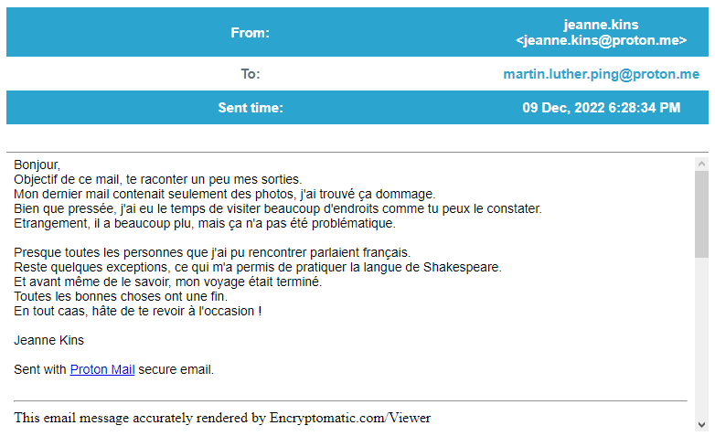


> **title:** Bomberman 1/2
>
> **category:** Forensics
>
> **difficulty:** Moyen
>
> **point:** 50
>
> **author:** Marie-Jeanne
>
> **description:**
>
> Martin Luther Ping est sous surveillance.  
>
> Nous avons pu récupérer les derniers mails qu'il a reçus.  
>
> Nous savons qu'il prépare un mauvais coup.  
>
> Trouvez son acolyte et le message secret envoyé.  
>
>  
>
> Le flag est au format : CYBN{truc.muche@hotmail.fr_message-secret}
>
> *Ce challenge est un mélange d'osint, de stéganographie et de forensics*
>
> 

## Solution

L'archive contient des fichier **`.eml`**, rendez-vous donc sur un viewer en ligne. Ici j'ai juste cherché *eml viewer online* et je suis tombé sur **[Encryptomatic](www.encryptomatic.com/viewer/)**.

En lisant chaque fichier, on peut voir en faisant attention que dans **`Retour de vacances (2) 2022-12-09T19_28_34+01_00.eml`** il y a un message caché :

En prenant toutes les premières lettres de chaque ligne on peut lire **`BOMBE PRETE`** .

On connaît donc l'email de l'acolyte et son message.

**`FLAG : CYBN{jeanne.kins@proton.me_bombe-prete}`**


