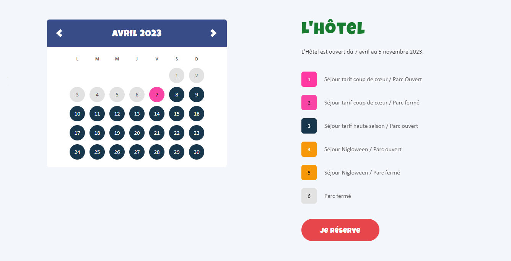


> **title:** Bomberman 2/2
>
> **category:** Forensics
>
> **difficulty:** Moyen
>
> **point:** 50
>
> **author:** Marie-Jeanne
>
> **description:**
>
> Jeanne est de mèche avec Martin.  
>
> Une preuve supplémentaire vient d'être apportée par leur dernière conversation par SMS.  
>
> Trouvez le lieu et la date de leur prochain rendez-vous.  
>
> Le flag est au format : CYBN{le-lieu_date}  
>
> Exemple : CYBN{le-barbiche_27/04/2025}  
>
> *Ce challenge est un mélange d'osint, de stéganographie et de forensics*
>
> 

## Solution

L'image fournie contient le message **`hash 21b7a11646b7c0c9c23eec66a086c07e`**. Il faut se rappeler l'objectif d'un hash : identifier de manière unique une donnée. A partir de là on comprend rapidement que ce message sert à en désigner un autre.

Dans la partie précédente de ce challenge, l'acolyte était **Jeanne KINS** et si l'on regarde les autres mails que l'on avait d'elle on voit qu'elle en avait envoyé un autre contenant beaucoup d'images :

On peut essayer de calculer les hash de ces images en espérant que l'un d'eux correspondent (*il est possible de savoir en regardant la taille du hash donné dans le message qu'il s'agit de **`MD5`** mais sinon on peut tester un peu tout, même si c'est long*).

Ici j'utilise **[CyberChef](https://gchq.github.io/CyberChef/)**, en passant l'image **`bar_2.png`** on obtient le même hash :

Maintenant on sait de quelle image elle parle, il faut maintenant trouver où c'est puis quelle est l'heure de l'ouverture.

Direction **[Yandex](https://yandex.com/images/)** où l'on lance une recherche par image avec la notre :

**Bingo**, l'hôtel des Pirates, un hôtel 4 étoiles à pas piquer des hannetons situé à **Nigloland** :

Maintenant rendez-vous sur **[leur site]()** dans l'onglet **Calendrier**, on voit que la prochaine ouverture est le **`8 Avril`** :

On peut maintenant construire notre flag :

**`FLAG : CYBN{hotel-des-pirates_08/04/2023}`**


