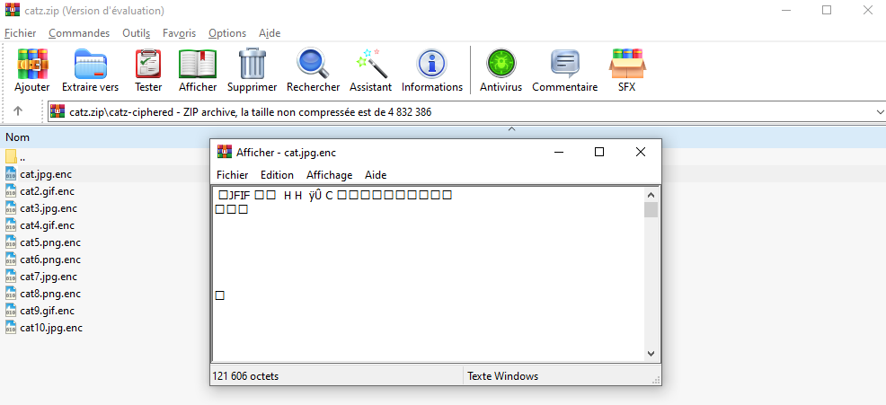
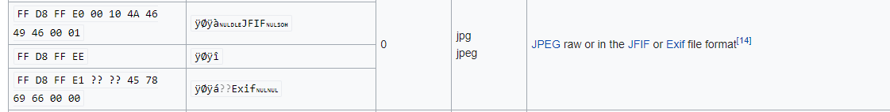
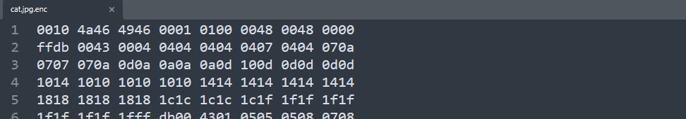
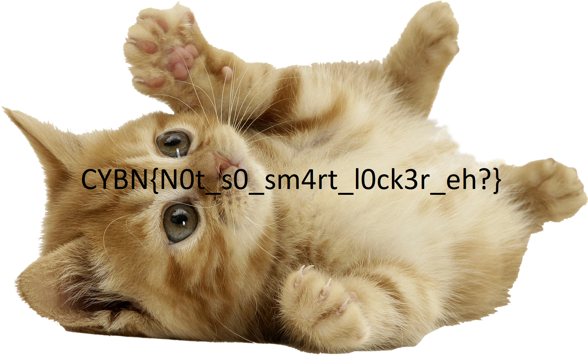


> **title:** Magic
>
> **category:** Forensics
>
> **difficulty:** Moyen
>
> **point:** 50
>
> **author:** Maestran
>
> **description:**
>
> Le PC du PDG de CAT-ENTERPRISE s'est fait pirater et un rançongiciel s'est installé sur le poste.
>
> Nous pensons cependant qu'il y a moyen de récupérer ces fichiers.
>
> Arriverez vous à retrouvez ces photos très importantes ?
>
> 

## Solution

Prenons le premier fichier chiffré. On voit qu'il est nommé **`cat.jpg.enc`** donc on comprend que le fichier original était un **`JPEG`**. En ouvrant le fichier dans un afficheur de texte on peut voir le début d'un header **`JPEG`** normal :



On voit notamment écrit **`JFIF`**. Pour ceux qui ne sont pas au courant, les fichiers possèdent un entête qui permet de savoir comment le lire (*sauf Windows qui lui détermine le type du fichier en lisant l'extension écrite dans son nom plutôt que de lire le début de celui-ci*).

En faisant un tour sur une liste des headers de fichier (j'ai utilisé **[celui-ci](https://en.wikipedia.org/wiki/List_of_file_signatures)** perso) on voit que l'entête des **`JPEG`** est en hexadecimal **`FF D8 FF E0 00 10 4A 46`** :



En ouvrant le fichier dans un lecteur hexadecimal, on voit qu'il nous manque les 4 premiers octets :



On comprend donc que le ransomware n'a en fait pas chiffré les fichiers mais uniquement retiré la partie de l'entête des fichiers les définissant (*cela s'appelle le magic number en anglais et signature en français*).

Pour lire les fichiers correctement, on va donc simplement rajouter les 4 premiers octets correspondants à l'extension. On sort python et c'est parti :

```python
from os import listdir
from os.path import join

DIR = "./cats"

for filename in listdir(DIR):
	if not filename.endswith('.enc'):
		continue

	# On retire le .enc pour connaître le nom d'origine
	original_filename = filename.split('.enc')[0]

	# Chemin du fichier "chiffré"
	filepath_encrypted = join(DIR, filename)

	# Chemin du fichier avec le nom d'origine où l'on va écrire dedans
	filepath_decrypted = join(DIR, original_filename)

	# Ouverture des flux de lecture et d'écriture
	f_encrypted = open(filepath_encrypted, 'rb')
	f_decrypted = open(filepath_decrypted, 'wb')

	# Ajout des 4 octets en fonctions du type du fichier
	if original_filename.endswith('.jpg'):
		f_decrypted.write(b"\xFF\xD8\xFF\xE0")
	elif original_filename.endswith('.gif'):
		f_decrypted.write(b"\x47\x49\x46\x38")
	elif original_filename.endswith('.png'):
		f_decrypted.write(b"\x89\x50\x4E\x47")
	
	# Ajout à la suite du fichier "chiffré" où il manquait les 4 octets ajouté juste avant 
	f_decrypted.write(f_encrypted.read())

	# Fermeture des flux
	f_decrypted.close()
	f_encrypted.close()
```

On peut maintenant lire tous les fichiers, en ouvrant le fichier **`cat6.png`** on voit le flag :



**`FLAG : CYBN{N0t_s0_sm4rt_l0ck3r_eh?}`**


