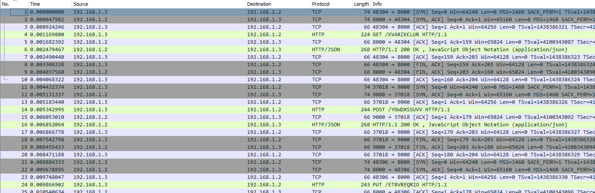
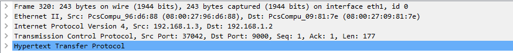
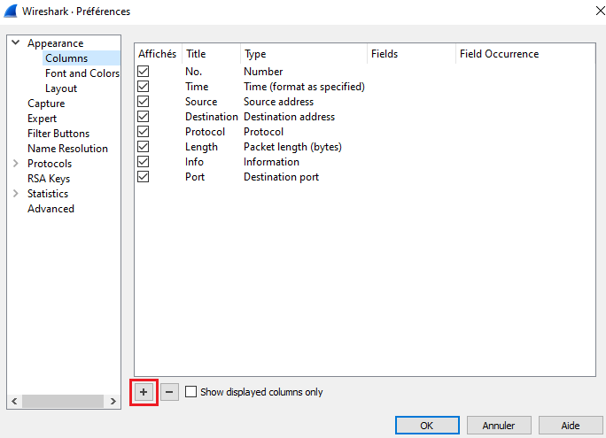
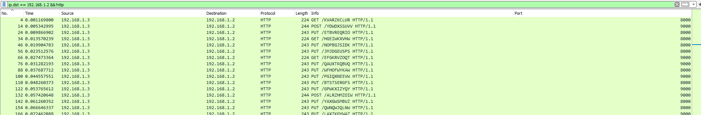


> **title:** Peu importe le chemin
>
> **category:** Forensics
>
> **difficulty:** Très difficile
>
> **point:** 150
>
> **author:** ???
>
> **description:**
>
> Notre développeur junior dit avoir développé une méthode d'exfiltration indétectable. 
>
> Montrez lui que ceci n'a rien de difficile pour vous !
>
> Author: LUN

## Solution

En ouvrant le fichier avec **`WireShark`** on voit plusieurs requêtes :



Plusieurs sont assez étranges, on a des **`GET`**, des **`POST`** et des **`PUT`** depuis l'adresse **`192.168.1.3`** sur l'adresse **`192.168.1.2`** sur des chemins tout autant étranges.

Seulement ce qu'il fallait remarquer c'était les ports de destination. On peut le voir dans le détail des requêtes :



On peut également afficher une colonne avec le port de destination en modifiant les préférences de **`WireShark`** :



En filtrant uniquement sur ces requêtes avec le filtres **`ip.dst == 192.168.1.2 && http`** :



On voit que les requêtes sont sur le port **`8000`** ou **`9000`**. Cela ressemble fortement à du binaire donc importons ça dans python et faisons un script pour remplacer dans l'ordre temporel les requêtes sur le **`8000`** par un **`0`** et celles sur le **`9000`** par un **`1`**. Ensuite on transforme ça selon la norme ASCII :

```python
requests = """4	0.001169800	192.168.1.3	192.168.1.2	HTTP	224	GET /KVARZKCLUR HTTP/1.1 	8000
14	0.005342995	192.168.1.3	192.168.1.2	HTTP	244	POST /YDWDXSSUVV HTTP/1.1 	9000
24	0.009866902	192.168.1.3	192.168.1.2	HTTP	243	PUT /ETBVREQRIO HTTP/1.1 	8000
34	0.013570239	192.168.1.3	192.168.1.2	HTTP	224	GET /HGEIWKXVHW HTTP/1.1 	8000
46	0.019904783	192.168.1.3	192.168.1.2	HTTP	243	PUT /NOPBGJSIDK HTTP/1.1 	8000
56	0.023512576	192.168.1.3	192.168.1.2	HTTP	243	PUT /JMJDGEUSPS HTTP/1.1 	8000
66	0.027473364	192.168.1.3	192.168.1.2	HTTP	224	GET /EFGKRVZOQT HTTP/1.1 	9000
76	0.031282193	192.168.1.3	192.168.1.2	HTTP	243	PUT /QAUXTKQBUQ HTTP/1.1 	9000
88	0.037687712	192.168.1.3	192.168.1.2	HTTP	243	PUT /WFHOFWYKAW HTTP/1.1 	8000
100	0.044557551	192.168.1.3	192.168.1.2	HTTP	243	PUT /PGIQXNEEVW HTTP/1.1 	9000
110	0.048260373	192.168.1.3	192.168.1.2	HTTP	243	PUT /BTSTSERGFS HTTP/1.1 	8000
122	0.053765612	192.168.1.3	192.168.1.2	HTTP	243	PUT /GPWKXIZYQY HTTP/1.1 	9000
132	0.057420648	192.168.1.3	192.168.1.2	HTTP	244	POST /ALRZHMZOIW HTTP/1.1 	9000
142	0.061260352	192.168.1.3	192.168.1.2	HTTP	243	PUT /YAXGWSMBUZ HTTP/1.1 	8000
154	0.066646337	192.168.1.3	192.168.1.2	HTTP	243	PUT /QWNQWJQLNW HTTP/1.1 	8000
166	0.072462088	192.168.1.3	192.168.1.2	HTTP	243	PUT /LAXZKGYWAZ HTTP/1.1 	9000
180	0.078887222	192.168.1.3	192.168.1.2	HTTP	243	PUT /SZESLQWHKW HTTP/1.1 	8000
190	0.082958903	192.168.1.3	192.168.1.2	HTTP	224	GET /FGKBLUPRTS HTTP/1.1 	9000
200	0.086650677	192.168.1.3	192.168.1.2	HTTP	224	GET /AMZCJOYVVU HTTP/1.1 	8000
212	0.095892604	192.168.1.3	192.168.1.2	HTTP	243	PUT /YHYQJDISUK HTTP/1.1 	8000
224	0.101527302	192.168.1.3	192.168.1.2	HTTP	243	PUT /BDQXBGCAVQ HTTP/1.1 	8000
234	0.106330715	192.168.1.3	192.168.1.2	HTTP	224	GET /GLKMHHTBWN HTTP/1.1 	8000
244	0.110360352	192.168.1.3	192.168.1.2	HTTP	243	PUT /WBURCZOLKW HTTP/1.1 	9000
256	0.115328754	192.168.1.3	192.168.1.2	HTTP	243	PUT /OWHHFUMMIR HTTP/1.1 	8000
266	0.119863186	192.168.1.3	192.168.1.2	HTTP	243	PUT /XMXPAJXTGQ HTTP/1.1 	8000
276	0.123334384	192.168.1.3	192.168.1.2	HTTP	224	GET /BSCDEEEYAH HTTP/1.1 	9000
288	0.128429517	192.168.1.3	192.168.1.2	HTTP	243	PUT /ORZHIQYIXM HTTP/1.1 	8000
298	0.131938732	192.168.1.3	192.168.1.2	HTTP	244	POST /GQMFQMHMKU HTTP/1.1 	8000
308	0.135899588	192.168.1.3	192.168.1.2	HTTP	243	PUT /GHNRCJWWPS HTTP/1.1 	9000
320	0.141036255	192.168.1.3	192.168.1.2	HTTP	243	PUT /YOHFORTHXN HTTP/1.1 	9000
332	0.149187773	192.168.1.3	192.168.1.2	HTTP	243	PUT /IRCLBTEKUT HTTP/1.1 	9000
342	0.152611654	192.168.1.3	192.168.1.2	HTTP	224	GET /HOKYJYIQNC HTTP/1.1 	8000
354	0.156999719	192.168.1.3	192.168.1.2	HTTP	243	PUT /PFADNQJLHF HTTP/1.1 	8000
366	0.161308512	192.168.1.3	192.168.1.2	HTTP	243	PUT /GMJFWRAWAI HTTP/1.1 	9000
376	0.164841237	192.168.1.3	192.168.1.2	HTTP	243	PUT /LGKDACFPIO HTTP/1.1 	9000
386	0.168325606	192.168.1.3	192.168.1.2	HTTP	224	GET /IDPINOQZJD HTTP/1.1 	9000
398	0.173175813	192.168.1.3	192.168.1.2	HTTP	243	PUT /NAKIDQVPSH HTTP/1.1 	9000
410	0.178126644	192.168.1.3	192.168.1.2	HTTP	243	PUT /IUAUHUFBYI HTTP/1.1 	8000
420	0.181088690	192.168.1.3	192.168.1.2	HTTP	224	GET /VRISWDLCNM HTTP/1.1 	9000
432	0.185794662	192.168.1.3	192.168.1.2	HTTP	243	PUT /NFVZAGKCEW HTTP/1.1 	9000
444	0.190750853	192.168.1.3	192.168.1.2	HTTP	243	PUT /WIQBMJENPT HTTP/1.1 	8000
456	0.196126482	192.168.1.3	192.168.1.2	HTTP	243	PUT /DQFPIPBJEM HTTP/1.1 	9000
466	0.199699244	192.168.1.3	192.168.1.2	HTTP	244	POST /OWMMSAGVEK HTTP/1.1 	8000
476	0.202755722	192.168.1.3	192.168.1.2	HTTP	243	PUT /PRZXBOMSFN HTTP/1.1 	9000
486	0.205794773	192.168.1.3	192.168.1.2	HTTP	224	GET /JVWXSAMMHT HTTP/1.1 	8000
498	0.211398827	192.168.1.3	192.168.1.2	HTTP	243	PUT /YCETAPTKCJ HTTP/1.1 	9000
510	0.216151638	192.168.1.3	192.168.1.2	HTTP	243	PUT /ISBUHLRTRU HTTP/1.1 	8000
522	0.220750063	192.168.1.3	192.168.1.2	HTTP	243	PUT /WGYSTCFJRB HTTP/1.1 	8000
534	0.225451555	192.168.1.3	192.168.1.2	HTTP	243	PUT /TNHYUVPSXK HTTP/1.1 	8000
544	0.229300766	192.168.1.3	192.168.1.2	HTTP	243	PUT /BESIUZVCOH HTTP/1.1 	9000
554	0.232881137	192.168.1.3	192.168.1.2	HTTP	224	GET /FMAMTOFZPT HTTP/1.1 	9000
564	0.236492212	192.168.1.3	192.168.1.2	HTTP	224	GET /OLJUKJPIME HTTP/1.1 	8000
574	0.239961339	192.168.1.3	192.168.1.2	HTTP	244	POST /SKCZQYMLXL HTTP/1.1 	9000
584	0.243496298	192.168.1.3	192.168.1.2	HTTP	243	PUT /XBSMQEILYL HTTP/1.1 	8000
594	0.247688181	192.168.1.3	192.168.1.2	HTTP	243	PUT /PQJBDJHZOM HTTP/1.1 	8000
606	0.253354501	192.168.1.3	192.168.1.2	HTTP	243	PUT /DLEAZALYOY HTTP/1.1 	8000
616	0.257153336	192.168.1.3	192.168.1.2	HTTP	243	PUT /NSHMPETTZD HTTP/1.1 	8000
626	0.261032192	192.168.1.3	192.168.1.2	HTTP	224	GET /VXRZMCKURW HTTP/1.1 	8000
638	0.266333995	192.168.1.3	192.168.1.2	HTTP	243	PUT /SKSAWSQHGT HTTP/1.1 	9000
648	0.270440316	192.168.1.3	192.168.1.2	HTTP	224	GET /FHYMAYVEWN HTTP/1.1 	9000
660	0.275401251	192.168.1.3	192.168.1.2	HTTP	243	PUT /PXOSFPDVRI HTTP/1.1 	8000
672	0.280290477	192.168.1.3	192.168.1.2	HTTP	243	PUT /YHJZAYDEQU HTTP/1.1 	8000
682	0.284319925	192.168.1.3	192.168.1.2	HTTP	244	POST /RXCDJIBOQR HTTP/1.1 	8000
692	0.289246169	192.168.1.3	192.168.1.2	HTTP	243	PUT /SXVOQYGHHO HTTP/1.1 	9000
704	0.293783379	192.168.1.3	192.168.1.2	HTTP	243	PUT /VSRUBQDIDX HTTP/1.1 	8000
716	0.298024862	192.168.1.3	192.168.1.2	HTTP	243	PUT /QBKPEUTZIV HTTP/1.1 	9000
728	0.302968528	192.168.1.3	192.168.1.2	HTTP	243	PUT /PCQJZHPSSH HTTP/1.1 	9000
740	0.307860620	192.168.1.3	192.168.1.2	HTTP	243	PUT /NQMOSTWUCM HTTP/1.1 	9000
750	0.312740183	192.168.1.3	192.168.1.2	HTTP	244	POST /QOWQVQGMYP HTTP/1.1 	8000
762	0.318027860	192.168.1.3	192.168.1.2	HTTP	243	PUT /ASHUNLIOBM HTTP/1.1 	8000
772	0.321751225	192.168.1.3	192.168.1.2	HTTP	244	POST /SCFAJUQRVZ HTTP/1.1 	9000
784	0.326678235	192.168.1.3	192.168.1.2	HTTP	243	PUT /GNPCRNVAOY HTTP/1.1 	9000
796	0.332288489	192.168.1.3	192.168.1.2	HTTP	224	GET /ZQWHICHMXE HTTP/1.1 	8000
806	0.336305006	192.168.1.3	192.168.1.2	HTTP	244	POST /RTVWAMXEWD HTTP/1.1 	9000
816	0.340314854	192.168.1.3	192.168.1.2	HTTP	224	GET /RCLAXTHPIG HTTP/1.1 	8000
826	0.343654569	192.168.1.3	192.168.1.2	HTTP	224	GET /VJZOEOGYCA HTTP/1.1 	9000
836	0.347378252	192.168.1.3	192.168.1.2	HTTP	243	PUT /WGXJUUJIAS HTTP/1.1 	9000
846	0.351344501	192.168.1.3	192.168.1.2	HTTP	244	POST /DJTSJSZCEA HTTP/1.1 	9000
856	0.354767917	192.168.1.3	192.168.1.2	HTTP	224	GET /WLWCKBKDMF HTTP/1.1 	9000
866	0.358896983	192.168.1.3	192.168.1.2	HTTP	224	GET /HEJEEMLONG HTTP/1.1 	9000
876	0.363106936	192.168.1.3	192.168.1.2	HTTP	224	GET /HOTFMIPRQF HTTP/1.1 	8000
886	0.366845654	192.168.1.3	192.168.1.2	HTTP	244	POST /WNELAEVYZP HTTP/1.1 	8000
898	0.372077446	192.168.1.3	192.168.1.2	HTTP	243	PUT /CJCXTIVCBN HTTP/1.1 	9000
908	0.376009005	192.168.1.3	192.168.1.2	HTTP	243	PUT /GRMRWNWIGL HTTP/1.1 	9000
918	0.379338108	192.168.1.3	192.168.1.2	HTTP	224	GET /DKZLOELTGF HTTP/1.1 	8000
928	0.383266672	192.168.1.3	192.168.1.2	HTTP	244	POST /FWBRVOYNVM HTTP/1.1 	8000
938	0.387421623	192.168.1.3	192.168.1.2	HTTP	244	POST /ZVIKZVMBXR HTTP/1.1 	8000
948	0.390788897	192.168.1.3	192.168.1.2	HTTP	244	POST /MZOTJPDSEE HTTP/1.1 	9000
960	0.397241450	192.168.1.3	192.168.1.2	HTTP	243	PUT /DEUQUSDRAN HTTP/1.1 	8000
972	0.402722741	192.168.1.3	192.168.1.2	HTTP	243	PUT /SMIMVNJJFH HTTP/1.1 	9000
982	0.405843976	192.168.1.3	192.168.1.2	HTTP	224	GET /TYTGPRBPAS HTTP/1.1 	9000
994	0.410674602	192.168.1.3	192.168.1.2	HTTP	243	PUT /HGBSBNKHXO HTTP/1.1 	9000
1004	0.413951114	192.168.1.3	192.168.1.2	HTTP	243	PUT /BPIFFIXXEU HTTP/1.1 	8000
1014	0.417244526	192.168.1.3	192.168.1.2	HTTP	244	POST /XQCVMDQFJD HTTP/1.1 	8000
1024	0.420913152	192.168.1.3	192.168.1.2	HTTP	244	POST /XZXMNJPRIN HTTP/1.1 	9000
1034	0.424775237	192.168.1.3	192.168.1.2	HTTP	243	PUT /HRTPZKWMKG HTTP/1.1 	9000
1046	0.429308901	192.168.1.3	192.168.1.2	HTTP	243	PUT /PXHAINUGLU HTTP/1.1 	8000
1058	0.434345877	192.168.1.3	192.168.1.2	HTTP	243	PUT /QBMLWATADZ HTTP/1.1 	9000
1070	0.439036551	192.168.1.3	192.168.1.2	HTTP	243	PUT /ZNEXXKNJLI HTTP/1.1 	8000
1080	0.442504088	192.168.1.3	192.168.1.2	HTTP	244	POST /LMAMSXZZAO HTTP/1.1 	9000
1090	0.445769274	192.168.1.3	192.168.1.2	HTTP	244	POST /VUEYPDRTTR HTTP/1.1 	9000
1100	0.449842137	192.168.1.3	192.168.1.2	HTTP	243	PUT /ZDNGAXFPFK HTTP/1.1 	9000
1110	0.453950582	192.168.1.3	192.168.1.2	HTTP	244	POST /OBMPSPZJZI HTTP/1.1 	9000
1122	0.460243071	192.168.1.3	192.168.1.2	HTTP	243	PUT /WTSXVLBWTQ HTTP/1.1 	9000
1132	0.464570486	192.168.1.3	192.168.1.2	HTTP	224	GET /MGJDDYMWZY HTTP/1.1 	8000
1142	0.469244831	192.168.1.3	192.168.1.2	HTTP	244	POST /CUDEBUCUXQ HTTP/1.1 	9000
1152	0.473262282	192.168.1.3	192.168.1.2	HTTP	243	PUT /PYWOYGJEXH HTTP/1.1 	8000
1164	0.478673679	192.168.1.3	192.168.1.2	HTTP	243	PUT /QPFMACHUMZ HTTP/1.1 	9000
1174	0.483161655	192.168.1.3	192.168.1.2	HTTP	244	POST /YZEACQHEBH HTTP/1.1 	8000
1186	0.488321110	192.168.1.3	192.168.1.2	HTTP	243	PUT /VQAHFETMWH HTTP/1.1 	9000
1198	0.493413911	192.168.1.3	192.168.1.2	HTTP	243	PUT /SAURLKWDRD HTTP/1.1 	8000
1208	0.496592584	192.168.1.3	192.168.1.2	HTTP	244	POST /IESSWLKVCQ HTTP/1.1 	8000
1220	0.501649175	192.168.1.3	192.168.1.2	HTTP	244	POST /QNYYQWHEFC HTTP/1.1 	8000
1232	0.506626998	192.168.1.3	192.168.1.2	HTTP	243	PUT /PFNUZXYSHS HTTP/1.1 	9000
1244	0.512323070	192.168.1.3	192.168.1.2	HTTP	243	PUT /JTKLLWAZHN HTTP/1.1 	9000
1256	0.517140106	192.168.1.3	192.168.1.2	HTTP	243	PUT /IUOJRBALGT HTTP/1.1 	8000
1268	0.521888589	192.168.1.3	192.168.1.2	HTTP	243	PUT /WHCBQSMKYB HTTP/1.1 	9000
1278	0.525111833	192.168.1.3	192.168.1.2	HTTP	244	POST /LHIAIOAUKL HTTP/1.1 	8000
1288	0.528382577	192.168.1.3	192.168.1.2	HTTP	243	PUT /MRPAWYYYWH HTTP/1.1 	8000
1298	0.531695799	192.168.1.3	192.168.1.2	HTTP	224	GET /IIRATIAOCA HTTP/1.1 	8000
1310	0.537185904	192.168.1.3	192.168.1.2	HTTP	243	PUT /MGSUZLCQEC HTTP/1.1 	8000
1320	0.540626596	192.168.1.3	192.168.1.2	HTTP	243	PUT /YRAKQLIOWX HTTP/1.1 	8000
1330	0.544189372	192.168.1.3	192.168.1.2	HTTP	224	GET /BBCYYKYOYA HTTP/1.1 	9000
1342	0.549918881	192.168.1.3	192.168.1.2	HTTP	243	PUT /RILNZFLXKH HTTP/1.1 	9000
1352	0.553429441	192.168.1.3	192.168.1.2	HTTP	244	POST /RTRKTVLRSY HTTP/1.1 	8000
1362	0.556672717	192.168.1.3	192.168.1.2	HTTP	244	POST /UPVBUYAZUH HTTP/1.1 	8000
1372	0.560997294	192.168.1.3	192.168.1.2	HTTP	243	PUT /LBZKPXZOAX HTTP/1.1 	9000
1382	0.564518964	192.168.1.3	192.168.1.2	HTTP	224	GET /QUAKYDBVFO HTTP/1.1 	9000
1392	0.568823384	192.168.1.3	192.168.1.2	HTTP	243	PUT /GMMFCETKZN HTTP/1.1 	8000
1404	0.574185044	192.168.1.3	192.168.1.2	HTTP	243	PUT /KCIXWESACO HTTP/1.1 	9000
1414	0.578074929	192.168.1.3	192.168.1.2	HTTP	243	PUT /ACHRNUJNJV HTTP/1.1 	8000
1424	0.582690869	192.168.1.3	192.168.1.2	HTTP	243	PUT /UONVDITFWW HTTP/1.1 	9000
1434	0.587496526	192.168.1.3	192.168.1.2	HTTP	243	PUT /ALJKAWMNWV HTTP/1.1 	9000
1444	0.591989308	192.168.1.3	192.168.1.2	HTTP	244	POST /EJBKRGDCKS HTTP/1.1 	9000
1454	0.596911294	192.168.1.3	192.168.1.2	HTTP	243	PUT /LYKTFWPRLO HTTP/1.1 	9000
1464	0.601815306	192.168.1.3	192.168.1.2	HTTP	243	PUT /KDLAGUNSNV HTTP/1.1 	9000
1474	0.607007926	192.168.1.3	192.168.1.2	HTTP	244	POST /CXSDZQGCWZ HTTP/1.1 	8000
1484	0.610946034	192.168.1.3	192.168.1.2	HTTP	224	GET /ATQTSALWYI HTTP/1.1 	9000
1496	0.618634815	192.168.1.3	192.168.1.2	HTTP	243	PUT /EIIUOQSCPY HTTP/1.1 	8000
1506	0.622617763	192.168.1.3	192.168.1.2	HTTP	244	POST /FDYESDEBKU HTTP/1.1 	9000
1516	0.627395821	192.168.1.3	192.168.1.2	HTTP	243	PUT /ATFIKWZWKN HTTP/1.1 	8000
1528	0.633819162	192.168.1.3	192.168.1.2	HTTP	243	PUT /TXAFSGMYHE HTTP/1.1 	9000
1540	0.640121818	192.168.1.3	192.168.1.2	HTTP	243	PUT /IJLITWQYJF HTTP/1.1 	9000
1552	0.646586308	192.168.1.3	192.168.1.2	HTTP	243	PUT /WFOCMUGSPD HTTP/1.1 	9000
1566	0.654207184	192.168.1.3	192.168.1.2	HTTP	243	PUT /BSEENOQHJQ HTTP/1.1 	8000
1576	0.658427197	192.168.1.3	192.168.1.2	HTTP	224	GET /HSYANJLRRD HTTP/1.1 	8000
1588	0.665389525	192.168.1.3	192.168.1.2	HTTP	243	PUT /VXYCTABYCW HTTP/1.1 	9000
1600	0.670750071	192.168.1.3	192.168.1.2	HTTP	243	PUT /YCVNSHMZMS HTTP/1.1 	9000
1612	0.676073325	192.168.1.3	192.168.1.2	HTTP	243	PUT /ONLDWFRHAR HTTP/1.1 	8000
1622	0.680327794	192.168.1.3	192.168.1.2	HTTP	243	PUT /JXKYMXJOKJ HTTP/1.1 	9000
1634	0.687665246	192.168.1.3	192.168.1.2	HTTP	243	PUT /BCHDVOMOEQ HTTP/1.1 	8000
1646	0.692893447	192.168.1.3	192.168.1.2	HTTP	243	PUT /QIHAQBISXK HTTP/1.1 	8000
1658	0.698708051	192.168.1.3	192.168.1.2	HTTP	243	PUT /HETUMTSPMG HTTP/1.1 	8000
1668	0.704628487	192.168.1.3	192.168.1.2	HTTP	243	PUT /BKIAYDSFGU HTTP/1.1 	9000
1680	0.716177036	192.168.1.3	192.168.1.2	HTTP	243	PUT /GIOHWFUNSA HTTP/1.1 	9000
1690	0.720062445	192.168.1.3	192.168.1.2	HTTP	224	GET /JIETWGWXEA HTTP/1.1 	9000
1700	0.724444396	192.168.1.3	192.168.1.2	HTTP	244	POST /ISJGQZNKYR HTTP/1.1 	9000
1710	0.728858257	192.168.1.3	192.168.1.2	HTTP	224	GET /KOUZEFFVQL HTTP/1.1 	8000
1722	0.741172413	192.168.1.3	192.168.1.2	HTTP	243	PUT /RQHWKHZUNC HTTP/1.1 	8000
1734	0.753436865	192.168.1.3	192.168.1.2	HTTP	243	PUT /FDMKHHGXII HTTP/1.1 	9000
1744	0.759724351	192.168.1.3	192.168.1.2	HTTP	243	PUT /KQENAGUGSM HTTP/1.1 	8000
1756	0.768861127	192.168.1.3	192.168.1.2	HTTP	243	PUT /XVXEODSHWL HTTP/1.1 	9000
1766	0.773843359	192.168.1.3	192.168.1.2	HTTP	224	GET /MGDMNAWLWZ HTTP/1.1 	9000
1776	0.778320534	192.168.1.3	192.168.1.2	HTTP	244	POST /XTUIOPPJDA HTTP/1.1 	9000
1786	0.783017713	192.168.1.3	192.168.1.2	HTTP	243	PUT /ITKOLNBHTY HTTP/1.1 	9000
1796	0.788019593	192.168.1.3	192.168.1.2	HTTP	243	PUT /OHQEOAJLMI HTTP/1.1 	9000
1806	0.792671584	192.168.1.3	192.168.1.2	HTTP	224	GET /HSALWWZASV HTTP/1.1 	8000
1816	0.797319059	192.168.1.3	192.168.1.2	HTTP	243	PUT /BRYOMIKUTT HTTP/1.1 	9000"""

# Transformation des requêtes en 0 ou en 1
binary = ''.join(['0' if l.split(' ')[-1] == "8000" else '1' for l in requests.split('\n')])

# Prend les bit 8 à 8 et les transforme en char
print(''.join([chr(int(binary[i:i+8], 2)) for i in range(0, len(binary), 8)]))

# CYBN{Th1s_1s_Th3_W4y}
```

**`FLAG : CYBN{Th1s_1s_Th3_W4y}`**


