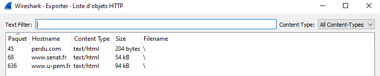
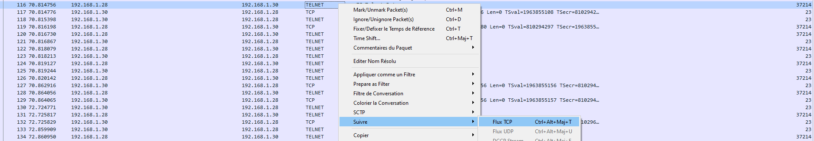
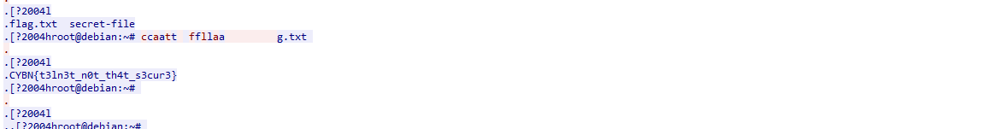


> **title:** Sniff Sniff
>
> **category:** Forensics
>
> **difficulty:** Facile
>
> **point:** 25
>
> **author:** Maestran
>
> **description:**
>
> A chaque fois que vous utilisez un protocole non chiffré, un enfant pleure.
>
> Le fichier fourni est un .pcap que vous devez ouvrir avec le logiciel wireshark : https://www.wireshark.org/download.html
>
> 

## Solution

En ouvrant le fichier avec **`WireShark`** on voit plusieurs types de requêtes, du **`DNS`**, de l'**`ICMP`**, de l'**`HTTP`**, du **`TCP`** et du **`TELNET`**.

Bon clairement ici on cherche un secret échangé donc on oublie le **`DNS`** et l'**`ICMP`** pour gagner du temps. On peut regarder ce qui passe via **`HTTP`** mais nous ne verrons que 3 pages html sans rien d'intéressant dedans :

Par contre si l'on suit les échanges **`TELNET`** :

On voit toutes les interactions entre l'utilisateur et la machine distante, notamment le **`cat flag.txt`** suivis du retour de la machine avec le contenu du fichier :

**`FLAG : CYBN{t3ln3t_n0t_th4t_s3cur3}`**


