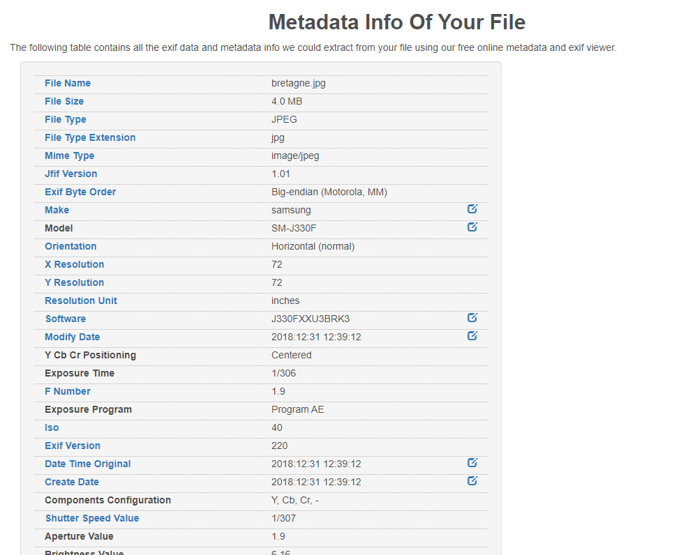


> **title:** Souvenir
>
> **category:** Forensics
>
> **difficulty:** Facile
>
> **point:** 25
>
> **author:** Maestran
>
> **description:**
>
> Parfois, une image ne contient pas seulement qu'une photo...
>
> Quel est le commentaire sur cette image ?  
>
> A quel date a été prise cette photo ?  
>
> Et quel est le modèle du téléphone ?  
>
> Le flag doit être au format :
>
> CYBN{Commentaire_Date_Modèle}
>
> (Sans espaces / accent)
>
> Exemple :
>
> Si le commentaire est "Souvenir!"  
>
> La date est le 25/09/2021  
>
> Et le modèle est "Pixel 6A"  
>
> Alors le flag sera :  
>
> CYBN{Souvenir!_25/09/2021_Pixel6A}
>
> 

## Solution

Ici on peut utiliser plusieurs outils :

- **[Exiftool](https://exiftool.org)** => outil en ligne de commande.
- **[AperiSolve](https://www.aperisolve.com/)** => site web très utilisé en CTF
- **[Metadata2go](https://www.metadata2go.com/)** => site web pratique et rapide

En passant l'image dans **[Metadata2go](https://www.metadata2go.com/)** on obtiens : 

On peu notamment extraire ces informations :
- **`Xp Comment`** => **`Perros-Guirec`**
- **`Create Date`** => **`2018:12:31 12:39:12`**
- **`Model`** => **`SM-J330F`**

Donc on peut construire notre flag :

**`FLAG : CYBN{Perros-Guirec_31/12/2018_SM-J330F}`**


