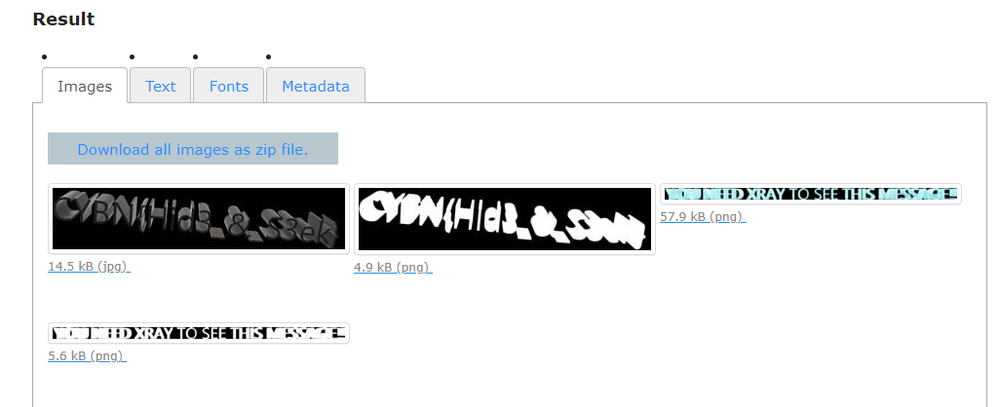


> **title:** Xray
>
> **category:** Forensics
>
> **difficulty:** Facile
>
> **point:** 25
>
> **author:** MrSheepSheep
>
> **description:**
>
> Pouvez-vous voir ce qui se cache derrière ce message ?
>
> 

## Solution

Si on se penche un peu sur le format PDF on apprend que ce format fonctionne sous format d'objets. Tout ce qu'on trouve dedans sont stocké sous forme d'objet (texte, image, script etc...) et à une certaine position pour ceux qui sont affichés.

Le terme **`XRay`** faisant référence à voir au travers, on comprend que l'image que l'on voit est par dessus une autre et que c'est l'autre qu'il faut pouvoir lire.

Donc direction google pour tenter d'extraire les objets d'un PDF. Ici j'utilise le site **[ExtractPDF](https://www.extractpdf.com)** (*j'ai tapé "pdf extract objects" pour le trouver*) :

On voit qu'il y avait bien d'autres images dans le PDF et sur lesquelles on peut lire le flag.

**`FLAG : CYBN{Hid3_&_S3ek}`**


