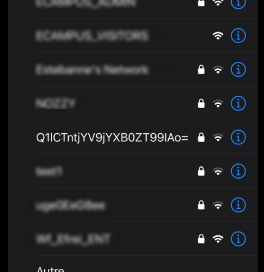


> **title:** Identify 1/3
>
> **category:** Hardware
>
> **difficulty:** Moyen
>
> **point:** 50
>
> **author:** ???
>
> **description:**
>
> Un agent ennemi s’est infiltré à la Cybernight !  
>
> Nous l'avons vu passer sur une caméra avec un sac rempli de matériel puis sortir du campus.     
>
> Nous pensons qu’il essaye de nous espionner sur le réseau wifi mais nous ne savons pas comment. Une idée de ce qu'il a pu faire ? 
>
> **Challenge à effectuer en physique uniquement aux 4 étages du bâtiment A.**  
>
> **N’hésitez pas à fouiller sur d’autres étages.**  
>
> **Pas besoin d’aller demander la caméra au gardien.**

## Solution

En se baladant dans le bâtiment, un WIFI étrange apparassait :

En décodant `Q1lCTntjYV9jYXB0ZT99IAo=` depuis la base 64, on obtient le flag.

**`FLAG : CYBN{ca_capte?}`**


