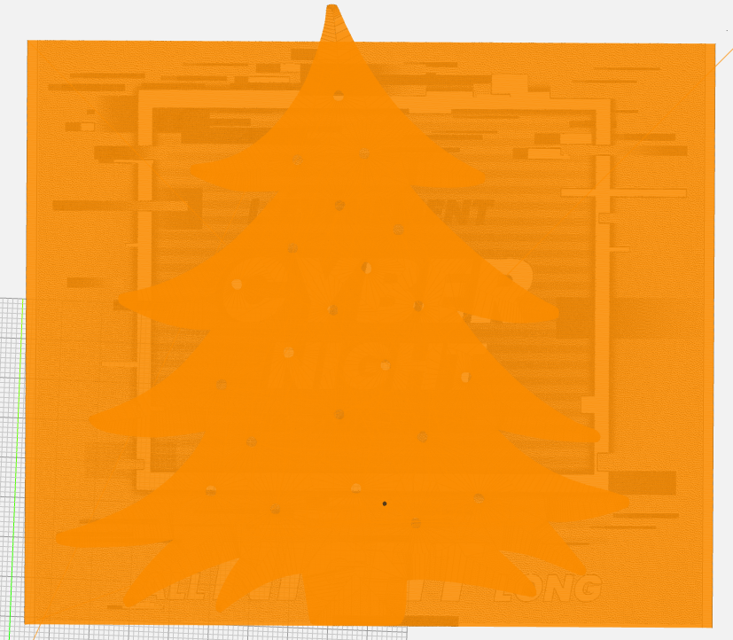
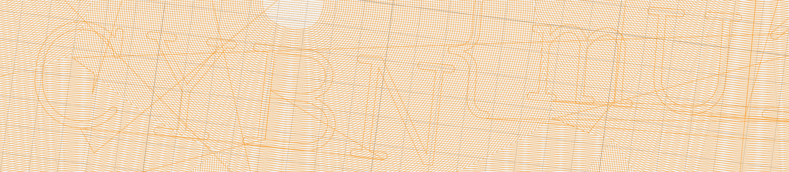


> **title:** class4
>
> **category:** Hardware
>
> **difficulty:** Moyen
>
> **point:** 50
>
> **author:** Langley
>
> **description:**
>
> ce challenge se base sur le langage gcode.
>
> 

## Solution

Un fichier GCode est fourni, on a simplement à l'ouvrir dans un viewer pour voir les déplacements effectués. Ici j'utilise **[ncviewer](https://ncviewer.com)**.

Un dessin se forme grâce au GCode :

Si l'on regarde au pied du sapin, on voit le flag :

**`FLAG : CYBN{mU17Y_14y3r}`**


