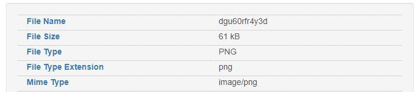


> **title:** Et je tombe tombe tombe ...
>
> **category:** Misc
>
> **difficulty:** Moyen
>
> **point:** 50
>
> **author:** m00n
>
> **description:**
>
> 
>
> 

## Solution

Il faut soit prendre 30 min à la main soit faire un script pour décompresser en boucler les archives. Ici on utilise la version **command-line de 7Zip** car elle prend en charge tous les formats d'archive utilisés dans ce challenge (c'était voulu par l'auteur).

Avant tout il faut installer 7Zip et l'ajouter dans la variable d'environnement PATH. 

Voici le script :

```python
from os import mkdir, devnull, remove, listdir, replace
from subprocess import check_call, CalledProcessError
from os.path import join, exists
from uuid import uuid4


def create_dir(base="./"):
	path = join(base, str(uuid4()))
	while exists(path):
		path = join(base, str(uuid4()))
	mkdir(path)
	return path


DIR_FIN = create_dir()
DIR_TMP = create_dir()
print(f"DIR_TMP: {DIR_TMP}\nDIR_FIN: {DIR_FIN}\n")

to_extract = r"path-to-file/et-je-tombe-tombe-tombe.zip"
i = 0

# Devnull pour ne pas que l'appel de la commande écrive dans le terminal
with open(devnull) as null:
	while True:
		i += 1
		print(f"[{str(i).zfill(5)}] {to_extract}")

		try:
			# Lancer la commande 7Zip pour décompresser le fichier
			check_call(f"7z.exe e \"{to_extract}\" -y -o{DIR_TMP}", stdout=null, stderr=null)

			# Déplacer tous les fichiers du dossier TMP ver FINAL
			for file in listdir(DIR_FIN):
				remove(join(DIR_FIN, file))
			for file in listdir(DIR_TMP):
				replace(join(DIR_TMP, file), join(DIR_FIN, file))

			# Récupèrer le nom du prochain fichier à extraire
			extracted = listdir(DIR_FIN)
			if len(extracted) != 1:
				print("Multiple files extracted")
				exit()
			to_extract = join(DIR_FIN, extracted[0])

		# Si le fichier ne peut pas être extrait
		except CalledProcessError:
			break
print("Extraction ended")

# DIR_TMP: ./83741ca8-27bd-41b7-bab5-3279248fe8a9
# DIR_FIN: ./5cb23492-1903-40fc-bb37-43244391bf7d
# 
# [00001] path-to-file/et-je-tombe-tombe-tombe.zip
# [00002] ./5cb23492-1903-40fc-bb37-43244391bf7d/1wcw51ueaiwq
# [...]
# [05483] ./5cb23492-1903-40fc-bb37-43244391bf7d/iz45okt21j28
# [05484] ./5cb23492-1903-40fc-bb37-43244391bf7d/dgu60rfr4y3d
# Extraction ended
```

Après 5483 décompression, on récupère un fichier sans extension, avec la commande **`file`** ou via un site comme **[Metadata2go](https://www.metadata2go.com)** et l'on voit qu'il s'agit d'un PNG :



L'image en question contient le flag :


**`FLAG : cybn{60n3_0u7_f0r_4_57r011_4nd_f4113n_d0wn_7h3_7Z_h013}`**


