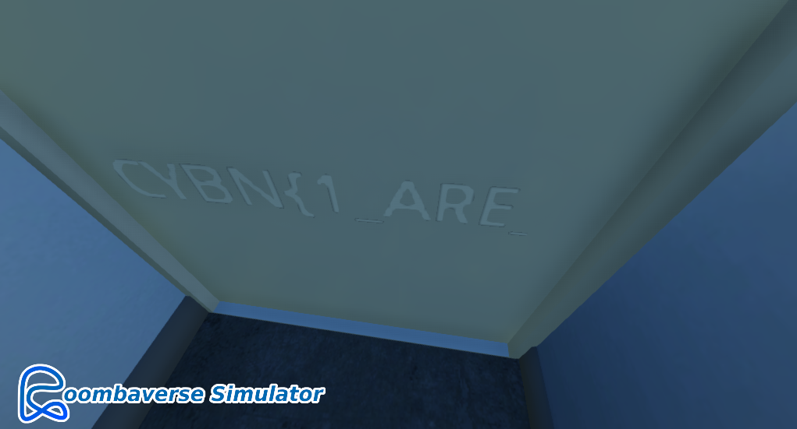
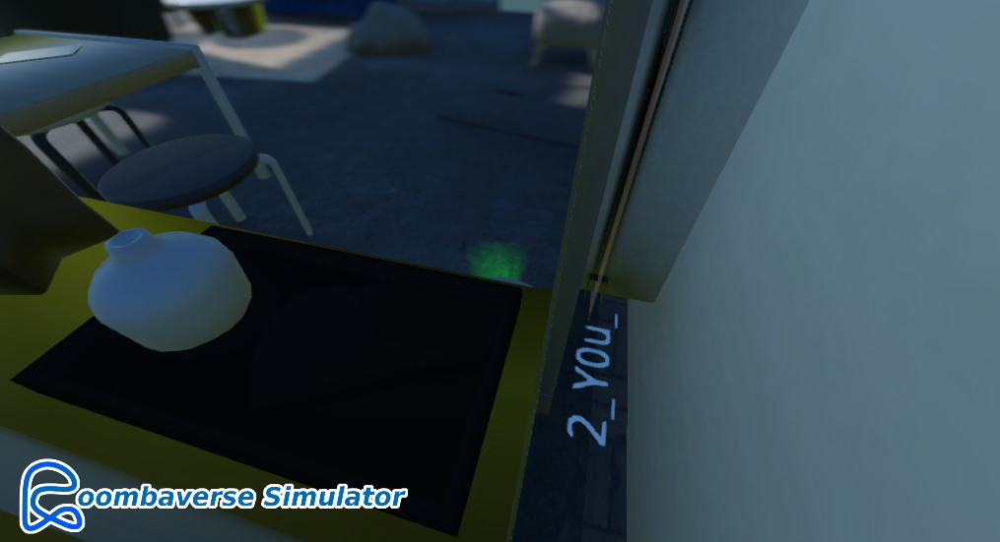
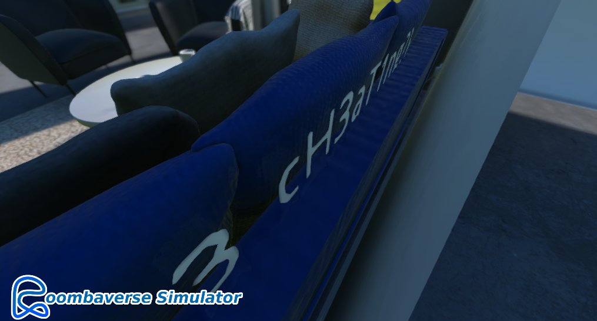
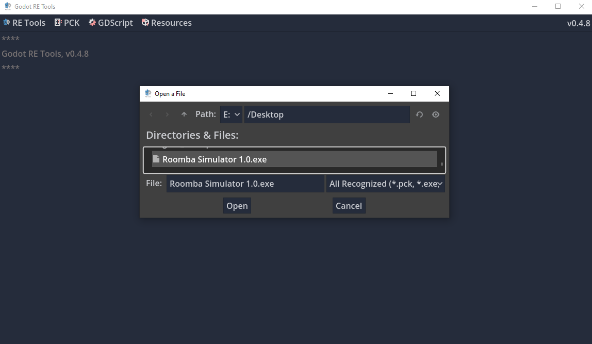
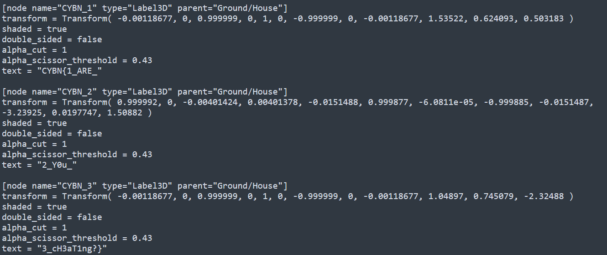


> **title:** Roombaverse Simulator - Des yeux partout
>
> **category:** Misc
>
> **difficulty:** Facile
>
> **point:** 25
>
> **author:** MrSheepSheep
>
> **description:**
>
> Le flag est caché quelque part dans le jeu. A vous de trouver où !
>
> 
>
> https://roombaverse.cybernight-c.tf/roombaverse-simulator

## Solution

Plusieurs façons de faire comme trouver un glitch dans le jeu ou décompiler le jeu avec un outil comme **[gdsdecomp](https://github.com/bruvzg/gdsdecomp/releases)**. Voici deux solutions :

### Glitch

Il faut jouer sur la caméra, elle peut passer à travers les murs donc en se plaçant aux bons endroits on peut regarder derrière des objets.

Le flag est découpé en 3 parties. Le premier endroit est derrière la porte d'entrée :

Le second est dans l'angle au fond à gauche par rapport au spawn du robot :

Le dernier est derrière le canapé, il faut aller dessous pour le voir :

### Décompilation

On ouvre l'outils et on clique en haut à gauche sur **RE Tools** puis **Recover Project**. 

Maintenant avec les fichiers récupérés, dans le **Main.tscn** on trouve le flag découpé à l'intérieur

**`FLAG : CYBN{1_ARE_2_Y0u_3_cH3aT1ng?}`**


